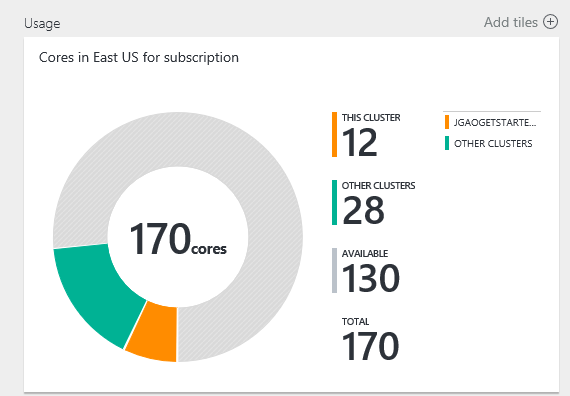
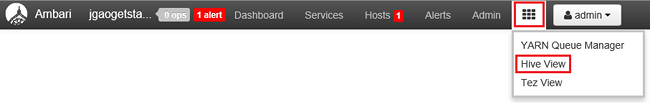

<properties
    pageTitle="管理 HDInsight 使用 Azure 入口網站中的 Linux 型 Hadoop 叢集 |Microsoft Azure"
    description="瞭解如何建立及管理 Linux 型 HDInsight 叢集使用 Azure 入口網站。"
    services="hdinsight"
    documentationCenter=""
    authors="mumian"
    manager="jhubbard"
    editor="cgronlun"
    tags="azure-portal"/>

<tags
    ms.service="hdinsight"
    ms.workload="big-data"
    ms.tgt_pltfrm="na"
    ms.devlang="na"
    ms.topic="article"
    ms.date="08/10/2016"
    ms.author="jgao"/>

#使用 [Azure 入口網站管理 Hadoop 叢集 HDInsight 中

[AZURE.INCLUDE [selector](../../includes/hdinsight-portal-management-selector.md)]

使用[Azure 入口網站][azure-portal]，您可以管理 Linux 為基礎的叢集中 Azure HDInsight。 使用 [定位點選取器建立 Hadoop 叢集 HDInsight 使用其他工具中的資訊。 

**必要條件**

這份文件之前，您必須具備下列項目︰

- **Azure 訂閱**。 請參閱[取得 Azure 免費試用版](https://azure.microsoft.com/documentation/videos/get-azure-free-trial-for-testing-hadoop-in-hdinsight/)。

##開啟入口網站

1. 登入[https://portal.azure.com](https://portal.azure.com)。
2. 開啟入口網站後，您可以︰

    - 按一下 [建立新的叢集左側功能表中的 [**新增**]:
    
        ![新的 HDInsight 叢集] 按鈕](./media/hdinsight-administer-use-portal-linux/azure-portal-new-button.png)
    - 按一下 [從清單現有叢集的左側功能表的 [ **HDInsight 叢集**
    
        ![Azure 入口網站的 HDInsight 叢集] 按鈕](./media/hdinsight-administer-use-portal-linux/azure-portal-hdinsight-button.png)

        如果**HDInsight**沒有出現在左側功能表中，按一下 [**瀏覽**，，然後按一下 [ **HDInsight 叢集**。

        

##建立叢集

[AZURE.INCLUDE [delete-cluster-warning](../../includes/hdinsight-delete-cluster-warning.md)]

HDInsight 搭配寬 Hadoop 元件。 驗證與支援的元件清單中，請參閱[Azure HDInsight 是哪個版本的 Hadoop](hdinsight-component-versioning.md)。 一般叢集建立資訊，請參閱[建立 Hadoop 叢集 HDInsight 中](hdinsight-hadoop-provision-linux-clusters.md)。 

##清單，然後顯示叢集

1. 登入[https://portal.azure.com](https://portal.azure.com)。
2. 按一下 [從清單現有叢集的左側功能表的 [ **HDInsight 叢集**]。
3. 按一下 [叢集名稱]。 如果叢集清單很長，您可以使用頁面上方的篩選器。
4. 按兩下 [叢集從清單中，以顯示詳細資料]。

    **功能表和 [基本功能**︰

    
    
    - **設定**及**所有的設定**︰ 顯示**設定**刀叢集，可讓您存取叢集詳細的設定資訊。
    - **儀表板**、**叢集儀表板**和 * * URL︰ 這些是存取叢集儀表板，也就是 Ambari Web Linux 型叢集的所有方式。
    - **安全的命令介面**︰ 顯示指示連線至叢集使用安全命令介面 (SSH) 連線。
    - **縮放比例叢集**︰ 可讓您變更此叢集工作者節點數目。
    - **刪除**︰ 刪除叢集。
    - **快速入門 ()**︰ 顯示的資訊可協助您開始使用 HDInsight。
    - **使用者 ()**︰ 可讓您設定為其他使用者的_入口網站_管理的權限，此叢集 Azure 訂閱。
    
        > [AZURE.IMPORTANT] 這_只_會影響 access 和 Azure 入口網站中，在此叢集的權限，不會影響可以連線至或提交到 HDInsight 叢集工作的人員。
    - **標籤 (![事項] 標記圖示](./media/hdinsight-administer-use-portal-linux/tags.png))**︰ 標籤可讓您設定以定義您的雲端服務自訂分類的金鑰/值組。 比方說，您可能會建立名為 [__專案__]，，，然後使用特定專案相關聯的所有服務的 [常見的值。
    - **Ambari 檢視**︰ Ambari 網頁的連結。
    
    > [AZURE.IMPORTANT] 若要管理 HDInsight 叢集所提供的服務，您必須使用 Ambari 網頁或 Ambari REST API。 如需有關如何使用 Ambari 的詳細資訊，請參閱[管理 HDInsight 叢集使用 Ambari](hdinsight-hadoop-manage-ambari.md)。

    **使用方式**︰
    
    
    
5. 按一下 [**設定**]。

    

    - **稽核記錄**︰
    - **快速入門**︰ 顯示的資訊可協助您開始使用 HDInsight。
    - **縮放比例叢集**︰ 增加和減少叢集工作者節點數目。
    - **安全的命令介面**︰ 顯示指示連線至叢集使用安全命令介面 (SSH) 連線。
    - **HDInsight 合作夥伴**︰ 新增或移除目前的 HDInsight 合作夥伴。
    - **外部 Metastores**︰ 檢視登錄區及 Oozie metastores。 Metastores 只可以叢集建立程序期間進行設定。
    - **指令碼動作**︰ 執行被叢集上的指令碼。
    - **屬性**︰ 檢視叢集內容。
    - **Azure 儲存金鑰**︰ 檢視預設儲存帳戶與索引鍵。 儲存帳戶是叢集建立程序期間的設定。
    - **叢集 AAD 身分識別**︰ 
    - **使用者**︰ 可讓您設定為其他使用者的_入口網站_管理的權限，此叢集 Azure 訂閱。
    - **標籤**︰ 標籤可讓您設定以定義您的雲端服務自訂分類的金鑰/值組。 比方說，您可能會建立名為 [__專案__]，，，然後使用特定專案相關聯的所有服務的 [常見的值。
    
    > [AZURE.NOTE] 這是一般清單可用的設定。而非所有會出現所有叢集類型。

6. 按一下 [**內容**︰

    內容是︰
    
    - **主機名稱**︰ 叢集名稱。
    - **叢集 URL**。
    - **狀態**︰ 包含中止，接受，ClusterStorageProvisioned AzureVMConfiguration、 HDInsightConfiguration，操作執行，錯誤，刪除刪除，逾時 DeleteQueued、 DeleteTimedout、 DeleteError、 PatchQueued、 CertRolloverQueued、 ResizeQueued、 ClusterCustomization
    - **地區**︰ Azure 的位置。 如需支援 Azure 位置的清單，請參閱**地區**下拉式清單方塊上[HDInsight 價格](https://azure.microsoft.com/pricing/details/hdinsight/)。
    - **建立資料**。
    - **作業系統**: [ **Windows**或**Linux**。
    - **類型**︰ Hadoop、 HBase 大量，激起。 
    - **版本**。 請參閱[HDInsight 版本](hdinsight-component-versioning.md)
    - **訂閱**︰ 訂閱名稱。
    - **訂閱識別碼**。
    - **預設的資料來源**︰ 預設叢集檔案系統。
    - **價格層的工作者節點**。
    - **不對節點價格層**。

##刪除叢集

刪除叢集不會刪除預設儲存帳戶或任何連結的儲存空間的帳戶。 您可以使用相同的儲存空間帳戶和相同 metastores 重新建立叢集。 建議使用新的預設 Blob 容器，當您重新建立叢集。

1. 登入[入口網站][azure-portal]。
2. 從左側功能表中按一下 [**全部瀏覽**]、 按一下**HDInsight 叢集**，按一下您叢集的名稱。
3. 從上方的功能表中，按一下 [**刪除**，然後依照指示執行。

另請參閱[暫停/關機叢集](#pauseshut-down-clusters)。

##縮放比例叢集
叢集縮放功能可讓您變更正在執行中 Azure HDInsight，而不需要重新建立 [叢集叢集使用工作者節點數目。

>[AZURE.NOTE] 只使用 HDInsight 版本 3.1.3 叢集或更高支援。 如果您不確定您的叢集版本的您可以核取 [屬性] 頁面。  請參閱[清單] 和 [顯示叢集](#list-and-show-clusters)。

變更每種類型的支援 HDInsight 叢集資料節點數目的影響︰

- Hadoop

    您可以順暢完美地增加背景工作中的節點數目 Hadoop 叢集執行而不會影響任何擱置] 或 [執行的工作。 在進行作業時也能提交新的工作。 縮放比例作業失敗適當地處理以便叢集永遠左功能的狀態。

    當 Hadoop 叢集縮小來減少資料節點數目時，部分叢集服務會重新啟動。 這會使所有執行，並且擱置的工作，在 [縮放比例] 作業完成失敗。 您可以不過，重新送出工作一旦完成作業。

- HBase

    流暢地，您可以新增或移除節點] 在執行中時，HBase 叢集。 完成 [縮放比例] 作業的幾分鐘內自動對稱地區的伺服器。 不過，您可以登入的叢集 headnode，並從 [命令提示字元視窗中執行下列命令以手動平衡地區伺服器︰

        >pushd %HBASE_HOME%\bin
        >hbase shell
        >balancer

    如需有關如何使用 HBase 命令介面的詳細資訊，請參閱]
- 大量

    流暢地，您可以新增或移除資料節點] 在執行中時，大量叢集。 但縮放作業成功完成之後，您將需要重新平衡拓撲。

    平衡可完成兩種方法︰

    * 大量網頁 UI
    * 命令列介面 (CLI) 工具

    請參閱[Apache 大量文件](http://storm.apache.org/documentation/Understanding-the-parallelism-of-a-Storm-topology.html)更多。

    大量網頁 UI HDInsight 叢集上有︰

    

    以下是如何使用 [CLI 命令來重新平衡大量拓撲範例︰

        ## Reconfigure the topology "mytopology" to use 5 worker processes,
        ## the spout "blue-spout" to use 3 executors, and
        ## the bolt "yellow-bolt" to use 10 executors

        $ storm rebalance mytopology -n 5 -e blue-spout=3 -e yellow-bolt=10

**若要縮放叢集**

1. 登入[入口網站][azure-portal]。
2. 從左側功能表中按一下 [**全部瀏覽**]、 按一下**HDInsight 叢集**，按一下您叢集的名稱。
3. 按一下 [**設定**]，請從 [上方] 功能表，然後按一下 [**縮放比例叢集**。
4. 輸入**數字的工作者節點**。 叢集節點數目的限制而異 Azure 訂閱。 您也可以連絡帳單支援，以增加限制。  成本資訊會反映您所做的節點數目的變更。

    

##暫停/關機叢集

大部分的 Hadoop 工作是批次工作只能執行有時候的時間。 針對大部分 Hadoop 叢集，有長的叢集不用於處理的時間。 HDInsight，與您的資料會儲存於 Azure 儲存體，以便在不使用安全地刪除叢集。
您也會針對 HDInsight 叢集，即使沒有使用。 由於叢集費用多次多儲存空間的費用，讓經濟叢集時無法使用。

有多種方式，您可以設計程序︰

- 使用者 Azure 資料工廠。 建立視 HDInsight 連結服務，請參閱[建立視 Linux 型 Hadoop 叢集中使用 Azure 資料工廠 HDInsight](hdinsight-hadoop-create-linux-clusters-adf.md) 。
- 使用 PowerShell 的 Azure。  請參閱[分析航班延遲情況資料](hdinsight-analyze-flight-delay-data.md)。
- 使用 Azure CLI。 請參閱[使用 Azure CLI 管理 HDInsight 叢集](hdinsight-administer-use-command-line.md)。
- 使用 HDInsight.NET SDK。 請參閱[提交 Hadoop 工作](hdinsight-submit-hadoop-jobs-programmatically.md)。

價格的資訊，請參閱[HDInsight 價格](https://azure.microsoft.com/pricing/details/hdinsight/)。 若要刪除叢集從入口網站，請參閱[刪除叢集](#delete-clusters)

##變更密碼

HDInsight 叢集可以有兩個使用者帳戶。 HDInsight （又名叢集使用者帳戶 HTTP 使用者帳戶），建立程序期間會建立 SSH 使用者帳戶。 您可以 Ambari web 變更叢集使用者帳戶使用者名稱和密碼和指令碼動作，若要變更的 SSH 使用者帳戶的使用者介面

###變更叢集使用者的密碼

您可以使用 Ambari 網路使用者介面，來變更叢集使用者的密碼。 若要登入 Ambari，您必須使用現有的叢集使用者名稱和密碼。

> [AZURE.NOTE] 如果您變更叢集使用者] （管理） 密碼時，這可能會導致指令碼針對此叢集失敗執行的動作。 如果您有任何必要的指令碼動作的目標工作者節點，這些可能會失敗，當您新增到叢集節點調整大小的作業。 如需指令碼動作的詳細資訊，請參閱[自訂 HDInsight 叢集使用指令碼的動作](hdinsight-hadoop-customize-cluster-linux.md)。

1. 登入 Ambari 網頁 UI 使用 HDInsight 叢集使用者認證。 預設的使用者名稱是**管理員**。 URL 是**https://&lt;HDInsight 叢集名稱 > azurehdinsight.net**。
2. 從上方的功能表中，按一下 [**管理員**]，然後按一下 [「 管理 Ambari 」。 
3. 從左側功能表中，按一下 [**使用者**]。
4. 按一下 [**管理員**]。
5. 按一下 [**變更密碼**]。

Ambari 再變更叢集內所有節點的密碼。

###變更 SSH 使用者的密碼

1. 使用文字編輯器，將下列儲存為檔案命名__changepassword.sh__。

    > [AZURE.IMPORTANT] 您必須使用線條結尾為使用 LF 編輯器。 如果編輯器] 中使用 CRLF，將無法運作的指令碼。
    
        #! /bin/bash
        USER=$1
        PASS=$2

        usermod --password $(echo $PASS | openssl passwd -1 -stdin) $USER

2. 若要從 HDInsight 使用 HTTP 或 HTTPS 位址可存取的儲存位置上, 傳檔案。 例如，公開檔案儲存例如 OneDrive 或 Azure Blob 儲存體。 這需要在下一個步驟中的檔案，儲存 URI （HTTP 或 HTTPS 地址）。

3. 從 Azure] 入口網站中，選取您的 HDInsight 叢集，然後選取__所有設定__。 從__設定__刀中，選取 [__指令碼動作__]。

4. 從__指令碼動作__刀中，選取 [__新送出__]。 __送出指令碼動作__刀出現時，輸入下列資訊。

  	| 功能變數 | 值 |
  	| ----- | ----- |
  	| 名稱 | 變更 ssh 密碼 |
  	| 被指令碼 URI | Changepassword.sh 檔案 URI |
  	| 節點 （不對、 工作、 Nimbus、 主管、 動物園管理員等等） | 列出所有節點類型 ✓ |
  	| 參數 | 輸入的 SSH 使用者名稱，然後新密碼。 應該要有一個空格之間的使用者名稱和密碼。
  	| 固定這個指令碼動作... | 將此欄位保留取消核取。

5. 選取 [__建立__]，套用指令碼]。 一旦完成指令碼，您可以連線到叢集 SSH 使用新的密碼。

##授與/撤銷存取

HDInsight 叢集有下列 HTTP web 服務 （所有這些服務需要 RESTful 的端點）︰

- ODBC
- JDBC
- Ambari
- Oozie
- Templeton

根據預設，這些服務會授與存取。 您可以撤銷/授與使用[Azure CLI](hdinsight-administer-use-command-line.md#enabledisable-http-access-for-a-cluster)和[PowerShell 的 Azure](hdinsight-administer-use-powershell.md#grantrevoke-access)的存取權。

##尋找訂閱識別碼

**若要尋找您的 Azure 訂閱識別碼**

1. 登入[入口網站][azure-portal]。
2. 從左側功能表中，按一下 [**全部瀏覽**，然後按一下 [**訂閱]**。 每個訂閱有的名稱，以及識別碼。

每個叢集連結至 Azure 的訂閱。 訂閱識別碼叢集**不可或缺**的圖磚上顯示。 請參閱[清單] 和 [顯示叢集](#list-and-show-clusters)。

##尋找 [資源] 群組 

ARM 模式] 中，在每個 HDInsight 叢集建立與 Azure 資源群組。 Azure 資源所屬群組之叢集會顯示於︰

- [叢集] 清單中會有一個**資源群組**資料行。
- 叢集**不可或缺**的磚。  

請參閱[清單] 和 [顯示叢集](#list-and-show-clusters)。

##尋找預設儲存帳戶

每個 HDInsight 叢集具有預設儲存帳戶。 預設儲存帳戶和叢集其鍵會出現在 [**設定**/**屬性**/**Azure 儲存金鑰**。 請參閱[清單] 和 [顯示叢集](#list-and-show-clusters)。

##執行登錄區查詢

您無法直接從 Azure 入口網站中，執行登錄區工作，但您可以使用登錄區檢視 Ambari Web UI 上。

**若要執行使用 Ambari 登錄區檢視的登錄區查詢**

1. 登入 Ambari 網頁 UI 使用 HDInsight 叢集使用者認證。 預設的使用者名稱是**管理員**。 URL 是**https://&lt;HDInsight 叢集名稱 > azurehdinsight.net**。
2. 下圖所示，請開啟登錄區檢視︰  

    
3. 從上方的功能表中按一下 [**查詢**]。
4. 在 [**查詢編輯器]**中，輸入群組的查詢，然後按一下 [**執行**。

##監視工作

請參閱[管理 HDInsight 叢集使用 Ambari 網路使用者介面](hdinsight-hadoop-manage-ambari.md#monitoring)。

##瀏覽檔案

使用 Azure 入口網站，您可以瀏覽預設容器的內容。

1. 登入[https://portal.azure.com](https://portal.azure.com)。
2. 按一下 [從清單現有叢集的左側功能表的 [ **HDInsight 叢集**]。
3. 按一下 [叢集名稱]。 如果叢集清單很長，您可以使用頁面上方的篩選器。
4. 按一下 [**設定**]。
5. **設定**刀按一下**Azure 儲存金鑰**。
6. 按一下 [預設儲存體帳戶名稱]。
7. 按一下 [ **Blob**磚。
8. 按一下 [預設容器名稱]。

##監視叢集使用情況

HDInsight 叢集刀 [__使用情況__] 區段會顯示可用核心數目的相關資訊至您的訂閱，用於 HDInsight，以及核心配置給此叢集及如何將它們配置此叢集內節點數目。 請參閱[清單] 和 [顯示叢集](#list-and-show-clusters)。

> [AZURE.IMPORTANT] 若要監視 HDInsight 叢集所提供的服務，您必須使用 Ambari 網頁或 Ambari REST API。 如需有關如何使用 Ambari 的詳細資訊，請參閱[管理 HDInsight 叢集使用 Ambari](hdinsight-hadoop-manage-ambari.md)

##連線到叢集

請參閱[使用登錄區中使用 SSH HDInsight Hadoop 使用](hdinsight-hadoop-use-hive-ssh.md#ssh)。
    
##後續步驟
本文中，您已經學會如何使用來建立 HDInsight 叢集入口網站，以及如何開啟 Hadoop 命令列工具。 若要深入瞭解，請參閱下列文章︰

* [管理使用 PowerShell 的 Azure HDInsight](hdinsight-administer-use-powershell.md)
* [管理使用 CLI Azure HDInsight](hdinsight-administer-use-command-line.md)
* [建立 HDInsight 叢集](hdinsight-provision-clusters.md)
* [使用中 HDInsight 的登錄區](hdinsight-use-hive.md)
* [HDInsight 中使用的豬](hdinsight-use-pig.md)
* [HDInsight 中使用 Sqoop](hdinsight-use-sqoop.md)
* [開始使用 Azure HDInsight](hdinsight-hadoop-linux-tutorial-get-started.md)
* [Azure HDInsight 哪個版本的 Hadoop 功能？](hdinsight-component-versioning.md)

[azure-portal]: https://portal.azure.com
[image-hadoopcommandline]: ./media/hdinsight-administer-use-portal-linux/hdinsight-hadoop-command-line.png "Hadoop 命令列"
