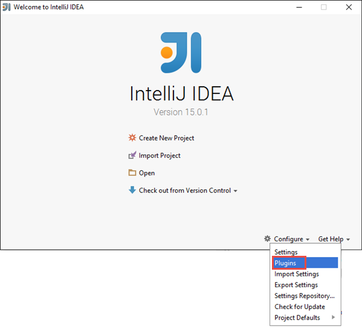
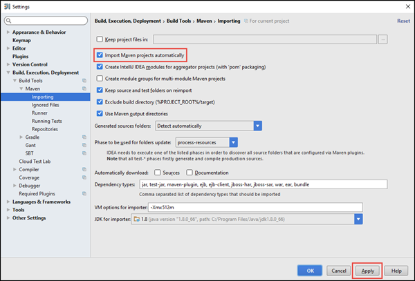
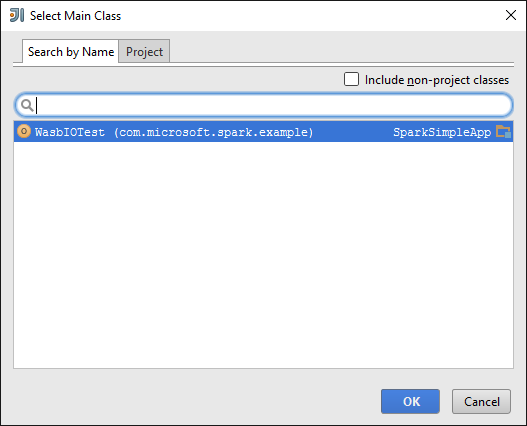
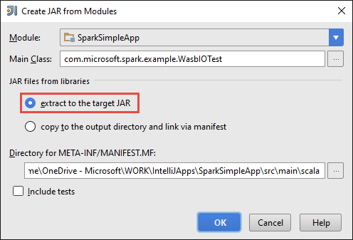

<properties
    pageTitle="建立獨立 scala HDInsight 火花叢集上執行的應用程式 |Microsoft Azure"
    description="瞭解如何建立獨立火花 HDInsight 火花叢集上執行應用程式。"
    services="hdinsight"
    documentationCenter=""
    authors="nitinme"
    manager="jhubbard"
    editor="cgronlun"
    tags="azure-portal"/>

<tags
    ms.service="hdinsight"
    ms.workload="big-data"
    ms.tgt_pltfrm="na"
    ms.devlang="na"
    ms.topic="article"
    ms.date="10/28/2016"
    ms.author="nitinme"/>

# 建立獨立 Scala HDInsight linux Apache 火花叢集上執行應用程式

本文提供逐步指引開發獨立火花應用程式撰寫 Scala Maven 使用 IntelliJ 想法。 本文為建置系統使用 Apache Maven，並啟動與現有的 Maven 原型 Scala 提供 IntelliJ 想法。  高階建立 Scala IntelliJ 想法的應用程式會包含下列步驟︰

* 使用建置系統 Maven。
* 若要解決火花模組相依性更新專案物件模型 (POM) 檔案。
* 撰寫您的應用程式中 Scala。
* 產生可以傳送到 HDInsight 火花叢集 jar 檔案。
* 使用晚總火花叢集上執行應用程式。

>[AZURE.NOTE] HDInsight 也提供 IntelliJ 想法外掛程式的工具，以便建立及提交到 HDInsight 火花叢集 Linux 上的應用程式的程序。 如需詳細資訊，請參閱[IntelliJ 可以建立及提交火花應用程式的使用 HDInsight 工具增益集](hdinsight-apache-spark-intellij-tool-plugin.md)。

**必要條件**

* Azure 的訂閱。 請參閱[取得 Azure 免費試用版](https://azure.microsoft.com/documentation/videos/get-azure-free-trial-for-testing-hadoop-in-hdinsight/)。
* HDInsight linux Apache 火花叢集。 如需相關指示，請參閱[建立 Apache 火花叢集中 Azure HDInsight](hdinsight-apache-spark-jupyter-spark-sql.md)。
* Oracle Java 開發套件。 您可以從[這裡](http://www.oracle.com/technetwork/java/javase/downloads/jdk8-downloads-2133151.html)進行安裝。
* Java IDE。 本文會使用 IntelliJ 想法 15.0.1。 您可以從[這裡](https://www.jetbrains.com/idea/download/)進行安裝。

## 如 IntelliJ 瞭解安裝 Scala 外掛程式

如果啟用 Scala 外掛程式沒有不提示 IntelliJ 您先安裝，啟動 IntelliJ 想法，並透過下列步驟，以安裝該外掛程式︰

1. 開始 IntelliJ 主意並從歡迎畫面上，按一下 [**設定**，然後按一下**外掛程式**。

    

2. 在下一個畫面中，按一下 [從左上角的 [**安裝 JetBrains 外掛程式**]。 在開啟的 [**瀏覽 JetBrains 增益集**] 對話方塊中搜尋 Scala，然後按一下**安裝**。

    

3. 外掛程式安裝成功之後，按一下**重新啟動 IntelliJ 想法] 按鈕**，以重新啟動 IDE。

## 建立獨立 Scala 專案

1. 啟動 IntelliJ 想法，並建立新的專案。 在 [新的 [專案] 對話方塊中，選取下列選項，然後再按 [**下一步**。

    

    * 您可以選取 [ **Maven**作為專案類型。
    * 指定**專案 SDK**。 按一下 [新增]，然後瀏覽至 Java 安裝目錄，通常是`C:\Program Files\Java\jdk1.8.0_66`。
    * 選取**從原型建立**選項。
    * 從 archetypes 清單中，選取 [ **org.scala tools.archetypes:scala-原型簡單**。 這會建立右側目錄結構，並下載撰寫 Scala 程式所需的預設相依性。

2. 提供**識別碼**、 **ArtifactId**和**版本**的相關值。 按一下 [**下一步**]。

3. 在下一個方塊中，讓您指定 Maven 主目錄及其他使用者設定，接受預設值，然後按一下 [**下一步**。

4. 在 [姓氏] 對話方塊中，指定的專案名稱及位置，然後按一下 [**完成]**。

5. 刪除在**src\test\scala\com\microsoft\spark\example** **MySpec.Scala**檔案。 您不需要此應用程式。

6. 必要時，重新命名預設來源和測試檔案。 從 IntelliJ 您先在左窗格中，瀏覽至**src\main\scala\com.microsoft.spark.example**。 以滑鼠右鍵按一下**App.scala****重構**、 按一下 [重新命名檔案，和在對話方塊中，提供應用程式的新名稱，然後按一下然後按一下 [**重構**。

      

7. 後續步驟中，您就會更新以定義火花 Scala 應用程式的相依性 pom.xml。 下載並自動解析這些相依性，您必須設定會相應地 Maven。

    

    1. 從 [**檔案**] 功能表中，按一下 [**設定**]。
    2. 在 [**設定**] 對話方塊中，瀏覽到**建置、 執行、 部署** > **建立工具** > **Maven** > **匯入**。
    3. 選取要**匯入 Maven 自動專案**的選項。
    4. 按一下 [**套用**]，然後按一下**[確定]**。

8. 更新 Scala 來源檔案，包括您的應用程式碼。 開啟現有的程式碼範例取代下列程式碼並儲存變更。 將此程式碼會讀取 （在所有 HDInsight 火花叢集提供），HVAC.csv 中的資料擷取第六個欄中，只有一個數字的資料列，並將輸出寫入**/HVACOut**叢集在預設存放區。

        package com.microsoft.spark.example

        import org.apache.spark.SparkConf
        import org.apache.spark.SparkContext

        /**
          * Test IO to wasb
          */
        object WasbIOTest {
          def main (arg: Array[String]): Unit = {
            val conf = new SparkConf().setAppName("WASBIOTest")
            val sc = new SparkContext(conf)

            val rdd = sc.textFile("wasbs:///HdiSamples/HdiSamples/SensorSampleData/hvac/HVAC.csv")

            //find the rows which have only one digit in the 7th column in the CSV
            val rdd1 = rdd.filter(s => s.split(",")(6).length() == 1)

            rdd1.saveAsTextFile("wasbs:///HVACout")
          }
        }

9. 更新 pom.xml。

    1.  內`<project>\<properties>`新增下列動作︰

            <scala.version>2.10.4</scala.version>
            <scala.compat.version>2.10.4</scala.compat.version>
            <scala.binary.version>2.10</scala.binary.version>

    2. 內`<project>\<dependencies>`新增下列動作︰

            <dependency>
              <groupId>org.apache.spark</groupId>
              <artifactId>spark-core_${scala.binary.version}</artifactId>
              <version>1.4.1</version>
            </dependency>

    Pom.xml 儲存變更。

10. 建立.jar 檔案。 IntelliJ 您先啟用 JAR 建立為專案的成品。 執行下列步驟。

    1. 從 [**檔案**] 功能表中，按一下 [**專案結構**。
    2. 在 [**專案結構**] 對話方塊中，按一下**成品**，然後按一下加號。 從快顯] 對話方塊中，按一下**JAR**，，然後按一下**從與相依性的模組**。

        

    3. 在 [**建立 JAR 從模組**] 對話方塊中，按一下省略符號 () 針對**主要類別**。

    4. 在 [**選取主要類別**] 對話方塊中，選取的預設顯示的類別，然後按一下**[確定]**。

        

    5. 在**建立 JAR 從模組**] 對話方塊中，確定選取 [**擷取至目標 JAR**的選項，然後再按一下**[確定]**。 這會建立單一糖與所有的相依性。

        

    6. 輸出版面配置] 索引標籤會列出所有 （每瓶） 所 Maven 專案的一部分。 您可以選取並刪除要在其上 Scala 應用程式有沒有直接相依性。 此建立應用程式，您可以移除所有但最後一個 （**SparkSimpleApp 編譯輸出**）。 選取 [刪除，然後按一下 [**刪除**] 圖示 （每瓶）]。

        

        請確定已選取**建立讓於**] 方塊中，以確保會建立糖，每次建立或更新專案。 按一下 [**套用**] 和 [**確定**]。

    7. 從功能表列中，按一下 [**建立**，然後按一下**進行專案。** 您也可以按一下要建立糖**建立成品**。 下**\out\artifacts**會建立輸出 jar。

        

## 火花叢集上執行應用程式

若要在叢集上執行應用程式，您必須執行下列動作︰

* **複製至儲存 Azure blob 應用程式糖**叢集相關聯。 您可以使用[**AzCopy**](../storage/storage-use-azcopy.md)，命令列公用程式中，執行此作業。 有許多其他用戶端，您可以使用上傳的資料。 您可以找到深入瞭解其在[上傳 Hadoop 工作 HDInsight 的資料](hdinsight-upload-data.md)。

* **若要從遠端提交應用程式工作使用晚總**火花叢集。 HDInsight 火花叢集包含晚總公開其餘結束點到遠端提交火花工作。 如需詳細資訊，請參閱[使用遠端晚總上 HDInsight 火花叢集提交火花工作](hdinsight-apache-spark-livy-rest-interface.md)。

## 另請參閱

* [概觀︰ Apache 火花上 Azure HDInsight](hdinsight-apache-spark-overview.md)

### 案例

* [使用 BI 火花︰ 執行火花 HDInsight 中使用的 BI 工具的互動式的資料分析](hdinsight-apache-spark-use-bi-tools.md)

* [與電腦學習火花︰ 使用火花 HDInsight 分析建置溫度使用 HVAC 資料中](hdinsight-apache-spark-ipython-notebook-machine-learning.md)

* [與電腦學習火花︰ 使用火花 HDInsight 預測食物檢查結果中](hdinsight-apache-spark-machine-learning-mllib-ipython.md)

* [火花串流︰ 使用火花 HDInsight 建置即時串流應用程式中](hdinsight-apache-spark-eventhub-streaming.md)

* [HDInsight 中使用火花網站記錄分析](hdinsight-apache-spark-custom-library-website-log-analysis.md)

### 建立和執行應用程式

* [在使用晚總火花叢集從遠端執行工作](hdinsight-apache-spark-livy-rest-interface.md)

### 工具和延伸模組

* [使用 HDInsight 工具增益集，如 IntelliJ 瞭解建立及提交火花 Scala 應用程式](hdinsight-apache-spark-intellij-tool-plugin.md)

* [使用 HDInsight 工具增益集，如 IntelliJ 瞭解遠端偵錯火花應用程式](hdinsight-apache-spark-intellij-tool-plugin-debug-jobs-remotely.md)

* [使用上 HDInsight 火花叢集運貨用飛艇筆記本](hdinsight-apache-spark-use-zeppelin-notebook.md)

* [核心適用於 HDInsight 火花叢集 Jupyter 筆記本](hdinsight-apache-spark-jupyter-notebook-kernels.md)

* [使用外部封包 Jupyter 筆記本](hdinsight-apache-spark-jupyter-notebook-use-external-packages.md)

* [在 [您的電腦上安裝 Jupyter 並連線到 HDInsight 火花叢集](hdinsight-apache-spark-jupyter-notebook-install-locally.md)

### 管理資源

* [管理資源 Apache 火花叢集中 Azure HDInsight](hdinsight-apache-spark-resource-manager.md)

* [追蹤和偵錯 Apache 火花中叢集 HDInsight 上執行的工作](hdinsight-apache-spark-job-debugging.md)
