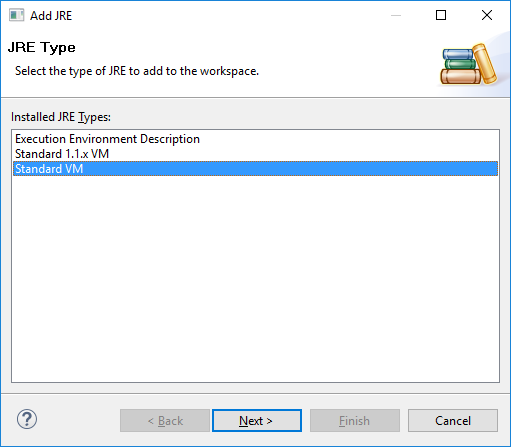
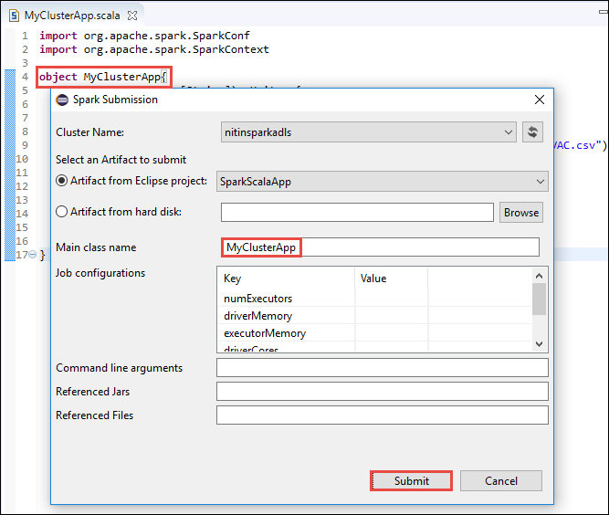

 <properties
    pageTitle="建立使用 HDInsight 工具中 Azure 工具組蝕火花 Scala 應用程式 |Microsoft Azure"
    description="瞭解如何建立獨立火花 HDInsight 火花叢集上執行應用程式。"
    services="hdinsight"
    documentationCenter=""
    authors="nitinme"
    manager="jhubbard"
    editor="cgronlun"
    tags="azure-portal"/>

<tags
    ms.service="hdinsight"
    ms.workload="big-data"
    ms.tgt_pltfrm="na"
    ms.devlang="na"
    ms.topic="article"
    ms.date="08/30/2016"
    ms.author="nitinme"/>

# 使用中的蝕 Azure 工具組 HDInsight 工具來建立火花 HDInsight 火花 Linux 叢集的應用程式

本文提供逐步指引開發撰寫 Scala 並送出以 HDInsight 火花叢集 HDInsight 工具中 Azure 工具組用蝕火花應用程式。 您可以使用工具]，以數種不同的方法︰

* 若要開發並送出 HDInsight 火花叢集上的 Scala 火花應用程式
* 若要存取您的 Azure HDInsight 火花叢集資源
* 若要開發，並在本機上執行的 Scala 火花應用程式

>[AZURE.IMPORTANT] 此工具可以用於建立及提交僅適用於 linux HDInsight 火花叢集應用程式。

##必要條件

* Azure 的訂閱。 請參閱[取得 Azure 免費試用版](https://azure.microsoft.com/documentation/videos/get-azure-free-trial-for-testing-hadoop-in-hdinsight/)。

* HDInsight linux Apache 火花叢集。 如需相關指示，請參閱[建立 Apache 火花叢集中 Azure HDInsight](hdinsight-apache-spark-jupyter-spark-sql.md)。

* Oracle Java 開發套件版本 7 和 8 版本。 
    * **Java SDK 7**用來編譯火花專案 HDInsight 叢集支援 Java 版本 7。 您可以從 [[在這裡](http://www.oracle.com/technetwork/java/javase/downloads/jdk7-downloads-1880260.html)下載 Java SDK 7。
    * **Java SDK 8**用於蝕 IDE 執行階段。 您可以從[這裡](http://www.oracle.com/technetwork/java/javase/downloads/jdk8-downloads-2133151.html)免費下載。

* 蝕 IDE。 本文會使用蝕霓紅。 您可以從[這裡](https://www.eclipse.org/downloads/)進行安裝。

* 蝕 Scala IDE。 
    * **如果您有安裝蝕 IDE**，您可以新增 Scala IDE 外掛程式前往**協助** -> **安裝新的軟體**，並將[http://download.scala-ide.org/sdk/lithium/e44/scala211/stable/site](http://download.scala-ide.org/sdk/lithium/e44/scala211/stable/site)新增為下載蝕 Scala 外掛程式的來源。 
    * **如果您沒有安裝蝕 IDE**，則您可以直接從[以下](http://scala-ide.org/download/sdk.html)安裝 Scala IDE。 您可以從這個連結下載.zip 檔案、 擷取它、 瀏覽至 [ **/eclipse** ] 資料夾中，，然後執行從該處的 [ **eclipse.exe**檔案。
    
    >[AZURE.NOTE] 這份文件中的步驟會根據蝕 IDE 使用 Scala 外掛程式安裝。

* 火花 SDK。 您可以從[這裡](http://go.microsoft.com/fwlink/?LinkID=723585&clcid=0x409)免費下載。

* 從[https://www.eclipse.org/efxclipse/install.html](https://www.eclipse.org/efxclipse/install.html)安裝 e (fx) clipse。

## 安裝蝕中 Azure 工具組 HDInsight 工具

HDInsight 工具蝕是可用的蝕 Azure 工具組的一部分。 如需有關如何安裝 Azure 工具組的指示，請參閱[安裝的蝕 Azure 工具組](../azure-toolkit-for-eclipse-installation.md)。

## 登入您 Azure 的訂閱

1. 啟動蝕，並開啟 [Azure 檔案總管]。 從 IDE 中的 [**視窗**] 功能表，按一下 [**顯示檢視**，然後按一下 [**其他**]。 從開啟的對話方塊中，展開**Azure** **Azure 檔案總管**]，然後按一下然後按一下**[確定]**。

    

2. **Azure**中的節點**Azure 檔案總管**，以滑鼠右鍵按一下，然後按一下 [**管理訂閱**。

3. 在 [**管理訂閱**] 對話方塊中，按一下 [**登入**並輸入 Azure 認證。

    

4. 您登入之後，**管理訂閱**] 對話方塊會列出與認證相關的所有 Azure 訂閱。 按一下 [**關閉**] 對話方塊中。

5. 在 [Azure 檔案總管] 索引標籤中，展開**HDInsight**若要查看 HDInsight 火花叢集，在您的訂閱。

    

6. 您可以進一步展開叢集名稱節點，若要查看叢集相關聯的資源 （例如儲存帳戶）。

    

## 設定 HDInsight 火花叢集火花 Scala 專案

1. 從蝕 IDE 工作空格中，按一下 [**檔案]**，按一下 [**新增**]，然後按一下**專案**。 

2. 在**新的專案**精靈中，展開**HDInsight****火花 HDInsight (Scala) 上的**，，然後選取然後按 [**下一步**。

    

3. 在**新的 HDInsight Scala 專案**] 對話方塊中，輸入/選取值如下圖所示，在下圖，，然後按 [**下一步**。

    

    * 輸入專案的名稱。
    * 在 [ **JRE** ] 方塊中，請確定**使用的執行環境 JRE**設定為 [ **JavaSE 1.7**。
    * 請確定火花 SDK 設定為 [下載 SDK 的所在位置。 下載位置的連結會包含在之前在本主題中的[先決條件](#prerequisites)。 您也可以下載 SDK 包含在此對話方塊中的連結上方的圖片所示。    

4. 在下一步] 對話方塊中，按一下 [**文件庫**] 索引標籤，然後按兩下**JRE 系統文件庫 [JavaSE 1.7]**。

    

5. 在 [**編輯文件庫**] 對話方塊中，請確定**執行環境**設定為 [ **JavaSE-1.7(jdk1.7.0_79)**。 如果這不是可用的選項，請遵循下列步驟。

    1. 選取**替代 JRE**選項，請參閱**JavaSE-1.7(jdk1.7.0_79)**是否有空。
    2. 如果沒有出現，按一下 [**安裝 JREs** ] 按鈕。

          

    3. 在 [**安裝 JREs** ] 對話方塊中，按一下 [**新增**]。

            

    4. **JRE 類型**] 對話方塊中，選取 [**標準 VM**，，然後按一下 [**下一步**

            

    5. 在**JRE 定義**] 對話方塊中，按一下 [目錄]，然後瀏覽至 JDK 7 安裝的位置，並選取**jdk1.7.0_79**的根資料夾。

            

    6. 按一下 [**完成**]。 在 [**安裝 JREs** ] 對話方塊中，選取新加入的 JRE，，然後按一下**[確定]**。

           

    7. 新增的 JRE 應該**執行環境**的列。 按一下 [**完成**]。

           

6. 回到 [**文件庫**] 索引標籤上按兩下**Scala 文件庫容器 [2.11.8]**。 在 [**編輯文件庫**] 對話方塊中，選取 [**固定 Scala 文件庫容器︰ 2.10.6**]。 

    

    直到您離開專案的 [設定] 對話方塊，請按一下 [**完成**]。

## 建立 HDInsight 火花叢集 Scala 應用程式

1. 在已開啟蝕 IDE 中，從**套件檔案總管**中，展開您先前建立的專案以滑鼠右鍵按一下**src**、 指向 [**新增]**，再按一下**其他**。

2. 在 [**選取] 精靈**] 對話方塊中，展開**Scala 精靈** **Scala 物件**]，然後按一下然後按 [**下一步**。

    

3. 在 [**建立新檔案**] 對話方塊中，輸入物件的名稱，然後按一下**完成**。

    

4. 在文字編輯器中，貼上下列的程式碼。

        import org.apache.spark.SparkConf
        import org.apache.spark.SparkContext
    
        object MyClusterApp{
          def main (arg: Array[String]): Unit = {
            val conf = new SparkConf().setAppName("MyClusterApp")
            val sc = new SparkContext(conf)
        
            val rdd = sc.textFile("wasbs:///HdiSamples/HdiSamples/SensorSampleData/hvac/HVAC.csv")
        
            //find the rows which have only one digit in the 7th column in the CSV
            val rdd1 =  rdd.filter(s => s.split(",")(6).length() == 1)
        
            rdd1.saveAsTextFile("wasbs:///HVACOut")
          }     
        }

5. HDInsight 火花叢集上執行應用程式。

    1. 從**套件檔案總管**中，專案名稱，以滑鼠右鍵按一下，然後選取**送至 HDInsight 火花應用程式**。      

    2. 在 [**火花送出**] 對話方塊中，提供下列的值。

        * 針對**叢集名稱**，請選取您想要在其執行應用程式的 HDInsight 火花叢集。

        * 您需要從蝕專案中，選取成品或選取 [從硬碟。

        * 針對**主要類別名稱**] 文字方塊中，輸入您的程式碼中指定的物件名稱 （請參閱下方圖像）。

            

        * 在此範例中的應用程式碼不需要任何命令列引數或參照 （每瓶） 或檔案，因為您可以將剩餘的 [文字] 方塊保留空白。

        * 按一下 [**送出**]。

    3. [**火花送出**] 索引標籤應該能如常顯示進度。 您可以在 「 火花送出] 視窗中的 [紅色] 按鈕，即可停止應用程式。 您也可以檢視按一下 （[藍色] 方塊中的圖像以表示） 地球圖示來執行這項特定應用程式的記錄。

        

    在下一個區段中，您可以瞭解如何存取輸出蝕 HDInsight 工具使用 Azure 工具組中的工作。

## 存取及管理 HDInsight 火花叢集蝕 Azure 工具組中使用 HDInsight 工具

您可以執行各種作業使用 HDInsight 工具。

### 存取叢集存放容器

1. 從 Azure 總管] 中，展開**HDInsight**根節點，請參閱 HDInsight 火花叢集所提供的清單。

3. 展開叢集名稱即可查看儲存帳戶及叢集的預設儲存容器。

    

4. 按一下 [儲存容器名稱叢集相關聯。 在右窗格中，您應該會看到一個稱為**HVACOut**資料夾。 連按兩下以開啟資料夾，您會看到**組件-*** 檔案。 開啟這些檔案]，查看應用程式的輸出的其中一個。

### 存取火花歷程記錄伺服器

1. 從**Azure 檔案總管**] 中，以滑鼠右鍵按一下您火花叢集名稱，然後選取**開啟火花歷程記錄 ui**。 出現提示時，輸入叢集管理員認證。 您必須指定這些時佈建叢集。

2. 在火花歷程記錄 Server 儀表板，您可以尋找應用程式您只要完成執行使用應用程式的名稱。 上述的程式碼，在您設定應用程式名稱使用`val conf = new SparkConf().setAppName("MyClusterApp")`。 因此，火花應用程式名稱都是**MyClusterApp**。

### 啟動 Ambari 入口網站

從**Azure 檔案總管**] 中，以滑鼠右鍵按一下您火花叢集名稱，然後選取**開啟叢集管理入口網站 (Ambari)**。 出現提示時，輸入叢集管理員認證。 您必須指定這些時佈建叢集。

### 管理 Azure 訂閱

根據預設，HDInsight 工具中的蝕 Azure 工具組列出火花叢集從 Azure 所有的訂閱。 如有需要，您可以指定您要存取叢集的訂閱。 **Azure 檔案總管**] 中，從**Azure**根節點，以滑鼠右鍵按一下，然後再按一下 [**管理訂閱**。 從對話方塊中，清除核取方塊，針對您不想存取，然後按一下 [**關閉**訂閱。 如果您要登出 Azure 訂閱，您也可以按一下**登出**。

## 在本機上執行的火花 Scala 應用程式

您可以使用中的蝕 Azure 工具組 HDInsight 工具工作站本機執行火花 Scala 應用程式。 一般而言，這類應用程式執行不需要存取叢集資源，例如存放容器可以會執行，並在本機測試。

### 必要條件

在 Windows 電腦上執行的本機火花 Scala 應用程式，您可能會收到例外狀況，因為缺少**WinUtils.exe**在 Windows 作業系統上，就會發生的[火花 2356年](https://issues.apache.org/jira/browse/SPARK-2356)所述。 若要解決此錯誤，您必須[下載可執行檔從這裡開始](http://public-repo-1.hortonworks.com/hdp-win-alpha/winutils.exe)到位置，如**C:\WinUtils\bin**。 然後，您必須新增環境變數**HADOOP_HOME** ，及變數的值設為**C\WinUtils**。

### 執行本機火花 Scala 應用程式  

1. 啟動蝕，並建立新的專案。 在 [新的 [專案] 對話方塊中，選取下列選項，然後再按 [**下一步**。

    

    * 從左窗格中，選取 [ **HDInsight**]。
    * 從右窗格中，選取 [**火花 HDInsight 本機執行範例 (Scala)**]。
    * 按一下 [**下一步**]。

2. 若要提供專案詳細資料，請依照下列步驟 3 到 6[設定火花 Scala 應用程式專案 HDInsight 火花叢集](#set-up-a-spark-scala-application-project-for-an-hdinsight-spark cluster)前一節中所示。

3. 範本會將程式碼範例 (**LogQuery**) 您可以在您的電腦本機執行**src**資料夾下。

    

4.  以滑鼠右鍵按一下**LogQuery**應用程式上，指向**身分執行**]，再按一下 [ **1 Scala 應用程式**。 您會看到如下的輸出底部的 [**主控台**] 索引標籤中。

    

## 意見反應及已知問題

目前正在檢視火花輸出直接不受支援，我們正在處理的。

如果您有任何建議或意見反應，或使用此工具時，會發生任何問題，請隨意來信 hdivstool 在 microsoft 點 com 在電子郵件。

## 另請參閱

* [概觀︰ Apache 火花上 Azure HDInsight](hdinsight-apache-spark-overview.md)

### 案例

* [使用 BI 火花︰ 執行火花 HDInsight 中使用的 BI 工具的互動式的資料分析](hdinsight-apache-spark-use-bi-tools.md)

* [與電腦學習火花︰ 使用火花 HDInsight 分析建置溫度使用 HVAC 資料中](hdinsight-apache-spark-ipython-notebook-machine-learning.md)

* [與電腦學習火花︰ 使用火花 HDInsight 預測食物檢查結果中](hdinsight-apache-spark-machine-learning-mllib-ipython.md)

* [火花串流︰ 使用火花 HDInsight 建置即時串流應用程式中](hdinsight-apache-spark-eventhub-streaming.md)

* [HDInsight 中使用火花網站記錄分析](hdinsight-apache-spark-custom-library-website-log-analysis.md)

### 建立和執行應用程式

* [建立使用 Scala 獨立應用程式](hdinsight-apache-spark-create-standalone-application.md)

* [在使用晚總火花叢集從遠端執行工作](hdinsight-apache-spark-livy-rest-interface.md)

### 工具和延伸模組

* [使用中的 IntelliJ Azure 工具組 HDInsight 工具來建立及提交火花 Scala 應用程式](hdinsight-apache-spark-intellij-tool-plugin.md)

* [使用 [HDInsight 工具] 中的偵錯 IntelliJ Azure 工具組遠端激起應用程式](hdinsight-apache-spark-intellij-tool-plugin-debug-jobs-remotely.md)

* [使用上 HDInsight 火花叢集運貨用飛艇筆記本](hdinsight-apache-spark-use-zeppelin-notebook.md)

* [核心適用於 HDInsight 火花叢集 Jupyter 筆記本](hdinsight-apache-spark-jupyter-notebook-kernels.md)

* [使用外部封包 Jupyter 筆記本](hdinsight-apache-spark-jupyter-notebook-use-external-packages.md)

* [在 [您的電腦上安裝 Jupyter 並連線到 HDInsight 火花叢集](hdinsight-apache-spark-jupyter-notebook-install-locally.md)

### 管理資源

* [管理資源 Apache 火花叢集中 Azure HDInsight](hdinsight-apache-spark-resource-manager.md)

* [追蹤和偵錯 Apache 火花中叢集 HDInsight 上執行的工作](hdinsight-apache-spark-job-debugging.md)
