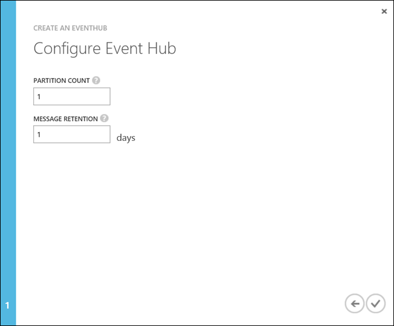
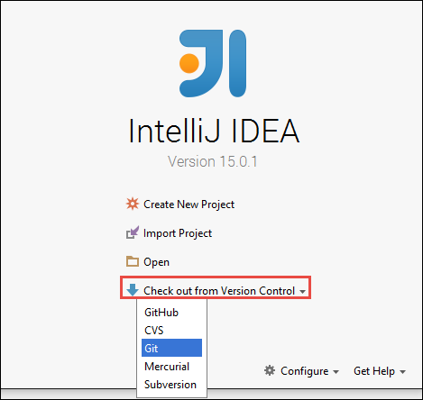

<properties 
    pageTitle="Azure 事件集線器使用處理串流資料中 HDInsight Apache 火花 |Microsoft Azure" 
    description="如何傳送資料的逐步指示串流到 Azure 事件集線器，然後火花使用 scala 應用程式中收到的事件" 
    services="hdinsight" 
    documentationCenter="" 
    authors="nitinme" 
    manager="jhubbard" 
    editor="cgronlun"
    tags="azure-portal"/>

<tags 
    ms.service="hdinsight" 
    ms.workload="big-data" 
    ms.tgt_pltfrm="na" 
    ms.devlang="na" 
    ms.topic="article" 
    ms.date="09/30/2016" 
    ms.author="nitinme"/>

# 火花串流: [處理程序與 HDInsight linux Apache 火花叢集從 Azure 事件集線器事件

火花串流延伸核心火花 API 建立可調整高處理量、 容錯串流處理應用程式。 資料可以 ingested 從多個來源中。 在本文中，我們會使用 Azure 事件集線器，內嵌的資料。 事件集線器是 free ingestion 系統秒的事件，可以吸收量數百萬。 

在本教學課程中，您將學習如何建立 Azure 事件] 中心內，如何使用主控台應用程式中 Java，事件中心將內嵌的郵件，以及可擷取平行使用撰寫 Scala 火花應用程式。 此應用程式會使用資料串流到事件集線器，並將其傳送到不同的輸出 （Azure 儲存體 Blob、 登錄區資料表和 SQL 資料表）。

> [AZURE.NOTE] 若要依照本文中的指示進行，您必須使用兩個版本的 Azure 入口網站。 若要建立事件中心中，您會使用[傳統 Azure 入口網站](https://manage.windowsazure.com)。 若要使用的 HDInsight 火花叢集，您會使用[Azure 入口網站](https://portal.azure.com/)。  

**先決條件︰**

您必須具備下列項目︰

- Azure 的訂閱。 請參閱[取得 Azure 免費試用版](https://azure.microsoft.com/documentation/videos/get-azure-free-trial-for-testing-hadoop-in-hdinsight/)。
- Apache 火花叢集。 如需相關指示，請參閱[建立 Apache 火花叢集中 Azure HDInsight](hdinsight-apache-spark-jupyter-spark-sql.md)。
- Oracle Java 開發套件。 您可以從[這裡](http://www.oracle.com/technetwork/java/javase/downloads/jdk8-downloads-2133151.html)進行安裝。
- Java IDE。 本文會使用 IntelliJ 想法 15.0.1。 您可以從[這裡](https://www.jetbrains.com/idea/download/)進行安裝。
- SQL Server，Microsoft JDBC 驅動程式 v4.1 或更新版本。 這被需要事件資料寫入的 SQL Server 資料庫。 您可以從[這裡](https://msdn.microsoft.com/sqlserver/aa937724.aspx)進行安裝。
- Azure SQL 資料庫。 如需相關指示，請參閱[建立以分鐘為單位的 SQL 資料庫](../sql-database/sql-database-get-started.md)。

## 此方案做什麼？

這是接續串流解決方案的方式︰

1. 建立會收到的事件資料流 Azure 事件中心。

2. 執行本機獨立的應用程式會產生的事件，並將其 Azure 事件中心。 在[https://github.com/hdinsight/spark-streaming-data-persistence-examples](https://github.com/hdinsight/spark-streaming-data-persistence-examples)發佈負責這項工作的範例應用程式。

2. 從 Azure] 事件中心讀取串流的事件，並將其送到不同的位置 （Azure Blob、 登錄區資料表和 SQL 資料庫表格） 的火花叢集上從遠端執行串流應用程式。 

## 建立 Azure 事件中心

1. 從[Azure 入口網站](https://manage.windowsazure.com)中，選取 [**新增** > **服務匯流排** > **事件中心** > **建立自訂**。

2. 在**新增新的事件中心**畫面上，輸入 [**事件] 中心名稱**]，選取要建立中心，並建立新的命名空間或選取現有的**區域**。 按一下**箭號**，以繼續進行。

    

    > [AZURE.NOTE] 您應該為 Apache 火花叢集以減少延遲和成本 HDInsight 中選取同一個**位置**。

3. 在 [**設定] 事件中心**] 畫面中，輸入**磁碟分割數目**和**訊息保留**值，然後再按一下核取記號。 此範例中，使用分割數為 10，郵件保留為 1。 請注意磁碟分割數目，因為您稍後需要此值。

    

4. 按一下您建立的 [事件] 中心內，按一下 [**設定**]，然後建立的事件中心的兩個存取原則。

    <table>
    <tr><th>名稱</th><th>權限</th></tr>
    <tr><td>mysendpolicy</td><td>傳送</td></tr>
    <tr><td>myreceivepolicy</td><td>聆聽</td></tr>
    </table>

    建立權限後，請選取 [在頁面底部的 [**儲存**] 圖示。 這樣會建立將用來傳送 (**mysendpolicy**) 及聆聽此事件中心 (**myreceivepolicy**) 共用的存取原則。

    

    
5. 在相同頁面上，記原則產生的索引鍵的兩個原則。 儲存之後，將會使用這些按鍵。

    

6. 在**儀表板**頁面上，按一下 [從擷取及 [事件] 中心內使用兩個原則儲存的連接字串最下方的 [**連線資訊**]。

    

## 傳送郵件給事件中心使用 Scala 應用程式

本節中，您可以使用獨立的本機 Scala 應用程式的事件資料流傳送到您在上一個步驟中建立的 Azure 事件集線器。 在[https://github.com/hdinsight/eventhubs-sample-event-producer](https://github.com/hdinsight/eventhubs-sample-event-producer)GitHub 上使用此應用程式。 在此步驟假設您已經分叉時此 GitHub 存放庫。

1. 開啟應用程式， **EventhubsSampleEventProducer**，在 IntelliJ 想法。
    
2. 建立專案。 從 [**建置**] 功能表中，按一下 [**建立專案**]。 下**\out\artifacts**會建立輸出 jar。

>[AZURE.TIP] 您也可以直接從 GitHub 存放庫中建立專案使用 IntelliJ 概念中可用的選項。 若要瞭解如何使用這個方法，使用 [下一步] 區段中的指示，取得指示。 請注意，不是大量的下一節所述的步驟適用於您在此步驟中建立的 Scala 應用程式。 例如︰

> * 您不會更新以包含火花版本 POM。 這是因為沒有任何相依性火花上建立此應用程式
> * 您不會新增至專案文件庫的一些相依性 （每瓶）。 這是因為這些 （每瓶） 並不需要此專案。

## 更新 Scala 串流接收事件的應用程式

若要接收事件，並將它傳送到不同的目的地範例 Scala 應用程式的[https://github.com/hdinsight/spark-streaming-data-persistence-examples](https://github.com/hdinsight/spark-streaming-data-persistence-examples)。 請遵循下列步驟來更新此應用程式，並建立輸出 jar。

1. 啟動 IntelliJ 主意並從 [啟動] 畫面上，選取 [**從版本控制取出**，然後按一下**給**。
        
    

2. 在 [**複製存放庫**] 對話方塊中，提供給存放庫複製指定，複製目錄]，然後按一下 [**複製**的 URL。

    

    
3. 依照提示操作，直到完全複製專案。 按下**Alt + 1**開啟**的專案檢視**。 應如下所示。

    
    
4. 請務必以 Java8 編譯的應用程式碼。 確定，按一下 [**檔案]**，按一下**專案結構**，然後在 [**專案**] 索引標籤上確定專案語言層級會設定為**8-Lambda 等類型註釋**。

    

5. 開啟**pom.xml** ，並確定火花版本正確。 在下 <properties> 節點，尋找下列程式碼片段，並確認火花版本。

        <scala.version>2.10.4</scala.version>
        <scala.compat.version>2.10.4</scala.compat.version>
        <scala.binary.version>2.10</scala.binary.version>
        <spark.version>1.6.2</spark.version>
    
5. 應用程式需要兩個相依性 （每瓶）︰

    * **EventHub 受話器 jar**。 這是需火花從事件中心接收郵件。 若要使用此 jar，更新 [若要新增在**pom.xml** `<dependencies>`。

            <dependency>
              <groupId>com.microsoft.azure</groupId>
              <artifactId>spark-streaming-eventhubs_2.10</artifactId>
              <version>1.6.0</version>
            </dependency> 

    * **JDBC 驅動程式 jar**。 這被需要撰寫轉換為 Azure SQL 資料庫或從事件中樞收到的郵件。 您可以下載 v4.1 或從[以下](https://msdn.microsoft.com/sqlserver/aa937724.aspx)此 jar 檔案的更新版本。 新增此 jar 參照中的專案文件庫。 執行下列步驟︰

        1. 從 IntelliJ 想法，您會使用應用程式開啟，按一下 [**檔案**] 視窗中，按一下 [**專案結構**，，然後按一下**文件庫**。 
        
        2. 按一下 [新增] 圖示 ()，按一下 [ **Java**，，然後瀏覽至您已下載 JDBC 驅動程式 jar 的位置。 請依照提示 jar 檔案新增至專案文件庫。

            ")

        3. 按一下 [**套用**]。

6. 建立輸出 jar 檔案。 執行下列步驟。
    1. 在 [**專案結構**] 對話方塊中，按一下**成品**，然後按一下加號。 從快顯] 對話方塊中，按一下**JAR**，，然後按一下**從與相依性的模組**。

        

    1. 在 [**建立 JAR 從模組**] 對話方塊中，按一下省略符號 () 針對**主要類別**。

    1. 在 [**選取主要類別**] 對話方塊中，選取任何可用的類別，然後按一下**[確定]**。

        

    1. 在**建立 JAR 從模組**] 對話方塊中，確定選取 [**擷取至目標 JAR**的選項，然後再按一下**[確定]**。 這會建立單一糖與所有的相依性。

        

    1. [**輸出版面配置**] 索引標籤會列出所有 （每瓶） 所 Maven 專案的一部分。 您可以選取並刪除要在其上 Scala 應用程式有沒有直接相依性。 此建立應用程式，您可以移除所有但最後一個 （**microsoft-火花-串流-範例編譯輸出**）。 選取要刪除，然後按一下 [**刪除**] 圖示 （每瓶） ()。

        

        請確定已選取**建立讓於**] 方塊中，以確保會建立糖，每次建立或更新專案。 按一下 [**套用**] 和 [**確定**]。

    1. 在 [**輸出版面配置**] 索引標籤底部的 [**可用的項目**] 方塊中，向右有 SQL JDBC 糖您先前新增至專案文件庫。 您必須將它新增至**輸出版面配置**] 索引標籤。 Jar 檔案，以滑鼠右鍵按一下，然後按一下 [**擷取到輸出根**。

          

        [**輸出版面配置**] 索引標籤，現在應該看起來如下。

        ![最後的輸出] 索引標籤](./media/hdinsight-apache-spark-eventhub-streaming/final-output-tab.png)     

        在 [**專案結構**] 對話方塊中，按一下 [**套用**]，然後按一下**[確定]**。 

    1. 從功能表列中，按一下 [**建立**，然後按一下**進行專案。** 您也可以按一下要建立糖**建立成品**。 下**\out\artifacts**會建立輸出 jar。

        

## 在使用晚總火花叢集從遠端執行應用程式

我們會使用晚總火花叢集上從遠端執行串流應用程式。 如需如何使用 HDInsight 火花叢集晚總的詳細說明，請參閱[遠端到 Apache 火花叢集 Azure HDInsight 上送出工作](hdinsight-apache-spark-livy-rest-interface.md)。 您可以開始執行之前遠端工作，以資料流事件使用火花有數種您應該執行的動作︰

1. 啟動本機獨立應用程式來產生的事件，然後傳送給事件中心]。 您可以使用下列命令，執行此作業︰

        java -cp EventhubsSampleEventProducer.jar com.microsoft.eventhubs.client.example.EventhubsClientDriver --eventhubs-namespace "mysbnamespace" --eventhubs-name "myeventhub" --policy-name "mysendpolicy" --policy-key "<policy key>" --message-length 32 --thread-count 32 --message-count -1

2. 將資料流 jar (**microsoft-火花-串流-examples.jar**) 複製到 [叢集相關聯 Azure Blob 儲存體。 這樣糖晚總存取。 您可以使用[**AzCopy**](../storage/storage-use-azcopy.md)，命令列公用程式中，執行此作業。 有許多其他用戶端，您可以使用上傳的資料。 您可以找到深入瞭解其在[上傳 Hadoop 工作 HDInsight 的資料](hdinsight-upload-data.md)。

3. 執行這些應用程式在電腦上安裝捲曲。 我們使用捲曲叫用晚總端點從遠端執行工作。

### 執行應用程式，以將為文字 Azure 儲存體 Blob 收到的事件

開啟命令提示字元、 瀏覽至目錄安裝捲曲，然後執行下列命令 （取代使用者名稱與密碼和叢集名稱）︰

    curl -k --user "admin:mypassword1!" -v -H "Content-Type: application/json" -X POST --data @C:\Temp\inputBlob.txt "https://mysparkcluster.azurehdinsight.net/livy/batches"

定義檔案**inputBlob.txt**中的參數，如下所示︰

    { "file":"wasbs:///example/jars/microsoft-spark-streaming-examples.jar", "className":"com.microsoft.spark.streaming.examples.workloads.EventhubsEventCount", "args":["--eventhubs-namespace", "mysbnamespace", "--eventhubs-name", "myeventhub", "--policy-name", "myreceivepolicy", "--policy-key", "<put-your-key-here>", "--consumer-group", "$default", "--partition-count", 10, "--batch-interval-in-seconds", 20, "--checkpoint-directory", "/EventCheckpoint", "--event-count-folder", "/EventCount/EventCount10"], "numExecutors":20, "executorMemory":"1G", "executorCores":1, "driverMemory":"2G" }

讓我們瞭解內容中輸入檔案的參數︰

* **檔案**是 Azure 儲存體帳戶叢集相關聯的應用程式 jar 檔案的路徑。
* **類別名稱**是糖類別的名稱。
* **引數**是類別所需要的引數清單
* **numExecutors**是核心火花用來執行串流應用程式的數量。 此一律採用至少兩次事件中心磁碟分割區的數目。
* **executorMemory**、 **executorCores**， **driverMemory**是用來將所需的資源分派給串流應用程式的參數。

>[AZURE.NOTE] 您不需要建立輸出資料夾 （EventCheckpoint、 EventCount/EventCount10） 做為參數。 串流應用程式為您建立它們。
    
當您執行命令時，您應該會看到如下所示的輸出︰

    < HTTP/1.1 201 Created
    < Content-Type: application/json; charset=UTF-8
    < Location: /18
    < Server: Microsoft-IIS/8.5
    < X-Powered-By: ARR/2.5
    < X-Powered-By: ASP.NET
    < Date: Tue, 01 Dec 2015 05:39:10 GMT
    < Content-Length: 37
    <
    {"id":1,"state":"starting","log":[]}* Connection #0 to host mysparkcluster.azurehdinsight.net left intact

請記下批次 ID （在此範例中，是 '1'） 的輸出最後一列中。 若要驗證成功執行應用程式，您可以查看您與叢集相關聯的 Azure 儲存體帳戶，您應該會看到那里建立**/EventCount/EventCount10**資料夾。 此資料夾包含二進位大型物件擷取的事件處理中指定的時間週期參數**批次間隔-中的秒**數。

應用程式會繼續執行，直到您將其刪除。 若要這麼做，請使用下列命令︰

    curl -k --user "admin:mypassword1!" -v -X DELETE "https://mysparkcluster.azurehdinsight.net/livy/batches/1"

### 執行應用程式，以將 json Azure 儲存體 Blob 收到的事件

開啟命令提示字元、 瀏覽至目錄安裝捲曲，然後執行下列命令 （取代使用者名稱與密碼和叢集名稱）︰

    curl -k --user "admin:mypassword1!" -v -H "Content-Type: application/json" -X POST --data @C:\Temp\inputJSON.txt "https://mysparkcluster.azurehdinsight.net/livy/batches"

定義檔案**inputJSON.txt**中的參數，如下所示︰

    { "file":"wasbs:///example/jars/microsoft-spark-streaming-examples.jar", "className":"com.microsoft.spark.streaming.examples.workloads.EventhubsToAzureBlobAsJSON", "args":["--eventhubs-namespace", "mysbnamespace", "--eventhubs-name", "myeventhub", "--policy-name", "myreceivepolicy", "--policy-key", "<put-your-key-here>", "--consumer-group", "$default", "--partition-count", 10, "--batch-interval-in-seconds", 20, "--checkpoint-directory", "/EventCheckpoint", "--event-count-folder", "/EventCount/EventCount10", "--event-store-folder", "/EventStore10"], "numExecutors":20, "executorMemory":"1G", "executorCores":1, "driverMemory":"2G" }

參數類似您指定的文字輸出，在先前的步驟。 同樣地，您不需要建立輸出資料夾 （EventCheckpoint、 EventCount/EventCount10） 做為參數。 串流應用程式為您建立它們。

 執行命令後，您可以查看您與叢集相關聯的 Azure 儲存體帳戶，您應該會看到那里建立**/EventStore10**資料夾。 開啟任何檔案加上**組件**和您應該會看到處理 JSON 格式的事件。

### 執行應用程式，以將登錄區資料表中收到的事件

若要執行的應用程式串流至登錄區資料表的事件，您需要一些額外的元件。 以下是︰

* datanucleus api-jdo 3.2.6.jar
* datanucleus-rdbms-3.2.9.jar
* datanucleus-核心-3.2.10.jar
* 登錄區 site.xml

在您 HDInsight 火花叢集**.jar**檔案可`/usr/hdp/current/spark-client/lib`。 在有**登錄區 site.xml** `/usr/hdp/current/spark-client/conf`。

您可以使用[WinScp](http://winscp.net/eng/download.php)覆寫這些檔案的本機電腦。 工具然後可用來這些檔案複製到您叢集相關聯的儲存空間帳戶。 如需有關如何上傳檔案到儲存帳戶的詳細資訊，請參閱[上傳 Hadoop 工作 HDInsight 的資料](hdinsight-upload-data.md)。

一旦您 Azure 儲存體帳戶複製移至檔案]，開啟命令提示字元、 瀏覽至安裝捲曲，目錄及執行下列命令 （取代使用者名稱與密碼和叢集名稱）︰

    curl -k --user "admin:mypassword1!" -v -H "Content-Type: application/json" -X POST --data @C:\Temp\inputHive.txt "https://mysparkcluster.azurehdinsight.net/livy/batches"

定義檔案**inputHive.txt**中的參數，如下所示︰

    { "file":"wasbs:///example/jars/microsoft-spark-streaming-examples.jar", "className":"com.microsoft.spark.streaming.examples.workloads.EventhubsToHiveTable", "args":["--eventhubs-namespace", "mysbnamespace", "--eventhubs-name", "myeventhub", "--policy-name", "myreceivepolicy", "--policy-key", "<put-your-key-here>", "--consumer-group", "$default", "--partition-count", 10, "--batch-interval-in-seconds", 20, "--checkpoint-directory", "/EventCheckpoint", "--event-count-folder", "/EventCount/EventCount10", "--event-hive-table", "EventHiveTable10" ], "jars":["wasbs:///example/jars/datanucleus-api-jdo-3.2.6.jar", "wasbs:///example/jars/datanucleus-rdbms-3.2.9.jar", "wasbs:///example/jars/datanucleus-core-3.2.10.jar"], "files":["wasbs:///example/jars/hive-site.xml"], "numExecutors":20, "executorMemory":"1G", "executorCores":1, "driverMemory":"2G" }

參數類似您指定的文字輸出先前的步驟。 同樣地，您不需要建立輸出資料夾 （EventCheckpoint、 EventCount/EventCount10） 或輸出做為參數的登錄區資料表 (EventHiveTable10)。 串流應用程式為您建立它們。 附註**（每瓶）**和**檔案**的選項，包括.jar 檔案並將您複製的儲存空間帳戶登錄區 site.xml 的路徑。

確認已成功建立登錄區資料表，可讓您 SSH 到叢集，並執行登錄區查詢。 如需相關指示，請參閱[使用登錄區中使用 SSH HDInsight Hadoop 使用](hdinsight-hadoop-use-hive-ssh.md)。 當您使用 SSH 連線時，您可以執行下列命令以確認登錄區資料表， **EventHiveTable10**，建立。

    show tables;

您應該會看到類似以下的輸出︰

    OK
    eventhivetable10
    hivesampletable

您也可以執行選取查詢以檢視資料表的內容。

    SELECT * FROM eventhivetable10 LIMIT 10;

您應該會看到如下所示的輸出︰

    ZN90apUSQODDTx7n6Toh6jDbuPngqT4c
    sor2M7xsFwmaRW8W8NDwMneFNMrOVkW1
    o2HcsU735ejSi2bGEcbUSB4btCFmI1lW
    TLuibq4rbj0T9st9eEzIWJwNGtMWYoYS
    HKCpPlWFWAJILwR69MAq863nCWYzDEw6
    Mvx0GQOPYvPR7ezBEpIHYKTKiEhYammQ
    85dRppSBSbZgThLr1s0GMgKqynDUqudr
    5LAWkNqorLj3ZN9a2mfWr9rZqeXKN4pF
    ulf9wSFNjD7BZXCyunozecov9QpEIYmJ
    vWzM3nvOja8DhYcwn0n5eTfOItZ966pa
    Time taken: 4.434 seconds, Fetched: 10 row(s)

### 執行要收到的事件至 Azure SQL 資料庫表格的應用程式

執行此步驟之前，先確定您有建立 Azure SQL 資料庫。 您將需要的資料庫名稱與資料庫伺服器名稱，資料庫系統管理員認證的值做為參數。 您不需要透過建立資料庫資料表。 串流應用程式為您建立的。

開啟命令提示字元、 瀏覽至目錄安裝捲曲，然後執行下列命令︰

    curl -k --user "admin:mypassword1!" -v -H "Content-Type: application/json" -X POST --data @C:\Temp\inputSQL.txt "https://mysparkcluster.azurehdinsight.net/livy/batches"

定義檔案**inputSQL.txt**中的參數，如下所示︰

    { "file":"wasbs:///example/jars/microsoft-spark-streaming-examples.jar", "className":"com.microsoft.spark.streaming.examples.workloads.EventhubsToAzureSQLTable", "args":["--eventhubs-namespace", "mysbnamespace", "--eventhubs-name", "myeventhub", "--policy-name", "myreceivepolicy", "--policy-key", "<put-your-key-here>", "--consumer-group", "$default", "--partition-count", 10, "--batch-interval-in-seconds", 20, "--checkpoint-directory", "/EventCheckpoint", "--event-count-folder", "/EventCount/EventCount10", "--sql-server-fqdn", "<database-server-name>.database.windows.net", "--sql-database-name", "mysparkdatabase", "--database-username", "sparkdbadmin", "--database-password", "<put-password-here>", "--event-sql-table", "EventContent" ], "numExecutors":20, "executorMemory":"1G", "executorCores":1, "driverMemory":"2G" }

若要驗證成功執行應用程式，您可以連線到使用 SQL Server Management Studio Azure SQL 資料庫。 如需如何執行這項作業，請參閱[連線至 SQL 資料庫的 SQL Server Management Studio 中](../sql-database/sql-database-connect-query-ssms.md)的指示。 當您連線至資料庫時，您可以瀏覽至**EventContent**資料表所建立的資料流應用程式。 您可以執行快速查詢從資料表取得資料。 執行下列查詢︰

    SELECT * FROM EventCount

您應該會看到類似以下的輸出︰

    00046b0f-2552-4980-9c3f-8bba5647c8ee
    000b7530-12f9-4081-8e19-90acd26f9c0c
    000bc521-9c1b-4a42-ab08-dc1893b83f3b
    00123a2a-e00d-496a-9104-108920955718
    0017c68f-7a4e-452d-97ad-5cb1fe5ba81b
    001KsmqL2gfu5ZcuQuTqTxQvVyGCqPp9
    001vIZgOStka4DXtud0e3tX7XbfMnZrN
    00220586-3e1a-4d2d-a89b-05c5892e541a
    0029e309-9e54-4e1b-84be-cd04e6fce5ec
    003333cf-874f-4045-9da3-9f98c2b4ea49
    0043c07e-8d73-420a-9af7-1fcb94575356
    004a11a9-0c2c-4bc0-a7d5-2e0ebd947ab9

    
## 另請參閱

* [概觀︰ Apache 火花上 Azure HDInsight](hdinsight-apache-spark-overview.md)

### 案例

* [使用 BI 火花︰ 執行火花 HDInsight 中使用的 BI 工具的互動式的資料分析](hdinsight-apache-spark-use-bi-tools.md)

* [與電腦學習火花︰ 使用火花 HDInsight 分析建置溫度使用 HVAC 資料中](hdinsight-apache-spark-ipython-notebook-machine-learning.md)

* [與電腦學習火花︰ 使用火花 HDInsight 預測食物檢查結果中](hdinsight-apache-spark-machine-learning-mllib-ipython.md)

* [HDInsight 中使用火花網站記錄分析](hdinsight-apache-spark-custom-library-website-log-analysis.md)

### 建立和執行應用程式

* [建立使用 Scala 獨立應用程式](hdinsight-apache-spark-create-standalone-application.md)

* [在使用晚總火花叢集從遠端執行工作](hdinsight-apache-spark-livy-rest-interface.md)

### 工具和延伸模組

* [使用 HDInsight 工具增益集，如 IntelliJ 瞭解建立及提交火花 Scala 應用程式](hdinsight-apache-spark-intellij-tool-plugin.md)

* [使用 HDInsight 工具增益集，如 IntelliJ 瞭解遠端偵錯火花應用程式](hdinsight-apache-spark-intellij-tool-plugin-debug-jobs-remotely.md)

* [使用上 HDInsight 火花叢集運貨用飛艇筆記本](hdinsight-apache-spark-use-zeppelin-notebook.md)

* [核心適用於 HDInsight 火花叢集 Jupyter 筆記本](hdinsight-apache-spark-jupyter-notebook-kernels.md)

* [使用外部封包 Jupyter 筆記本](hdinsight-apache-spark-jupyter-notebook-use-external-packages.md)

* [在 [您的電腦上安裝 Jupyter 並連線到 HDInsight 火花叢集](hdinsight-apache-spark-jupyter-notebook-install-locally.md)

### 管理資源

* [管理資源 Apache 火花叢集中 Azure HDInsight](hdinsight-apache-spark-resource-manager.md)

* [追蹤和偵錯 Apache 火花中叢集 HDInsight 上執行的工作](hdinsight-apache-spark-job-debugging.md)

[hdinsight-versions]: hdinsight-component-versioning.md
[hdinsight-upload-data]: hdinsight-upload-data.md
[hdinsight-storage]: hdinsight-hadoop-use-blob-storage.md

[azure-purchase-options]: http://azure.microsoft.com/pricing/purchase-options/
[azure-member-offers]: http://azure.microsoft.com/pricing/member-offers/
[azure-free-trial]: http://azure.microsoft.com/pricing/free-trial/
[azure-management-portal]: https://manage.windowsazure.com/
[azure-create-storageaccount]: ../storage-create-storage-account/ 
