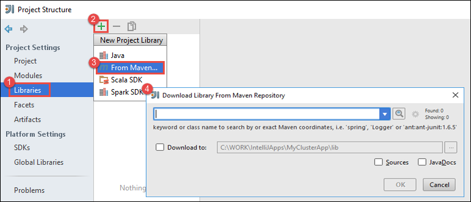
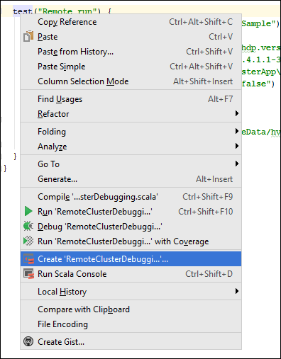
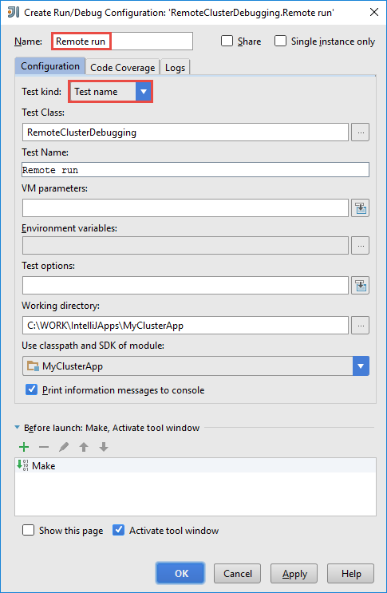
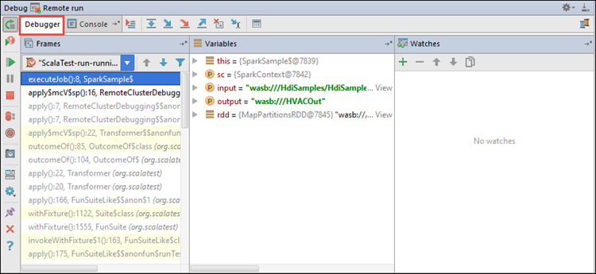

 <properties
    pageTitle="使用中的 IntelliJ Azure 工具組 HDInsight 工具來遠端偵錯 HDInsight 火花叢集上執行應用程式 |Microsoft Azure"
    description="瞭解如何使用中的 IntelliJ Azure 工具組 HDInsight 工具來遠端偵錯 HDInsight 火花叢集上執行應用程式。"
    services="hdinsight"
    documentationCenter=""
    authors="nitinme"
    manager="jhubbard"
    editor="cgronlun"
    tags="azure-portal"/>

<tags
    ms.service="hdinsight"
    ms.workload="big-data"
    ms.tgt_pltfrm="na"
    ms.devlang="na"
    ms.topic="article"
    ms.date="09/09/2016"
    ms.author="nitinme"/>

# 使用中的 IntelliJ Azure 工具組 HDInsight 工具來偵錯 HDInsight 火花 Linux 叢集上遠端火花應用程式

本文提供逐步指引如何使用 HDInsight 中工具的 IntelliJ Azure 工具組，提交火花工作 HDInsight 火花叢集上的並偵錯其遠端從您的桌上型電腦。 若要這麼做，您必須執行下列高層級的步驟︰

1. 建立網站的網站或點為網站 Azure 虛擬網路。 這份文件中的步驟假設您使用網站的網路。

2. 火花叢集在中建立的網站-Azure 虛擬網路 Azure HDInsight。

3. 確認叢集 headnode 和桌面之間的連線。

4. 在 IntelliJ 您先建立 Scala 應用程式，並將它設定為遠端偵錯。

5. 執行和偵錯應用程式。

##必要條件

* Azure 的訂閱。 請參閱[取得 Azure 免費試用版](https://azure.microsoft.com/documentation/videos/get-azure-free-trial-for-testing-hadoop-in-hdinsight/)。

* HDInsight linux Apache 火花叢集。 如需相關指示，請參閱[建立 Apache 火花叢集中 Azure HDInsight](hdinsight-apache-spark-jupyter-spark-sql.md)。
 
* Oracle Java 開發套件。 您可以從[這裡](http://www.oracle.com/technetwork/java/javase/downloads/jdk8-downloads-2133151.html)進行安裝。
 
* IntelliJ 想法。 本文會使用版本 15.0.1。 您可以從[這裡](https://www.jetbrains.com/idea/download/)進行安裝。
 
* HDInsight 工具中的 IntelliJ Azure 工具組。 IntelliJ HDInsight 工具可為 IntelliJ Azure 工具組的一部分。 如需有關如何安裝 Azure 工具組的指示，請參閱[安裝的 IntelliJ Azure 工具組](../azure-toolkit-for-intellij-installation.md)。

* 登入 IntelliJ 您先從 Azure 訂閱。 依照指示進行[以下](hdinsight-apache-spark-intellij-tool-plugin.md#log-into-your-azure-subscription)。
 
* 在執行 Windows 電腦上執行遠端偵錯火花 Scala 應用程式時，您可能會收到例外狀況，因為缺少 WinUtils.exe Windows 上，就會發生的[火花 2356年](https://issues.apache.org/jira/browse/SPARK-2356)所述。 若要解決此錯誤，您必須[下載可執行檔從這裡開始](http://public-repo-1.hortonworks.com/hdp-win-alpha/winutils.exe)到位置，如**C:\WinUtils\bin**。 然後，您必須新增環境變數**HADOOP_HOME** ，及變數的值設為**C\WinUtils**。

## 步驟 1︰ 建立 Azure 虛擬網路

請依照下列指示，從下建立 Azure 虛擬網路，然後確認 [桌面和 Azure 虛擬網路之間的連線的連結。

* [建立使用 Azure 入口網站的網站-VPN 連線 VNet](../vpn-gateway/vpn-gateway-howto-site-to-site-resource-manager-portal.md)
* [使用 PowerShell 網站-VPN 連線建立 VNet](../vpn-gateway/vpn-gateway-create-site-to-site-rm-powershell.md)
* [點-網站使用 PowerShell 虛擬網路連線的設定](../vpn-gateway/vpn-gateway-howto-point-to-site-rm-ps.md)

## 步驟 2︰ 建立 HDInsight 火花叢集

您也應該建立 Apache 火花叢集，在您建立的 Azure 虛擬網路的 Azure HDInsight。 在[HDInsight 中的 [建立 Linux 型叢集](hdinsight-hadoop-provision-linux-clusters.md)使用可用的資訊。 選用設定的一部分，選取您在上一個步驟中建立 Azure 虛擬網路。

## 步驟 3︰ 驗證叢集 headnode 和桌面之間的連線

1. 取得 headnode 的 IP 位址。 開啟 Ambari UI 叢集。 從叢集刀中，按一下 [**儀表板**]。

    

2. 從 Ambari UI，從右上角，按一下 [**主辦城市**]。

    

3. 您應該會看到 headnodes、 工作者節點和動物園管理員節點的清單。 Headnodes 有**hn*** 前置字元。 按一下第一個 headnode。

    

4. 在開啟時，[**摘要**] 方塊中，從頁面底端複製 headnode 和主機名稱的 IP 位址。

    

5. 包含您要執行和遠端偵錯火花工作**hosts**檔案在電腦上的 IP 位址和 headnode 主機名稱。 這會讓您使用的 IP 位址，以及主機名稱 headnode 與通訊。

    1. 開啟筆記本，以提高權限。 從 [檔案] 功能表中，按一下 [**開啟**]，然後瀏覽至 hosts 檔案的位置。 在 Windows 電腦上，則`C:\Windows\System32\Drivers\etc\hosts`。

    2. 將下列文字新增至 [**主辦城市**檔案。

            # For headnode0
            192.xxx.xx.xx hn0-nitinp
            192.xxx.xx.xx hn0-nitinp.lhwwghjkpqejawpqbwcdyp3.gx.internal.cloudapp.net

            # For headnode1
            192.xxx.xx.xx hn1-nitinp
            192.xxx.xx.xx hn1-nitinp.lhwwghjkpqejawpqbwcdyp3.gx.internal.cloudapp.net

5. 從您連線至 Azure 虛擬網路 HDInsight 叢集所用的電腦，請確認您可以偵測使用的 IP 位址，以及主機名稱的兩個 headnodes。

6. 將使用的指示，在[連線至使用 SSH HDInsight 叢集](hdinsight-hadoop-linux-use-ssh-windows.md#connect-to-a-linux-based-hdinsight-cluster)叢集 headnode SSH。 從叢集 headnode，偵測 （ping) 桌上型電腦的 IP 位址。 您應該測試連線至網路連線和 Azure 虛擬網路的電腦已連線至其他的電腦所指派的兩個的 IP 位址。

7. 針對其他 headnode 以及重複步驟。 

## 步驟 4︰ 建立 HDInsight 工具中 Azure 工具組用 IntelliJ 火花 Scala 應用程式，並將它設定為遠端偵錯

1. 啟動 IntelliJ 想法，並建立新的專案。 在 [新的 [專案] 對話方塊中，選取下列選項，然後再按 [**下一步**。

    

    * 從左窗格中，選取 [ **HDInsight**]。
    * 從右窗格中，選取 [**火花上 HDInsight (Scala)**]。
    * 按一下 [**下一步**]。

2. 在下一個視窗中，提供專案詳細資料。

    * 提供專案名稱和專案的位置。
    * 對於**專案 SDK**，請確定您提供 Java 版本大於 7。
    * 針對**Scala SDK**，按一下 [**建立**]，按一下 [**下載**]，然後選取 Scala 若要使用的版本。 **請確定您沒有使用版本 2.11.x**。 此範例使用版本**2.10.6**。

        

    * 如**火花 SDK**，下載及使用從[以下](http://go.microsoft.com/fwlink/?LinkID=723585&clcid=0x409)SDK。 您也可以略過此並改用[火花 Maven 存放庫](http://mvnrepository.com/search?q=spark)，不過請確定您有安裝來開發火花應用程式正確 maven 存放庫。 （例如，您需要，請確定您有安裝如果您使用火花串流; 火花串流組件也請確定您使用的標示為 Scala 2.10 存放庫-執行的使用存放庫標示為 Scala 2.11。）

        

    * 按一下 [**完成**]。

3. 火花專案會自動為您建立的成品。 若要查看的成品，請遵循下列步驟。

    1. 從 [**檔案**] 功能表中，按一下 [**專案結構**。
    2. 在 [**專案結構**] 對話方塊中，按一下 [若要查看所建立的預設成品的**成品**。

        

    您也可以建立自己的成品上按一下 [bly**+**上述圖像中醒目提示的圖示。

4. 在 [**專案結構**] 對話方塊中，按一下 [**專案**]。 如果**專案 SDK** 1.8 設定，請確定**專案語言層級**會設定為**7-菱形 ARM，多難題等**。

    

4. 將文件庫新增至您的專案。 若要新增文件庫，以滑鼠右鍵按一下專案樹狀目錄中的專案名稱，然後再按一下 [**開啟模組設定**。 在 [**專案結構**] 對話方塊中，從左側的窗格中，按一下 [**文件庫**，然後按一下 （+） 符號，然後按一下 [**從 Maven**。 

     

    在 [**下載文件庫從 Maven 存放庫**] 對話方塊中，搜尋並新增下列文件庫。

    * `org.scalatest:scalatest_2.10:2.2.1`
    * `org.apache.hadoop:hadoop-azure:2.7.1`

5. 複製`yarn-site.xml`和`core-site.xml`從叢集 headnode 並將其新增至專案。 您可以使用下列命令，將檔案複製。 您可以執行下列動作來使用[Cygwin](https://cygwin.com/install.html) `scp`命令，將檔案複製叢集 headnodes。

        scp <ssh user name>@<headnode IP address or host name>://etc/hadoop/conf/core-site.xml .

    因為我們新增叢集 headnode IP 位址和 hostname 之 hosts 檔案在桌面上，我們可以使用 [ **scp**命令以下列方式。

        scp sshuser@hn0-nitinp:/etc/hadoop/conf/core-site.xml .
        scp sshuser@hn0-nitinp:/etc/hadoop/conf/yarn-site.xml .

    複製資料夾底下的**/src**您專案樹狀目錄中，例如將這些檔案新增至專案`<your project directory>\src`。

6. 更新`core-site.xml`進行下列變更。

    1. `core-site.xml`包含要儲存相關聯的帳戶與叢集的加密的金鑰。 在 [`core-site.xml`您新增至專案，加密的金鑰取代的實際儲存鍵與帳戶相關聯預設儲存空間。 請參閱[管理您的儲存空間便捷鍵](../storage/storage-create-storage-account.md#manage-your-storage-account)。

            <property>
                <name>fs.azure.account.key.hdistoragecentral.blob.core.windows.net</name>
                <value>access-key-associated-with-the-account</value>
            </property>

    2. 移除下列項目從`core-site.xml`。

            <property>
                <name>fs.azure.account.keyprovider.hdistoragecentral.blob.core.windows.net</name>
                <value>org.apache.hadoop.fs.azure.ShellDecryptionKeyProvider</value>
            </property>

            <property>
                <name>fs.azure.shellkeyprovider.script</name>
                <value>/usr/lib/python2.7/dist-packages/hdinsight_common/decrypt.sh</value>
            </property>

            <property>
                <name>net.topology.script.file.name</name>
                <value>/etc/hadoop/conf/topology_script.py</value>
            </property>

    3. 儲存檔案。

7. 新增您的應用程式的主要類別。 從**專案總管]**中，以滑鼠右鍵按一下**src**，指向 [**新增]**，然後按一下**Scala 類別**。

    

8. 在 [**建立新的 Scala 類別**] 對話方塊中，提供的名稱，選取**物件****類型**]，然後按一下**[確定]**。

    

9. 在 [`MyClusterAppMain.scala`檔案時，請貼上下列的程式碼。 將此程式碼會建立盡如內容和啟動`executeJob`的方法`SparkSample`物件。

        import org.apache.spark.{SparkConf, SparkContext}

        object SparkSampleMain {
          def main (arg: Array[String]): Unit = {
            val conf = new SparkConf().setAppName("SparkSample")
                                      .set("spark.hadoop.validateOutputSpecs", "false")
            val sc = new SparkContext(conf)
        
            SparkSample.executeJob(sc,
                                   "wasbs:///HdiSamples/HdiSamples/SensorSampleData/hvac/HVAC.csv",
                                   "wasbs:///HVACOut")
          }
        }

10. 重複步驟 8 和 9 上述新增稱為 Scala 物件`SparkSample`。 若要此課程新增下列程式碼。 將此程式碼會讀取 （在所有 HDInsight 火花叢集提供），HVAC.csv 中的資料擷取第七個資料行中 CSV，只有一個數字的資料列，並將輸出寫入**/HVACOut**叢集在預設存放區。

        import org.apache.spark.SparkContext
    
        object SparkSample {
          def executeJob (sc: SparkContext, input: String, output: String): Unit = {
            val rdd = sc.textFile(input)
        
            //find the rows which have only one digit in the 7th column in the CSV
            val rdd1 =  rdd.filter(s => s.split(",")(6).length() == 1)
        
            val s = sc.parallelize(rdd.take(5)).cartesian(rdd).count()
            println(s)
        
            rdd1.saveAsTextFile(output)
            //rdd1.collect().foreach(println)
          }
        
        }

11. 重複步驟 8 和 9 上述加入新的類別稱為`RemoteClusterDebugging`。 這個類別實作火花測試架構，用於偵錯應用程式。 新增下列程式碼，`RemoteClusterDebugging`類別。

        import org.apache.spark.{SparkConf, SparkContext}
        import org.scalatest.FunSuite
        
        class RemoteClusterDebugging extends FunSuite {
        
          test("Remote run") {
            val conf = new SparkConf().setAppName("SparkSample")
                                      .setMaster("yarn-client")
                                      .set("spark.yarn.am.extraJavaOptions", "-Dhdp.version=2.4")
                                      .set("spark.yarn.jar", "wasbs:///hdp/apps/2.4.2.0-258/spark-assembly-1.6.1.2.4.2.0-258-hadoop2.7.1.2.4.2.0-258.jar")
                                      .setJars(Seq("""C:\WORK\IntelliJApps\MyClusterApp\out\artifacts\MyClusterApp_DefaultArtifact\default_artifact.jar"""))
                                      .set("spark.hadoop.validateOutputSpecs", "false")
            val sc = new SparkContext(conf)
        
            SparkSample.executeJob(sc,
              "wasbs:///HdiSamples/HdiSamples/SensorSampleData/hvac/HVAC.csv",
              "wasbs:///HVACOut")
          }
        }

    幾個重要事項請注意以下︰
    
    * 針對`.set("spark.yarn.jar", "wasbs:///hdp/apps/2.4.2.0-258/spark-assembly-1.6.1.2.4.2.0-258-hadoop2.7.1.2.4.2.0-258.jar")`，請確定火花組件 JAR 上指定的 path 叢集儲存空間，您可以使用。
    * 針對`setJars`，指定成品 jar 建立所在的位置。 通常是`<Your IntelliJ project directory>\out\<project name>_DefaultArtifact\default_artifact.jar`。 

11. 在 [`RemoteClusterDebugging`類別，以滑鼠右鍵按一下`test`關鍵字，然後選取 [**建立 RemoteClusterDebugging 設定**。

    

12. 在對話方塊中，提供的名稱設定，然後選取**測試類型**為**測試名稱**。 保留所有其他的值為預設值，按一下 [**套用**]，然後按一下**[確定]**。

    

13. 您現在應該會看到**遠端執行**設定功能表列中的下拉式清單。 

    

## 步驟 5︰ 偵錯模式中執行應用程式

1. 在 IntelliJ 您專案中，開啟`SparkSample.scala`並建立中斷點旁 'val rdd1 」。 在建立中斷點的快顯功能表中，選取 [**在函數 executeJob 一行**]。

    

2. 按一下 [**遠端執行**設定下拉式開始執行應用程式] 旁的 [**偵錯執行**] 按鈕。

    

3. 當程式執行中斷點時，您應該會看到在下方窗格中的**偵錯工具**] 索引標籤。

    

4. 按一下 [(**+**) 圖示以新增監看式下, 圖所示。 

    

    這裡，因為應用程式中斷之前變數`rdd1`建立，使用我們可以看到哪些變數中的第一次 5 列此監看式`rdd`。 按下**ENTER**。

    

    在上方的圖片中看到的內容是在執行階段，您可以查詢的資料和偵錯 terrabytes 如何您的應用程式進行時。 比方說，在上方的圖片中顯示的輸出，您可以看到輸出的第一列是標頭。 根據此問題，您可以修改您的應用程式程式碼，如有必要，請略過標題列。

5. 您現在可以按一下 [**履歷表程式**圖示，以繼續使用您的應用程式執行。

    

6. 如果應用程式順利完成，您應該會看到如下所示的輸出。

    

 

## 另請參閱

* [概觀︰ Apache 火花上 Azure HDInsight](hdinsight-apache-spark-overview.md)

### 案例

* [使用 BI 火花︰ 執行火花 HDInsight 中使用的 BI 工具的互動式的資料分析](hdinsight-apache-spark-use-bi-tools.md)

* [與電腦學習火花︰ 使用火花 HDInsight 分析建置溫度使用 HVAC 資料中](hdinsight-apache-spark-ipython-notebook-machine-learning.md)

* [與電腦學習火花︰ 使用火花 HDInsight 預測食物檢查結果中](hdinsight-apache-spark-machine-learning-mllib-ipython.md)

* [火花串流︰ 使用火花 HDInsight 建置即時串流應用程式中](hdinsight-apache-spark-eventhub-streaming.md)

* [HDInsight 中使用火花網站記錄分析](hdinsight-apache-spark-custom-library-website-log-analysis.md)

### 建立和執行應用程式

* [建立使用 Scala 獨立應用程式](hdinsight-apache-spark-create-standalone-application.md)

* [在使用晚總火花叢集從遠端執行工作](hdinsight-apache-spark-livy-rest-interface.md)

### 工具和延伸模組

* [使用中的 IntelliJ Azure 工具組 HDInsight 工具來建立及提交火花 Scala 應用程式](hdinsight-apache-spark-intellij-tool-plugin.md)

* [使用中的蝕 Azure 工具組 HDInsight 工具來建立火花應用程式](hdinsight-apache-spark-eclipse-tool-plugin.md)

* [使用上 HDInsight 火花叢集運貨用飛艇筆記本](hdinsight-apache-spark-use-zeppelin-notebook.md)

* [核心適用於 HDInsight 火花叢集 Jupyter 筆記本](hdinsight-apache-spark-jupyter-notebook-kernels.md)

* [使用外部封包 Jupyter 筆記本](hdinsight-apache-spark-jupyter-notebook-use-external-packages.md)

* [在 [您的電腦上安裝 Jupyter 並連線到 HDInsight 火花叢集](hdinsight-apache-spark-jupyter-notebook-install-locally.md)

### 管理資源

* [管理資源 Apache 火花叢集中 Azure HDInsight](hdinsight-apache-spark-resource-manager.md)

* [追蹤和偵錯 Apache 火花中叢集 HDInsight 上執行的工作](hdinsight-apache-spark-job-debugging.md)
