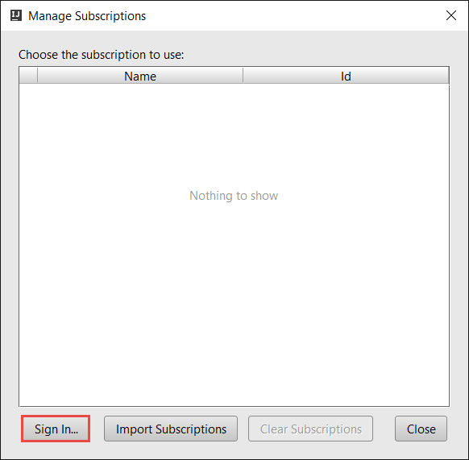
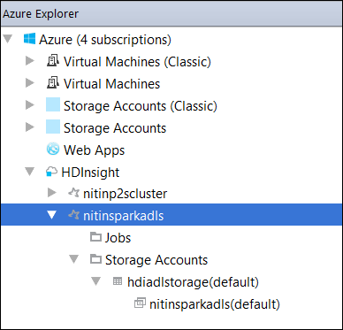

 <properties
    pageTitle="建立使用 HDInsight 工具中 Azure 工具組 IntelliJ 火花 Scala 應用程式 |Microsoft Azure"
    description="瞭解如何建立獨立火花 HDInsight 火花叢集上執行應用程式。"
    services="hdinsight"
    documentationCenter=""
    authors="nitinme"
    manager="jhubbard"
    editor="cgronlun"
    tags="azure-portal"/>

<tags
    ms.service="hdinsight"
    ms.workload="big-data"
    ms.tgt_pltfrm="na"
    ms.devlang="na"
    ms.topic="article"
    ms.date="09/09/2016"
    ms.author="nitinme"/>

# 使用中的 IntelliJ Azure 工具組 HDInsight 工具來建立火花 HDInsight 火花 Linux 叢集的應用程式

本文提供逐步指引開發撰寫 Scala 並送出以 HDInsight 火花叢集 HDInsight 工具中 Azure 工具組用 IntelliJ 火花應用程式。  您可以使用工具]，以數種不同的方法︰

* 若要開發並送出 HDInsight 火花叢集上的 Scala 火花應用程式
* 若要存取您的 Azure HDInsight 火花叢集資源
* 若要開發，並在本機上執行的 Scala 火花應用程式

您也可以依照 [視訊[以下](https://mix.office.com/watch/1nqkqjt5xonza)快速入門。

>[AZURE.IMPORTANT] 此工具可以用於建立及提交僅適用於 linux HDInsight 火花叢集應用程式。

##必要條件

* Azure 的訂閱。 請參閱[取得 Azure 免費試用版](https://azure.microsoft.com/documentation/videos/get-azure-free-trial-for-testing-hadoop-in-hdinsight/)。

* HDInsight linux Apache 火花叢集。 如需相關指示，請參閱[建立 Apache 火花叢集中 Azure HDInsight](hdinsight-apache-spark-jupyter-spark-sql.md)。

* Oracle Java 開發套件。 您可以從[這裡](http://www.oracle.com/technetwork/java/javase/downloads/jdk8-downloads-2133151.html)進行安裝。

* IntelliJ 想法。 本文會使用版本 15.0.1。 您可以從[這裡](https://www.jetbrains.com/idea/download/)進行安裝。

## 安裝 IntelliJ 中 Azure 工具組 HDInsight 工具

HDInsight 工具 IntelliJ 是可用的 IntelliJ Azure 工具組的一部分。 如需有關如何安裝 Azure 工具組的指示，請參閱[安裝的 IntelliJ Azure 工具組](../azure-toolkit-for-intellij-installation.md)。

## 登入您 Azure 的訂閱

1. 啟動 IntelliJ，並開啟 [Azure 檔案總管]。 從 [IDE 中的 [**檢視**] 功能表中，按一下 [**工具視窗**，然後按一下**Azure 總管。**

    

2. **Azure**中的節點**Azure 檔案總管**，以滑鼠右鍵按一下，然後按一下 [**管理訂閱**。

3. 在 [**管理訂閱**] 對話方塊中，按一下 [**登入**並輸入 Azure 認證。

    

4. 您登入之後，**管理訂閱**] 對話方塊會列出與認證相關的所有 Azure 訂閱。 按一下 [**關閉**] 對話方塊中。

5. 在 [ **Azure 檔案總管**] 索引標籤中，展開**HDInsight**若要查看 HDInsight 火花叢集，在您的訂閱。

    

6. 您可以進一步展開叢集名稱節點，若要查看叢集相關聯的資源 （例如儲存帳戶）。

    

## HDInsight 火花叢集上執行火花 Scala 應用程式

1. 啟動 IntelliJ 概念，並建立新的專案。 在 [新的 [專案] 對話方塊中，選取下列選項，然後再按 [**下一步**。

    

    * 從左窗格中，選取 [ **HDInsight**]。
    * 從右窗格中，選取 [**火花上 HDInsight (Scala)**]。
    * 按一下 [**下一步**]。

2. 在下一個視窗中，提供專案詳細資料。

    * 提供專案名稱和專案的位置。
    * 對於**專案 SDK**，請確定您提供 Java 版本大於 7。
    * 針對**Scala SDK**，按一下 [**建立**]，按一下 [**下載**]，然後選取 Scala 若要使用的版本。 **請確定您沒有使用版本 2.11.x**。 此範例使用版本**2.10.6**。

        

    * 如**火花 SDK**，下載及使用從[以下](http://go.microsoft.com/fwlink/?LinkID=723585&clcid=0x409)SDK。 您也可以略過此並改用[火花 Maven 存放庫](http://mvnrepository.com/search?q=spark)，不過請確定您有安裝開發火花應用程式正確 maven 存放庫。 （例如，您需要，請確定您有安裝如果您使用火花串流; 火花串流組件也請確定您使用的標示為 Scala 2.10 存放庫-執行的使用存放庫標示為 Scala 2.11。）

        

    * 按一下 [**完成**]。

3. 火花專案會自動為您建立的成品。 若要查看的成品，請遵循下列步驟。

    1. 從 [**檔案**] 功能表中，按一下 [**專案結構**。
    2. 在 [**專案結構**] 對話方塊中，按一下 [若要查看所建立的預設成品的**成品**。

        

    您也可以建立自己的成品上按一下 [bly**+**上述圖像中醒目提示的圖示。

4. 在 [**專案結構**] 對話方塊中，按一下 [**專案**]。 如果**專案 SDK** 1.8 設定，請確定**專案語言層級**會設定為**7-菱形 ARM，多難題等**。

    

5. 新增您的應用程式的程式碼。

    1. 從**專案總管]**中，以滑鼠右鍵按一下**src**，指向 [**新增]**，然後按一下**Scala 類別**。

        

    2. 在 [**建立新的 Scala 類別**] 對話方塊中，提供的名稱，選取**物件****類型**]，然後按一下**[確定]**。

        

    3. 在**MyClusterApp.scala**檔案中，貼上下列的程式碼。 將此程式碼會讀取 （在所有 HDInsight 火花叢集提供），HVAC.csv 中的資料擷取第七個資料行中 CSV，只有一個數字的資料列，並將輸出寫入**/HVACOut**叢集在預設存放區。

            import org.apache.spark.SparkConf
            import org.apache.spark.SparkContext

            object MyClusterApp{
              def main (arg: Array[String]): Unit = {
                val conf = new SparkConf().setAppName("MyClusterApp")
                val sc = new SparkContext(conf)

                val rdd = sc.textFile("wasbs:///HdiSamples/HdiSamples/SensorSampleData/hvac/HVAC.csv")

                //find the rows which have only one digit in the 7th column in the CSV
                val rdd1 =  rdd.filter(s => s.split(",")(6).length() == 1)

                rdd1.saveAsTextFile("wasbs:///HVACOut")
              }

            }

5. HDInsight 火花叢集上執行應用程式。

    1. 從**專案總管]**中，專案名稱，以滑鼠右鍵按一下，然後選取**要 HDInsight 提交火花應用程式**。

        

    2. 系統會提示您 Azure 訂閱認證。 在 [**火花送出**] 對話方塊中，提供下列的值。

        * 針對**火花叢集 (僅限 Linux)**，選取您要執行應用程式的 HDInsight 火花叢集。

        * 您需要從 IntelliJ 專案中，選取成品，或從硬碟中選取一個。

        * 針對**主要類別名稱**] 文字方塊中，按一下省略符號 () 應用程式碼中，選取主要類別，再按一下**[確定]**。

            

        * 在此範例中的應用程式碼不需要任何命令列引數或參照 （每瓶） 或檔案，因為您可以將剩餘的 [文字] 方塊保留空白。

        * 提供所有輸入後,] 對話方塊中應如下所示。

            

        * 按一下 [**送出**]。

    3. 在視窗底部的 [**火花送出**] 索引標籤應該能如常顯示進度。 您也可以停止應用程式，即可在 「 火花送出] 視窗中的 [紅色] 按鈕。

        

    在下一個區段中，您可以瞭解如何存取輸出 IntelliJ HDInsight 工具使用 Azure 工具組中的工作。

## 存取及管理 HDInsight 火花叢集 IntelliJ Azure 工具組中使用 HDInsight 工具

您可以執行各種作業使用 HDInsight 工具所包含的 IntelliJ Azure 工具組。

### 存取 [工作] 檢視直接從 HDInsight 工具

1. 從**Azure 檔案總管**中，展開**HDInsight**、 展開火花叢集名稱，然後按一下**工作**。

2. 在右窗格中，**火花工作檢視**] 索引標籤會顯示在叢集執行的所有應用程式。 按一下 [應用程式的名稱，您想要查看更多詳細資料]。

    

3. **錯誤訊息**與**工作輸出**、**晚總工作記錄檔**，**火花驅動程式記錄**的方塊已填妥根據您所選取的應用程式。

4. 您也可以按一下畫面頂端的個別按鈕，開啟**火花歷程記錄 UI**和**YARN 使用者介面**（應用程式層級）。

### 存取火花歷程記錄伺服器

1. **Azure 檔案總管**] 中，展開**HDInsight**、 火花叢集名稱，以滑鼠右鍵按一下，然後選取 [**開啟火花歷程記錄 ui**。 出現提示時，輸入叢集管理員認證。 您必須指定這些時佈建叢集。

2. 在火花歷程記錄 Server 儀表板，您可以尋找應用程式您只要完成執行使用應用程式的名稱。 上述的程式碼，在您設定應用程式名稱使用`val conf = new SparkConf().setAppName("MyClusterApp")`。 因此，火花應用程式名稱都是**MyClusterApp**。

### 啟動 Ambari 入口網站

**Azure 檔案總管**] 中，展開**HDInsight**，以滑鼠右鍵按一下您火花叢集名稱，然後選取 [**開啟叢集管理入口網站 (Ambari)**。 出現提示時，輸入叢集管理員認證。 您必須指定這些時佈建叢集。

### 管理 Azure 訂閱

根據預設，HDInsight 工具會列出火花叢集從 Azure 所有的訂閱。 如有需要，您可以指定您要存取叢集的訂閱。 **Azure 檔案總管**] 中，從**Azure**根節點，以滑鼠右鍵按一下，然後再按一下 [**管理訂閱**。 從對話方塊中，清除核取方塊，針對您不想存取，然後按一下 [**關閉**訂閱。 如果您要登出 Azure 訂閱，您也可以按一下**登出**。

## 在本機上執行的火花 Scala 應用程式

您可以使用中的 IntelliJ Azure 工具組 HDInsight 工具工作站本機執行火花 Scala 應用程式。 一般而言，這類應用程式執行不需要存取叢集資源，例如存放容器可以會執行，並在本機測試。

### 必要條件

在 Windows 電腦上執行的本機火花 Scala 應用程式，您可能會收到例外狀況的 Windows 上遺失 WinUtils.exe 因為[火花 2356年](https://issues.apache.org/jira/browse/SPARK-2356)所述。 若要解決此錯誤，您必須[下載可執行檔從這裡開始](http://public-repo-1.hortonworks.com/hdp-win-alpha/winutils.exe)到位置，如**C:\WinUtils\bin**。 然後，您必須新增環境變數**HADOOP_HOME** ，及變數的值設為**C\WinUtils**。

### 執行本機火花 Scala 應用程式  

1. 啟動 IntelliJ 概念，並建立新的專案。 在 [新的 [專案] 對話方塊中，選取下列選項，然後再按 [**下一步**。

    

    * 從左窗格中，選取 [ **HDInsight**]。
    * 從右窗格中，選取 [**火花 HDInsight 本機執行範例 (Scala)**]。
    * 按一下 [**下一步**]。

2. 在下一個視窗中，提供專案詳細資料。

    * 提供專案名稱和專案的位置。
    * 對於**專案 SDK**，請確定您提供 Java 版本大於 7。
    * 針對**Scala SDK**，按一下 [**建立**]，按一下 [**下載**]，然後選取 Scala 若要使用的版本。 **請確定您沒有使用版本 2.11.x**。 此範例使用版本**2.10.6**。

        

    * 如**火花 SDK**，下載及使用從[以下](http://go.microsoft.com/fwlink/?LinkID=723585&clcid=0x409)SDK。 您也可以略過此並改用[火花 Maven 存放庫](http://mvnrepository.com/search?q=spark)，不過請確定您有安裝開發火花應用程式正確 maven 存放庫。 （例如，您需要，請確定您有安裝如果您使用火花串流; 火花串流組件也請確定您使用的標示為 Scala 2.10 存放庫-執行的使用存放庫標示為 Scala 2.11。）

        

    * 按一下 [**完成**]。

3. 範本會將程式碼範例 (**LogQuery**) 您可以在您的電腦本機執行**src**資料夾下。

    

4.  **LogQuery**應用程式，以滑鼠右鍵按一下，然後按一下 [ **」 執行 「 LogQuery' 」**。 您會看到如下的輸出底部的 [**執行**] 索引標籤中。

    

## 轉換，HDInsight 工具在 Azure 工具組 IntelliJ 現有 IntelliJ 想法應用程式

您也可以轉換 IntelliJ 瞭解相容性的 IntelliJ Azure 工具組的 HDInsight 工具中建立您現有的火花 Scala 應用程式。 這會讓您使用工具來送出到 HDInsight 火花叢集的應用程式。 您可以藉由執行下列步驟執行︰

1. 使用 IntelliJ 您先建立現有火花 Scala appliction，開啟相關聯的.iml 檔案。
2. 在根層級，您會看見如下的**模組**項目︰

        <module org.jetbrains.idea.maven.project.MavenProjectsManager.isMavenModule="true" type="JAVA_MODULE" version="4">

3. 編輯要新增的項目`UniqueKey="HDInsightTool"`使**模組**項目如下︰

        <module org.jetbrains.idea.maven.project.MavenProjectsManager.isMavenModule="true" type="JAVA_MODULE" version="4" UniqueKey="HDInsightTool">

4. 儲存變更。 您的應用程式現在應該相容 HDInsight 中的工具的 IntelliJ Azure 工具組。 您可以將它測試以滑鼠右鍵按一下 [專案總管] 中的專案名稱。 快顯功能表現在應該**要 HDInsight 提交火花應用程式**的選項。

## 疑難排解

### 本機執行中的 「 請使用較大的堆積 」 錯誤

在火花 1.6，如果您使用的 32 位元 Java SDK 期間本機執行]，您可能會發生下列錯誤︰

    Exception in thread "main" java.lang.IllegalArgumentException: System memory 259522560 must be at least 4.718592E8. Please use a larger heap size.
        at org.apache.spark.memory.UnifiedMemoryManager$.getMaxMemory(UnifiedMemoryManager.scala:193)
        at org.apache.spark.memory.UnifiedMemoryManager$.apply(UnifiedMemoryManager.scala:175)
        at org.apache.spark.SparkEnv$.create(SparkEnv.scala:354)
        at org.apache.spark.SparkEnv$.createDriverEnv(SparkEnv.scala:193)
        at org.apache.spark.SparkContext.createSparkEnv(SparkContext.scala:288)
        at org.apache.spark.SparkContext.<init>(SparkContext.scala:457)
        at LogQuery$.main(LogQuery.scala:53)
        at LogQuery.main(LogQuery.scala)
        at sun.reflect.NativeMethodAccessorImpl.invoke0(Native Method)
        at sun.reflect.NativeMethodAccessorImpl.invoke(NativeMethodAccessorImpl.java:57)
        at sun.reflect.DelegatingMethodAccessorImpl.invoke(DelegatingMethodAccessorImpl.java:43)
        at java.lang.reflect.Method.invoke(Method.java:606)
        at com.intellij.rt.execution.application.AppMain.main(AppMain.java:144)

這是因為不大，若要執行，因為火花需要至少 471 MB （您可以取得更多詳細資料從[火花 12081](https://issues.apache.org/jira/browse/SPARK-12081)如果您想要） 火花的堆積大小。 一個簡單的解決方案是使用 64 位元 Java SDK。 您也可以變更 IntelliJ 的 JVM 設定，藉由新增下列選項︰

    -Xms128m -Xmx512m -XX:MaxPermSize=300m -ea

## 意見反應及已知問題

目前正在檢視火花輸出直接不受支援，我們正在處理的。

如果您有任何建議或意見反應，或使用此工具時，會發生任何問題，請隨意來信 hdivstool 在 microsoft 點 com 在電子郵件。

## 另請參閱

* [概觀︰ Apache 火花上 Azure HDInsight](hdinsight-apache-spark-overview.md)

### 案例

* [使用 BI 火花︰ 執行火花 HDInsight 中使用的 BI 工具的互動式的資料分析](hdinsight-apache-spark-use-bi-tools.md)

* [與電腦學習火花︰ 使用火花 HDInsight 分析建置溫度使用 HVAC 資料中](hdinsight-apache-spark-ipython-notebook-machine-learning.md)

* [與電腦學習火花︰ 使用火花 HDInsight 預測食物檢查結果中](hdinsight-apache-spark-machine-learning-mllib-ipython.md)

* [火花串流︰ 使用火花 HDInsight 建置即時串流應用程式中](hdinsight-apache-spark-eventhub-streaming.md)

* [HDInsight 中使用火花網站記錄分析](hdinsight-apache-spark-custom-library-website-log-analysis.md)

### 建立和執行應用程式

* [建立使用 Scala 獨立應用程式](hdinsight-apache-spark-create-standalone-application.md)

* [在使用晚總火花叢集從遠端執行工作](hdinsight-apache-spark-livy-rest-interface.md)

### 工具和延伸模組

* [使用 [HDInsight 工具] 中的偵錯 IntelliJ Azure 工具組遠端激起應用程式](hdinsight-apache-spark-intellij-tool-plugin-debug-jobs-remotely.md)

* [使用中的蝕 Azure 工具組 HDInsight 工具來建立火花應用程式](hdinsight-apache-spark-eclipse-tool-plugin.md)

* [使用上 HDInsight 火花叢集運貨用飛艇筆記本](hdinsight-apache-spark-use-zeppelin-notebook.md)

* [核心適用於 HDInsight 火花叢集 Jupyter 筆記本](hdinsight-apache-spark-jupyter-notebook-kernels.md)

* [使用外部封包 Jupyter 筆記本](hdinsight-apache-spark-jupyter-notebook-use-external-packages.md)

* [在 [您的電腦上安裝 Jupyter 並連線到 HDInsight 火花叢集](hdinsight-apache-spark-jupyter-notebook-install-locally.md)

### 管理資源

* [管理資源 Apache 火花叢集中 Azure HDInsight](hdinsight-apache-spark-resource-manager.md)

* [追蹤和偵錯 Apache 火花中叢集 HDInsight 上執行的工作](hdinsight-apache-spark-job-debugging.md)
