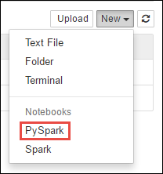

<properties 
    pageTitle="使用 Apache 火花建置 HDInsight 上的電腦學習應用程式 |Microsoft Azure" 
    description="如何建置電腦學習應用程式中使用 Apache 火花筆記本的逐步指示" 
    services="hdinsight" 
    documentationCenter="" 
    authors="nitinme" 
    manager="jhubbard" 
    editor="cgronlun"
    tags="azure-portal"/>

<tags 
    ms.service="hdinsight" 
    ms.workload="big-data" 
    ms.tgt_pltfrm="na" 
    ms.devlang="na" 
    ms.topic="article" 
    ms.date="10/05/2016" 
    ms.author="nitinme"/>

# 建立執行 Apache 火花叢集 HDInsight linux 電腦學習應用程式

瞭解如何建立電腦，學習使用 Apache 火花叢集中 HDInsight 應用程式。 本文說明如何使用可用的 Jupyter 筆記本與叢集建立並測試我們的應用程式。 應用程式使用預設的所有叢集上提供的範例 HVAC.csv 資料。

**先決條件︰**

您必須具備下列項目︰

- Azure 的訂閱。 請參閱[取得 Azure 免費試用版](https://azure.microsoft.com/documentation/videos/get-azure-free-trial-for-testing-hadoop-in-hdinsight/)。
- HDInsight linux Apache 火花圖組。 如需相關指示，請參閱[建立 Apache 火花叢集中 Azure HDInsight](hdinsight-apache-spark-jupyter-spark-sql.md)。 

##顯示我的資料

我們開始建立應用程式之前，請讓我們瞭解資料與分析，我們會執行的資料類型的結構。 

本文中，我們會使用您 HDInsight 叢集與相關聯的 Azure 儲存體帳戶提供的範例**HVAC.csv**資料檔案。 內儲存帳戶檔案位於**\HdiSamples\HdiSamples\SensorSampleData\hvac**。 下載並開啟 CSV 檔案，以取得資料的快照。  

目標溫度和實際的已安裝的 HVAC 系統建置溫度，則會顯示資料。 假設**系統**欄代表系統識別碼， **SystemAge**欄代表 HVAC 系統已中建置適當的年數。

我們會使用這項資料來預測是否建置會更高或 colder 根據目標溫度，提供系統識別碼與系統年齡。

##撰寫使用火花 MLlib 電腦學習應用程式

在此應用程式中，我們會使用火花毫升管線執行文件分類。 在管線，我們可以將文字分割文件、 將文字轉換成數值功能向量，和最後建立預測模型功能向量和標籤。 執行下列步驟，以建立應用程式。

1. 從[Azure 入口網站](https://portal.azure.com/)，從 startboard 中，按一下 [火花叢集的磚 （如果您釘選它 startboard）。 您也可以導覽下**瀏覽所有**叢集 > **HDInsight 叢集**。   

2. 從火花叢集刀中，按一下 [**叢集儀表板**，，然後按一下**Jupyter 筆記本**。 如果出現提示，請輸入叢集管理員認證。

    > [AZURE.NOTE] 您也可能會在瀏覽器中開啟下列 URL 達到叢集 Jupyter 筆記本。 取代您叢集名稱__CLUSTERNAME__ :
    >
    > `https://CLUSTERNAME.azurehdinsight.net/jupyter`

2. 建立新的筆記本。 按一下 [**新增**]，然後按一下 [ **PySpark**。

    

3. 建立新的筆記本，並開啟 Untitled.pynb 名稱。 按一下筆記本名稱上方，然後輸入好記的名稱。

    

3. 您建立 PySpark 核心的筆記本，因為您不需要明確地建立任何內容。 當您執行第一個程式碼儲存格時，火花和登錄區內容，會自動建立適合您。 您可以開始匯入所需的這種情況類型。 貼上下列的程式碼片段空白的儲存格，然後再按下**SHIFT + enter 鍵**。 

        from pyspark.ml import Pipeline
        from pyspark.ml.classification import LogisticRegression
        from pyspark.ml.feature import HashingTF, Tokenizer
        from pyspark.sql import Row
        
        import os
        import sys
        from pyspark.sql.types import *
        
        from pyspark.mllib.classification import LogisticRegressionWithSGD
        from pyspark.mllib.regression import LabeledPoint
        from numpy import array
        
        
     
4. 您必須現在載入資料 (hvac.csv)、 分析，並使用它訓練模型。 您可以定義的函數會檢查是否大於目標溫度建築的實際的溫度。 如果實際的溫度大，建置為作用，以值**1.0**。 如果實際的溫度較小，建置是低溫，以值**0.0**。 

    貼上下列的程式碼片段空白的儲存格並按下**SHIFT + enter 鍵**。

        
        # List the structure of data for better understanding. Becuase the data will be
        # loaded as an array, this structure makes it easy to understand what each element
        # in the array corresponds to

        # 0 Date
        # 1 Time
        # 2 TargetTemp
        # 3 ActualTemp
        # 4 System
        # 5 SystemAge
        # 6 BuildingID

        LabeledDocument = Row("BuildingID", "SystemInfo", "label")

        # Define a function that parses the raw CSV file and returns an object of type LabeledDocument
        
        def parseDocument(line):
            values = [str(x) for x in line.split(',')]
            if (values[3] > values[2]):
                hot = 1.0
            else:
                hot = 0.0        
    
            textValue = str(values[4]) + " " + str(values[5])
    
            return LabeledDocument((values[6]), textValue, hot)

        # Load the raw HVAC.csv file, parse it using the function
        data = sc.textFile("wasbs:///HdiSamples/HdiSamples/SensorSampleData/hvac/HVAC.csv")

        documents = data.filter(lambda s: "Date" not in s).map(parseDocument)
        training = documents.toDF()

5. 設定火花電腦學習管線包含三個階段︰ tokenizer hashingTF，與長程。 瞭解什麼是管線和運作方式的詳細資訊，請參閱<a href="http://spark.apache.org/docs/latest/ml-guide.html#how-it-works" target="_blank">火花電腦學習管道的郵件</a>。

    貼上下列的程式碼片段空白的儲存格並按下**SHIFT + enter 鍵**。

        tokenizer = Tokenizer(inputCol="SystemInfo", outputCol="words")
        hashingTF = HashingTF(inputCol=tokenizer.getOutputCol(), outputCol="features")
        lr = LogisticRegression(maxIter=10, regParam=0.01)
        pipeline = Pipeline(stages=[tokenizer, hashingTF, lr])

6. 調整大小的管線訓練文件]。 貼上下列的程式碼片段空白的儲存格並按下**SHIFT + enter 鍵**。

        model = pipeline.fit(training)

7. 確認訓練文件檢查點您應用程式的進度。 貼上下列的程式碼片段空白的儲存格並按下**SHIFT + enter 鍵**。

        training.show()

    這應該讓輸出如下︰

        +----------+----------+-----+
        |BuildingID|SystemInfo|label|
        +----------+----------+-----+
        |         4|     13 20|  0.0|
        |        17|      3 20|  0.0|
        |        18|     17 20|  1.0|
        |        15|      2 23|  0.0|
        |         3|      16 9|  1.0|
        |         4|     13 28|  0.0|
        |         2|     12 24|  0.0|
        |        16|     20 26|  1.0|
        |         9|      16 9|  1.0|
        |        12|       6 5|  0.0|
        |        15|     10 17|  1.0|
        |         7|      2 11|  0.0|
        |        15|      14 2|  1.0|
        |         6|       3 2|  0.0|
        |        20|     19 22|  0.0|
        |         8|     19 11|  0.0|
        |         6|      15 7|  0.0|
        |        13|      12 5|  0.0|
        |         4|      8 22|  0.0|
        |         7|      17 5|  0.0|
        +----------+----------+-----+

    返回並驗證的輸出對原始的 CSV 檔。 例如，CSV 檔案的第一列包含此資料︰

    

    請注意實際的溫度小於目標溫度，建議建置低溫。 因此訓練輸出] 清單中的第一列**標籤**] 的值是**0.0**，這表示建置沒有作用。

8.  準備執行訓練的模型與資料集。 若要這麼做，我們會傳遞系統識別碼和系統年齡 （標示為**簡明**訓練輸出中），及模型會使用該系統識別碼與系統年齡建置是否想要更高預測 （以 1.0 表示） 或更冷色 （以 0.0 表示）。

    貼上下列的程式碼片段空白的儲存格並按下**SHIFT + enter 鍵**。
        
        # SystemInfo here is a combination of system ID followed by system age
        Document = Row("id", "SystemInfo")
        test = sc.parallelize([(1L, "20 25"),
                      (2L, "4 15"),
                      (3L, "16 9"),
                      (4L, "9 22"),
                      (5L, "17 10"),
                      (6L, "7 22")]) \
            .map(lambda x: Document(*x)).toDF() 

9. 最後，讓預測測試資料。 貼上下列的程式碼片段空白的儲存格並按下**SHIFT + enter 鍵**。

        # Make predictions on test documents and print columns of interest
        prediction = model.transform(test)
        selected = prediction.select("SystemInfo", "prediction", "probability")
        for row in selected.collect():
            print row

10. 您應該會看到類似以下的輸出︰

        Row(SystemInfo=u'20 25', prediction=1.0, probability=DenseVector([0.4999, 0.5001]))
        Row(SystemInfo=u'4 15', prediction=0.0, probability=DenseVector([0.5016, 0.4984]))
        Row(SystemInfo=u'16 9', prediction=1.0, probability=DenseVector([0.4785, 0.5215]))
        Row(SystemInfo=u'9 22', prediction=1.0, probability=DenseVector([0.4549, 0.5451]))
        Row(SystemInfo=u'17 10', prediction=1.0, probability=DenseVector([0.4925, 0.5075]))
        Row(SystemInfo=u'7 22', prediction=0.0, probability=DenseVector([0.5015, 0.4985]))

    預測的第一列，您可以看到的識別碼 20 和 25 年的系統年齡 HVAC 系統，建置會熱 (**預測 = 1.0**)。 預測 0.0 相對於 DenseVector (0.49999) 的第一個值，而第二個值 (0.5001) 對應預測 1.0。 在輸出清單，即使第二個值只會稍微較高，模型顯示**預測 = 1.0**。

11. 當您完成執行應用程式之後，您應該要關閉的筆記本，以釋出資源。 若要這麼做，從 [**檔案**] 功能表上的筆記本中，按一下 [**關閉並停止**]。 這將會關閉，然後關閉的筆記本。
           

##使用 Anaconda scikit-瞭解文件庫的電腦學習

HDInsight Apache 火花叢集包含 Anaconda 文件庫。 這也包括**scikit-瞭解**電腦學習的文件庫。 文件庫也會包含可用來建立範例應用程式，直接從 Jupyter 筆記本的各種資料集。 如需範例使用 scikit-瞭解文件庫，請參閱[http://scikit-learn.org/stable/auto_examples/index.html](http://scikit-learn.org/stable/auto_examples/index.html)。

##另請參閱

* [概觀︰ Apache 火花上 Azure HDInsight](hdinsight-apache-spark-overview.md)

### 案例

* [使用 BI 火花︰ 執行火花 HDInsight 中使用的 BI 工具的互動式的資料分析](hdinsight-apache-spark-use-bi-tools.md)

* [與電腦學習火花︰ 使用火花 HDInsight 預測食物檢查結果中](hdinsight-apache-spark-machine-learning-mllib-ipython.md)

* [火花串流︰ 使用火花 HDInsight 建置即時串流應用程式中](hdinsight-apache-spark-eventhub-streaming.md)

* [HDInsight 中使用火花網站記錄分析](hdinsight-apache-spark-custom-library-website-log-analysis.md)

### 建立和執行應用程式

* [建立使用 Scala 獨立應用程式](hdinsight-apache-spark-create-standalone-application.md)

* [在使用晚總火花叢集從遠端執行工作](hdinsight-apache-spark-livy-rest-interface.md)

### 工具和延伸模組

* [使用 HDInsight 工具增益集，如 IntelliJ 瞭解建立及提交火花 Scala 應用程式](hdinsight-apache-spark-intellij-tool-plugin.md)

* [使用 HDInsight 工具增益集，如 IntelliJ 瞭解遠端偵錯火花應用程式](hdinsight-apache-spark-intellij-tool-plugin-debug-jobs-remotely.md)

* [使用上 HDInsight 火花叢集運貨用飛艇筆記本](hdinsight-apache-spark-use-zeppelin-notebook.md)

* [核心適用於 HDInsight 火花叢集 Jupyter 筆記本](hdinsight-apache-spark-jupyter-notebook-kernels.md)

* [使用外部封包 Jupyter 筆記本](hdinsight-apache-spark-jupyter-notebook-use-external-packages.md)

* [在 [您的電腦上安裝 Jupyter 並連線到 HDInsight 火花叢集](hdinsight-apache-spark-jupyter-notebook-install-locally.md)

### 管理資源

* [管理資源 Apache 火花叢集中 Azure HDInsight](hdinsight-apache-spark-resource-manager.md)

* [追蹤和偵錯 Apache 火花中叢集 HDInsight 上執行的工作](hdinsight-apache-spark-job-debugging.md)

[hdinsight-versions]: hdinsight-component-versioning.md
[hdinsight-upload-data]: hdinsight-upload-data.md
[hdinsight-storage]: hdinsight-hadoop-use-blob-storage.md

[hdinsight-weblogs-sample]: hdinsight-hive-analyze-website-log.md
[hdinsight-sensor-data-sample]: hdinsight-hive-analyze-sensor-data.md

[azure-purchase-options]: http://azure.microsoft.com/pricing/purchase-options/
[azure-member-offers]: http://azure.microsoft.com/pricing/member-offers/
[azure-free-trial]: http://azure.microsoft.com/pricing/free-trial/
[azure-management-portal]: https://manage.windowsazure.com/
[azure-create-storageaccount]: storage-create-storage-account.md
