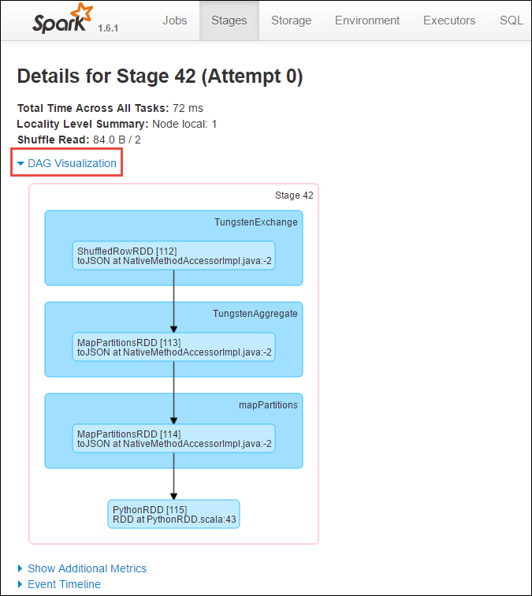

<properties 
    pageTitle="追蹤和偵錯 Apache 火花上執行的工作叢集中 HDInsight |Microsoft Azure" 
    description="使用 YARN UI、 火花 UI 和火花歷程記錄伺服器來追蹤及偵錯 Azure HDInsight 火花叢集上執行的工作" 
    services="hdinsight" 
    documentationCenter="" 
    authors="nitinme" 
    manager="jhubbard" 
    editor="cgronlun"
    tags="azure-portal"/>

<tags 
    ms.service="hdinsight" 
    ms.workload="big-data" 
    ms.tgt_pltfrm="na" 
    ms.devlang="na" 
    ms.topic="article" 
    ms.date="08/25/2016" 
    ms.author="nitinme"/>

# 追蹤和偵錯中 HDInsight Linux Apache 火花叢集上執行的工作

在本文中，您將學習如何追蹤和偵錯火花工作使用 YARN UI、 火花 UI 和火花歷程記錄伺服器。 在本文中，我們就會開始使用可用的筆記本與火花叢集，火花工作**電腦學習︰ 使用 MLLib 食物檢查資料的預測分析**。 您可以使用下列步驟來追蹤您提交使用任何其他方法，應用程式，例如 [**火花提交**。

##必要條件

您必須具備下列項目︰

- Azure 的訂閱。 請參閱[取得 Azure 免費試用版](https://azure.microsoft.com/documentation/videos/get-azure-free-trial-for-testing-hadoop-in-hdinsight/)。
- HDInsight linux Apache 火花叢集。 如需相關指示，請參閱[建立 Apache 火花叢集中 Azure HDInsight](hdinsight-apache-spark-jupyter-spark-sql.md)。
- 您應該開始執行筆記本，**[電腦學習︰ 使用 MLLib 食物檢查資料的預測分析](hdinsight-apache-spark-machine-learning-mllib-ipython.md)**。 如需如何執行此筆記本的指示，請依照下列連結。  

## 追蹤 YARN ui 上的應用程式

1. 啟動 YARN ui。 從叢集刀中，按一下 [**叢集儀表板**，，然後按一下**YARN**。

    

    >[AZURE.TIP] 或者，您也可以啟動 Ambari ui 在 YARN ui。 若要啟動 Ambari UI，從叢集刀**叢集儀表板**，，然後按一下**HDInsight 叢集儀表板**。 從 Ambari UI，按一下**YARN**、 按一下 [**快速連結**、 按一下 [作用中的資源管理員]，然後按一下**ResourceManager UI**。  

3. 由於您開始使用 Jupyter 筆記本火花工作時，應用程式會有名稱**remotesparkmagics** （這是啟動筆記本的所有應用程式的名稱）。 按一下應用程式的名稱與應用程式識別碼，取得工作的相關資訊。 這會啟動應用程式檢視。

    

    這類應用程式啟動 Jupyter 筆記本的狀態是 [一律**執行**直到您離開筆記本。

4. 從 [應用程式] 檢視中，您可以向下切入進一步了解應用程式並記錄 (stdout/stderr) 相關聯的容器。 您也可以按一下連結對應至**追蹤的 URL**，如下所示，以啟動火花 ui。 

    

## 追蹤火花 ui 上的應用程式

在火花 ui 上，您可以向下切入您之前開始，應用程式會產生火花工作。

1. 若要啟動火花 UI，從 [應用程式] 檢視中，請按一下**追蹤的 URL**，針對的連結，如下圖所示的螢幕擷取畫面上方。 您可以看到 [啟動應用程式執行 Jupyter 筆記本中的所有火花工作。

    

2. 按一下 [**執行程式**] 索引標籤，若要查看每個執行程式處理和儲存資訊。 您也可以按一下**執行緒傾印**的連結，以擷取呼叫堆疊。

    
 
3. 按一下以查看應用程式相關聯的階段的**階段**] 索引標籤。

    

    每個階段可以有多個工作，您可以想檢視執行統計資料，如下所示。

     

4. [階段的詳細資料] 頁面中，您可以在啟動 DAG 視覺效果。 展開頂端的頁面] 的 [ **DAG 視覺效果**] 連結，如下所示。

    

    DAG 或直接 Aclyic 圖表代表應用程式中的不同階段。 在圖形中的每個藍色方塊代表火花叫用作業的應用程式。

5. [階段的詳細資料] 頁面中，您也可以啟動應用程式的時間表檢視。 展開頂端的頁面] 的 [**活動時刻表**] 連結，如下所示。

    

    隨後便會顯示在表單中的時間表火花事件 時間表檢視目前使用三個層級，跨工作，且在階段中的工作。 上述的圖像擷取特定階段的 [時間表] 檢視。

    >[AZURE.TIP] 如果您選取 [**啟用 [縮放**] 核取方塊，您可以透過 [時間表] 檢視捲動向左鍵和向。

6. 在火花 ui 上的其他索引標籤提供火花執行個體的相關資訊。

    * 儲存空間] 索引標籤-如果您的應用程式建立 RDDs，您可以找到的 [儲存] 索引標籤的相關資訊。
    * 環境] 索引標籤-此索引標籤提供許多有幫助您火花執行個體相關資訊，例如 
        * Scala 版本
        * 叢集相關聯的事件記錄檔目錄
        * 執行程式核心應用程式的數目
        * 等。

## 尋找已完成的工作使用火花歷程記錄伺服器的相關資訊

一旦完成工作，火花歷程記錄伺服器中保存工作的相關資訊。

1. 若要啟動火花歷程記錄伺服器上，從叢集刀、 按一下**叢集儀表板**，然後按一下 [**火花歷程記錄伺服器**。

    

    >[AZURE.TIP] 或者，您也可以啟動 Ambari ui 火花歷程記錄 Server 使用者介面。 若要啟動 Ambari UI，從叢集刀**叢集儀表板**，，然後按一下**HDInsight 叢集儀表板**。 從 Ambari UI，按一下**火花**、 按一下 [**快速連結**]，然後按一下**火花歷程記錄 Server 使用者介面**。

2. 您會看到所有已完成的應用程式列。 按一下 [向下切入取得詳細資訊的應用程式的應用程式識別碼]。

    
    

## 另請參閱

* [概觀︰ Apache 火花上 Azure HDInsight](hdinsight-apache-spark-overview.md)

### 案例

* [使用 BI 火花︰ 執行火花 HDInsight 中使用的 BI 工具的互動式的資料分析](hdinsight-apache-spark-use-bi-tools.md)

* [與電腦學習火花︰ 使用火花 HDInsight 分析建置溫度使用 HVAC 資料中](hdinsight-apache-spark-ipython-notebook-machine-learning.md)

* [與電腦學習火花︰ 使用火花 HDInsight 預測食物檢查結果中](hdinsight-apache-spark-machine-learning-mllib-ipython.md)

* [火花串流︰ 使用火花 HDInsight 建置即時串流應用程式中](hdinsight-apache-spark-eventhub-streaming.md)

* [HDInsight 中使用火花網站記錄分析](hdinsight-apache-spark-custom-library-website-log-analysis.md)

### 建立和執行應用程式

* [建立使用 Scala 獨立應用程式](hdinsight-apache-spark-create-standalone-application.md)

* [在使用晚總火花叢集從遠端執行工作](hdinsight-apache-spark-livy-rest-interface.md)

### 工具和延伸模組

* [使用 HDInsight 工具增益集，如 IntelliJ 瞭解建立及提交火花 Scala 應用程式](hdinsight-apache-spark-intellij-tool-plugin.md)

* [使用 HDInsight 工具增益集，如 IntelliJ 瞭解遠端偵錯火花應用程式](hdinsight-apache-spark-intellij-tool-plugin-debug-jobs-remotely.md)

* [使用上 HDInsight 火花叢集運貨用飛艇筆記本](hdinsight-apache-spark-use-zeppelin-notebook.md)

* [核心適用於 Jupyter 火花叢集 HDInsight 的筆記本](hdinsight-apache-spark-jupyter-notebook-kernels.md)

* [使用外部封包 Jupyter 筆記本](hdinsight-apache-spark-jupyter-notebook-use-external-packages.md)

* [在 [您的電腦上安裝 Jupyter 並連線到 HDInsight 火花叢集](hdinsight-apache-spark-jupyter-notebook-install-locally.md)

### 管理資源

* [管理資源 Apache 火花叢集中 Azure HDInsight](hdinsight-apache-spark-resource-manager.md)
