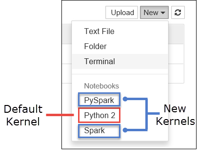

<properties 
    pageTitle="在您的電腦上安裝 Jupyter 筆記本，並將其連線至 HDInsight 火花叢集 |Microsoft Azure" 
    description="瞭解如何在本機電腦上安裝 Jupyter 的筆記本，並將其連線到 Apache 火花叢集上 Azure HDInsight。" 
    services="hdinsight" 
    documentationCenter="" 
    authors="nitinme" 
    manager="jhubbard" 
    editor="cgronlun"
    tags="azure-portal"/>

<tags 
    ms.service="hdinsight" 
    ms.workload="big-data" 
    ms.tgt_pltfrm="na" 
    ms.devlang="na" 
    ms.topic="article" 
    ms.date="09/26/2016" 
    ms.author="nitinme"/>

# 在您的電腦上安裝 Jupyter 筆記本並連線到 HDInsight linux Apache 火花叢集

在本文中，您將學習如何安裝 Jupyter 筆記本，以自訂 PySpark （適用於 Python) 和 （適用於 Scala) 火花核心與火花的優勢，並連線到 HDInsight 叢集的筆記本。 可在您的本機電腦上安裝 Jupyter 的原因，並可以有一些挑戰以及。 原因和挑戰的清單，請參閱本文結尾的 [[為何應該安裝 Jupyter 我的電腦上](#why-should-i-install-jupyter-on-my-computer)的一節。

在您的電腦上安裝 Jupyter 和火花個神奇是三個主要步驟。

* 安裝 Jupyter 筆記本
* 安裝火花個神奇 PySpark 和火花核心
* 設定存取上 HDInsight 火花叢集火花魔術

如需關於自訂核心與適用於 Jupyter 筆記本與 HDInsight 叢集火花個神奇的詳細資訊，請參閱[適用於 Jupyter 的筆記本，與 HDInsight Apache 火花 Linux 叢集核心](hdinsight-apache-spark-jupyter-notebook-kernels.md)。

##必要條件

列於此處的必要條件不是安裝 Jupyter。 以下是連線到 HDInsight 叢集 Jupyter 筆記本，筆記本安裝後。

- Azure 的訂閱。 請參閱[取得 Azure 免費試用版](https://azure.microsoft.com/documentation/videos/get-azure-free-trial-for-testing-hadoop-in-hdinsight/)。
- HDInsight linux Apache 火花圖組。 如需相關指示，請參閱[建立 Apache 火花叢集中 Azure HDInsight](hdinsight-apache-spark-jupyter-spark-sql.md)。

## 在您的電腦上安裝 Jupyter 筆記本

您必須安裝 Python，才能安裝 Jupyter 的筆記本。 Python 和 Jupyter 都可做為[Ananconda 通訊群組](https://www.continuum.io/downloads)的一部分。 當您安裝 Anaconda 時，您實際上安裝 Python 的分配。 Anaconda 安裝後，您可以新增 Jupyter 安裝執行命令。 本節提供您必須遵循指示進行。

1. 下載您的平台[Anaconda 安裝程式](https://www.continuum.io/downloads)，並執行安裝程式。 在執行設定精靈，請務必選取 [將 Anaconda 新增至您的 PATH 變數] 選項。

2. 執行下列命令以安裝 Jupyter。

        conda install jupyter

    如需有關 installting Jupyter 的詳細資訊，請參閱[使用 Anaconda 安裝 Jupyter](http://jupyter.readthedocs.io/en/latest/install.html)。

## 安裝核心和火花魔術

如何安裝火花個神奇的指示，PySpark 和火花核心，請參閱[sparkmagic 文件](https://github.com/jupyter-incubator/sparkmagic#installation)上 GitHub。

## 設定存取 HDInsight 火花叢集火花魔術

您可以在此區段中設定您安裝舊版連線到您必須已經建立中 Azure HDInsight Apache 火花叢集火花個神奇。

1. Jupyter 設定資訊通常會儲存於使用者主目錄中。 若要在任何作業系統平台上，找出您的主目錄，請輸入下列命令。

    啟動 Python 命令介面。 在 [命令] 視窗中，輸入以下資料︰

        python

    在 Python 命令介面輸入下列命令以找出的主目錄。

        import os
        print(os.path.expanduser('~'))

2. 瀏覽至主目錄，名為**.sparkmagic** ，如果不存在的資料夾。

3. 在資料夾中，建立一個稱為**config.json**檔案並新增下列 JSON 片段內。

        {
          "kernel_python_credentials" : {
            "username": "{USERNAME}",
            "base64_password": "{BASE64ENCODEDPASSWORD}",
            "url": "https://{CLUSTERDNSNAME}.azurehdinsight.net/livy"
          },
          "kernel_scala_credentials" : {
            "username": "{USERNAME}",
            "base64_password": "{BASE64ENCODEDPASSWORD}",
            "url": "https://{CLUSTERDNSNAME}.azurehdinsight.net/livy"
          }
        }

4. **{USERNAME}**， **{CLUSTERDNSNAME}**， **{BASE64ENCODEDPASSWORD}**替換適當的值。 若要針對 actualy 密碼產生 base64 編碼密碼，您可以使用公用程式，您最愛的程式設計語言或線上的數字。 會從您的命令提示字元執行簡單 Python 程式碼片段︰

        python -c "import base64; print(base64.b64encode('{YOURPASSWORD}'))"

5. 啟動 [Jupyter]。 使用命令提示字元中的 [動作] 命令。

        jupyter notebook

6. 確認您可以連線至叢集使用 Jupyter 筆記本，您可以使用可用火花個神奇核心。 執行下列步驟。

    1. 建立新的筆記本。 從右下角，按一下 [**新增**]。 您應該會看到預設核心**Python2**和兩個新核心的安裝時， **PySpark**和**火花**。

        

    
        按一下 [ **PySpark**]。

    2. 執行下列程式碼片段。

            %%sql
            SELECT * FROM hivesampletable LIMIT 5

        如果您已成功可以擷取輸出，會測試 HDInsight 叢集的連線。

    >[AZURE.TIP] 如果您想要更新的筆記本設定連線到不同的叢集，更新 config.json 以新的值，如上述的步驟 3 中所示。 

## 為什麼應該安裝 Jupyter 我的電腦上？

可以有一些您可能會想要在電腦上安裝 Jupyter，然後將其連線至火花叢集上 HDInsight 原因。

* 即使已提供火花叢集中 Azure HDInsight Jupyter 筆記本，您的電腦上安裝 Jupyter 提供建立您的筆記本的選項，測試執行叢集，您應用程式，然後上傳到叢集的筆記本。 叢集上, 傳的筆記本，您可以以上傳這些檔案使用的執行 Jupyter 筆記本或叢集，或將它們儲存至叢集相關聯的儲存空間帳戶中的 [/HdiNotebooks] 資料夾。 如需有關叢集上儲存筆記本的方式的詳細資訊，請參閱[Jupyter 筆記本儲存](hdinsight-apache-spark-jupyter-notebook-kernels.md#where-are-the-notebooks-stored)？
* 可用的筆記本與本機，您可以連線至不同的火花叢集，根據您的應用程式的需求。
* 您可以使用 GitHub 實作來源控制系統，而且版本控制的筆記本。 您也可以讓共同作業的環境，讓多位使用者處理相同的筆記本。
* 您可以使用筆記本本機不必叢集。 您只需要叢集測試您的筆記本，不必手動管理您的筆記本或的開發環境。
* 可能會比設定 Jupyter 安裝叢集上設定您自己的本機的開發環境變得更容易。  您可以利用所有您沒有設定一或多個遠端叢集本機安裝的軟體。

>[AZURE.WARNING] 與您的本機電腦上安裝 Jupyter，多個使用者可以執行相同筆記本相同火花叢集上一次。 在這種情況下，會建立多個晚總工作階段。 如果您遇到問題，並想要的偵錯時，它會追蹤哪些晚總工作階段複雜的工作所屬的使用者。

## 另請參閱

* [概觀︰ Apache 火花上 Azure HDInsight](hdinsight-apache-spark-overview.md)

### 案例

* [使用 BI 火花︰ 執行火花 HDInsight 中使用的 BI 工具的互動式的資料分析](hdinsight-apache-spark-use-bi-tools.md)

* [與電腦學習火花︰ 使用火花 HDInsight 分析建置溫度使用 HVAC 資料中](hdinsight-apache-spark-ipython-notebook-machine-learning.md)

* [與電腦學習火花︰ 使用火花 HDInsight 預測食物檢查結果中](hdinsight-apache-spark-machine-learning-mllib-ipython.md)

* [火花串流︰ 使用火花 HDInsight 建置即時串流應用程式中](hdinsight-apache-spark-eventhub-streaming.md)

* [HDInsight 中使用火花網站記錄分析](hdinsight-apache-spark-custom-library-website-log-analysis.md)

### 建立和執行應用程式

* [建立使用 Scala 獨立應用程式](hdinsight-apache-spark-create-standalone-application.md)

* [在使用晚總火花叢集從遠端執行工作](hdinsight-apache-spark-livy-rest-interface.md)

### 工具和延伸模組

* [使用 HDInsight 工具增益集，如 IntelliJ 瞭解建立及提交火花 Scala 應用程式](hdinsight-apache-spark-intellij-tool-plugin.md)

* [使用 HDInsight 工具增益集，如 IntelliJ 瞭解遠端偵錯火花應用程式](hdinsight-apache-spark-intellij-tool-plugin-debug-jobs-remotely.md)

* [使用上 HDInsight 火花叢集運貨用飛艇筆記本](hdinsight-apache-spark-use-zeppelin-notebook.md)

* [核心適用於 HDInsight 火花叢集 Jupyter 筆記本](hdinsight-apache-spark-jupyter-notebook-kernels.md)

* [使用外部封包 Jupyter 筆記本](hdinsight-apache-spark-jupyter-notebook-use-external-packages.md)

### 管理資源

* [管理資源 Apache 火花叢集中 Azure HDInsight](hdinsight-apache-spark-resource-manager.md)

* [追蹤和偵錯 Apache 火花中叢集 HDInsight 上執行的工作](hdinsight-apache-spark-job-debugging.md)
