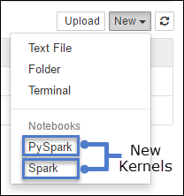

<properties 
    pageTitle="核心用於 Jupyter 筆記本上 HDInsight 火花叢集 linux |Microsoft Azure" 
    description="瞭解使用 HDInsight linux 火花叢集其他 Jupyter 筆記本核心。" 
    services="hdinsight" 
    documentationCenter="" 
    authors="nitinme" 
    manager="jhubbard" 
    editor="cgronlun"
    tags="azure-portal"/>

<tags 
    ms.service="hdinsight" 
    ms.workload="big-data" 
    ms.tgt_pltfrm="na" 
    ms.devlang="na" 
    ms.topic="article" 
    ms.date="10/05/2016" 
    ms.author="nitinme"/>

# 核心適用於 HDInsight linux Apache 火花叢集 Jupyter 筆記本

Apache 火花叢集 HDInsight (Linux) 上的包含您可以使用以測試您的應用程式的 Jupyter 筆記本。 核心是執行，並會解譯程式碼的程式。 HDInsight 火花叢集提供兩個核心，您可以使用 Jupyter 筆記本。 以下是︰

1. **PySpark**（適用於撰寫 Python 應用程式）
2. **火花**（適用於撰寫 Scala 應用程式）

本文中，您將學習如何使用這些核心，而什麼是您使用這些得到的優點。

**先決條件︰**

您必須具備下列項目︰

- Azure 的訂閱。 請參閱[取得 Azure 免費試用版](https://azure.microsoft.com/documentation/videos/get-azure-free-trial-for-testing-hadoop-in-hdinsight/)。
- HDInsight linux Apache 火花叢集。 如需相關指示，請參閱[建立 Apache 火花叢集中 Azure HDInsight](hdinsight-apache-spark-jupyter-spark-sql.md)。

## 我要如何使用核心？ 

1. 從[Azure 入口網站](https://portal.azure.com/)，從 startboard，按一下 [火花叢集] 方塊 （如果您釘選它 startboard）。 您也可以導覽下**瀏覽所有**叢集 > **HDInsight 叢集**。   

2. 從火花叢集刀中，按一下 [**叢集儀表板**，，然後按一下**Jupyter 筆記本**。 如果出現提示，請輸入叢集管理員認證。

    > [AZURE.NOTE] 您也可能會在瀏覽器中開啟下列 URL 達到叢集 Jupyter 筆記本。 取代您叢集名稱__CLUSTERNAME__ :
    >
    > `https://CLUSTERNAME.azurehdinsight.net/jupyter`

2. 建立新的核心新的筆記本。 按一下 [**新增**]，然後按一下 [ **Pyspark**或**火花**。 您應該使用火花核心 Scala 應用程式與 PySpark 核心 Python 應用程式。

     

3. 此應該開啟新的筆記本與您所選取核心。

## 為什麼應該使用 PySpark 或火花核心？

以下是使用新的核心的一些優點。

1. **預設內容**。 使用**PySpark** ] 或 [**火花**核心提供 Jupyter 筆記本中，您不需要明確設定火花或登錄區內容，才能開始使用應用程式開發;以下是可供您預設的。 這些內容是︰

    * **sc** -火花內容
    * **sqlContext** -登錄區內容

    因此，您不必執行陳述式，例如下列設定內容︰

        ###################################################
        # YOU DO NOT NEED TO RUN THIS WITH THE NEW KERNELS
        ###################################################
        sc = SparkContext('yarn-client')
        sqlContext = HiveContext(sc)

    不過，您可以在應用程式中直接使用預設的內容。
    
2. **儲存格我們**。 PySpark 核心提供預先定義的 「 我們 」，這是您可以使用呼叫的特殊命令`%%`(例如`%%MAGIC` <args>)。 神奇命令必須在程式碼儲存格中的第一個單字並允許多列的內容。 非常重要應該在儲存格中的第一個單字。 新增項目之前的優勢，甚至是註解，會導致錯誤。   如需我們的詳細資訊，請參閱[以下](http://ipython.readthedocs.org/en/stable/interactive/magics.html)。

    下表列出可透過核心不同我們。

  	| 魔術     | 範例                         | 描述  |
  	|-----------|---------------------------------|--------------|
  	| 說明      | `%%help`                            | 產生資料表的所有可用的我們範例與描述 |
  	| 資訊      | `%%info`                          | 目前晚總端點的輸出工作階段資訊 |
  	| 設定 | `%%configure -f` `{"executorMemory": "1000M"`, `"executorCores": 4`} | 設定參數，建立工作階段。 強制標幟 (-f) 是強制，如果已建立工作階段，並會遭到捨棄並重新建立工作階段。 查看[晚總的文章 /sessions 要求本文](https://github.com/cloudera/livy#request-body)有效的參數的清單。 參數必須為 JSON 字串傳入，必須在下一行之後的優勢，如下所示的範例資料行。 |
  	| sql       |  `%%sql -o <variable name>`  `SHOW TABLES`    | 執行 sqlContext 登錄區查詢。 如果`-o`傳遞的參數，查詢的結果保存在 %[熊](http://pandas.pydata.org/)dataframe 本機 Python 內容。   |
  	| 本機     |     `%%local` `a=1`              | 在後續幾行中的所有程式碼將會在本機上執行。 程式碼，必須是有效的 Python 程式碼。 |
  	| 記錄檔      | `%%logs`                        | 輸出目前晚總工作階段的記錄。  |
  	| 刪除    | `%%delete -f -s <session number>` | 刪除目前的晚總端點的特定工作階段。 請注意，您無法刪除起始本身的核心工作階段。 |
  	| 清理   | `%%cleanup -f`                    | 刪除目前的晚總端點，包括此筆記本工作階段的所有工作階段。 強制標幟 f 是必要欄位。  |

    >[AZURE.NOTE] 除了新增 PySpark 核心我們，您也可以使用[內建 IPython 我們](https://ipython.org/ipython-doc/3/interactive/magics.html#cell-magics)，包括`%%sh`。 您可以使用`%%sh`個神奇叢集 headnode 上執行指令碼及封鎖的程式碼。 

3. **自動視覺效果**。 **Pyspark**核心自動文章登錄區和 SQL 查詢的輸出。 您有許多不同類型的視覺效果，包括資料表、 圓形圖、 折線圖、 區域、 列選擇的選項。

## 支援的參數 %sql 魔術

%Sql 個神奇支援不同的參數，您可以用來控制當您執行查詢時，收到的輸出的類型。 下表列出成果。

| 參數     | 範例                         | 描述  |
|-----------|---------------------------------|--------------|
| command 和 o      | `-o <VARIABLE NAME>`                          | 使用此參數查詢的結果，保留在 %與[熊](http://pandas.pydata.org/)dataframe 本機 Python 內容。 Dataframe 變數名稱是您所指定的變數名稱。 |
| -q      | `-q`                          | 使用此選項關閉視覺效果的儲存格。 如果您不想要自動-以視覺化方式呈現的儲存格內容，只是要擷取它為 dataframe，然後使用`-q -o <VARIABLE>`。 如果您想要關閉不擷取結果的視覺效果 (例如的 SQL 查詢執行側效果想`CREATE TABLE`陳述式)，就是使用`-q`而不用指定`-o`引數。 |
| -m       |  `-m <METHOD>`    | [**記錄**] 或 [**範例****方法**在哪裡 （預設為**記錄**）。 如果**採取**的方法，是核心會挑選頂端的 [指定 MAXROWS （描述此表格中的更新版本） 的結果資料組中的項目。 如果方法**範例**，核心隨機範例根據資料集的項目`-r`參數，此表格中下一步描述。   |
| -r     |     `-r <FRACTION>`            | 以下**分數**是 0.0 到 1.0 之間的浮點數字。 如果是 SQL 查詢的範例方法`sample`，然後核心隨機範例為您; 設定結果的項目指定的分數例如︰ 如果您執行之引數的 SQL 查詢`-m sample -r 0.01`，然後將隨機取樣的結果列 1%。 |
| -n      | `-n <MAXROWS>`                        | **MAXROWS**為整數值。 核心會限制**MAXROWS**輸出資料列數目。 如果**MAXROWS**負數的數字，例如**-1**，然後在結果集中的資料列數目不會限制。 |

**範例︰**

    %%sql -q -m sample -r 0.1 -n 500 -o query2 
    SELECT * FROM hivesampletable

以上的陳述式執行下列動作︰

* 從**hivesampletable**選取所有記錄。
* 我們使用-q，因為它會關閉自動視覺效果。
* 因為我們使用`-m sample -r 0.1 -n 500`隨機範例中的資料列 hivesampletable 10%，並將結果集 500 個資料列的大小限制。
* 最後，因為我們使用`-o query2`它也會將儲存輸出到稱為**query2**dataframe。
    

## 使用新的核心時的考量

您不論核心使用 （PySpark 或火花），讓執行的筆記本會使用您的叢集資源。  使用這些核心，因為預設的內容，只要結束的筆記本不會不刪除內容，因此叢集資源仍在使用。 考慮使用 PySpark 和火花核心就是使用從筆記本的 [**檔案**] 功能表的 [**關閉] 和 [停止**] 選項。 這會刪除內容，然後結束筆記本。    

## 顯示一些範例

當您開啟 Jupyter 筆記本時，您會看到兩個可資料夾的根層級。

* **PySpark**資料夾有使用新的**Python**核心的範例筆記本。
* **Scala**資料夾有使用新的**火花**核心的範例筆記本。

若要深入瞭解其他可用的我們**PySpark**或**火花**資料夾中，您可以開啟**00-[讀取我第一個] 火花個神奇核心功能**筆記本。 您也可以使用兩個資料夾] 底下的可用的其他範例筆記本，若要瞭解如何達成 Jupyter 筆記本使用 HDInsight 火花叢集不同情況。

## 筆記本儲存在哪裡？

Jupyter 筆記本會儲存到**/HdiNotebooks**資料夾中的 [叢集相關聯的儲存空間帳戶。  會從 WASB 存取筆記本、 文字檔案，以及您 Jupyter 中建立的資料夾。  例如，如果您使用 Jupyter 建立資料夾**myfolder**和筆記本**myfolder/mynotebook.ipynb**時，您可以存取在該筆記本`wasbs:///HdiNotebooks/myfolder/mynotebook.ipynb`。  反向也是如此，亦即，如果您直接對您儲存的帳戶上傳的筆記本`/HdiNotebooks/mynotebook1.ipynb`，筆記本，也會看到從 Jupyter。  筆記本仍會維持在儲存帳戶即使叢集會刪除。

筆記本會儲存到儲存帳戶的方式是與 HDFS 相容的。 因此，如果您將您可以使用的叢集 SSH 檔案管理命令，如下所示︰

    hdfs dfs -ls /HdiNotebooks                            # List everything at the root directory – everything in this directory is visible to Jupyter from the home page
    hdfs dfs –copyToLocal /HdiNotebooks                 # Download the contents of the HdiNotebooks folder
    hdfs dfs –copyFromLocal example.ipynb /HdiNotebooks   # Upload a notebook example.ipynb to the root folder so it’s visible from Jupyter

在若有存取叢集儲存帳戶的問題，筆記本也會儲存在 headnode `/var/lib/jupyter`。

## 支援的瀏覽器
僅在 Google Chrome 支援執行 HDInsight 火花叢集 Jupyter 筆記本。

## 意見反應

新的核心是發展階段，而且會成熟化一段時間。 這也表示，Api 可能會變更這些核心成熟化。 我們非常感謝您可以使用這些新核心時的任何意見反應。 這是在形成這些核心正式發行非常有用。 在本文底部的 [**註解**] 區段下，您可以將您的註解/意見反應。

## 另請參閱

* [概觀︰ Apache 火花上 Azure HDInsight](hdinsight-apache-spark-overview.md)

### 案例

* [使用 BI 火花︰ 執行火花 HDInsight 中使用的 BI 工具的互動式的資料分析](hdinsight-apache-spark-use-bi-tools.md)

* [與電腦學習火花︰ 使用火花 HDInsight 分析建置溫度使用 HVAC 資料中](hdinsight-apache-spark-ipython-notebook-machine-learning.md)

* [與電腦學習火花︰ 使用火花 HDInsight 預測食物檢查結果中](hdinsight-apache-spark-machine-learning-mllib-ipython.md)

* [火花串流︰ 使用火花 HDInsight 建置即時串流應用程式中](hdinsight-apache-spark-eventhub-streaming.md)

* [HDInsight 中使用火花網站記錄分析](hdinsight-apache-spark-custom-library-website-log-analysis.md)

### 建立和執行應用程式

* [建立使用 Scala 獨立應用程式](hdinsight-apache-spark-create-standalone-application.md)

* [在使用晚總火花叢集從遠端執行工作](hdinsight-apache-spark-livy-rest-interface.md)

### 工具和延伸模組

* [使用 HDInsight 工具增益集，如 IntelliJ 瞭解建立及提交火花 Scala 應用程式](hdinsight-apache-spark-intellij-tool-plugin.md)

* [使用 HDInsight 工具增益集，如 IntelliJ 瞭解遠端偵錯火花應用程式](hdinsight-apache-spark-intellij-tool-plugin-debug-jobs-remotely.md)

* [使用上 HDInsight 火花叢集運貨用飛艇筆記本](hdinsight-apache-spark-use-zeppelin-notebook.md)

* [使用外部封包 Jupyter 筆記本](hdinsight-apache-spark-jupyter-notebook-use-external-packages.md)

* [在 [您的電腦上安裝 Jupyter 並連線到 HDInsight 火花叢集](hdinsight-apache-spark-jupyter-notebook-install-locally.md)

### 管理資源

* [管理資源 Apache 火花叢集中 Azure HDInsight](hdinsight-apache-spark-resource-manager.md)

* [追蹤和偵錯 Apache 火花中叢集 HDInsight 上執行的工作](hdinsight-apache-spark-job-debugging.md)
