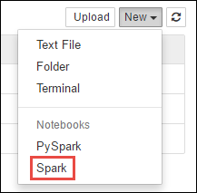

<properties 
    pageTitle="使用外部封包 Jupyter 筆記本中 HDInsight Apache 火花叢集 |Azure"
    description="若要使用外部火花套件如何設定 HDInsight 火花叢集 Jupyter 筆記本提供逐步指示。" 
    services="hdinsight" 
    documentationCenter="" 
    authors="nitinme" 
    manager="jhubbard" 
    editor="cgronlun"
    tags="azure-portal"/>

<tags 
    ms.service="hdinsight" 
    ms.workload="big-data" 
    ms.tgt_pltfrm="na" 
    ms.devlang="na" 
    ms.topic="article" 
    ms.date="10/28/2016" 
    ms.author="nitinme"/>

# 使用外部套件中 HDInsight linux Apache 火花叢集 Jupyter 筆記本

>[AZURE.NOTE] 本文適用於火花 1.5.2 上 HDInsight 3.3 和火花 1.6.2 HDInsight 3.4 上。 

瞭解如何設定 Jupyter 筆記本中使用外部 HDInsight (Linux) 上的 Apache 火花叢集，無法的社群提供封包叢集中包含的方塊出。 

您可以搜尋[Maven 存放庫](http://search.maven.org/)的可用套件的完整清單。 您也可以從其他來源取得可用套件的清單。 例如，社群提供封包的完整清單的[火花套件](http://spark-packages.org/)。

在本文中，您將學習如何使用 Jupyter 筆記本[火花 csv](http://search.maven.org/#artifactdetails%7Ccom.databricks%7Cspark-csv_2.10%7C1.4.0%7Cjar)套件。

##必要條件

您必須具備下列項目︰

- Azure 的訂閱。 請參閱[取得 Azure 免費試用版](https://azure.microsoft.com/documentation/videos/get-azure-free-trial-for-testing-hadoop-in-hdinsight/)。
- HDInsight linux Apache 火花叢集。 如需相關指示，請參閱[建立 Apache 火花叢集中 Azure HDInsight](hdinsight-apache-spark-jupyter-spark-sql.md)。

## 使用外部封包 Jupyter 筆記本 

1. 從[Azure 入口網站](https://portal.azure.com/)，從 startboard，按一下 [火花叢集] 方塊 （如果您釘選它 startboard）。 您也可以導覽下**瀏覽所有**叢集 > **叢集 HDInsight**。   

2. 從火花叢集刀中，按一下 [**快速連結**]，然後從**叢集儀表板**刀中，按一下**Jupyter 筆記本**。 如果出現提示，請輸入叢集管理員認證。

    > [AZURE.NOTE] 您也可能會在瀏覽器中開啟下列 URL 達到叢集 Jupyter 筆記本。 取代您叢集名稱__CLUSTERNAME__ :
    >
    > `https://CLUSTERNAME.azurehdinsight.net/jupyter`

2. 建立新的筆記本。 按一下 [**新增**]，然後按一下 [**火花**。

    

3. 建立新的筆記本，並開啟 Untitled.pynb 名稱。 按一下筆記本名稱上方，然後輸入好記的名稱。

    

4. 您會使用`%%configure`個神奇設定要使用外部套件的筆記本。 在 [使用外部套件的筆記本，請確定您撥打`%%configure`神奇第一個程式碼儲存格。 如此一來，可確保核心已啟動工作階段之前，請使用套件。

        %%configure
        { "packages":["com.databricks:spark-csv_2.10:1.4.0"] }

    >[AZURE.IMPORTANT] 如果您忘記設定核心第一個儲存格，您可以使用`%%configure`與`-f`參數，但會重新啟動工作階段，所有的進度可能會遺失。

5. 在上述片段`packages`預期 maven 座標 Maven 中央存放庫中的清單。 在此程式碼片段，`com.databricks:spark-csv_2.10:1.4.0`是**火花 csv**套件的 maven 座標。 以下是您如何建構套件座標。

    。 Maven 存放庫中找到套件。 在此教學課程中，我們使用[火花 csv](http://search.maven.org/#artifactdetails%7Ccom.databricks%7Cspark-csv_2.10%7C1.4.0%7Cjar)。
    
    b。 從存放庫，收集的**識別碼**、 **ArtifactId**及**版本**的值。

    

    c。 串連的三個值，並加上冒號 （**:**）。

        com.databricks:spark-csv_2.10:1.4.0

6. 執行的程式碼儲存格`%%configure`個神奇。 這將會設定以使用您所提供的封裝基礎晚總工作階段。 在筆記本中的後續儲存格，您現在可以使用套件，如下所示。

        val df = sqlContext.read.format("com.databricks.spark.csv").
        option("header", "true").
        option("inferSchema", "true").
        load("wasbs:///HdiSamples/HdiSamples/SensorSampleData/hvac/HVAC.csv")

7. 然後，您可以執行的程式碼片段，類似如下所示，若要檢視您在上一個步驟中建立 dataframe 中的資料。

        df.show()

        df.select("Time").count()

## 另請參閱

* [概觀︰ Apache 火花上 Azure HDInsight](hdinsight-apache-spark-overview.md)

### 案例

* [使用 BI 火花︰ 執行火花 HDInsight 中使用的 BI 工具的互動式的資料分析](hdinsight-apache-spark-use-bi-tools.md)

* [與電腦學習火花︰ 使用火花 HDInsight 分析建置溫度使用 HVAC 資料中](hdinsight-apache-spark-ipython-notebook-machine-learning.md)

* [與電腦學習火花︰ 使用火花 HDInsight 預測食物檢查結果中](hdinsight-apache-spark-machine-learning-mllib-ipython.md)

* [火花串流︰ 使用火花 HDInsight 建置即時串流應用程式中](hdinsight-apache-spark-eventhub-streaming.md)

* [HDInsight 中使用火花網站記錄分析](hdinsight-apache-spark-custom-library-website-log-analysis.md)

### 建立和執行應用程式

* [建立使用 Scala 獨立應用程式](hdinsight-apache-spark-create-standalone-application.md)

* [在使用晚總火花叢集從遠端執行工作](hdinsight-apache-spark-livy-rest-interface.md)

### 工具和延伸模組

* [使用 HDInsight 工具增益集，如 IntelliJ 瞭解建立及提交火花 Scala 應用程式](hdinsight-apache-spark-intellij-tool-plugin.md)

* [使用 HDInsight 工具增益集，如 IntelliJ 瞭解遠端偵錯火花應用程式](hdinsight-apache-spark-intellij-tool-plugin-debug-jobs-remotely.md)

* [使用上 HDInsight 火花叢集運貨用飛艇筆記本](hdinsight-apache-spark-use-zeppelin-notebook.md)

* [核心適用於 Jupyter 火花叢集 HDInsight 的筆記本](hdinsight-apache-spark-jupyter-notebook-kernels.md)

* [在 [您的電腦上安裝 Jupyter 並連線到 HDInsight 火花叢集](hdinsight-apache-spark-jupyter-notebook-install-locally.md)

### 管理資源

* [管理資源 Apache 火花叢集中 Azure HDInsight](hdinsight-apache-spark-resource-manager.md)

* [追蹤和偵錯 Apache 火花中叢集 HDInsight 上執行的工作](hdinsight-apache-spark-job-debugging.md)
