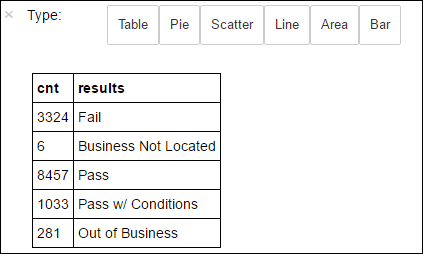

<properties 
    pageTitle="使用 Apache 火花建置 HDInsight 上的電腦學習應用程式 |Microsoft Azure" 
    description="如何建置電腦學習應用程式中使用 Apache 火花筆記本的逐步指示" 
    services="hdinsight" 
    documentationCenter="" 
    authors="nitinme" 
    manager="jhubbard" 
    editor="cgronlun"
    tags="azure-portal"/>

<tags 
    ms.service="hdinsight" 
    ms.workload="big-data" 
    ms.tgt_pltfrm="na" 
    ms.devlang="na" 
    ms.topic="article" 
    ms.date="10/05/2016" 
    ms.author="nitinme"/>

# 電腦學習︰ 資料 MLlib 使用 Apache 火花叢集 HDInsight linux 上食物檢查預測的分析

> [AZURE.TIP] 本教學課程也是在您建立的 HDInsight 火花 (Linux) 叢集 Jupyter 筆記本。 筆記本體驗，可讓您從筆記本本身執行 Python 程式碼片段。 若要執行的教學課程筆記本中，建立火花叢集、 啟動 Jupyter 筆記本 (`https://CLUSTERNAME.azurehdinsight.net/jupyter`)，然後**Python**資料夾中的 [執行**火花電腦學習食物檢查資料的預測分析使用 MLLib.ipynb**的筆記本。

本文將示範如何使用**MLLib**，火花的內建的電腦，學習文件庫，在開啟的資料集執行簡單的預測分析。 MLLib 為核心火花的文件庫提供許多公用程式可用於電腦學習工作，包括公用程式適用於︰

* 分類

* 迴歸分析

* 叢集

* 主題模型

* 單一值分解 (SVD) 和主要元件分析 (PCA)

* 假設測試和計算範例統計值

本文提供透過後勤迴歸*分類*的簡單方法。

## 分類和後勤迴歸是什麼？

*分類*，常見的電腦學習工作，是將類別排序輸入的資料的程序。 若要瞭解如何指派 「 標籤 」 以輸入您所提供的資料分類演算法的工作就是。 例如，您可能認為接受輸入股票資訊並股票分為兩個類別的電腦學習演算法的︰ 您應該銷售的股票，您應該保留的股票。

後勤迴歸是您用於分類演算法。 火花的後勤迴歸 API 適合用於*二進位分類*，或將輸入的資料分類到其中一個兩個群組。 如需有關後勤回復的詳細資訊，請參閱[維基百科](https://en.wikipedia.org/wiki/Logistic_regression)。

在 [摘要] 後勤迴歸的程序會產生*後勤函數*可以用來預測輸入的向量所屬的群組或其他的機率。  

## 我們想要完成此文件中什麼？

您會使用火花可執行的透過[「 芝加哥城市資料] 入口網站](https://data.cityofchicago.org/)取得的食物檢查資料 (**Food_Inspections1.csv**) 一些預測分析。 此資料集的內容進行芝加哥，包括每個食物建立檢查的相關資訊與找不到 （如果有的話），衝突的檢查結果中的食物操作的相關資訊。 CSV 資料檔案已經在**/HdiSamples/HdiSamples/FoodInspectionData/Food_Inspections1.csv**叢集相關聯的儲存空間帳戶。

下列步驟中，您會開發模型]，請參閱如何成功或失敗食物檢查。 

## 開始建立使用火花 MLlib 機器學習應用程式

1. 從[Azure 入口網站](https://portal.azure.com/)，從 startboard，按一下 [火花叢集] 方塊 （如果您釘選它 startboard）。 您也可以導覽下**瀏覽所有**叢集 > **HDInsight 叢集**。   

2. 從火花叢集刀中，按一下 [**叢集儀表板**，，然後按一下**Jupyter 筆記本**。 如果出現提示，請輸入叢集管理員認證。

    > [AZURE.NOTE] 您也可能會在瀏覽器中開啟下列 URL 達到叢集 Jupyter 筆記本。 取代您叢集名稱__CLUSTERNAME__ :
    >
    > `https://CLUSTERNAME.azurehdinsight.net/jupyter`

2. 建立新的筆記本。 按一下 [**新增**]，然後按一下 [ **PySpark**。

    

3. 建立新的筆記本，並開啟 Untitled.pynb 名稱。 按一下筆記本名稱上方，然後輸入好記的名稱。

    

3. 您建立 PySpark 核心的筆記本，因為您不需要明確地建立任何內容。 當您執行第一個程式碼儲存格時，火花和登錄區內容，會自動建立適合您。 您可以開始建立您的電腦學習應用程式匯入所需的這種情況的類型。 若要這麼做，請將游標放在儲存格並按下**SHIFT + enter 鍵**。

        from pyspark.ml import Pipeline
        from pyspark.ml.classification import LogisticRegression
        from pyspark.ml.feature import HashingTF, Tokenizer
        from pyspark.sql import Row
        from pyspark.sql.functions import UserDefinedFunction
        from pyspark.sql.types import *

## 建構輸入的 dataframe

我們可以使用`sqlContext`在結構化資料上執行轉換。 第一個任務是載入火花 SQL *dataframe*的範例資料 ((**Food_Inspections1.csv**))。 

1. 因為原始資料是 CSV 格式，我們需要取出檔案的每一行將記憶體為非結構化文字; 使用火花內容然後，您可以使用 Python 的 CSV 文件庫個別剖析每一行。 

        def csvParse(s):
            import csv
            from StringIO import StringIO
            sio = StringIO(s)
            value = csv.reader(sio).next()
            sio.close()
            return value
        
        inspections = sc.textFile('wasbs:///HdiSamples/HdiSamples/FoodInspectionData/Food_Inspections1.csv')\
                        .map(csvParse)

2. 現在，我們會有 CSV 檔案為 RDD。 讓我們從了解資料的結構描述 RDD 擷取一列。

        inspections.take(1)

    您應該會看到如下所示的輸出︰

        # -----------------
        # THIS IS AN OUTPUT
        # -----------------

        [['413707',
          'LUNA PARK INC',
          'LUNA PARK  DAY CARE',
          '2049789',
          "Children's Services Facility",
          'Risk 1 (High)',
          '3250 W FOSTER AVE ',
          'CHICAGO',
          'IL',
          '60625',
          '09/21/2010',
          'License-Task Force',
          'Fail',
          '24. DISH WASHING FACILITIES: PROPERLY DESIGNED, CONSTRUCTED, MAINTAINED, INSTALLED, LOCATED AND OPERATED - Comments: All dishwashing machines must be of a type that complies with all requirements of the plumbing section of the Municipal Code of Chicago and Rules and Regulation of the Board of Health. OBSEVERD THE 3 COMPARTMENT SINK BACKING UP INTO THE 1ST AND 2ND COMPARTMENT WITH CLEAR WATER AND SLOWLY DRAINING OUT. INST NEED HAVE IT REPAIR. CITATION ISSUED, SERIOUS VIOLATION 7-38-030 H000062369-10 COURT DATE 10-28-10 TIME 1 P.M. ROOM 107 400 W. SURPERIOR. | 36. LIGHTING: REQUIRED MINIMUM FOOT-CANDLES OF LIGHT PROVIDED, FIXTURES SHIELDED - Comments: Shielding to protect against broken glass falling into food shall be provided for all artificial lighting sources in preparation, service, and display facilities. LIGHT SHIELD ARE MISSING UNDER HOOD OF  COOKING EQUIPMENT AND NEED TO REPLACE LIGHT UNDER UNIT. 4 LIGHTS ARE OUT IN THE REAR CHILDREN AREA,IN THE KINDERGARDEN CLASS ROOM. 2 LIGHT ARE OUT EAST REAR, LIGHT FRONT WEST ROOM. NEED TO REPLACE ALL LIGHT THAT ARE NOT WORKING. | 35. WALLS, CEILINGS, ATTACHED EQUIPMENT CONSTRUCTED PER CODE: GOOD REPAIR, SURFACES CLEAN AND DUST-LESS CLEANING METHODS - Comments: The walls and ceilings shall be in good repair and easily cleaned. MISSING CEILING TILES WITH STAINS IN WEST,EAST, IN FRONT AREA WEST, AND BY THE 15MOS AREA. NEED TO BE REPLACED. | 32. FOOD AND NON-FOOD CONTACT SURFACES PROPERLY DESIGNED, CONSTRUCTED AND MAINTAINED - Comments: All food and non-food contact equipment and utensils shall be smooth, easily cleanable, and durable, and shall be in good repair. SPLASH GUARDED ARE NEEDED BY THE EXPOSED HAND SINK IN THE KITCHEN AREA | 34. FLOORS: CONSTRUCTED PER CODE, CLEANED, GOOD REPAIR, COVING INSTALLED, DUST-LESS CLEANING METHODS USED - Comments: The floors shall be constructed per code, be smooth and easily cleaned, and be kept clean and in good repair. INST NEED TO ELEVATE ALL FOOD ITEMS 6INCH OFF THE FLOOR 6 INCH AWAY FORM WALL.  ',
          '41.97583445690982',
          '-87.7107455232781',
          '(41.97583445690982, -87.7107455232781)']]

3. 上述輸出讓我們的結構描述輸入的檔案。檔案包含每個建立、 建立、 地址、 操作和位置，在其他方面的資料類型的名稱。 現在就讓我們選取會有幫助我們預測分析並將結果分組為 dataframe，然後使用，建立一個暫存資料表的幾個資料行。

        schema = StructType([
        StructField("id", IntegerType(), False), 
        StructField("name", StringType(), False), 
        StructField("results", StringType(), False), 
        StructField("violations", StringType(), True)])

        df = sqlContext.createDataFrame(inspections.map(lambda l: (int(l[0]), l[1], l[12], l[13])) , schema)
        df.registerTempTable('CountResults')

4. 現在我們有*dataframe*， `df` ，我們可以在其中執行我們的分析。 我們也有來電**CountResults**暫存資料表。 4 的 dataframe 感興趣的欄包含了︰**識別碼**、**名稱**、**結果**及**衝突**。 
    
    讓我們來取得資料的一小部分範例︰

        df.show(5)

    您應該會看到如下所示的輸出︰

        # -----------------
        # THIS IS AN OUTPUT
        # -----------------

        +------+--------------------+-------+--------------------+
        |    id|                name|results|          violations|
        +------+--------------------+-------+--------------------+
        |413707|       LUNA PARK INC|   Fail|24. DISH WASHING ...|
        |391234|       CAFE SELMARIE|   Fail|2. FACILITIES TO ...|
        |413751|          MANCHU WOK|   Pass|33. FOOD AND NON-...|
        |413708|BENCHMARK HOSPITA...|   Pass|                    |
        |413722|           JJ BURGER|   Pass|                    |
        +------+--------------------+-------+--------------------+

## 了解資料

1. 現在就讓我們開始具體的資料集的內容。 例如，有哪些不同欄中的值**結果**？

        df.select('results').distinct().show()

    
    您應該會看到如下所示的輸出︰

        # -----------------
        # THIS IS AN OUTPUT
        # -----------------
    
        +--------------------+
        |             results|
        +--------------------+
        |                Fail|
        |Business Not Located|
        |                Pass|
        |  Pass w/ Conditions|
        |     Out of Business|
        +--------------------+
    
2. 快速視覺效果可協助我們瞭解這些結果的原因。 我們已**CountResults**暫時表格中的資料。 您可以執行下列 SQL 查詢以取得深入瞭解如何分散結果資料表。

        %%sql -o countResultsdf
        SELECT results, COUNT(results) AS cnt FROM CountResults GROUP BY results

    `%%sql`個神奇後面`-o countResultsdf`可確保查詢的輸出本機保存在 Jupyter 伺服器 (通常是叢集 headnode)。 輸出會保存為以指定的名稱**countResultsdf**[熊](http://pandas.pydata.org/)dataframe。
    
    您應該會看到如下所示的輸出︰
    
    

    如需有關`%%sql`的優勢，以及其他我們提供 PySpark 核心，請參閱[核心提供火花 HDInsight 叢集 Jupyter 筆記本](hdinsight-apache-spark-jupyter-notebook-kernels.md#why-should-i-use-the-new-kernels)。

3. 您也可以使用 Matplotlib，用來建構視覺效果的資料，文件庫來建立的繪圖。 因為您必須從本機保存的**countResultsdf** dataframe 建立繪圖，都必須開始的程式碼片段`%%local`個神奇。 如此一來，可確保 Jupyter 伺服器上執行的程式碼是本機。

        %%local
        %matplotlib inline
        import matplotlib.pyplot as plt
        
        
        labels = countResultsdf['results']
        sizes = countResultsdf['cnt']
        colors = ['turquoise', 'seagreen', 'mediumslateblue', 'palegreen', 'coral']
        plt.pie(sizes, labels=labels, autopct='%1.1f%%', colors=colors)
        plt.axis('equal')

    您應該會看到如下所示的輸出︰

    

4. 您可以查看有 5 不同的結果的能檢查︰
    
    * 企業版不 
    * 會失敗。
    * 傳遞
    * Pss 與條件，和
    * 登出商務 

    讓我們開發可以猜測的食物該類檢查結果的模型提供衝突。 後勤迴歸為二進位分類方法，因為這麼做，我們的資料分組成兩個類別︰**失敗**，並**將傳遞**。 「 傳遞與條件 」 仍行程，因此當我們訓練模型，我們會考慮在兩個結果相當於。 其他結果 （「 商務不位於 「，」 的商業 」） 的資料不實用，因此我們將會移除我們訓練設定。 由於這兩個類別構成結果的很小百分比繼續應該是沒問題。

5. 讓我們吧] 並轉換我們現有 dataframe (`df`) 到新的 dataframe 每個檢查表示當做標籤衝突組的位置。 我們的大小寫的標籤`0.0`代表失敗的標籤`1.0`代表成功，而的標籤`-1.0`代表除了這兩部分結果。 計算新的資料範圍時，我們將篩選出這些其他結果。

        def labelForResults(s):
            if s == 'Fail':
                return 0.0
            elif s == 'Pass w/ Conditions' or s == 'Pass':
                return 1.0
            else:
                return -1.0
        label = UserDefinedFunction(labelForResults, DoubleType())
        labeledData = df.select(label(df.results).alias('label'), df.violations).where('label >= 0')

    讓我們來擷取標記的資料，以查看 [看起來像是一列。

        labeledData.take(1)

    您應該會看到如下所示的輸出︰
    
        # -----------------
        # THIS IS AN OUTPUT
        # -----------------
    
        [Row(label=0.0, violations=u"41. PREMISES MAINTAINED FREE OF LITTER, UNNECESSARY ARTICLES, CLEANING  EQUIPMENT PROPERLY STORED - Comments: All parts of the food establishment and all parts of the property used in connection with the operation of the establishment shall be kept neat and clean and should not produce any offensive odors.  REMOVE MATTRESS FROM SMALL DUMPSTER. | 35. WALLS, CEILINGS, ATTACHED EQUIPMENT CONSTRUCTED PER CODE: GOOD REPAIR, SURFACES CLEAN AND DUST-LESS CLEANING METHODS - Comments: The walls and ceilings shall be in good repair and easily cleaned.  REPAIR MISALIGNED DOORS AND DOOR NEAR ELEVATOR.  DETAIL CLEAN BLACK MOLD LIKE SUBSTANCE FROM WALLS BY BOTH DISH MACHINES.  REPAIR OR REMOVE BASEBOARD UNDER DISH MACHINE (LEFT REAR KITCHEN). SEAL ALL GAPS.  REPLACE MILK CRATES USED IN WALK IN COOLERS AND STORAGE AREAS WITH PROPER SHELVING AT LEAST 6' OFF THE FLOOR.  | 38. VENTILATION: ROOMS AND EQUIPMENT VENTED AS REQUIRED: PLUMBING: INSTALLED AND MAINTAINED - Comments: The flow of air discharged from kitchen fans shall always be through a duct to a point above the roofline.  REPAIR BROKEN VENTILATION IN MEN'S AND WOMEN'S WASHROOMS NEXT TO DINING AREA. | 32. FOOD AND NON-FOOD CONTACT SURFACES PROPERLY DESIGNED, CONSTRUCTED AND MAINTAINED - Comments: All food and non-food contact equipment and utensils shall be smooth, easily cleanable, and durable, and shall be in good repair.  REPAIR DAMAGED PLUG ON LEFT SIDE OF 2 COMPARTMENT SINK.  REPAIR SELF CLOSER ON BOTTOM LEFT DOOR OF 4 DOOR PREP UNIT NEXT TO OFFICE.")]

## 從輸入 dataframe 建立後勤迴歸模型

我們的最後一個工作是標記的資料轉換的格式，您可以依後勤迴歸分析。 輸入至後勤迴歸演算法應一組*標籤功能向量組*，」 功能向量 」 會是表示方式的輸入的點的數字的對象的位置。 因此，我們需要轉換 「 衝突 」 欄中，這是半結構化，並包含許多空閒文字的電腦可以輕鬆地理解的實數陣列中的註解的方式。 

一標準的電腦學習方法處理自然語言是指派相異的每個字 「 索引 」，然後將向量傳遞給電腦學習演算法的每個索引的值，包含該文字的文字字串中的相對的頻率。 

MLLib 提供簡單的方法，才能執行此作業。 首先，我們會 」 眾多 「 每一個衝突字串，以取得個字串中的個別的單字，然後，我們將使用`HashingTF`轉換功能向量然後可傳遞至建構模型後勤迴歸演算法的權杖每組。 我們會使用 「 管線 」 的順序來進行上述步驟。

    tokenizer = Tokenizer(inputCol="violations", outputCol="words")
    hashingTF = HashingTF(inputCol=tokenizer.getOutputCol(), outputCol="features")
    lr = LogisticRegression(maxIter=10, regParam=0.01)
    pipeline = Pipeline(stages=[tokenizer, hashingTF, lr])
    
    model = pipeline.fit(labeledData)

## 評估在個別的測試資料集的模型

我們可以使用的模型我們先前建立*預測*的結果會出現新的操作，根據發現衝突。 我們訓練此模型中的資料集**Food_Inspections1.csv**上。 讓我們使用第二個資料集， **Food_Inspections2.csv**，*評估*這個新的資料模型的強度。 此第二個資料集 (**Food_Inspections2.csv**) 應該已經是叢集相關聯的預設儲存容器。

1. 下列程式碼片段會建立新的 dataframe **predictionsDf**包含模型所產生的預測。 程式碼片段也會建立**預測**根據 dataframe 的暫時表格。

        testData = sc.textFile('wasbs:///HdiSamples/HdiSamples/FoodInspectionData/Food_Inspections2.csv')\
                 .map(csvParse) \
                 .map(lambda l: (int(l[0]), l[1], l[12], l[13]))
        testDf = sqlContext.createDataFrame(testData, schema).where("results = 'Fail' OR results = 'Pass' OR results = 'Pass w/ Conditions'")
        predictionsDf = model.transform(testDf)
        predictionsDf.registerTempTable('Predictions')
        predictionsDf.columns

    您應該會看到如下所示的輸出︰
    
        # -----------------
        # THIS IS AN OUTPUT
        # -----------------
        
        ['id',
         'name',
         'results',
         'violations',
         'words',
         'features',
         'rawPrediction',
         'probability',
         'prediction']

2. 查看其中一個預測。 執行這個程式碼片段︰

        predictionsDf.take(1)

    您會看到預測中測試資料集的第一個項目。

3. `model.transform()`方法將任何新的資料結構描述，套用相同的轉換和到達分類資料的方式來預測。 我們可以執行具體的我們預測的精確度如何一些簡單的統計資料︰

        numSuccesses = predictionsDf.where("""(prediction = 0 AND results = 'Fail') OR 
                                              (prediction = 1 AND (results = 'Pass' OR 
                                                                   results = 'Pass w/ Conditions'))""").count()
        numInspections = predictionsDf.count()
        
        print "There were", numInspections, "inspections and there were", numSuccesses, "successful predictions"
        print "This is a", str((float(numSuccesses) / float(numInspections)) * 100) + "%", "success rate"

    輸出類似下列所示︰
    
        # -----------------
        # THIS IS AN OUTPUT
        # -----------------
    
        There were 9315 inspections and there were 8087 successful predictions
        This is a 86.8169618894% success rate

    使用火花後勤迴歸分析，讓我們的精確的模型的英文衝突描述與特定的商業想成功或失敗食物檢查的是否之間的關係。 

## 建立視覺化的方式呈現預測

我們現在可以建構最終的視覺效果，可協助我們瞭解這項測試結果的原因。 

1. 我們先從不同的預測和結果從先前建立的**預測**暫存資料表。 下列查詢分隔為*true_positive*、 *false_positive*、 *true_negative*，以及*false_negative*輸出。 在下面的查詢中，我們關閉視覺效果使用`-q`也儲存輸出 (使用`-o`) 為可利用再使用的 dataframes`%%local`個神奇。 

        %%sql -q -o true_positive
        SELECT count(*) AS cnt FROM Predictions WHERE prediction = 0 AND results = 'Fail'

        %%sql -q -o false_positive
        SELECT count(*) AS cnt FROM Predictions WHERE prediction = 0 AND (results = 'Pass' OR results = 'Pass w/ Conditions')

        %%sql -q -o true_negative
        SELECT count(*) AS cnt FROM Predictions WHERE prediction = 1 AND results = 'Fail'

        %%sql -q -o false_negative
        SELECT count(*) AS cnt FROM Predictions WHERE prediction = 1 AND (results = 'Pass' OR results = 'Pass w/ Conditions') 

2. 最後，請使用下列程式碼片段產生使用**Matplotlib**繪圖。

        %%local
        %matplotlib inline
        import matplotlib.pyplot as plt
        
        labels = ['True positive', 'False positive', 'True negative', 'False negative']
        sizes = [true_positive['cnt'], false_positive['cnt'], false_negative['cnt'], true_negative['cnt']]
        colors = ['turquoise', 'seagreen', 'mediumslateblue', 'palegreen', 'coral']
        plt.pie(sizes, labels=labels, autopct='%1.1f%%', colors=colors)
        plt.axis('equal')
    
    您應該會看到下列輸出。
    
    

    在此圖表中，「 正 」 的結果是指失敗的食物檢查，而負的結果是指傳遞的檢查。

## 關閉筆記本

當您完成執行應用程式之後，您應該要關閉的筆記本，以釋出資源。 若要這麼做，從 [**檔案**] 功能表上的筆記本中，按一下 [**關閉並停止**]。 這將會關閉，然後關閉的筆記本。

## 另請參閱

* [概觀︰ Apache 火花上 Azure HDInsight](hdinsight-apache-spark-overview.md)

### 案例

* [使用 BI 火花︰ 執行火花 HDInsight 中使用的 BI 工具的互動式的資料分析](hdinsight-apache-spark-use-bi-tools.md)

* [與電腦學習火花︰ 使用火花 HDInsight 分析建置溫度使用 HVAC 資料中](hdinsight-apache-spark-ipython-notebook-machine-learning.md)

* [火花串流︰ 使用火花 HDInsight 建置即時串流應用程式中](hdinsight-apache-spark-eventhub-streaming.md)

* [HDInsight 中使用火花網站記錄分析](hdinsight-apache-spark-custom-library-website-log-analysis.md)

### 建立和執行應用程式

* [建立使用 Scala 獨立應用程式](hdinsight-apache-spark-create-standalone-application.md)

* [在使用晚總火花叢集從遠端執行工作](hdinsight-apache-spark-livy-rest-interface.md)

### 工具和延伸模組

* [使用 HDInsight 工具增益集，如 IntelliJ 瞭解建立及提交火花 Scala 應用程式](hdinsight-apache-spark-intellij-tool-plugin.md)

* [使用 HDInsight 工具增益集，如 IntelliJ 瞭解遠端偵錯火花應用程式](hdinsight-apache-spark-intellij-tool-plugin-debug-jobs-remotely.md)

* [使用上 HDInsight 火花叢集運貨用飛艇筆記本](hdinsight-apache-spark-use-zeppelin-notebook.md)

* [核心適用於 HDInsight 火花叢集 Jupyter 筆記本](hdinsight-apache-spark-jupyter-notebook-kernels.md)

* [使用外部封包 Jupyter 筆記本](hdinsight-apache-spark-jupyter-notebook-use-external-packages.md)

* [在 [您的電腦上安裝 Jupyter 並連線到 HDInsight 火花叢集](hdinsight-apache-spark-jupyter-notebook-install-locally.md)

### 管理資源

* [管理資源 Apache 火花叢集中 Azure HDInsight](hdinsight-apache-spark-resource-manager.md)

* [追蹤和偵錯 Apache 火花中叢集 HDInsight 上執行的工作](hdinsight-apache-spark-job-debugging.md)
