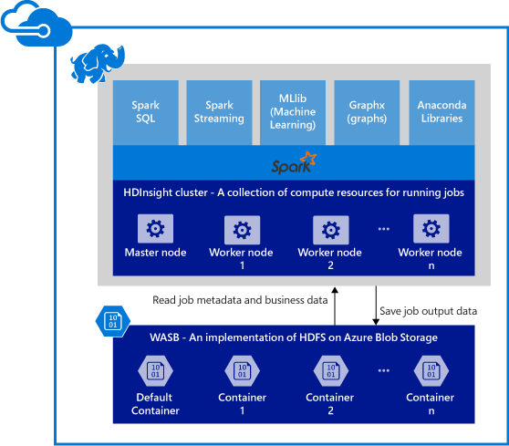

<properties 
    pageTitle="在 HDInsight Apache 火花概觀 |Microsoft Azure" 
    description="在 HDInsight Apache 火花和要火花 HDInsight 上應用程式中使用您的案例的簡介。" 
    services="hdinsight" 
    documentationCenter="" 
    authors="nitinme" 
    manager="jhubbard" 
    editor="cgronlun"
    tags="azure-portal"/>

<tags 
    ms.service="hdinsight" 
    ms.workload="big-data" 
    ms.tgt_pltfrm="na" 
    ms.devlang="na" 
    ms.topic="get-started-article" 
    ms.date="08/25/2016" 
    ms.author="nitinme"/>

# 概觀︰ Apache 火花 HDInsight linux
 
<a href="http://spark.apache.org/" target="_blank">Apache 火花</a>是處理架構，可支援提高大型資料分析應用程式的效能的記憶體內處理開啟來源平行。 火花處理引擎內建的速度，以便於使用及複雜的分析。 火花的記憶體內的計算功能讓您更適合反覆運算演算法電腦學習及圖形計算中。 火花也是相容於 Azure Blob 儲存體 (WASB) 的所以您儲存在 Azure 中的現有資料可輕鬆地處理透過火花。

當您建立火花叢集 HDInsight 中時，您可以建立 Azure 計算資源與火花安裝和設定。 只需要瞭解的十分鐘內建立火花叢集 HDInsight 中。 處理資料會儲存於 Azure Blob 儲存體。 請參閱[使用 Azure Blob 儲存體與 HDInsight][hdinsight-storage]。

**想要開始使用 Apache 火花 Azure HDInsight 上嗎？** 請參閱[快速入門︰ 建立火花叢集 HDInsight linux 及執行範例應用程式使用 Jupyter](hdinsight-apache-spark-jupyter-spark-sql.md)。

>[AZURE.NOTE] 如需已知的問題和限制目前版本的清單，請參閱[已知問題的 Apache 火花 Azure HDInsight (Linux) 中](hdinsight-apache-spark-jupyter-spark-sql.md)。

## 為什麼要使用火花 Azure HDInsight 上？ 

Azure HDInsight 提供完整的管理火花服務。 使用火花上 HDInsight 的優點是︰

| 功能                             | 描述       |
|-------------------------------------|-------------------|
| 以便於建立叢集            | 您可以建立新的火花叢集 HDInsight 上，使用 Azure 管理入口網站的 PowerShell 的 Azure HDInsight.NET SDK 的分鐘數。 請參閱[快速入門中 HDInsight 火花叢集](hdinsight-apache-spark-jupyter-spark-sql.md) |
| 使用方便性                     | HDInsight 叢集火花包含預先設定的 Jupyter 筆記本。 您可以使用這些互動式資料處理和視覺效果。 Url 是 https://CLUSTERNAME.azurehdinsight.net/jupyter。 __CLUSTERNAME__換成您火花 HDInsight 叢集的名稱。|
| REST Api                       | 在 HDInsight 火花包含[晚總](https://github.com/cloudera/hue/tree/master/apps/spark/java#welcome-to-livy-the-rest-spark-server)的 REST API 火花作業伺服器遠端送出及監視執行的作業。 |
| Azure 資料湖市集支援 | 在 HDInsight 火花可以設定為使用 Azure 資料湖存放為額外的儲存空間。 如需更多資料湖存放區上的詳細資訊，請參閱[概觀的 Azure 資料湖存放區](../data-lake-store/data-lake-store-overview.md)。
| Azure 服務整合 | 在 HDInsight 火花隨附到 Azure 事件的連接器。 客戶可以建立使用事件集線器，除了[Kafka](http://kafka.apache.org/)，已使用的應用程式串流火花的一部分。 |
| R 伺服器的支援  | 您可以設定 R 伺服器 HDInsight 火花叢集上執行的速度與火花叢集承諾分散式的 R 計算。 如需詳細資訊，請參閱[開始使用 HDInsight R 伺服器](hdinsight-hadoop-r-server-get-started.md)。   |
| 與 IntelliJ 可以整合  | 您可以使用的 IntelliJ HDInsight 外掛程式用來建立及提交 HDInsight 火花叢集應用程式。 如需詳細資訊，請參閱[IntelliJ 您先建立火花 HDInsight 火花 Linux 叢集的應用程式的使用 HDInsight 工具增益集](hdinsight-apache-spark-intellij-tool-plugin.md)。 |
| 並行查詢              | 在 HDInsight 火花支援同步查詢。 這可讓一位使用者或多個查詢從不同的使用者和應用程式共用相同的叢集資源的多個查詢。 |
| SSDs 的快取                 | 您可以選擇在記憶體或 SSDs 附加至叢集節點的快取資料。 在記憶體中快取提供最佳的查詢效能，但可能會耗費資源。快取中 SSDs 提供改善查詢效能，而不需要建立叢集，才能在記憶體中調整整個資料集大小的絕佳的選項。|
| 整合的 BI 工具       | 火花 HDInsight 的資料分析的 BI 工具[Power BI](http://www.powerbi.com/)等[Tableau](http://www.tableau.com/products/desktop)提供連接器。|
| 預先載入的 Anaconda 文件庫        | 火花 HDInsight 叢集隨附 Anaconda 已預先安裝的文件庫。 [Anaconda](http://docs.continuum.io/anaconda/)提供靠近 200 文件庫電腦學習、 資料分析、 視覺效果等等。|
| 延展性                     | 雖然您可以在建立期間叢集中指定的節點數目，您可能要放大或縮小叢集符合工作量。 所有的 HDInsight 叢集允許您變更叢集的節點數目。 此外，火花叢集卸除資料不會遺失與之後的所有資料都儲存在 Azure Blob 儲存體。 |
| 24/7 支援                    | 在 HDInsight 火花隨附企業級 24/7 支援與 SLA 的 99.9%向上時間。|

## 什麼是火花 HDInsight 上的使用案例？

Apache 火花 HDInsight 中啟用下列主要的狀況。

### 互動式的資料分析與 BI

[看看教學課程](hdinsight-apache-spark-use-bi-tools.md)

在 HDInsight Apache 火花 Azure Blob 儲存資料。 商務專家和重要的決策製造商可以分析及該資料建立報表並使用 Microsoft Power BI 建立的分析資料的互動式報表。 分析師可以從非結構化/半結構化資料開始 Azure 儲存體中，定義的結構描述，使用筆記本的資料，然後建立 [使用 Microsoft Power BI 的資料模型。 在 HDInsight 火花也支援協力廠商 BI 工具，例如 Tableau 與 Qlikview，讓資料分析師、 商務專家及索引鍵的決策製造商理想的平台的 SAP Lumira 數的字。

### 反覆運算電腦學習

[看看教學課程︰ 預測建置溫度 uisng HVAC 資料](hdinsight-apache-spark-ipython-notebook-machine-learning.md)

[看看教學課程︰ 預測食物檢查結果](hdinsight-apache-spark-machine-learning-mllib-ipython.md)

Apache 火花隨附[MLlib](http://spark.apache.org/mllib/)，電腦，學習使用火花建立的文件庫。 此外，在 HDInsight 火花也包含 Anaconda，使用各種不同的電腦學習套件 Python 分配。 結合這 Jupyter 筆記本內建的支援，您可以建立電腦學習應用程式的列上方環境。  

### 串流和即時資料分析

[看看教學課程](hdinsight-apache-spark-eventhub-streaming.md)

範圍是從資料充分以減少時間來處理資料，為它放到建置串流解決方案 true 的情況下使用即時的資料分析。 火花 HDInsight 中的提供豐富的支援建置即時分析解決方案。 火花已有連接器內嵌像 Kafka、 Flume、 Twitter、 ZeroMQ 或 TCP 通訊端的多個來源的資料，而火花 HDInsight 中的會加入最高級支援 ingesting Azure 事件集線器的資料。 事件集線器是最常用的佇列服務 Azure 上。 有的方塊出支援的事件集線器會讓激起 HDInsight 中建置即時分析管線理想的平台。

##火花叢集中包含哪些元件？

火花 HDInsight 中包含下列元件，可在預設叢集上。

- [火花核心](https://spark.apache.org/docs/1.5.1/)。 包含火花核心、 火花 SQL 火花串流 Api、 GraphX 及 MLlib。
- [Anaconda](http://docs.continuum.io/anaconda/)
- [晚總](https://github.com/cloudera/hue/tree/master/apps/spark/java#welcome-to-livy-the-rest-spark-server)
- [Jupyter 筆記本](https://jupyter.org)

在 HDInsight 火花也提供[ODBC 驅動程式](http://go.microsoft.com/fwlink/?LinkId=616229)連線火花叢集 HDInsight 中的 BI 工具，例如 Microsoft Power BI 和 Tableau。

## 位置開始？

開始建立火花叢集 HDInsight Linux 上。 請參閱[快速入門︰ 建立火花叢集 HDInsight linux 及執行範例應用程式使用 Jupyter](hdinsight-apache-spark-jupyter-spark-sql.md)。 

## 後續步驟

### 案例

* [使用 BI 火花︰ 執行火花 HDInsight 中使用的 BI 工具的互動式的資料分析](hdinsight-apache-spark-use-bi-tools.md)

* [與電腦學習火花︰ 使用火花 HDInsight 分析建置溫度使用 HVAC 資料中](hdinsight-apache-spark-ipython-notebook-machine-learning.md)

* [與電腦學習火花︰ 使用火花 HDInsight 預測食物檢查結果中](hdinsight-apache-spark-machine-learning-mllib-ipython.md)

* [火花串流︰ 使用火花 HDInsight 建置即時串流應用程式中](hdinsight-apache-spark-eventhub-streaming.md)

* [HDInsight 中使用火花網站記錄分析](hdinsight-apache-spark-custom-library-website-log-analysis.md)

### 建立和執行應用程式

* [建立使用 Scala 獨立應用程式](hdinsight-apache-spark-create-standalone-application.md)

* [在使用晚總火花叢集從遠端執行工作](hdinsight-apache-spark-livy-rest-interface.md)

### 工具和延伸模組

* [使用 HDInsight 工具增益集，如 IntelliJ 瞭解建立及提交火花 Scala 應用程式](hdinsight-apache-spark-intellij-tool-plugin.md)

* [使用 HDInsight 工具增益集，如 IntelliJ 瞭解遠端偵錯火花應用程式](hdinsight-apache-spark-intellij-tool-plugin-debug-jobs-remotely.md)

* [使用上 HDInsight 火花叢集運貨用飛艇筆記本](hdinsight-apache-spark-use-zeppelin-notebook.md)

* [核心適用於 HDInsight 火花叢集 Jupyter 筆記本](hdinsight-apache-spark-jupyter-notebook-kernels.md)

* [使用外部封包 Jupyter 筆記本](hdinsight-apache-spark-jupyter-notebook-use-external-packages.md)

* [在 [您的電腦上安裝 Jupyter 並連線到 HDInsight 火花叢集](hdinsight-apache-spark-jupyter-notebook-install-locally.md)

### 管理資源

* [管理資源 Apache 火花叢集中 Azure HDInsight](hdinsight-apache-spark-resource-manager.md)

* [追蹤和偵錯 Apache 火花中叢集 HDInsight 上執行的工作](hdinsight-apache-spark-job-debugging.md)

[hdinsight-storage]: hdinsight-hadoop-use-blob-storage.md
