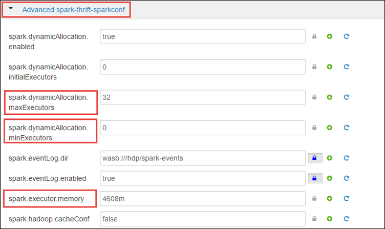

<properties 
    pageTitle="使用資源管理員資源配置給 Apache 火花中叢集 HDInsight |Microsoft Azure" 
    description="瞭解如何使用較佳的效能上 HDInsight 火花叢集資源管理員。" 
    services="hdinsight" 
    documentationCenter="" 
    authors="nitinme" 
    manager="jhubbard" 
    editor="cgronlun"
    tags="azure-portal"/>

<tags 
    ms.service="hdinsight" 
    ms.workload="big-data" 
    ms.tgt_pltfrm="na" 
    ms.devlang="na" 
    ms.topic="article" 
    ms.date="08/25/2016" 
    ms.author="nitinme"/>

# 管理 Apache 火花叢集 HDInsight linux 的資源

在本文中，您將學習如何存取 Ambari UI，YARN UI 如介面與火花歷程記錄伺服器火花叢集。 您也會學習如何調整叢集設定的最佳效能。

**先決條件︰**

您必須具備下列項目︰

- Azure 的訂閱。 請參閱[取得 Azure 免費試用版](https://azure.microsoft.com/documentation/videos/get-azure-free-trial-for-testing-hadoop-in-hdinsight/)。
- HDInsight linux Apache 火花叢集。 如需相關指示，請參閱[建立 Apache 火花叢集中 Azure HDInsight](hdinsight-apache-spark-jupyter-spark-sql.md)。

## 我要如何啟動 Ambari Web UI？

1. 從[Azure 入口網站](https://portal.azure.com/)，從 startboard，按一下 [火花叢集] 方塊 （如果您釘選它 startboard）。 您也可以導覽下**瀏覽所有**叢集 > **HDInsight 叢集**。 
 
2. 從火花叢集刀中，按一下 [**儀表板**]。 出現提示時，輸入火花叢集管理員認證。

    

3. 此應該啟動 Ambari Web UI，如下所示。

       

## 我要如何啟動火花歷程記錄伺服器？

1. 從[Azure 入口網站](https://portal.azure.com/)，從 startboard，按一下 [火花叢集] 方塊 （如果您釘選它 startboard）。

2. 從叢集防禦，以**快速連結**，按一下 [**叢集儀表板**。 在 [**叢集儀表板**刀中，按一下**火花歷程記錄伺服器**。

    

    出現提示時，輸入火花叢集管理員認證。

## 我要如何啟動 Yarn UI？

您可以使用 YARN UI 監控正在執行火花叢集的應用程式。 

1. 從叢集刀中，按一下 [**叢集儀表板**，，然後按一下**YARN**。

    

    >[AZURE.TIP] 或者，您也可以啟動 Ambari ui 在 YARN ui。 若要啟動 Ambari UI，從叢集刀**叢集儀表板**，，然後按一下**HDInsight 叢集儀表板**。 從 Ambari UI，按一下**YARN**、 按一下 [**快速連結**、 按一下 [作用中的資源管理員]，然後按一下**ResourceManager UI**。

## 什麼是最佳叢集設定執行火花應用程式？

可根據應用程式的需求火花設定的三個主要參數`spark.executor.instances`， `spark.executor.cores`，及`spark.executor.memory`。 執行程式是火花應用程式的啟動程序。 它在工作者節點上執行，並負責執行應用程式的任務。 預設會數執行程式和每個叢集執行程式大小會根據工作者節點和工作者節點大小的數字計算。 這些儲存在`spark-defaults.conf`叢集標頭節點。 

三個設定參數可以設定叢集層級 （適用於叢集執行的所有應用程式），或每個個別應用程式，也可以指定。

### 變更使用 Ambari UI 的參數

1. 從 Ambari UI 按一下**火花**、 按一下 [**設定**，然後再展開**自訂火花預設值**。

    

2. 有 4 火花叢集同時執行應用程式是預設值。 您可以變更使用者介面，這些值如下所示。

    

3. 按一下 [**儲存**] 儲存設定變更。 在頁面頂端，系統會提示您重新啟動所有受影響的服務。 按一下 [**重新啟動**]。

    

### 變更執行 Jupyter 筆記本中的應用程式的參數

執行 Jupyter 筆記本中的應用程式，您可以使用`%%configure`個神奇若要變更設定。 理想的情況下，您必須變更這類應用程式，才能執行您的第一個程式碼儲存格的開頭。 如此一來，可確保設定會套用到晚總工作階段，取得建立時。 如果您想要變更在稍後的階段應用程式中的設定，您必須使用`-f`參數。 不過，以執行讓應用程式中的所有進度，將都會遺失。

下列程式碼片段示範如何變更 Jupyter 中執行的應用程式的設定。

    %%configure 
    {"executorMemory": "3072M", "executorCores": 4, “numExecutors”:10}

設定參數必須為 JSON 字串傳入和必須在下一行之後的優勢，如下所示的範例資料行。 

### 提交使用應用程式的參數火花提交的變更

下列命令是如何變更設定參數批次應用程式使用已送出的範例`spark-submit`。

    spark-submit --class <the application class to execute> --executor-memory 3072M --executor-cores 4 –-num-executors 10 <location of application jar file> <application parameters>

### 變更應用程式使用捲曲送出的參數

下列命令是如何變更設定參數使用的捲曲送出批次應用程式的範例。

    curl -k -v -H 'Content-Type: application/json' -X POST -d '{"file":"<location of application jar file>", "className":"<the application class to execute>", "args":[<application parameters>], "numExecutors":10, "executorMemory":"2G", "executorCores":5' localhost:8998/batches

### 我要如何變更火花 Thrift 伺服器上的下列參數？

火花 Thrift 伺服器火花叢集 JDBC/ODBC 存取和使用服務火花 SQL 查詢。 工具，例如 Power BI，Tableau 等。 使用 ODBC 通訊協定通訊與火花 Thrift 伺服器執行火花 SQL 查詢以火花應用程式。 建立火花叢集時，會啟動火花 Thrift 伺服器的兩個執行個體，另一個在每個標頭的節點。 每個火花 Thrift 伺服器是顯示為火花應用程式在 YARN ui 上。 

火花 Thrift 伺服器使用火花動態執行程式配置，因此`spark.executor.instances`不會使用。 不過，火花 Thrift Server 會使用`spark.dynamicAllocation.minExecutors`和`spark.dynamicAllocation.maxExecutors`指定執行程式計數。 設定參數`spark.executor.cores`和`spark.executor.memory`用於修改執行程式大小。 您可以變更下列參數，如下所示。

* 展開 [**進階的火花-thrift-sparkconf**類別更新參數`spark.dynamicAllocation.minExecutors`， `spark.dynamicAllocation.maxExecutors`，及`spark.executor.memory`。

     

* 展開 [**自訂火花 thrift sparkconf**類別更新參數`spark.executor.cores`。

    

### 我要如何變更驅動程式伺服器的記憶體火花 Thrift？

設定為標頭節點 RAM 大小的 25%，提供標頭節點的總 RAM 大小大於 14 GB 火花 Thrift 伺服器驅動程式記憶體。 您可以使用 Ambari UI 變更驅動程式記憶體設定，如下所示。

* 從 Ambari UI 按一下**火花****設定**、 展開**進階火花信封**]，然後按一下然後提供**spark_thrift_cmd_opts**的值。

    

## 我不要使用 BI 火花叢集。 如何返回將的資源？

我們使用火花動態配置，因為 thrift 伺服器所使用的唯一資源是兩個應用程式母片的資源。 若要釋放這些資源必須停止叢集上執行的 Thrift 伺服器服務。

1. 從 Ambari UI，從左側的窗格中，按一下 [**火花**]。

2. 在下一個頁面上，按一下 [**火花 Thrift 伺服器**]。

    

3. 您應該會看到兩個 headnodes 火花 Thrift 伺服器執行。 按一下其中一個 headnodes。

    

4. [下一步] 頁面會列出該 headnode 上執行的所有服務。 從清單按一下火花 Thrift 伺服器] 旁的下拉式按鈕，然後再按一下 [**停止**]。

    

5. 重複上其他 headnode 以及這些步驟。

## 我 Jupyter 筆記本並未執行如預期般。 如何重新啟動服務？

1. 啟動 Ambari Web UI 如上所示。 從左側的導覽窗格中，按一下**Jupyter**，按一下**服務動作**]，然後按一下 [**全部重新啟動**。 這會從所有 headnodes 都開始 Jupyter 服務。

    

    

## 另請參閱

* [概觀︰ Apache 火花上 Azure HDInsight](hdinsight-apache-spark-overview.md)

### 案例

* [使用 BI 火花︰ 執行火花 HDInsight 中使用的 BI 工具的互動式的資料分析](hdinsight-apache-spark-use-bi-tools.md)

* [與電腦學習火花︰ 使用火花 HDInsight 分析建置溫度使用 HVAC 資料中](hdinsight-apache-spark-ipython-notebook-machine-learning.md)

* [與電腦學習火花︰ 使用火花 HDInsight 預測食物檢查結果中](hdinsight-apache-spark-machine-learning-mllib-ipython.md)

* [火花串流︰ 使用火花 HDInsight 建置即時串流應用程式中](hdinsight-apache-spark-eventhub-streaming.md)

* [HDInsight 中使用火花網站記錄分析](hdinsight-apache-spark-custom-library-website-log-analysis.md)

### 建立和執行應用程式

* [建立使用 Scala 獨立應用程式](hdinsight-apache-spark-create-standalone-application.md)

* [在使用晚總火花叢集從遠端執行工作](hdinsight-apache-spark-livy-rest-interface.md)

### 工具和延伸模組

* [使用 HDInsight 工具增益集，如 IntelliJ 瞭解建立及提交火花 Scala 應用程式](hdinsight-apache-spark-intellij-tool-plugin.md)

* [使用 HDInsight 工具增益集，如 IntelliJ 瞭解遠端偵錯火花應用程式](hdinsight-apache-spark-intellij-tool-plugin-debug-jobs-remotely.md)

* [使用上 HDInsight 火花叢集運貨用飛艇筆記本](hdinsight-apache-spark-use-zeppelin-notebook.md)

* [核心適用於 HDInsight 火花叢集 Jupyter 筆記本](hdinsight-apache-spark-jupyter-notebook-kernels.md)

* [使用外部封包 Jupyter 筆記本](hdinsight-apache-spark-jupyter-notebook-use-external-packages.md)

* [在 [您的電腦上安裝 Jupyter 並連線到 HDInsight 火花叢集](hdinsight-apache-spark-jupyter-notebook-install-locally.md)

### 管理資源

* [追蹤和偵錯 Apache 火花中叢集 HDInsight 上執行的工作](hdinsight-apache-spark-job-debugging.md)

[hdinsight-versions]: hdinsight-component-versioning.md
[hdinsight-upload-data]: hdinsight-upload-data.md
[hdinsight-storage]: hdinsight-hadoop-use-blob-storage.md

[azure-purchase-options]: http://azure.microsoft.com/pricing/purchase-options/
[azure-member-offers]: http://azure.microsoft.com/pricing/member-offers/
[azure-free-trial]: http://azure.microsoft.com/pricing/free-trial/
[azure-management-portal]: https://manage.windowsazure.com/
[azure-create-storageaccount]: storage-create-storage-account.md 
