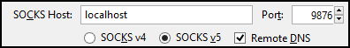
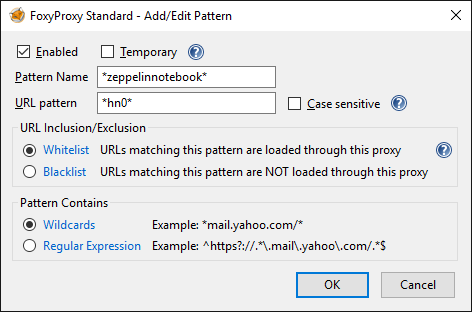
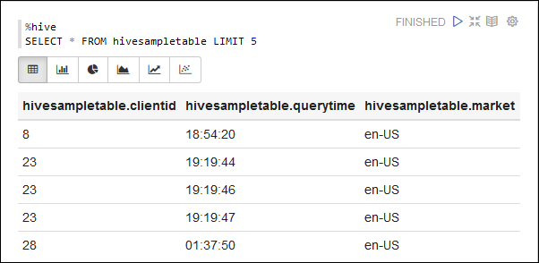

<properties 
    pageTitle="HDInsight Linux 上安裝 Apache 火花叢集運貨用飛艇筆記本 |Microsoft Azure" 
    description="如何安裝和使用 HDInsight linux 火花叢集運貨用飛艇筆記本的逐步指示。" 
    services="hdinsight" 
    documentationCenter="" 
    authors="nitinme" 
    manager="jhubbard" 
    editor="cgronlun"/>

<tags 
    ms.service="hdinsight" 
    ms.workload="big-data" 
    ms.tgt_pltfrm="na" 
    ms.devlang="na" 
    ms.topic="article" 
    ms.date="10/28/2016" 
    ms.author="nitinme"/>

# HDInsight Linux 上安裝 Apache 火花叢集運貨用飛艇筆記本

瞭解如何安裝運貨用飛艇筆記本 Apache 火花叢集上以及如何使用運貨用飛艇筆記本執行火花工作。

> [AZURE.IMPORTANT] 運貨用飛艇筆記本，可立即預設火花叢集。 您不需要明確安裝火花叢集上再。 如需詳細資訊，請參閱[使用運貨用飛艇的筆記本，與 Apache 火花叢集 HDInsight Linux 上](hdinsight-apache-spark-zeppelin-notebook.md)。 

**先決條件︰**

* 本教學課程之前，您必須有 Azure 訂閱。 請參閱[取得 Azure 免費試用版](https://azure.microsoft.com/documentation/videos/get-azure-free-trial-for-testing-hadoop-in-hdinsight/)。
* Apache 火花叢集。 如需相關指示，請參閱[建立 Apache 火花叢集中 Azure HDInsight](hdinsight-apache-spark-jupyter-spark-sql.md)。
* SSH 用戶端。 Linux 和 Unix 散佈或 Macintosh OS X，`ssh`命令提供的作業系統。 我們建議您的 Windows [PuTTY](http://www.chiark.greenend.org.uk/~sgtatham/putty/download.html)

    > [AZURE.NOTE] 如果您想要使用的 SSH 用戶端以外`ssh`或 PuTTY，請參閱如何建立 SSH 通道用戶端的說明文件。

* 網頁瀏覽器可使用 SOCKS proxy 設定

* __（選用）__︰ 外掛程式，例如[FoxyProxy](http://getfoxyproxy.org/,) ，可以套用規則的只路由透過通道特定的要求。

    > [AZURE.WARNING] 例如 FoxyProxy 外掛程式，不透過瀏覽器所做的所有要求可能都經由通道。 這可能會導致網頁瀏覽器中載入速度變慢。

## 安裝運貨用飛艇火花叢集上

您可以使用指令碼動作火花叢集上安裝運貨用飛艇。 指令碼動作會使用自訂指令碼無法使用預設的叢集上安裝元件。 您可以藉由使用 HDInsight.NET SDK，或使用 PowerShell 的 Azure，從 Azure] 入口網站，安裝運貨用飛艇使用自訂指令碼。 安裝運貨用飛艇一部分叢集建立或執行叢集之後，您可以使用指令碼。 以下各節中的連結提供指示如何執行此作業。 

### 使用 [Azure 入口網站

如何使用 Azure 入口網站執行指令碼動作安裝運貨用飛艇的指示，請參閱[自訂 HDInsight 叢集使用指令碼動作](hdinsight-hadoop-customize-cluster-linux.md#use-a-script-action-from-the-azure-portal)。 您必須進行一些變更文件中的相關指示。

* 您必須安裝運貨用飛艇使用指令碼。 安裝運貨用飛艇火花叢集上 HDInsight 上的自訂指令碼會提供下列連結︰
    * 火花 1.6.0 叢集-`https://hdiconfigactions.blob.core.windows.net/linuxincubatorzeppelinv01/install-zeppelin-spark160-v01.sh`
    * 火花 1.5.2 叢集-`https://hdiconfigactions.blob.core.windows.net/linuxincubatorzeppelinv01/install-zeppelin-spark151-v01.sh`

* 您必須執行指令碼動作僅在 headnode。

* 指令碼不需要任何參數。 

### 使用 HDInsight.NET SDK

如何使用 HDInsight.NET SDK 執行指令碼動作安裝運貨用飛艇的指示，請參閱[自訂 HDInsight 叢集使用指令碼動作](hdinsight-hadoop-customize-cluster-linux.md#use-a-script-action-from-the-hdinsight-net-sdk)。 您必須進行一些變更文件中的相關指示。

* 您必須安裝運貨用飛艇使用指令碼。 安裝運貨用飛艇火花叢集上 HDInsight 上的自訂指令碼會提供下列連結︰
    * 火花 1.6.0 叢集-`https://hdiconfigactions.blob.core.windows.net/linuxincubatorzeppelinv01/install-zeppelin-spark160-v01.sh`
    * 火花 1.5.2 叢集-`https://hdiconfigactions.blob.core.windows.net/linuxincubatorzeppelinv01/install-zeppelin-spark151-v01.sh`

* 指令碼不需要任何參數。 

* 您正在建立叢集類型設火花。

### 使用 PowerShell 的 Azure

建立火花叢集 HDInsight linux 運貨用飛艇安裝與使用下列 PowerShell 程式碼片段。 根據您有火花叢集的版本，您必須更新下列包含連結至對應的自訂指令碼 PowerShell 程式碼片段。 

* 火花 1.6.0 叢集-`https://hdiconfigactions.blob.core.windows.net/linuxincubatorzeppelinv01/install-zeppelin-spark160-v01.sh`
* 火花 1.5.2 叢集-`https://hdiconfigactions.blob.core.windows.net/linuxincubatorzeppelinv01/install-zeppelin-spark151-v01.sh`

[AZURE.INCLUDE [upgrade-powershell](../../includes/hdinsight-use-latest-powershell.md)]

    Login-AzureRMAccount
    
    # PROVIDE VALUES FOR THE VARIABLES
    $clusterAdminUsername="admin"
    $clusterAdminPassword="<<password>>"
    $clusterSshUsername="adminssh"
    $clusterSshPassword="<<password>>"
    $clusterName="<<clustername>>"
    $clusterContainerName=$clusterName
    $resourceGroupName="<<resourceGroupName>>"
    $location="<<region>>"
    $storage1Name="<<storagename>>"
    $storage1Key="<<storagekey>>"
    $subscriptionId="<<subscriptionId>>"
    
    Select-AzureRmSubscription -SubscriptionId $subscriptionId
    
    $passwordAsSecureString=ConvertTo-SecureString $clusterAdminPassword -AsPlainText -Force
    $clusterCredential=New-Object System.Management.Automation.PSCredential ($clusterAdminUsername, $passwordAsSecureString)
    $passwordAsSecureString=ConvertTo-SecureString $clusterSshPassword -AsPlainText -Force
    $clusterSshCredential=New-Object System.Management.Automation.PSCredential ($clusterSshUsername, $passwordAsSecureString)
    
    $azureHDInsightConfigs= New-AzureRmHDInsightClusterConfig -ClusterType Spark
    $azureHDInsightConfigs.DefaultStorageAccountKey = $storage1Key
    $azureHDInsightConfigs.DefaultStorageAccountName = "$storage1Name.blob.core.windows.net"
    
    Add-AzureRMHDInsightScriptAction -Config $azureHDInsightConfigs -Name "Install Zeppelin" -NodeType HeadNode -Parameters "void" -Uri "https://hdiconfigactions.blob.core.windows.net/linuxincubatorzeppelinv01/install-zeppelin-spark151-v01.sh"
    
    New-AzureRMHDInsightCluster -Config $azureHDInsightConfigs -OSType Linux -HeadNodeSize "Standard_D12" -WorkerNodeSize "Standard_D12" -ClusterSizeInNodes 2 -Location $location -ResourceGroupName $resourceGroupName -ClusterName $clusterName -HttpCredential $clusterCredential -DefaultStorageContainer $clusterContainerName -SshCredential $clusterSshCredential -Version "3.3"
 
## 設定 SSH 通道存取運貨用飛艇筆記本

您會使用 SSH 通道存取 HDInsight linux 火花叢集上執行的運貨用飛艇筆記本。 下列步驟說明如何建立使用 ssh 命令列 (Linux) 和 PuTTY (Windows) SSH 通道。

### 建立使用 SSH] 命令 (Linux) 通道

使用下列命令以建立 SSH 通道使用`ssh`] 命令。 __使用者名稱__與 SSH 使用者 HDInsight 叢集，並__CLUSTERNAME__取代 HDInsight 叢集的名稱

    ssh -C2qTnNf -D 9876 USERNAME@CLUSTERNAME-ssh.azurehdinsight.net

這樣會建立路由流量至本機的連接埠 9876 叢集，透過 SSH 的連線。 選項包括︰

* **D 9876** -會將透過通道流量路由傳送的本機連接埠。

* **C** -壓縮所有資料，因為 web 流量大部分的文字。

* **2** -強制 SSH 嘗試通訊協定版本只 2。

* **問:** -安靜模式。

* **T** ，停用虛擬 tty 配置，因為我們只是要轉寄的連接埠。

* **n** -防止讀取 STDIN，因為我們只是要轉寄的連接埠。

* **N** -不會執行遠端命令，因為我們只是要轉寄的連接埠。

* **f** ，在背景中執行。

如果您使用 SSH 金鑰設定叢集，您可能需要使用`-i`參數指定 SSH 私密金鑰的路徑。

後命令完成，便會傳送到本機電腦上的連接埠 9876 的流量會透過路由安全通訊端層 (SSL) 叢集向節點，並顯示為那里來自。

### 建立使用 PuTTY (Windows) 通道

您可以使用下列步驟來建立使用 PuTTY SSH 通道。

1. 開啟 PuTTY，並輸入您的連線資訊。 如果您不熟悉 PuTTY，請參閱[使用 SSH 與 Linux 為基礎的 Hadoop HDInsight 從 Windows 上](hdinsight-hadoop-linux-use-ssh-windows.md)關於如何使用 HDInsight 資訊。

2. 在 [左邊] 對話方塊的 [**類別**] 區段中，展開**連線**、 展開**SSH**，，然後選取**通道**。

3. **控制 SSH 連接埠轉送選項**表單上提供下列資訊︰

    * **來源連接埠**-您想要轉寄的用戶端的連接埠。 例如， **9876**。

    * **目的地**-SSH Linux 型 HDInsight 叢集位址。 例如， **mycluster ssh.azurehdinsight.net**。

    * **動態**-可讓路由動態 SOCKS proxy。

    

4. 按一下 [**新增**]，若要新增設定]，，然後按一下 [**開啟**] 以開啟 SSH 的連線。

5. 出現提示時，登入伺服器。 這會建立 SSH 工作階段，並啟用通道。

### 使用瀏覽器通道

> [AZURE.NOTE] 本節中的步驟會使用 FireFox 瀏覽器中，因為這是免費 Linux、 Unix、 Macintosh OS X 和 Windows 系統。 Google Chrome、 Microsoft Edge 或 Apple Safari 等其他現代瀏覽器應合作。不過，在一些步驟中使用 FoxyProxy 外掛程式可能無法使用所有的瀏覽器。

1. 設定用於**localhost:9876** **SOCKS v5** proxy 瀏覽器。 以下是 Firefox 設定的外觀。 如果您使用不同的連接埠比 9876，變更所用的連接埠︰

    

    > [AZURE.NOTE] 選取 [**遠端 DNS** ，會使用 HDInsight 叢集解決網域名稱系統 (DNS) 要求。 如果這是未選取，就會在本機解析 DNS。

2. 驗證的流量會路由透過通道 vising 例如[http://www.whatismyip.com/](http://www.whatismyip.com/)網站啟用及停用在 firefox 是 proxy 設定。 設定已啟用，會到機器 Microsoft Azure 資料中心的 IP 位址。

### 在瀏覽器副檔名

時設定瀏覽器，使用此通道的運作方式，您通常不想透過通道路由所有流量。 在瀏覽器副檔名，例如[FoxyProxy](http://getfoxyproxy.org/)支援模式比對 URL 要求 (FoxyProxy 標準或加上只)，以便只要求特定的 Url 會透過通道傳送。

如果您有安裝 FoxyProxy 標準，請將它設定為只將轉寄流量 HDInsight 通道透過使用下列步驟。

1. 在瀏覽器中開啟 FoxyProxy 副檔名。 例如，在 firefox 是指選取 FoxyProxy 圖示旁的 [位址] 欄位。

    

2. 選取 [**新增新的 Proxy**、 選取 [**一般**] 索引標籤，然後輸入**HDInsightProxy**proxy 名稱。

    

3. 選取 [ **Proxy 詳細資料**] 索引標籤，並填入下列欄位︰

    * **主機] 或 [IP 位址**-這是本機，因為我們使用 SSH 通道的本機電腦上。

    * **連接埠**-這是您用於 SSH 通道的連接埠。

    * **SOCKS proxy** -選取此選項以啟用瀏覽器，通道作為 proxy。

    * **SOCKS v5** -選取此選項以 proxy 設定的必要的版本。

    

4. 選取 [ **URL 圖樣**] 索引標籤，然後選取 [**新增 [開新圖樣**。 使用下列定義圖樣]，然後按一下**[確定]**:

    * **圖樣名稱** - **zeppelinnotebook** -這是圖樣只易記的名稱。

    * **URL 模式** - **\*hn0** * -定義符合裝載運貨用飛艇筆記本的結束點的內部完整的網域名稱的圖樣。因為運貨用飛艇筆記本只上提供的叢集，headnode0 而端點通常是`http://hn0-<string>.internal.cloudapp.net`，使用模式* *hn0** 可確保要求會重新導向至運貨用飛艇端點。

        

4. 按一下**[確定]**以新增 proxy 並關閉**Proxy 設定**]。

5. 在 FoxyProxy] 對話方塊的頂端，**選取模式**變更為**使用 proxy 根據他們的預先定義的圖樣與優先順序**，，然後再按一下 [**關閉**]。

    

執行這些步驟之後，會透過 SSL 通道路由只包含字串__hn0__ Url 的要求。 

## 存取運貨用飛艇筆記本

SSH 通道設定之後，您可以使用下列步驟，可以遵循下列步驟，存取運貨用飛艇火花叢集上的筆記本。 在此區段中，您會看到 %sql 和 %登錄區陳述式的執行方式。

1. 從網頁瀏覽器中，開啟下列結束點︰

        http://hn0-myspar:9995

    * **hn0**表示 headnode0
    * **myspar**是火花叢集名稱的前六個字母。
    * **9995**是運貨用飛艇筆記本的可存取的位置的連接埠。

2. 建立新的筆記本。 從 [頁首] 窗格中，按一下**筆記本**]，然後按一下 [**建立新的筆記**。

    

    在相同頁面上，在**筆記本**標題下，您應該會看到新的筆記本名稱**記事 XXXXXXXXX**開始著手。 按一下 [新增筆記本]。

3. 在新筆記本的網頁上，按一下標題，然後如果您想要變更筆記本的名稱。 按下 ENTER 即可儲存該名稱變更。 此外，請確定筆記本頁首顯示右上角中的 [**已連線**狀態。

    

### 執行 SQL 陳述式

4. 載入暫存資料表中的範例資料。 當您建立火花叢集 HDInsight 中時，範例資料檔案， **hvac.csv**，會複製到**\HdiSamples\SensorSampleData\hvac**之相關聯的儲存帳戶中。

    在空白段落中所建立的預設新的筆記本中，貼上下列的程式碼片段。

        // Create an RDD using the default Spark context, sc
        val hvacText = sc.textFile("wasbs:///HdiSamples/HdiSamples/SensorSampleData/hvac/HVAC.csv")
        
        // Define a schema
        case class Hvac(date: String, time: String, targettemp: Integer, actualtemp: Integer, buildingID: String)
        
        // Map the values in the .csv file to the schema
        val hvac = hvacText.map(s => s.split(",")).filter(s => s(0) != "Date").map(
            s => Hvac(s(0), 
                    s(1),
                    s(2).toInt,
                    s(3).toInt,
                    s(6)
            )
        ).toDF()
        
        // Register as a temporary table called "hvac"
        hvac.registerTempTable("hvac")
        
    按下**SHIFT + ENTER** ，或按一下 [執行程式碼片段段落的 [**播放**] 按鈕。 段落向右角狀態應該就緒，等待執行以完成的進度。 輸出會顯示底部的同一個段落中。 螢幕擷取畫面看起來如下所示︰

    

    您也可以提供標題至每個段落。 從右上角，按一下 [**設定**] 圖示，然後按一下**顯示標題**。

5. 您現在可以執行火花 SQL 陳述式**hvac**表格。 貼上下列查詢，在新的段落中。 查詢會擷取建置識別碼] 和 [目標與實際的溫度的每個建置在指定日期之間的差異。 按下**SHIFT + enter 鍵**。

        %sql
        select buildingID, (targettemp - actualtemp) as temp_diff, date 
        from hvac
        where date = "6/1/13" 

    **%Sql**陳述式的開頭會告訴您要使用火花 SQL 手語翻譯的筆記本。 您可以自行定義的解譯器筆記本標頭中的 [**手語翻譯**] 索引標籤。

    以下螢幕擷取畫面顯示的輸出。

    

     按一下 [顯示選項 （矩形中醒目提示） 來切換不同的方式呈現的輸出相同。 按一下 [**設定**]，以選擇輸出中哪些 consitutes 索引鍵和值。 螢幕擷取畫面上方會使用**buildingID**鍵和**temp_diff**平均值做為的值。

    
6. 您也可以執行的查詢中使用變數火花 SQL 陳述式。 下一步的程式碼片段會顯示如何在您想要查詢的可能值的查詢定義一個變數， **Temp**。 當您第一次執行查詢時，下拉式清單會自動填入變數您指定的值。

        %sql
        select buildingID, date, targettemp, (targettemp - actualtemp) as temp_diff
        from hvac
        where targettemp > "${Temp = 65,65|75|85}" 

    在新的段落中貼上此程式碼片段，然後按**SHIFT + enter 鍵**。 以下螢幕擷取畫面顯示的輸出。

    

    後續的查詢，您可以從下拉式清單中選取新的值，並再次執行查詢。 按一下 [**設定**]，以選擇輸出中哪些 consitutes 索引鍵和值。 螢幕擷取畫面上方會使用**buildingID**索引鍵，做為的值， **temp_diff**和**targettemp**為群組的平均值。

7. 重新啟動火花 SQL 解譯結束應用程式。 按一下 [**手語翻譯**] 索引標籤上方，以及火花解譯，按一下 [**重新啟動**。

    

### 執行登錄區陳述式

1. 從運貨用飛艇筆記本中，按一下 [**手語翻譯**] 按鈕。

    

2. **登錄區**解譯中，按一下 [**編輯**]。

    

    更新下列屬性。

    * 設定**default.password**您指定的密碼管理員使用者建立 HDInsight 火花叢集時。
    * 若要設定**default.url** `jdbc:hive2://<spark_cluster_name>.azurehdinsight.net:443/default;ssl=true?hive.server2.transport.mode=http;hive.server2.thrift.http.path=/hive2`。 取代**\<spark_cluster_name >**火花叢集的名稱。
    * 設定**default.user**您指定建立叢集時的管理員使用者的名稱。 例如，*管理員*。

3. 按一下 [**儲存**]，然後重新啟動登錄區手語翻譯提示，請按一下**[確定**]。

4. 建立新的筆記本，並執行下列陳述式清單叢集上所有的登錄區資料表。

        %hive
        SHOW TABLES

    根據預設，HDInsight 叢集會有呼叫**hivesampletable** ，因此您應該會看到下列輸出範例資料表。

    

5. 執行下列陳述式清單的資料表中的記錄。

        %hive
        SELECT * FROM hivesampletable LIMIT 5

    您應該如下所示的輸出。

    

## 另請參閱

* [概觀︰ Apache 火花上 Azure HDInsight](hdinsight-apache-spark-overview.md)

### 案例

* [使用 BI 火花︰ 執行火花 HDInsight 中使用的 BI 工具的互動式的資料分析](hdinsight-apache-spark-use-bi-tools.md)

* [與電腦學習火花︰ 使用火花 HDInsight 分析建置溫度使用 HVAC 資料中](hdinsight-apache-spark-ipython-notebook-machine-learning.md)

* [與電腦學習火花︰ 使用火花 HDInsight 預測食物檢查結果中](hdinsight-apache-spark-machine-learning-mllib-ipython.md)

* [火花串流︰ 使用火花 HDInsight 建置即時串流應用程式中](hdinsight-apache-spark-eventhub-streaming.md)

* [HDInsight 中使用火花網站記錄分析](hdinsight-apache-spark-custom-library-website-log-analysis.md)

### 建立和執行應用程式

* [建立使用 Scala 獨立應用程式](hdinsight-apache-spark-create-standalone-application.md)

* [在使用晚總火花叢集從遠端執行工作](hdinsight-apache-spark-livy-rest-interface.md)

### 工具和延伸模組

* [使用 HDInsight 工具增益集，如 IntelliJ 瞭解建立及提交火花 Scala 應用程式](hdinsight-apache-spark-intellij-tool-plugin.md)

* [使用 HDInsight 工具增益集，如 IntelliJ 瞭解遠端偵錯火花應用程式](hdinsight-apache-spark-intellij-tool-plugin-debug-jobs-remotely.md)

* [核心適用於 HDInsight 火花叢集 Jupyter 筆記本](hdinsight-apache-spark-jupyter-notebook-kernels.md)

* [使用外部封包 Jupyter 筆記本](hdinsight-apache-spark-jupyter-notebook-use-external-packages.md)

* [在 [您的電腦上安裝 Jupyter 並連線到 HDInsight 火花叢集](hdinsight-apache-spark-jupyter-notebook-install-locally.md)

### 管理資源

* [管理資源 Apache 火花叢集中 Azure HDInsight](hdinsight-apache-spark-resource-manager.md)

* [追蹤和偵錯 Apache 火花中叢集 HDInsight 上執行的工作](hdinsight-apache-spark-job-debugging.md)

[hdinsight-versions]: hdinsight-component-versioning.md
[hdinsight-upload-data]: hdinsight-upload-data.md
[hdinsight-storage]: hdinsight-hadoop-use-blob-storage.md

[azure-purchase-options]: http://azure.microsoft.com/pricing/purchase-options/
[azure-member-offers]: http://azure.microsoft.com/pricing/member-offers/
[azure-free-trial]: http://azure.microsoft.com/pricing/free-trial/
[azure-management-portal]: https://manage.windowsazure.com/
[azure-create-storageaccount]: storage-create-storage-account.md 

