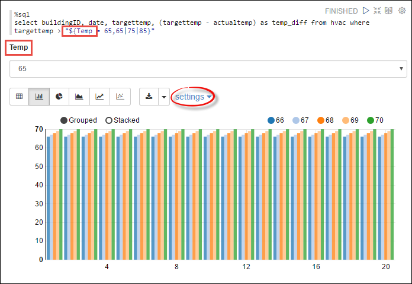
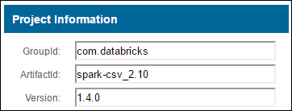

<properties 
    pageTitle="使用 HDInsight linux 火花叢集運貨用飛艇筆記本 |Microsoft Azure" 
    description="如何使用 HDInsight linux 火花叢集運貨用飛艇筆記本的逐步指示。" 
    services="hdinsight" 
    documentationCenter="" 
    authors="nitinme" 
    manager="jhubbard" 
    editor="cgronlun"/>

<tags 
    ms.service="hdinsight" 
    ms.workload="big-data" 
    ms.tgt_pltfrm="na" 
    ms.devlang="na" 
    ms.topic="article" 
    ms.date="10/05/2016" 
    ms.author="nitinme"/>

# 使用 HDInsight linux Apache 火花叢集運貨用飛艇筆記本

HDInsight 火花叢集包含運貨用飛艇筆記本，您可以用來執行火花工作。 本文中，您可以瞭解如何使用運貨用飛艇筆記本 HDInsight 叢集上。

**先決條件︰**

* Azure 的訂閱。 請參閱[取得 Azure 免費試用版](https://azure.microsoft.com/documentation/videos/get-azure-free-trial-for-testing-hadoop-in-hdinsight/)。

* Apache 火花叢集。 如需相關指示，請參閱[建立 Apache 火花叢集中 Azure HDInsight](hdinsight-apache-spark-jupyter-spark-sql.md)。

## 啟動運貨用飛艇筆記本

1. 從火花叢集刀中，按一下 [**叢集儀表板**，，然後按一下**運貨用飛艇筆記本**。 如果出現提示，請輸入叢集管理員認證。

    > [AZURE.NOTE] 您也可能會在瀏覽器中開啟下列 URL 達到叢集運貨用飛艇筆記本。 取代您叢集名稱__CLUSTERNAME__ :
    >
    > `https://CLUSTERNAME.azurehdinsight.net/zeppelin`

2. 建立新的筆記本。 從 [頁首] 窗格中，按一下**筆記本**]，然後按一下 [**建立新的筆記**。

    

    輸入筆記本的名稱，然後再按一下 [**建立記事**。

3. 此外，請確定筆記本標題會顯示為連線的狀態。 在右上角的綠色圓點以表示它。

    

4. 載入暫存資料表中的範例資料。 當您建立火花叢集 HDInsight 中時，範例資料檔案， **hvac.csv**，會複製到**\HdiSamples\SensorSampleData\hvac**之相關聯的儲存帳戶中。

    在空白段落中所建立的預設新的筆記本中，貼上下列的程式碼片段。

        %livy.spark
        //The above magic instructs Zeppelin to use the Livy Scala interpreter

        // Create an RDD using the default Spark context, sc
        val hvacText = sc.textFile("wasbs:///HdiSamples/HdiSamples/SensorSampleData/hvac/HVAC.csv")
        
        // Define a schema
        case class Hvac(date: String, time: String, targettemp: Integer, actualtemp: Integer, buildingID: String)
        
        // Map the values in the .csv file to the schema
        val hvac = hvacText.map(s => s.split(",")).filter(s => s(0) != "Date").map(
            s => Hvac(s(0), 
                    s(1),
                    s(2).toInt,
                    s(3).toInt,
                    s(6)
            )
        ).toDF()
        
        // Register as a temporary table called "hvac"
        hvac.registerTempTable("hvac")
        
    按下**SHIFT + ENTER** ，或按一下 [執行程式碼片段段落的 [**播放**] 按鈕。 段落向右角狀態應該就緒，等待執行以完成的進度。 輸出會顯示底部的同一個段落中。 螢幕擷取畫面看起來如下所示︰

    

    您也可以提供標題至每個段落。 從右上角，按一下 [**設定**] 圖示，然後按一下**顯示標題**。

5. 您現在可以執行火花 SQL 陳述式**hvac**表格。 貼上下列查詢，在新的段落中。 查詢會擷取建置識別碼] 和 [目標與實際的溫度的每個建置在指定日期之間的差異。 按下**SHIFT + enter 鍵**。

        %sql
        select buildingID, (targettemp - actualtemp) as temp_diff, date from hvac where date = "6/1/13" 

    **%Sql**陳述式的開頭會告訴您要使用晚總 Scala 手語翻譯的筆記本。

    以下螢幕擷取畫面顯示的輸出。

    

     按一下 [顯示選項 （矩形中醒目提示） 來切換不同的方式呈現的輸出相同。 按一下 [**設定**]，以選擇輸出中哪些 consitutes 索引鍵和值。 螢幕擷取畫面上方會使用**buildingID**鍵和**temp_diff**平均值做為的值。

    
6. 您也可以執行的查詢中使用變數火花 SQL 陳述式。 下一步的程式碼片段會顯示如何在您想要查詢的可能值的查詢定義一個變數， **Temp**。 當您第一次執行查詢時，下拉式清單會自動填入變數您指定的值。

        %sql
        select buildingID, date, targettemp, (targettemp - actualtemp) as temp_diff from hvac where targettemp > "${Temp = 65,65|75|85}" 

    在新的段落中貼上此程式碼片段，然後按**SHIFT + enter 鍵**。 以下螢幕擷取畫面顯示的輸出。

    

    後續的查詢，您可以從下拉式清單中選取新的值，並再次執行查詢。 按一下 [**設定**]，以選擇輸出中哪些 consitutes 索引鍵和值。 螢幕擷取畫面上方會使用**buildingID**索引鍵，做為的值， **temp_diff**和**targettemp**為群組的平均值。

7. 重新啟動晚總解譯結束應用程式。 若要這麼做，即可登入的使用者名稱的右上角，從開啟手語翻譯設定，再按一下 [**手語翻譯**。

    

2. 捲動到 [晚總手語翻譯設定，然後按一下 [**重新啟動**。

    

## 如何使用筆記本中使用外部套件？

您可以使用外部、 社群提供封包未包含的-現成叢集 Apache 火花叢集 HDInsight (Linux) 上設定運貨用飛艇筆記本。 您可以搜尋[Maven 存放庫](http://search.maven.org/)的可用套件的完整清單。 您也可以從其他來源取得可用套件的清單。 例如，社群提供封包的完整清單的[火花套件](http://spark-packages.org/)。

在本文中，您會看到如何使用 Jupyter 筆記本[火花 csv](http://search.maven.org/#artifactdetails%7Ccom.databricks%7Cspark-csv_2.10%7C1.4.0%7Cjar)套件。

1. 開啟 [解譯器設定。 從右上角，按一下記錄在 [使用者名稱，然後按一下**手語翻譯**。

    

2. 捲動到 [晚總手語翻譯設定，然後按一下 [**編輯**。

    

3. 新增新的金鑰，稱為**livy.spark.jars.packages**並設定其值的格式`group:id:version`。 因此，如果您想要使用[火花 csv](http://search.maven.org/#artifactdetails%7Ccom.databricks%7Cspark-csv_2.10%7C1.4.0%7Cjar)套件時，您必須設定的關鍵值`com.databricks:spark-csv_2.10:1.4.0`。

    

    按一下 [**儲存**]，然後重新啟動晚總手語翻譯。

4. **秘訣**︰ 如果您想要瞭解如何在送達機碼輸入上方，以下是如何。

    。 Maven 存放庫中找到套件。 在此教學課程中，我們使用[火花 csv](http://search.maven.org/#artifactdetails%7Ccom.databricks%7Cspark-csv_2.10%7C1.4.0%7Cjar)。
    
    b。 從存放庫，收集的**識別碼**、 **ArtifactId**及**版本**的值。

    

    c。 串連的三個值，並加上冒號 （**:**）。

        com.databricks:spark-csv_2.10:1.4.0

## 運貨用飛艇筆記本儲存在哪裡？

運貨用飛艇筆記本會儲存到叢集 headnodes。 因此，如果您刪除叢集，也會被刪除筆記本。 如果您想要保留您的筆記本，以供日後使用其他叢集上，您必須匯出之後您完成執行工作。 若要匯出的筆記本，請按一下 [**匯出**] 圖示下, 圖所示。

這將筆記本儲存為 JSON 檔案在您的下載位置。

## 晚總工作階段管理

當您執行運貨用飛艇筆記本中的第一個程式碼段落時，HDInsight 火花叢集中建立新的晚總工作階段。 這個工作階段是跨後續建立的所有運貨用飛艇筆記本共用。 如果基於某種原因工作階段是晚總刪除 （叢集重開機等），您無法從運貨用飛艇筆記本中執行的工作。

在這種情況下，您必須執行下列步驟，才能開始執行運貨用飛艇筆記本中的工作。 

1. 重新啟動晚總解譯運貨用飛艇筆記本中。 若要這麼做，即可登入的使用者名稱的右上角，從開啟解譯設定，再按一下 [**手語翻譯**。

    

2. 捲動到 [晚總手語翻譯設定，然後按一下 [**重新啟動**。

    

3. 從現有的運貨用飛艇筆記本中執行的程式碼儲存格。 這會建立新的晚總工作階段 HDInsight 叢集。

## 另請參閱

* [概觀︰ Apache 火花上 Azure HDInsight](hdinsight-apache-spark-overview.md)

### 案例

* [使用 BI 火花︰ 執行火花 HDInsight 中使用的 BI 工具的互動式的資料分析](hdinsight-apache-spark-use-bi-tools.md)

* [與電腦學習火花︰ 使用火花 HDInsight 分析建置溫度使用 HVAC 資料中](hdinsight-apache-spark-ipython-notebook-machine-learning.md)

* [與電腦學習火花︰ 使用火花 HDInsight 預測食物檢查結果中](hdinsight-apache-spark-machine-learning-mllib-ipython.md)

* [火花串流︰ 使用火花 HDInsight 建置即時串流應用程式中](hdinsight-apache-spark-eventhub-streaming.md)

* [HDInsight 中使用火花網站記錄分析](hdinsight-apache-spark-custom-library-website-log-analysis.md)

### 建立和執行應用程式

* [建立使用 Scala 獨立應用程式](hdinsight-apache-spark-create-standalone-application.md)

* [在使用晚總火花叢集從遠端執行工作](hdinsight-apache-spark-livy-rest-interface.md)

### 工具和延伸模組

* [使用 HDInsight 工具增益集，如 IntelliJ 瞭解建立及提交火花 Scala 應用程式](hdinsight-apache-spark-intellij-tool-plugin.md)

* [使用 HDInsight 工具增益集，如 IntelliJ 瞭解遠端偵錯火花應用程式](hdinsight-apache-spark-intellij-tool-plugin-debug-jobs-remotely.md)

* [核心適用於 HDInsight 火花叢集 Jupyter 筆記本](hdinsight-apache-spark-jupyter-notebook-kernels.md)

* [使用外部封包 Jupyter 筆記本](hdinsight-apache-spark-jupyter-notebook-use-external-packages.md)

* [在 [您的電腦上安裝 Jupyter 並連線到 HDInsight 火花叢集](hdinsight-apache-spark-jupyter-notebook-install-locally.md)

### 管理資源

* [管理資源 Apache 火花叢集中 Azure HDInsight](hdinsight-apache-spark-resource-manager.md)

* [追蹤和偵錯 Apache 火花中叢集 HDInsight 上執行的工作](hdinsight-apache-spark-job-debugging.md)

[hdinsight-versions]: hdinsight-component-versioning.md
[hdinsight-upload-data]: hdinsight-upload-data.md
[hdinsight-storage]: hdinsight-hadoop-use-blob-storage.md

[azure-purchase-options]: http://azure.microsoft.com/pricing/purchase-options/
[azure-member-offers]: http://azure.microsoft.com/pricing/member-offers/
[azure-free-trial]: http://azure.microsoft.com/pricing/free-trial/
[azure-management-portal]: https://manage.windowsazure.com/
[azure-create-storageaccount]: storage-create-storage-account.md 

