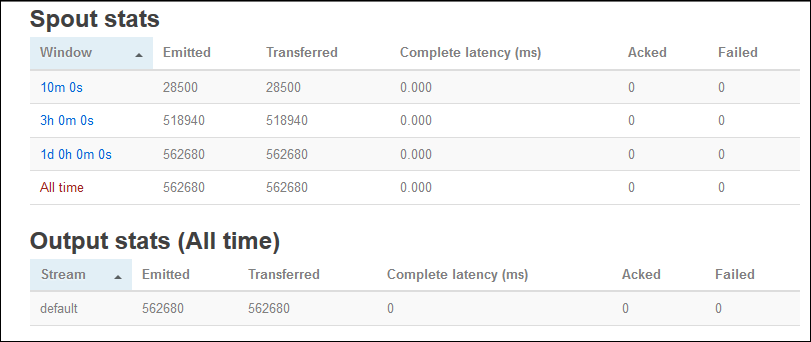

<properties
    pageTitle="Apache 大量教學課程︰ 開始使用 Linux 為基礎的大量上 HDInsight |Microsoft Azure"
    description="開始使用上 Linux 型 HDInsight 使用 Apache 大量與大量入門範例顯示較大的資料分析。 瞭解如何使用大量程序即時的資料。"
    keywords="apache 大量、 apache 大量教學課程，顯示較大的資料分析大量入門"
    services="hdinsight"
    documentationCenter=""
    authors="Blackmist"
    manager="jhubbard"
    editor="cgronlun"/>

<tags
   ms.service="hdinsight"
   ms.devlang="java"
   ms.topic="get-started-article"
   ms.tgt_pltfrm="na"
   ms.workload="big-data"
   ms.date="10/12/2016"
   ms.author="larryfr"/>

# Apache 大量教學課程︰ 開始使用大量入門範例 HDInsight 上顯示較大的資料分析

Apache 大量是以處理資料串流可調整、 容錯、 分散式、 即時計算系統。 使用大量 Azure HDInsight 上，您可以建立雲端大量叢集即時執行大型資料分析。

> [AZURE.NOTE] 本文中的步驟建立 Linux 型 HDInsight 叢集。 若要建立 Windows 型的大量 HDInsight 叢集上的步驟，請參閱[Apache 大量教學課程︰ 開始使用 HDInsight 上使用的資料分析大量入門範例](hdinsight-apache-storm-tutorial-get-started.md)

## 必要條件

[AZURE.INCLUDE [delete-cluster-warning](../../includes/hdinsight-delete-cluster-warning.md)]

您必須具備下列順利完成此 Apache 大量教學課程︰

- **Azure 訂閱**。 請參閱[取得 Azure 免費試用版](https://azure.microsoft.com/documentation/videos/get-azure-free-trial-for-testing-hadoop-in-hdinsight/)。

- **熟悉 SSH 和 SCP**。 如需有關使用 SSH 和 SCP HDInsight 的詳細資訊，請參閱下列各項︰

    - **Linux、 Unix 或 OS X 的用戶端**︰ 請參閱[使用 SSH Linux 為基礎的 Hadoop HDInsight Linux、 OS X 或 Unix 上使用](hdinsight-hadoop-linux-use-ssh-unix.md)

    - **Windows 用戶端**︰ 請參閱[使用 SSH Linux 為基礎的 Hadoop HDInsight 從 Windows 上使用](hdinsight-hadoop-linux-use-ssh-windows.md)

### 存取控制需求

[AZURE.INCLUDE [access-control](../../includes/hdinsight-access-control-requirements.md)]

## 建立大量叢集

您可以在此區段中，建立 HDInsight 版本 3.2 捨位叢集 （大量版本 0.9.3） 使用 Azure 資源管理員範本。 HDInsight 版本和其 Sla 的相關資訊，請參閱[HDInsight 元件版本設定](hdinsight-component-versioning.md)。 對於其他叢集建立的方法，請參閱[建立 HDInsight 叢集](hdinsight-hadoop-provision-linux-clusters.md)。

1. 按一下以開啟範本 Azure 入口網站中的下列圖像。         

    
    
    範本位於公用 blob 容器， *https://hditutorialdata.blob.core.windows.net/armtemplates/create-linux-based-storm-cluster-in-hdinsight.json*。 
   
2. 從參數刀中，輸入下列資訊︰

    - **ClusterName**︰ 輸入您要建立 Hadoop 叢集的名稱。
    - **叢集登入名稱和密碼**︰ 預設的登入名稱是管理員]。
    - **SSH 使用者名稱和密碼**。
    
    請記下這些值。  您需要這些教學課程中的更新版本。

    > [AZURE.NOTE] SSH 用來從遠端存取 HDInsight 叢集使用命令列。 連接到透過 SSH 叢集時使用的使用者名稱與您在這裡使用的密碼。 此外，SSH 使用者名稱必須是唯一的為它建立使用者帳戶所有 HDInsight 叢集節點。 下列是保留叢集，服務所使用的帳戶名稱，並無法用於 SSH 使用者名稱︰
    >
    > 根、 hdiuser、 大量、 hbase、 ubuntu、 動物園管理員、 hdfs、 yarn、 mapred、 hbase、 登錄區、 oozie、 接近、 sqoop、 系統、 tez、 hcat、 hdinsight 動物園管理員。

    > 如需有關如何使用 HDInsight SSH 的詳細資訊，請參閱下列文章︰

    > * [使用上 HDInsight Linux、 Unix，或 OS X 的 Linux 型 Hadoop SSH](hdinsight-hadoop-linux-use-ssh-unix.md)
    > * [使用上從 Windows HDInsight Linux 為基礎的 Hadoop SSH](hdinsight-hadoop-linux-use-ssh-windows.md)

    
3.按一下**[確定**] 儲存參數。

4.從**自訂部署**刀中，按一下**資源群組**] 下拉式清單方塊中，然後按一下 [**新增**]，建立新的資源群組。 資源群組是容器的群組叢集、 從屬參照儲存帳戶及其他連結的資源。

5.按一下 [**法律條款**]，然後再按一下 [**建立**。

6.按一下 [**建立**]。 您會看到標題為 「 」 範本部署 Submitting 部署新的方塊。 所需關於大約 20 分鐘建立叢集和 SQL 資料庫。

##HDInsight 上執行大量入門範例

[大量入門](https://github.com/apache/storm/tree/master/examples/storm-starter)範例會包含在 HDInsight 叢集上。 下列步驟，在您將執行 WordCount 範例。

1. 連線到使用 SSH HDInsight 叢集︰

        ssh USERNAME@CLUSTERNAME-ssh.azurehdinsight.net
        
    如果您是使用密碼保護您 SSH 的使用者帳戶，系統會提示您輸入。 如果您使用公開金鑰，您可能必須使用`-i`參數指定相符的私人索引鍵。 例如， `ssh -i ~/.ssh/id_rsa USERNAME@CLUSTERNAME-ssh.azurehdinsight.net`。
        
    如需有關使用 Linux 型 HDInsight SSH 的詳細資訊，請參閱下列文章︰
    
    * [使用上 HDInsight Linux、 Unix，或 OS X 的 Linux 型 Hadoop SSH](hdinsight-hadoop-linux-use-ssh-unix.md)

    * [使用上從 Windows HDInsight Linux 為基礎的 Hadoop SSH](hdinsight-hadoop-linux-use-ssh-windows)

2. 您可以使用下列命令來啟動範例拓撲︰

        storm jar /usr/hdp/current/storm-client/contrib/storm-starter/storm-starter-topologies-*.jar storm.starter.WordCountTopology wordcount
        
    > [AZURE.NOTE] `*`部分檔案名稱用來與版本號碼，可變更為 HDInsight 會更新。

    這會啟動範例 WordCount 拓撲叢集，與 「 wordcount 」 的易記的名稱。 它會隨機產生句子，並計算的每個單字的句子中的項目。

    > [AZURE.NOTE] 送出到叢集拓撲時，您必須先複製 jar 檔案，再使用包含叢集`storm`] 命令。 這可以透過`scp`命令從檔案所在的用戶端。 例如，`scp FILENAME.jar USERNAME@CLUSTERNAME-ssh.azurehdinsight.net:FILENAME.jar`
    >
    > WordCount 範例中，與其他大量入門範例，已包含在叢集上`/usr/hdp/current/storm-client/contrib/storm-starter/`。

##監控拓撲

大量使用者介面提供 web 介面使用執行拓撲，並包含在 HDInsight 叢集。

監視使用大量 UI 拓撲使用下列步驟︰

1. 開啟網頁瀏覽器 https://CLUSTERNAME.azurehdinsight.net/stormui，其中__CLUSTERNAME__是叢集的名稱。 這會開啟大量使用者介面。

    > [AZURE.NOTE] 如果系統要求您提供使用者名稱和密碼，請輸入叢集系統管理員 （系統） 和密碼，您會使用何時建立叢集。

2. 下**拓撲摘要**，選取 [在 [**名稱**] 欄中的 [ **wordcount**項目]。 這會顯示關於拓撲的詳細資訊。

    

    此頁面會提供下列資訊︰

    * **拓撲統計資料**-基本資訊拓撲效能，組織成時間 windows。

        > [AZURE.NOTE] 選取特定時間範圍變更資訊顯示在網頁上的其他區段中的 [時間] 的視窗。

    * **Spouts** -spouts，包括每個 spout 所傳回的最後一個錯誤的基本資訊。

    * **螺栓**-螺栓的基本資訊。

    * **拓撲設定**-拓撲設定的詳細資訊。

    此頁面也會提供拓撲可以採取的動作︰

    * **啟動**-停用的拓撲履歷表處理。

    * **停用**-暫停的執行拓撲。

    * **重新平衡**-調整拓撲的平行。 您已變更的叢集的節點數目後，您應該重新平衡執行拓撲。 如此一來調整以修正增加/縮小內容中的節點數目叢集平行拓撲。 如需詳細資訊，請參閱[瞭解大量拓撲的平行](http://storm.apache.org/documentation/Understanding-the-parallelism-of-a-Storm-topology.html)。

    * **刪除**-結束大量拓撲後指定逾時。

3. 此頁面上，選取 [從**Spouts**或**螺栓**區段的項目]。 這會顯示所選文件的相關資訊。

    

    此頁面會顯示下列資訊︰

    * **Spout/螺栓統計資料**-基本資訊元件效能，組織成時間 windows。

        > [AZURE.NOTE] 選取特定時間範圍變更資訊顯示在網頁上的其他區段中的 [時間] 的視窗。

    * **輸入統計資料**（僅限閃電）-產生螺栓所使用的資料的元件的詳細資訊。

    * **輸出統計資料**-資訊是由本螺栓發出的資料。

    * **執行程式**的執行個體，此元件的詳細資訊。

    * **錯誤**-這個元件所產生的錯誤。

4. 當您檢視 spout 或螺栓的詳細資料，請從若要檢視特定的執行個體元件的詳細資料的 [**執行程式**] 區段中的 [**連接埠**] 欄中選取項目。

        2015-01-27 14:18:02 b.s.d.task [INFO] Emitting: split default ["with"]
        2015-01-27 14:18:02 b.s.d.task [INFO] Emitting: split default ["nature"]
        2015-01-27 14:18:02 b.s.d.executor [INFO] Processing received message source: split:21, stream: default, id: {}, [snow]
        2015-01-27 14:18:02 b.s.d.task [INFO] Emitting: count default [snow, 747293]
        2015-01-27 14:18:02 b.s.d.executor [INFO] Processing received message source: split:21, stream: default, id: {}, [white]
        2015-01-27 14:18:02 b.s.d.task [INFO] Emitting: count default [white, 747293]
        2015-01-27 14:18:02 b.s.d.executor [INFO] Processing received message source: split:21, stream: default, id: {}, [seven]
        2015-01-27 14:18:02 b.s.d.task [INFO] Emitting: count default [seven, 1493957]

    此資料中，您可以查看 word**七**發生的 1493957 的時間。 這是此拓撲啟動後遇到的次數。

##停止拓撲

返回 [字數統計拓撲，**拓撲摘要**頁面，然後從 [**拓撲動作**] 區段中選取 [**刪除**] 按鈕。 出現提示時，輸入 10 之前停止拓撲所要等待的秒數。 之後的逾時，當您造訪的儀表板的 [**大量 UI** ] 區段，不再會顯示拓撲。

##刪除叢集

[AZURE.INCLUDE [delete-cluster-warning](../../includes/hdinsight-delete-cluster-warning.md)]

##後續步驟

在此 Apache 大量教學課程中，您可以使用大量入門，瞭解如何建立大量 HDInsight 叢集上並使用大量儀表板部署、 監控和管理大量拓撲。 接下來，瞭解如何[使用 Maven 開發 java 拓撲](hdinsight-storm-develop-java-topology.md)。

如果您已經熟悉開發 java 拓撲，若要將現有的拓撲部署 HDInsight，請參閱[部署及管理 Apache 大量拓撲上 HDInsight](hdinsight-storm-deploy-monitor-topology-linux.md)。

如果您是.NET 開發人員，您可以建立 C# 或混合式 C# / Java 拓撲使用 Visual Studio。 如需詳細資訊，請參閱[在使用 Visual Studio Hadoop 工具 HDInsight Apache 大量的開發 C# 拓撲](hdinsight-storm-develop-csharp-visual-studio-topology.md)。

例如拓撲中，可以使用大量上 HDInsight，請參閱下列範例︰

    * [在 HDInsight 大量的範例拓撲](hdinsight-storm-example-topology.md)

[apachestorm]: https://storm.incubator.apache.org
[stormdocs]: http://storm.incubator.apache.org/documentation/Documentation.html
[stormstarter]: https://github.com/apache/storm/tree/master/examples/storm-starter
[stormjavadocs]: https://storm.incubator.apache.org/apidocs/
[azureportal]: https://manage.windowsazure.com/
[hdinsight-provision]: hdinsight-provision-clusters.md
[preview-portal]: https://portal.azure.com/
