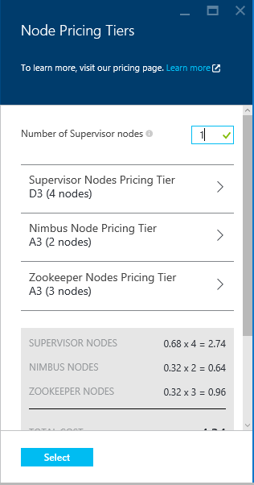

<properties
    pageTitle="Apache 大量教學課程︰ 開始使用大量 |Microsoft Azure"
    description="開始使用上 HDInsight 使用 Apache 大量與大量入門範例顯示較大的資料分析。 瞭解如何使用大量程序即時的資料。"
    keywords="apache 大量、 apache 大量教學課程，顯示較大的資料分析大量入門"
    services="hdinsight"
    documentationCenter=""
    authors="Blackmist"
    manager="jhubbard"
    editor="cgronlun"
    tags="azure-portal"/>

<tags
   ms.service="hdinsight"
   ms.devlang="java"
   ms.topic="article"
   ms.tgt_pltfrm="na"
   ms.workload="big-data"
   ms.date="09/07/2016"
   ms.author="larryfr"/>

# Apache 大量教學課程︰ 開始使用大量入門範例 HDInsight 上顯示較大的資料分析

Apache 大量是以處理資料串流可調整、 容錯、 分散式、 即時計算系統。 使用 Microsoft Azure HDInsight 上大量，您可以建立雲端大量叢集即時執行大型資料分析。 

> [AZURE.NOTE] 本文中的步驟建立 Windows 型 HDInsight 叢集。 若要建立 Linux 為基礎的大量 HDInsight 叢集上的步驟，請參閱[Apache 大量教學課程︰ 開始使用 HDInsight 上使用的資料分析大量入門範例](hdinsight-apache-storm-tutorial-get-started-linux.md)

## 必要條件

[AZURE.INCLUDE [delete-cluster-warning](../../includes/hdinsight-delete-cluster-warning.md)]

您必須具備下列順利完成此 Apache 大量教學課程︰

- **Azure 訂閱**。 請參閱[取得 Azure 免費試用版](https://azure.microsoft.com/documentation/videos/get-azure-free-trial-for-testing-hadoop-in-hdinsight/)。

### 存取控制需求

[AZURE.INCLUDE [access-control](../../includes/hdinsight-access-control-requirements.md)]

## 建立大量叢集

大量 HDInsight 上的儲存記錄檔和拓撲提交到叢集用於 Azure Blob 儲存體。 若要使用叢集建立用於 Azure 儲存體帳戶使用下列步驟︰

1. [Azure 入口網站]登入[preview-portal]。

2. 選取 [**新增**]，選取 [__資料分析__，，然後選取__HDInsight__。

    

3. 輸入__叢集名稱__。 如果有的話__叢集名稱__旁會出現綠色的核取記號。

4. 如果您有多個訂閱，請選取 [__訂閱__項目，以選取 [將會用於叢集 Azure 訂閱]。

5.  若要選取__大量__叢集使用__選取叢集類型__。 __作業系統__中，選取 [Windows]。 __叢集層__，選取 [標準]。 最後，使用 [選取] 按鈕，以儲存這些設定。

    

5. __資源群組__，您可以我們下拉式清單，請參閱現有的資源群組的清單，然後選取 [建立叢集中的項目。 或者，也可以選取 [__新增__]，然後輸入新的資源群組的名稱。 綠色核取記號會出現表示新群組的名稱是否有空。

6. 選取 [__認證__]，然後輸入__叢集登入的使用者名稱__和__叢集登入密碼__。 最後，使用__選取__要設定的認證。 遠端桌面會不能用於此文件中，所以您可以讓它停用。

    

6. 針對__資料來源__，您可以選取項目以選擇現有的資料來源，或建立新。

    

    目前您可以選取 Azure 儲存體帳戶為 HDInsight 叢集的資料來源。 使用下列命令以了解__資料來源__刀上的項目。

    - __選取方法__︰ 將此設定為__從所有的訂閱__以啟用 [瀏覽您的訂閱的儲存空間帳戶。 如果您想要輸入的__儲存空間名稱__及__便捷鍵__的現有的儲存空間帳戶，設為__便捷鍵__。

    - __建立新__︰ 使用此選項建立新的儲存空間帳戶。 使用功能變數出現在輸入的儲存體帳戶名稱。 名稱時，會出現綠色的核取。

    - __選擇預設的容器__︰ 使用此輸入要用於叢集預設容器的名稱。 您可以輸入任何的名稱，我們建議使用相同的名稱和叢集，讓您容易辨識的容器用於此特定叢集。

    - __位置__︰ 儲存帳戶會地理區域，或將建立在。

        > [AZURE.IMPORTANT] 選取預設資料來源的位置時，也會設定 HDInsight 叢集的位置。 叢集及預設值的資料來源必須位於相同的區域。

    - __選取 [__: 使用此儲存資料來源設定。

7. 選取 [若要顯示資訊將會建立此叢集節點的__節點定價層級__]。 根據預設，工作者節點數目設定至__4__。 設定為 [ __1__，這是滿足本教學課程中所需並降低的叢集。 叢集估計的成本會顯示在此刀底部。

    

    使用 [__選取__要儲存__節點價格層__的資訊。

8. 選取 [__選擇性的設定__]。 此刀可讓您選取叢集版本，以及設定其他選用的設定，例如加入__虛擬網路__。

    

9. 確定__固定至 Startboard__已選取，然後選取 [__建立__。 這會建立叢集，並新增一個磚，Azure 入口網站的 Startboard。 圖示表示佈建叢集已完成的變更來顯示一次佈建 HDInsight 圖示。

  	| 佈建時 | 佈建完成 |
  	| ------------------ | --------------------- |
  	|  |  |

    > [AZURE.NOTE] 需要花費叢集建立，通常約 15 分鐘的時間。 使用並排 Startboard 或在頁面左側的__通知__項目上，若要查看提供的程序。

## HDInsight 上執行大量入門範例

此 Apache 大量教學課程介紹 GitHub 上使用大量入門範例顯示較大的資料分析。

每個大量 HDInsight 叢集上隨附大量儀表板，可以用來上傳並執行大量拓撲叢集上。 每個叢集也可以直接從 [大量儀表板] 執行的範例拓撲隨附。

### 連線至儀表板

儀表板位於**https://&lt;clustername >.azurehdinsight.net//**，其中**clustername**叢集的名稱。 您也可以從 Startboard 選取叢集，然後選取刀頂端的 [__儀表板__] 連結，尋找儀表板的連結。

> [AZURE.NOTE] 連接至儀表板時，會提示您輸入使用者名稱和密碼。 這是系統管理員名稱 （**系統**） 與建立叢集時所使用的密碼。

[大量儀表板有載入之後，您會看到**送出拓撲**表單。

**送出拓撲**表單可上傳並執行含有大量拓撲.jar 檔案。 也包括叢集提供數種基本範例。

### 執行中 GitHub 大量起始專案中的字數統計範例

與叢集提供的範例包括 word 計算拓撲的各種變化。 這些範例包括**spout**隨機發出句子與**螺栓**的每一個句子分成個別的單字，然後計算每個單字發生的次數。 這些範例是從[大量入門範例](https://github.com/apache/storm/tree/master/examples/storm-starter)，這是 Apache 大量的一部分。

執行下列步驟，以執行大量入門範例︰

1. 從**Jar 檔案**下拉式清單中選取**StormStarter-WordCount** 。 這會填入的**類別名稱**] 和 [**其他參數**的欄位，以這個範例中的參數。

    

    * **類別名稱**-送出拓撲.jar 檔案中的類別。
    * **其他參數**-拓撲所需任何參數。 在此範例中，[] 欄位用於提供提交拓撲易記的名稱。

2. 按一下 [**送出**]。 隨後，[**結果**] 欄位會顯示送出工作，以及命令的結果所用的命令。 [**錯誤**] 欄位會顯示任何錯誤發生中送出拓撲。

    ![送出] 按鈕和大量入門 WordCount 的結果。](./media/hdinsight-apache-storm-tutorial-get-started/submit-results.png)

    > [AZURE.NOTE] 結果不會指出，拓撲已完成-**大量拓撲啟動後，就會執行，直到您停止了。** 字數統計拓撲產生隨機句子，並保留遭遇每個字詞，直到您停止的次數的計數。

### 監控拓撲

監控拓撲可在大量 ui。

1. 選取 [從大量儀表板頂端的 [**大量 UI** ]。 隨後便會顯示叢集和所有執行拓撲的摘要資訊。

    

    從上方的頁面，您可以看到拓撲已作用中的時間，以及數工作者執行程式，與所使用的工作。

    > [AZURE.NOTE] [**名稱**] 欄中包含透過**其他參數**欄位稍早所提供的易記名稱。

4. 下**拓撲摘要**，選取 [在 [**名稱**] 欄中的 [ **wordcount**項目]。 隨後便會顯示關於拓撲的詳細資訊。

    

    此頁面會提供下列資訊︰

    * **拓撲統計資料**-基本資訊拓撲效能，組織成時間 windows。

        > [AZURE.NOTE] 選取特定時間範圍變更資訊顯示在網頁上的其他區段中的 [時間] 的視窗。

    * **Spouts** -spouts，包括每個 spout 所傳回的最後一個錯誤的基本資訊。

    * **螺栓**-螺栓的基本資訊。

    * **拓撲設定**-拓撲設定的詳細資訊。

    此頁面也會提供拓撲可以採取的動作︰

    * **啟動**-停用的拓撲履歷表處理。

    * **停用**-暫停的執行拓撲。

    * **重新平衡**-調整拓撲的平行。 您已變更的叢集的節點數目後，您應該重新平衡執行拓撲。 如此一來調整以修正增加/縮小內容中的節點數目叢集平行拓撲。 如需詳細資訊，請參閱[瞭解大量拓撲的平行](http://storm.apache.org/documentation/Understanding-the-parallelism-of-a-Storm-topology.html)。

    * **刪除**-結束大量拓撲後指定逾時。

5. 此頁面上，選取 [從**Spouts**或**螺栓**區段的項目]。 隨後便會顯示所選文件的相關資訊。

    

    此頁面會顯示下列資訊︰

    * **Spout/螺栓統計資料**-基本資訊元件效能，組織成時間 windows。

        > [AZURE.NOTE] 選取特定時間範圍變更資訊顯示在網頁上的其他區段中的 [時間] 的視窗。

    * **輸入統計資料**（僅限閃電）-產生螺栓所使用的資料的元件的詳細資訊。

    * **輸出統計資料**-資訊是由本螺栓發出的資料。

    * **執行程式**的執行個體，此元件的詳細資訊。

    * **錯誤**-這個元件所產生的錯誤。

5. 當您檢視 spout 或螺栓的詳細資料，請從若要檢視特定的執行個體元件的詳細資料的 [**執行程式**] 區段中的 [**連接埠**] 欄中選取項目。

        2015-01-27 14:18:02 b.s.d.task [INFO] Emitting: split default ["with"]
        2015-01-27 14:18:02 b.s.d.task [INFO] Emitting: split default ["nature"]
        2015-01-27 14:18:02 b.s.d.executor [INFO] Processing received message source: split:21, stream: default, id: {}, [snow]
        2015-01-27 14:18:02 b.s.d.task [INFO] Emitting: count default [snow, 747293]
        2015-01-27 14:18:02 b.s.d.executor [INFO] Processing received message source: split:21, stream: default, id: {}, [white]
        2015-01-27 14:18:02 b.s.d.task [INFO] Emitting: count default [white, 747293]
        2015-01-27 14:18:02 b.s.d.executor [INFO] Processing received message source: split:21, stream: default, id: {}, [seven]
        2015-01-27 14:18:02 b.s.d.task [INFO] Emitting: count default [seven, 1493957]

    從資料中，您可以查看 word**七**發生的 1,493,957 時間。 這是此拓撲啟動後遇到的次數。

### 停止拓撲

返回 [字數統計拓撲，**拓撲摘要**頁面，然後從**拓撲動作**] 區段底下選取 [**刪除**。 出現提示時，輸入 10 之前停止拓撲所要等待的秒數。 逾時過後拓撲不會再出現時您造訪的儀表板的 [**大量 UI** ] 區段。

##刪除叢集

[AZURE.INCLUDE [delete-cluster-warning](../../includes/hdinsight-delete-cluster-warning.md)]

## 摘要

在此 Apache 大量教學課程中，您可以使用大量入門，瞭解如何建立大量 HDInsight 叢集上並使用大量儀表板部署、 監控和管理大量拓撲。

## 後續步驟

* **Visual Studio HDInsight 工具**-HDInsight 工具可讓您使用 Visual Studio 提交、 監控及管理大量拓撲類似大量儀表板先前所述。 HDInsight 工具也可讓您建立 C# 大量拓撲，並包含範例拓撲中，您可以部署，並在您叢集上執行。

    如需詳細資訊，請參閱[開始使用 Visual Studio HDInsight 工具](hdinsight-hadoop-visual-studio-tools-get-started.md)。

* **範例檔案**的 HDInsight 大量叢集提供**%STORM_HOME%\contrib**目錄中的多個範例。 每個範例應包含下列各項︰

    * 程式碼-例如大量-入門-0.9.1.2.1.5.0-2057年-sources.jar

    * Java 文件-例如大量-入門-0.9.1.2.1.5.0-2057年-javadoc.jar

    * 例如，例如 storm-starter-0.9.1.2.1.5.0-2057-jar-with-dependencies.jar

    要擷取的程式碼或 Java 文件中使用 'jar 」 命令。 例如，「 jar-xvf 大量-入門-0.9.1.2.1.5.0.2057-javadoc.jar 」。

    > [AZURE.NOTE] Java 文件包含網頁。 一旦建構，使用瀏覽器檢視**index.html**檔案。

    若要存取這些範例，您必須大量 HDInsight 叢集上啟用遠端桌面，然後再將檔案複製**%STORM_HOME%\contrib**。

* 下列文件包含其他範例，可以使用大量 HDInsight 上的清單︰

    * [在 HDInsight 大量的範例拓撲](hdinsight-storm-example-topology.md)

[apachestorm]: https://storm.incubator.apache.org
[stormdocs]: http://storm.incubator.apache.org/documentation/Documentation.html
[stormstarter]: https://github.com/apache/storm/tree/master/examples/storm-starter
[stormjavadocs]: https://storm.incubator.apache.org/apidocs/
[azureportal]: https://manage.windowsazure.com/
[hdinsight-provision]: hdinsight-provision-clusters.md
[preview-portal]: https://portal.azure.com/
