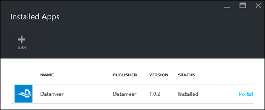

<properties
    pageTitle="HDInsight 上安裝 Hadoop 應用程式 |Microsoft Azure"
    description="瞭解如何安裝 HDInsight 應用程式的 HDInsight 應用程式。"
    services="hdinsight"
    documentationCenter=""
    authors="mumian"
    manager="jhubbard"
    editor="cgronlun"
    tags="azure-portal"/>

<tags
    ms.service="hdinsight"
    ms.devlang="na"
    ms.topic="hero-article"
    ms.tgt_pltfrm="na"
    ms.workload="big-data"
    ms.date="09/14/2016"
    ms.author="jgao"/>

# 安裝 HDInsight 應用程式

HDInsight 應用程式是使用者可以在 Linux 型 HDInsight 叢集安裝的應用程式。 Microsoft，獨立軟體廠商 (ISV)，或您自己，可以開發這些應用程式。 在本文中，您將學習如何安裝的已發佈的應用程式。 安裝您自己的應用程式，請參閱[安裝自訂 HDInsight 應用程式](hdinsight-apps-install-custom-applications.md)。 

目前有一個已發佈的應用程式︰

- **Datameer**: [Datameer](http://www.datameer.com/documentation/display/DAS50/Home?ls=Partners&lsd=Microsoft&c=Partners&cd=Microsoft)提供的分析師互動方式探索與分析，以視覺化方式呈現資料中顯示較大的結果。 提取其他資料來源，輕鬆地以探索新的關聯，並取得快速需要的答案。

>[AZURE.NOTE] Datameer 目前是 Azure HDInsight 版本 3.2 捨位叢集只支援。

本文中所提供的指示使用 Azure 入口網站。 您也能夠匯出入口網站中的 Azure 資源管理員範本或廠商，取得資源管理員範本的複本，以及使用 PowerShell 的 Azure 和 Azure CLI 部署範本。  請參閱[建立 Linux 型 Hadoop 叢集 HDInsight 使用資源管理員範本中](hdinsight-hadoop-create-linux-clusters-arm-templates.md)。

## 必要條件

如果您想要在現有的 HDInsight 叢集安裝 HDInsight 應用程式，您必須 HDInsight 叢集。 若要建立一個，請參閱[建立叢集](hdinsight-hadoop-linux-tutorial-get-started.md#create-cluster)。 當您建立 HDInsight 叢集時，您也可以安裝 HDInsight 應用程式。

## 安裝應用程式，以現有的叢集

下列程序顯示如何安裝現有的 HDInsight 叢集 HDInsight 應用程式。

**若要安裝 HDInsight 應用程式**

1. [Azure 入口網站](https://portal.azure.com)登入。
2. 按一下左側功能表中的 [ **HDInsight 叢集**]。  如果您沒有看到它，按一下 [**瀏覽**，，然後按一下 [ **HDInsight 叢集**。
3. 按一下 [HDInsight 叢集]。  如果您沒有帳戶，您必須建立一個第一個。  請參閱[建立叢集](hdinsight-hadoop-linux-tutorial-get-started.md#create-cluster)。
4. 從**設定**刀中，按一下 [**一般**] 類別底下的 [**應用程式**]。 **安裝應用程式**刀列出所有已安裝的應用程式。 

    ![hdinsight [入口網站應用程式] 功能表](./media/hdinsight-apps-install-applications/hdinsight-apps-portal-menu.png)

5. 按一下 [從刀功能表的 [**新增**]。 

    

    您應該看到現有 HDInsight 應用程式的清單。

    

6. 按一下其中一個應用程式，接受法律合約，，再按一下 [**選取**。

您可以看到安裝狀態從通知] 入口網站 （按一下鐘形圖示，上方的入口網站）。 安裝應用程式之後，應用程式會在安裝的應用程式刀。

## 安裝期間叢集建立的應用程式

您有安裝 HDInsight 應用程式，當您建立叢集時的選項。 在過程中，叢集會建立並執行狀態後，會安裝 HDInsight 應用程式。 下列程序顯示如何建立叢集時安裝 HDInsight 應用程式。

**若要安裝 HDInsight 應用程式**

1. [Azure 入口網站](https://portal.azure.com)登入。
2. 按一下 [**新增**]，按一下 [**資料 + 分析**]，再按一下 [ **HDInsight**。
3. 輸入**叢集名稱**︰ 此名稱必須是全域唯一。
4. 按一下以選取 [將會用於叢集 Azure 訂閱的**訂閱**]。
5. 按一下 [**選取叢集類型**]，然後選取︰

    - **叢集類型**︰ 如果您不知道如何選擇，請選取 [ **Hadoop**。 這是最常用的叢集類型。
    - **作業系統**︰ 選取**Linux**。
    - **版本**︰ 如果您不知道如何選擇使用預設版本。 如需詳細資訊，請參閱[HDInsight 叢集版本](hdinsight-component-versioning.md)。
    - **叢集層**︰ Azure HDInsight 提供兩種類型的大型資料雲端方案︰ 標準層和進階版層。 如需詳細資訊，請參閱[叢集層](hdinsight-hadoop-provision-linux-clusters.md#cluster-tiers)。
6. 按一下 [**應用程式**，按一下其中一個發佈的應用程式，再按一下 [**選取**。
6. 按一下 [**認證**]，然後輸入管理員使用者的密碼。 您也必須輸入**SSH 使用者名稱**與**密碼**或**公用鍵**，將會用於 SSH 使用者進行驗證。 使用公開金鑰是建議的方法。 若要儲存的認證設定底部，按一下 [**選取**]。
8. 按一下 [**資料來源**、 選取其中一個現有的儲存空間帳戶或建立新的儲存空間帳戶成為叢集預設儲存的帳戶。
9. 按一下 [**資源群組**來選取現有的資源群組，或按一下 [**新增**]，建立新的資源群組

10. 在**新 HDInsight 叢集**防禦，以確定**固定至 Startboard**已選取，然後再按一下 [**建立**]。 

## 已安裝的 HDInsight 應用程式與屬性] 清單

對於叢集，已安裝的 HDInsight 應用程式清單，以及每個已安裝的應用程式的內容，則會顯示入口網站。

**若要清單 HDInsight 應用程式，並顯示內容**

1. [Azure 入口網站](https://portal.azure.com)登入。
2. 按一下左側功能表中的 [ **HDInsight 叢集**]。  如果您沒有看到它，按一下 [**瀏覽**，，然後按一下 [**叢集 HDInsight**。
3. 按一下 [HDInsight 叢集]。
4. 從**設定**刀中，按一下 [在 [**一般**] 類別底下的 [**應用程式**]。 安裝應用程式刀列出所有已安裝的應用程式。 

    

5. 按一下其中一個安裝的應用程式，以顯示屬性]。 屬性刀清單︰

    - 應用程式名稱︰ 應用程式的名稱。
    - 狀態︰ 應用程式狀態。 
    - 網頁︰ 如果有任何已部署 edge 節點的 web 應用程式的 URL。 Credential 是您已設定叢集 HTTP 使用者認證相同。
    - HTTP 端點︰ credential 是您已設定叢集 HTTP 使用者認證相同。 
    - SSH 端點︰ 您可以使用[SSH](hdinsight-hadoop-linux-use-ssh-unix.md)連線至邊緣節點。 SSH 認證是您已設定叢集 SSH 使用者認證相同。

6. 若要刪除應用程式，應用程式，以滑鼠右鍵按一下，再按一下 [從內容功能表的 [**刪除**。

## 連接到邊緣節點

您可以連線至使用 HTTP 和 SSH 邊緣節點。 從[入口網站](#list-installed-hdinsight-apps-and-properties)，可以找到結束點資訊。 如需有關使用 SSH 的詳細資訊，請參閱[使用 SSH Linux 為基礎的 Hadoop HDInsight Linux、 Unix，或 OS X 上使用](hdinsight-hadoop-linux-use-ssh-unix.md)。 

HTTP 端點認證是您所設定的 HDInsight 叢集; HTTP 使用者認證SSH 端點認證是您已設定為 HDInsight 叢集 SSH 認證。

## 疑難排解

請參閱[疑難排解安裝](hdinsight-apps-install-custom-applications.md#troubleshoot-the-installation)。

## 後續步驟

- [安裝自訂 HDInsight 應用程式](hdinsight-apps-install-custom-applications.md)︰ 了解如何部署至 HDInsight 解除發佈的 HDInsight 應用程式。
- [發佈 HDInsight 應用程式](hdinsight-apps-publish-applications.md)︰ 了解如何發佈 Azure Marketplace 的您自訂 HDInsight 應用程式。
- [MSDN︰ 安裝 HDInsight 應用程式](https://msdn.microsoft.com/library/mt706515.aspx)︰ 了解如何定義 HDInsight 應用程式。
- [使用指令碼的巨集指令的自訂 Linux 型 HDInsight 叢集](hdinsight-hadoop-customize-cluster-linux.md)︰ 了解如何安裝其他應用程式使用指令碼的巨集指令。
- [建立 Linux 型 Hadoop 叢集中使用的資源管理員範本的 HDInsight](hdinsight-hadoop-create-linux-clusters-arm-templates.md)︰ 了解如何呼叫建立 HDInsight 叢集資源管理員範本。
- [使用空白的邊緣節點中 HDInsight](hdinsight-apps-use-edge-node.md)︰ 了解如何使用空白的邊緣節點存取 HDInsight 叢集、 測試 HDInsight 應用程式，以及裝載 HDInsight 應用程式。

