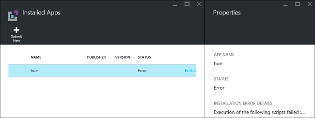

<properties
    pageTitle="HDInsight 上安裝 Hadoop 應用程式 |Microsoft Azure"
    description="瞭解如何安裝 HDInsight 應用程式的 HDInsight 應用程式。"
    services="hdinsight"
    documentationCenter=""
    authors="mumian"
    manager="jhubbard"
    editor="cgronlun"
    tags="azure-portal"/>

<tags
    ms.service="hdinsight"
    ms.devlang="na"
    ms.topic="hero-article"
    ms.tgt_pltfrm="na"
    ms.workload="big-data"
    ms.date="09/14/2016"
    ms.author="jgao"/>

# 安裝自訂 HDInsight 應用程式

HDInsight 應用程式是使用者可以在 Linux 型 HDInsight 叢集安裝的應用程式。  Microsoft，獨立軟體廠商 (ISV)，或您自己，可以開發這些應用程式。 在本文中，您將學習如何安裝尚未發行 Azure HDInsight 入口網站的 HDInsight 應用程式。 您將會安裝應用程式的[色調](http://gethue.com/)。 

其他相關的文章︰

- [安裝 HDInsight 應用程式](hdinsight-apps-install-applications.md)︰ 了解如何安裝叢集 HDInsight 應用程式。
- [發佈 HDInsight 應用程式](hdinsight-apps-publish-applications.md)︰ 了解如何發佈 Azure Marketplace 的您自訂 HDInsight 應用程式。
- [MSDN︰ 安裝 HDInsight 應用程式](https://msdn.microsoft.com/library/mt706515.aspx)︰ 了解如何定義 HDInsight 應用程式。

 
## 必要條件

如果您想要在現有的 HDInsight 叢集安裝 HDInsight 應用程式，您必須 HDInsight 叢集。 若要建立一個，請參閱[建立叢集](hdinsight-hadoop-linux-tutorial-get-started.md#create-cluster)。 當您建立 HDInsight 叢集時，您也可以安裝 HDInsight 應用程式。

## 安裝 HDInsight 應用程式

當您建立叢集或現有的 HDInsight 叢集安裝 HDInsight 應用程式。 定義 Azure 資源管理員範本，請參閱[MSDN︰ 安裝 HDInsight 應用程式](https://msdn.microsoft.com/library/mt706515.aspx)。

部署此應用程式 （色調） 的所需的檔案︰

- [azuredeploy.json](https://github.com/hdinsight/Iaas-Applications/blob/master/Hue/azuredeploy.json)︰ 安裝 HDInsight 應用程式的 [資源管理員範本。 請參閱[MSDN︰ 安裝 HDInsight 應用程式](https://msdn.microsoft.com/library/mt706515.aspx)開發您自己的資源管理員範本。
- [色調 install_v0.sh](https://github.com/hdinsight/Iaas-Applications/blob/master/Hue/scripts/Hue-install_v0.sh)︰ 呼叫設定邊緣節點在資源管理員範本的指令碼動作。 
- [色調 binaries.tgz](https://hdiconfigactions.blob.core.windows.net/linuxhueconfigactionv01/hue-binaries-14-04.tgz)︰ 從 hui install_v0.sh 呼叫色調二進位檔案。 
- [色調的二進位檔案 14-04.tgz](https://hdiconfigactions.blob.core.windows.net/linuxhueconfigactionv01/hue-binaries-14-04.tgz)︰ 從 hui install_v0.sh 呼叫色調二進位檔案。 
- [webwasb tomcat.tar.gz](https://hdiconfigactions.blob.core.windows.net/linuxhueconfigactionv01/webwasb-tomcat.tar.gz)︰ 從 hui install_v0.sh 呼叫範例 web 應用程式 (Tomcat)。

**若要安裝現有的 HDInsight 叢集色調**

1. 按一下 [登入 Azure 及開啟資源管理員範本 Azure 入口網站中的下列圖像。 

    

    此按鈕會開啟 Azure 入口網站上的資源管理員範本。  資源管理員範本位於[https://github.com/hdinsight/Iaas-Applications/tree/master/Hue](https://github.com/hdinsight/Iaas-Applications/tree/master/Hue)。  若要瞭解如何撰寫此資源管理員範本，請參閱[MSDN︰ 安裝 HDInsight 應用程式](https://msdn.microsoft.com/library/mt706515.aspx)。
    
2. 從**參數**刀中，輸入下列資訊︰

    - **ClusterName**︰ 輸入您要安裝應用程式的叢集的名稱。 此叢集必須為現有的叢集。
    
3. 按一下**[確定**] 儲存參數。
4. 從**自訂部署**刀中，輸入 [**資源群組**]。  資源群組已群組叢集、 從屬參照儲存帳戶及其他資源的容器。 需要和叢集使用相同的資源群組。
5. 按一下**法律條款**]，然後再按一下 [**建立**。
6. 請確認 [**固定至儀表板**核取方塊已選取，然後再按一下 [**建立**]。 您可以看到安裝狀態從 [釘選到入口網站的儀表板和入口網站的通知] 方塊 （按一下鐘形圖示，上方的入口網站）。  若要安裝應用程式需要關於 10 分鐘的時間。

**若要建立叢集時安裝色調**

1. 按一下 [登入 Azure 及開啟資源管理員範本 Azure 入口網站中的下列圖像。 

    

    此按鈕會開啟 Azure 入口網站上的資源管理員範本。  資源管理員範本是位於[https://hditutorialdata.blob.core.windows.net/hdinsightapps/create-linux-based-hadoop-cluster-in-hdinsight.json](https://hditutorialdata.blob.core.windows.net/hdinsightapps/create-linux-based-hadoop-cluster-in-hdinsight.json)。  若要瞭解如何撰寫此資源管理員範本，請參閱[MSDN︰ 安裝 HDInsight 應用程式](https://msdn.microsoft.com/library/mt706515.aspx)。

2. 請依照下列指示建立叢集並安裝色調。 如需有關如何建立 HDInsight 叢集的詳細資訊，請參閱[建立 Linux 型 Hadoop 叢集 HDInsight 中](hdinsight-hadoop-provision-linux-clusters.md)。

除了 Azure 入口網站中，您也可以撥打資源管理員範本使用[PowerShell 的 Azure](hdinsight-hadoop-create-linux-clusters-arm-templates.md#deploy-with-powershell)和[Azure CLI](hdinsight-hadoop-create-linux-clusters-arm-templates.md#deploy-with-azure-cli) 。

## 驗證安裝

您可以檢查 Azure 入口網站，以驗證應用程式安裝的應用程式狀態。 此外，您也可以驗證所有 HTTP 端點找出如預期般，如果有的話網頁︰

**若要開啟 [色調] 入口網站**

1. [Azure 入口網站](https://portal.azure.com)登入。
2. 按一下左側功能表中的 [ **HDInsight 叢集**]。  如果您沒有看到它，按一下 [**瀏覽**，，然後按一下 [ **HDInsight 叢集**。
3. 按一下 [的叢集安裝應用程式]。
4. 從**設定**刀中，按一下 [在 [**一般**] 類別底下的 [**應用程式**]。 您應該會看到**安裝的應用程式**刀中所列的**色調**。
5. 按一下 [**色調**從清單內容]。  
6. 按一下 [網頁] 連結，以驗證網站;若要驗證色調網頁 UI，請開啟 SSH 端點使用[PuTTY](hdinsight-hadoop-linux-use-ssh-windows.md)或其他[SSH 用戶端](hdinsight-hadoop-linux-use-ssh-unix.md)的在瀏覽器中開啟 HTTP 端點。
 
## 疑難排解安裝

您可以查看應用程式安裝狀態從入口網站的通知 （按一下鐘形圖示，上方的入口網站）。 

如果應用程式安裝失敗，您可以看到錯誤訊息，而且偵錯從 3 個位置的資訊︰

- HDInsight 應用程式︰ 一般錯誤的資訊。

    開啟叢集從入口網站，然後按一下 [設定刀從應用程式︰

    

- HDInsight 指令碼的巨集指令︰ 指令碼問題的詳細指令碼的 [動作] 窗格中，如果 HDInsight 應用程式的錯誤訊息指出指令碼動作失敗，就會顯示。

    請按一下 [指令碼動作，從 [設定刀。 指令碼動作記錄會顯示錯誤訊息

    
    
- Ambari Web UI︰ 如果安裝指令碼失敗的原因，請使用 Ambari Web UI 來檢查完整記錄安裝指令碼。

    如需詳細資訊，請參閱[疑難排解](hdinsight-hadoop-customize-cluster-linux.md#troubleshooting)。

## 移除 HDInsight 應用程式

有數種方式可刪除 HDInsight 應用程式。

### 使用入口網站

**若要移除的應用程式，使用入口網站**

1. [Azure 入口網站](https://portal.azure.com)登入。
2. 按一下左側功能表中的 [ **HDInsight 叢集**]。  如果您沒有看到它，按一下 [**瀏覽**，，然後按一下 [ **HDInsight 叢集**。
3. 按一下 [的叢集安裝應用程式]。
4. 從**設定**刀中，按一下 [在 [**一般**] 類別底下的 [**應用程式**]。 您應該看到安裝的應用程式的清單。 在此教學課程，**色調**會列在**安裝的應用程式**刀中。
5. 以滑鼠右鍵按一下您想要移除的應用程式，然後按一下 [**刪除**。
6. 按一下 [ **]**以確認。

從入口網站，您也可以刪除叢集，或刪除其中包含應用程式的 [資源] 群組。

### 使用 PowerShell 的 Azure

使用 PowerShell 的 Azure，您就可以刪除叢集，或刪除資源群組。 請參閱[刪除叢集使用 PowerShell 的 Azure](hdinsight-administer-use-powershell.md#delete-clusters)。

### 使用 Azure CLI

使用 Azure CLI，您就可以刪除叢集，或刪除資源群組。 請參閱[刪除使用 Azure CLI 叢集](hdinsight-administer-use-command-line.md#delete-clusters)。

## 後續步驟

- [MSDN︰ 安裝 HDInsight 應用程式](https://msdn.microsoft.com/library/mt706515.aspx)︰ 了解如何開發部署 HDInsight 應用程式的資源管理員範本。
- [安裝 HDInsight 應用程式](hdinsight-apps-install-applications.md)︰ 了解如何安裝叢集 HDInsight 應用程式。
- [發佈 HDInsight 應用程式](hdinsight-apps-publish-applications.md)︰ 了解如何發佈 Azure Marketplace 的您自訂 HDInsight 應用程式。
- [使用指令碼的巨集指令的自訂 Linux 型 HDInsight 叢集](hdinsight-hadoop-customize-cluster-linux.md)︰ 了解如何安裝其他應用程式使用指令碼的巨集指令。
- [建立 Linux 型 Hadoop 叢集中使用的資源管理員範本的 HDInsight](hdinsight-hadoop-create-linux-clusters-arm-templates.md)︰ 了解如何呼叫建立 HDInsight 叢集資源管理員範本。
- [使用空白的邊緣節點中 HDInsight](hdinsight-apps-use-edge-node.md)︰ 了解如何使用空白的邊緣節點存取 HDInsight 叢集、 測試 HDInsight 應用程式，以及裝載 HDInsight 應用程式。
