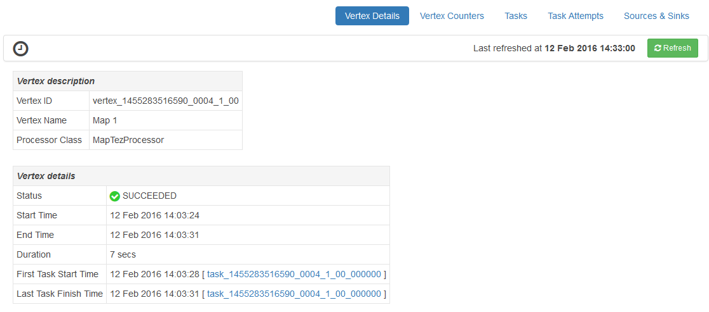

<properties
pageTitle="使用 HDInsight Ambari Tez 檢視 |Azure"
description="瞭解如何使用 Ambari Tez 檢視偵錯 Tez HDInsight 的工作。"
services="hdinsight"
documentationCenter=""
authors="Blackmist"
manager="jhubbard"
editor="cgronlun"/>

<tags
ms.service="hdinsight"
ms.devlang="na"
ms.topic="article"
ms.tgt_pltfrm="na"
ms.workload="big-data"
ms.date="10/04/2016"
ms.author="larryfr"/>

# 使用 Ambari 檢視偵錯 Tez HDInsight 的工作

HDInsight Ambari 網路使用者介面包含 Tez 檢視可以用來瞭解和偵錯 Tez 作為執行引擎的工作。 Tez 檢視可讓您以視覺化方式呈現的連線的項目圖表的工作，每個項目，向下切入擷取統計資料和記錄資訊。

> [AZURE.NOTE] 這份文件中的資訊是特定 Linux 型 HDInsight 叢集。 在 [偵錯時，使用 Windows 型 HDInsight Tez 工作的資訊，請參閱[使用 Tez UI 偵錯 Tez Windows 型 HDInsight 的工作](hdinsight-debug-tez-ui.md)。

## 必要條件

* Linux 型 HDInsight 叢集。 如需建立新的叢集的步驟，請參閱[開始使用 Linux 型 HDInsight](hdinsight-hadoop-linux-tutorial-get-started.md)。

* 新的網頁瀏覽器支援 html 5。

## 了解 Tez

Tez 是可延伸的架構，提供更大的速度比傳統 MapReduce Hadoop 中的資料處理。 若是 Linux 型 HDInsight 叢集，則登錄區的預設引擎。

當工作提交到 Tez 時，它會建立導向非循環圖 (DAG)，描述工作所需的動作的執行順序。 個別的動作是頂點，及執行一段整個工作。 頂點所述的工作的實際執行稱為工作，並可能散佈在多個叢集節點。

### 了解 Tez 檢視

Tez 檢視提供資訊程序正在執行，或有先前執行使用 Tez。 其可讓您檢視產生的 Tez，DAG 如何分佈於目前叢集，例如使用的工作和頂點，錯誤資訊記憶體計數器。 它可能會提供有用的資訊，在以下情況︰

* 監控長處理程序檢視地圖的進度，和縮小工作。

* 分析歷程記錄的資料的成功或失敗的程序，若要瞭解如何處理可能可以改善或失敗的原因。

## 產生 DAG

如果使用 Tez 引擎目前正在執行，或已發生過去的工作，Tez 檢視只會包含資料。 簡單的登錄區查詢通常可以解決不使用 Tez，不過更複雜的查詢的篩選、 群組、 排序，連接等通常會要求 Tez。

使用下列步驟執行，以執行使用 Tez 登錄區查詢。

1. 網頁瀏覽器中，瀏覽至 https://CLUSTERNAME.azurehdinsight.net，其中__CLUSTERNAME__是 HDInsight 叢集的名稱。

2. 在頁面頂端的功能表中，選取 [__檢視__] 圖示。 這看起來像一系列的平方和。 在出現下拉式清單中，選取 [__登錄區檢視__]。 

    

3. 當登錄區載入時，將 [查詢編輯器] 中，貼上下列，，然後按一下 [__執行__。

        select market, state, country from hivesampletable where deviceplatform='Android' group by market, country, state;
    
    完成工作後，您應該會看到的輸出會顯示在__查詢的程序結果__] 區段中。 結果應該類似下面的
    
        market  state       country
        en-GB   Hessen      Germany
        en-GB   Kingston    Jamaica
        
4. 選取 [__記錄__] 索引標籤。 您會看到類似以下資訊︰
    
        INFO : Session is already open
        INFO :

        INFO : Status: Running (Executing on YARN cluster with App id application_1454546500517_0063)

    儲存__應用程式識別碼__值，因為這會使用下一節。

## 使用 Tez 檢視

1. 在頁面頂端的功能表中，選取 [__檢視__] 圖示。 在出現下拉式清單中，選取__Tez 檢視__。

    

2. Tez 檢視載入時，您會看到目前正在執行，或已 DAGs 的清單執行叢集上。 預設檢視包含 Dag 名稱、 識別碼、 要是、 狀態、 開始時間、 結束時間、 持續時間、 應用程式識別碼和佇列。 更多欄您可以使用右側的頁面的齒輪圖示加入。

    

3. 如果您只有一個項目，就會在上一節中執行的查詢。 如果您有多個項目，您可以在 [__應用程式識別碼__] 欄位中，輸入應用程式識別碼搜尋，然後按下 enter。

4. 選取__Dag 名稱__。 這會顯示 DAG，相關資訊，以及下載包含 DAG 的相關資訊之 JSON 檔案的 zip 的選項。

    

5. 上方__DAG 詳細資料__有多個可用於顯示 DAG 的相關資訊的連結。

    * __DAG 計數器__會顯示此 DAG 計數器資訊。
    
    * __圖形化檢視__會顯示此 DAG 的圖形化表示。
    
    * __所有的頂點__會顯示在此 DAG 頂點的清單。
    
    * __所有工作__會都顯示此 DAG 中的所有頂點的工作清單。
    
    * __所有 TaskAttempts__都顯示嘗試執行此 DAG 工作的相關資訊。
    
    > [AZURE.NOTE] 如果您捲動頂點、 工作和 TaskAttempts 的資料行顯示，請注意到有檢視__計數器__和__檢視或下載記錄__每個資料列的連結。

    如果發生與工作失敗，DAG 詳細資料會顯示狀態為 [失敗，以及失敗的任務的相關資訊的連結。 診斷資訊會顯示下方 DAG 詳細資料。
    
    

7. 選取__圖形的檢視__。 隨後便會顯示 DAG 的圖形化表示。 您可以將滑鼠移到檢視以顯示相關的資訊中的每個頂點。

    

8. 按一下 [上一個頂點，將會載入該項目__頂點詳細資料__。 按一下__地圖 1__頂點，即可顯示此項目的詳細資料。

    

9. 請注意，您現在已在頁面頂端的頂點與工作相關的連結。

    > [AZURE.NOTE] 您也可以前往__DAG 詳細資料__、 選取__頂點詳細資料__，，然後選取 [__地圖 1__頂點到達此頁面。

    * __頂點計數器__會顯示此頂點計數器資訊。
    
    * __工作__會顯示此頂點的工作。
    
    * __任務會__顯示嘗試執行此頂點的工作的相關資訊。
    
    * __來源與接收__會顯示資料來源，此頂點接收。

    > [AZURE.NOTE] 以與 [上一個] 功能表中，您可以捲動欄顯示用於工作、 工作嘗試及來源 Sinks__ 來顯示每個項目的詳細資訊連結。

10. 選取 [__工作__]，然後選取項目為 [ __00_000000__。 這會顯示__工作詳細資料__，這項工作。 從這個畫面中，您可以檢視__任務計數器__和__工作嘗試__。

    

## 後續步驟

現在，您已經學會如何使用 Tez 檢視，進一步瞭解[使用登錄區 HDInsight 上](hdinsight-use-hive.md)。

Tez 詳細技術資訊，請參閱[Hortonworks Tez 頁面](http://hortonworks.com/hadoop/tez/)。

如需有關如何使用 HDInsight Ambari 的詳細資訊，請參閱 <<c0>管理 HDInsight 叢集使用 Ambari 網路使用者介面
