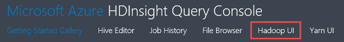

<properties
    pageTitle="偵錯中 HDInsight Hadoop︰ 檢視記錄與判讀的錯誤訊息 |Microsoft Azure"
    description="進一步瞭解管理 HDInsight 使用 PowerShell 時，您可能會收到錯誤訊息，若要復原，您可以採取的步驟。"
    services="hdinsight"
    tags="azure-portal"
    editor="cgronlun"
    manager="jhubbard"
    authors="mumian"
    documentationCenter=""/>

<tags
    ms.service="hdinsight"
    ms.workload="big-data"
    ms.tgt_pltfrm="na"
    ms.devlang="na"
    ms.topic="article"
    ms.date="09/02/2016"
    ms.author="jgao"/>

# 分析 HDInsight 記錄檔

Azure HDInsight 中的每個 Hadoop 叢集具有用來做為預設檔案系統的 Azure 儲存體帳戶。 儲存帳戶被指為預設儲存帳戶。 叢集使用 Azure 資料表儲存體和 Blob 儲存體預設儲存帳戶儲存的記錄。  若要瞭解叢集預設儲存帳戶，請參閱[管理 Hadoop 叢集 HDInsight 中](hdinsight-administer-use-management-portal.md#find-the-default-storage-account)。 記錄保留在 [儲存帳戶即使叢集會刪除。

##Azure 資料表寫入記錄檔

Azure 資料表寫入記錄檔提供一個層級的深入了解 HDInsight 叢集發生什麼事。

當您建立 HDInsight 叢集時，6 資料表會自動建立的預設資料表儲存體中的 [Linux 型叢集︰

- hdinsightagentlog
- 系統
- daemonlog
- hadoopservicelog
- ambariserverlog
- ambariagentlog

3 個資料表建立 Windows 型叢集︰

- setuplog︰ 佈建/設定的 HDInsight 叢集中發生的事件/例外狀況的記錄。
- hadoopinstalllog︰ 安裝 Hadoop 叢集上時所發生的事件/例外狀況的記錄。 此資料表可能會很有用偵錯時，使用自訂的參數建立叢集的相關問題。
- hadoopservicelog︰ 記錄事件/例外狀況的記錄的所有 Hadoop 服務。 此資料表可能會用於偵錯 HDInsight 叢集上的工作失敗的相關問題。

表格的檔名**u<ClusterName>DDMonYYYYatHHMMSSsss<TableName>**。

下列表格包含下列欄位︰

- ClusterDnsName
- ComponentName
- EventTimestamp
- Host （主機)
- MALoggingHash
- 訊息
- N
- PreciseTimeStamp
- 角色
- RowIndex
- 租用戶
- 時間戳記
- TraceLevel

### 存取記錄的工具

有許多工具可用來存取這些表格中的資料︰

-  Visual Studio
-  Azure 儲存檔案總管
-  Power Query for Excel

#### 使用 Power Query for Excel

Power Query 可以從[www.microsoft.com/en-us/download/details.aspx?id=39379]( http://www.microsoft.com/en-us/download/details.aspx?id=39379)安裝。 請參閱的系統需求的下載頁面

**使用 Power Query 開啟及分析服務記錄檔**

1. 開啟 [ **Microsoft Excel**]。
2. 從**Power Query** ] 功能表中，請按一下 [**從 Azure**，，然後按一下 [**從 Microsoft Azure 資料表儲存體**。
 
    
3. 輸入儲存體帳戶名稱。 這可以是簡短名稱或 FQDN。
4. 輸入的儲存空間帳戶金鑰。 您應該會看到資料表的清單︰

    
5. 以滑鼠右鍵按一下 hadoopservicelog 表格，在 [**導覽**] 窗格中的，選取 [**編輯**]。 您應該會看到 4 欄。 您也可以刪除**分割索引鍵****的資料列識別碼**，與**時間戳記**的欄，選取它們，然後從功能區中的選項中按一下 [**移除資料行**。
6. 按一下 [內容] 欄，選擇您想要將 Excel 試算表匯入的資料行中的 [展開] 圖示。 我的這個範例中，選擇 TraceLevel 及 ComponentName︰ 可讓我在元件有問題的一些基本資訊。

    
7. 按一下**[確定]**將資料匯入]。
8. 選取的**TraceLevel**、 角色及**ComponentName**資料行，然後按一下 [**群組依據**] 功能區中的控制項。
9. 按一下 [群組依據] 對話方塊中的**[確定**]
10. 按一下 [**套用並關閉**]。
 
您現在可以使用 Excel 來篩選及排序視。 當然，您可以向下切入問題發生時，但選取及分組上述的資料行提供不錯的 Hadoop 服務發生什麼事圖片時，才能加入其他資料行 （例如郵件）。 Setuplog 和 hadoopinstalllog 資料表可以套用相同的概念。

#### 使用 Visual Studio

**若要使用 Visual Studio**

1. 開啟 Visual Studio。
2. 從 [**檢視**] 功能表中，按一下 [**雲端的檔案總管**]。 直接按一下**CTRL +\, CTRL + X**。
3. 從**雲端的檔案總管**] 中，選取 [**資源類型**]。  **資源群組**時，其他可用的選項。
4. 展開 [**儲存帳戶**，預設儲存帳戶叢集，然後按一下 [**表格**]。
5. 按兩下**hadoopservicelog**。
6. 加入篩選。 例如︰
    
        TraceLevel eq 'ERROR'

    

    如需有關如何建構篩選的詳細資訊，請參閱[建構篩選字串的 [資料表設計工具](../vs-azure-tools-table-designer-construct-filter-strings.md)。
 
##Azure Blob 儲存體寫入記錄檔

[Azure 資料表寫入記錄檔](#log-written-to-azure-tables)提供一個層級的深入了解 HDInsight 叢集發生什麼事。 不過，這些表格不會提供任務層級記錄，有助於切入進一步將所發生的問題。 若要提供此的下一層級的詳細資料，HDInsight 叢集設定工作記錄寫入您已送出到 Templeton 任何工作的 Blob 儲存體帳戶。 實際上，這表示提交使用 Microsoft Azure PowerShell cmdlet 或.NET 工作送出 Api，不透過 RDP/命令列存取叢集送出的工作的工作。 

若要檢視的記錄，請參閱[Access YARN 應用程式登入 Linux 型 HDInsight](hdinsight-hadoop-access-yarn-app-logs-linux.md)。

如需有關應用程式記錄的詳細資訊，請參閱[Simplifying 使用者記錄管理和存取 YARN](http://hortonworks.com/blog/simplifying-user-logs-management-and-access-in-yarn/)。
 
 
## 檢視叢集健康狀況與工作記錄

###存取 Hadoop UI

從 Azure] 入口網站中，按一下 [開啟叢集刀 HDInsight 叢集名稱]。 從叢集刀中，按一下 [**儀表板**]。

出現提示時，請輸入叢集系統管理員認證。 在隨後便會開啟 [查詢主控台中，按一下 [ **Hadoop UI**]。

###存取 Yarn UI

從 Azure] 入口網站中，按一下 [開啟叢集刀 HDInsight 叢集名稱]。 從叢集刀中，按一下 [**儀表板**]。 出現提示時，請輸入叢集系統管理員認證。 在隨後便會開啟 [查詢主控台中，按一下 [ **YARN UI**]。

您可以使用 YARN UI，執行下列動作︰

* **取得叢集狀態**。 從左側的窗格中，展開**叢集**，並按一下 [**關於**]。 此簡報叢集狀態詳細資料，例如總計配置的記憶體，使用，核心叢集資源管理員的狀態，叢集版本等。

    

* **取得節點狀態**。 從左側的窗格中，展開**叢集**，然後按一下**節點**。 這會列出所有節點叢集，每個節點，HTTP 地址資源配置給每個節點等。

* **監視工作狀態**。 從左側的窗格中，展開**叢集**，，然後按一下 [**應用程式**清單中叢集的所有工作。 如果您想要查看特定的狀態 （例如，新的送出，執行等） 中的工作，按一下**應用程式**] 底下的適當連結。 您可以進一步按一下作業名稱，若要瞭解更多有關工作這類包括輸出、 記錄等。

###存取 HBase UI

從 Azure] 入口網站中，按一下 [開啟叢集刀 HDInsight HBase 叢集名稱]。 從叢集刀中，按一下 [**儀表板**]。 出現提示時，請輸入叢集系統管理員認證。 在隨後便會開啟 [查詢主控台中，按一下 [ **HBase UI**]。

## HDInsight 錯誤碼

來協助瞭解可能的錯誤狀況，他們可以管理使用 PowerShell 的 Azure 服務時所遇到 Hadoop Azure HDInsight 中的使用者，並建議從錯誤復原可以採取哪些步驟，就會提供分項本節中的錯誤訊息。

這些錯誤訊息的一些可能也會出現 Azure 入口網站中，用來管理 HDInsight 叢集時。 其他您可能會遇到的錯誤訊息，但有不太細分因為改善的動作可能在本文中的限制式。 在哪裡明顯降低內容提供其他錯誤訊息。 

### AtleastOneSqlMetastoreMustBeProvided
- **描述**︰ 請使用自訂設定的登錄區及 Oozie metastores 提供 Azure SQL 資料庫至少有一個元件的詳細資訊。
- **降低風險**︰ 使用者必須提供正確的 SQL Azure metastore 並再試一次要求。  

### AzureRegionNotSupported
- **描述**︰ 無法在地區*nameOfYourRegion*建立叢集。 使用有效的 HDInsight 區域，然後再試一次要求。
- **降低風險**︰ 客戶應該建立目前支援這些叢集地區︰ 東南亞、 西歐、 北歐洲、 東亞美國或西美國。  

### ClusterContainerRecordNotFound
- **描述**︰ 伺服器找不到要求的叢集記錄。  
- **降低風險**︰ 試一次。

### ClusterDnsNameInvalidReservedWord
- **描述**︰ 叢集 DNS 名稱*yourDnsName*不正確。 請確定名稱開始和結束的英數字元，而且只能包含 「-' 特殊字元  
- **降低風險**︰ 請確認您使用正確的 DNS 名稱叢集的開頭和結尾為英數字元，並包含沒有特殊字元破折號以外的 「-' 並再試一次。

### ClusterNameUnavailable
- **描述**︰ 叢集名稱*yourClusterName*就無法使用。 請挑選另一個名稱。  
- **降低風險**︰ 使用者應該指定唯一 clustername 和不存在於然後再試一次。 如果使用者使用的入口網站，UI 會通知他們如果叢集名稱已被使用在建立步驟。

### ClusterPasswordInvalid
- **描述**︰ 叢集密碼不正確。 密碼必須至少 10 個字元必須包含至少一個數字、 字母大寫、 小寫字母和不加空格的特殊字元，並不應該包含的使用者名稱的一部分。  
- **降低風險**︰ 輸入有效的叢集密碼，然後再試。

### ClusterUserNameInvalid
- **描述**︰ 叢集使用者名稱不正確。 請確定 [使用者名稱沒有包含特殊字元或空格。  
- **降低風險**︰ 提供有效叢集使用者名稱，然後再試。

### ClusterUserNameInvalidReservedWord
- **描述**︰ 叢集 DNS 名稱*yourDnsClusterName*不正確。 請確定名稱開始和結束的英數字元，而且只能包含 「-' 特殊字元  
- **降低風險**︰ 提供正確的 DNS 叢集使用者名稱，然後再試。

### ContainerNameMisMatchWithDnsName
- **描述**︰ 在 URI *yourcontainerURI*容器名稱] 和 [在邀請內文中的 DNS 名稱*yourDnsName*必須相同。  
- **降低風險**︰ 請確認您容器名稱] 和 [您的 DNS 名稱相同，並再試。

### DataNodeDefinitionNotFound
- **描述**︰ 無效叢集設定。 找不到節點大小的任何資料節點定義。  
- **降低風險**︰ 試一次。

### DeploymentDeletionFailure
- **描述**︰ 刪除部署失敗叢集  
- **降低風險**︰ 再試一次刪除作業。

### DnsMappingNotFound
- **描述**︰ 服務設定錯誤。 找不到所需的 DNS 對應資訊。  
- **降低風險**︰ 刪除叢集，建立新的叢集。

### DuplicateClusterContainerRequest
- **描述**︰ 複製叢集容器建立嘗試。 記錄存在於*nameOfYourContainer* ，但不是符合 Etag。
- **降低風險**︰ 提供容器的唯一名稱，並再試一次建立作業。

### DuplicateClusterInHostedService
- **描述**︰ 代管的服務*nameOfYourHostedService*已經包含叢集。 裝載的服務不能包含多個叢集  
- **降低風險**︰ 裝載在另一個代管服務叢集。

### FailureToUpdateDeploymentStatus
- **描述**︰ 伺服器無法更新叢集部署的狀態。  
- **降低風險**︰ 試一次。 如果這種情況多次，請連絡 CSS。

### HdiRestoreClusterAltered
- **描述**︰ 叢集*yourClusterName*已遭刪除進行的維修作業的一部分。 請重新建立叢集。
- **降低風險**︰ 重新建立叢集。

### HeadNodeConfigNotFound
- **描述**︰ 無效叢集設定。 節點大小中找不到所需的標頭節點設定。
- **降低風險**︰ 試一次。

### HostedServiceCreationFailure
- **描述**︰ 無法建立代管的服務*nameOfYourHostedService*。 請重試要求。  
- **降低風險**︰ 再試一次要求。

### HostedServiceHasProductionDeployment
- **描述**︰ 代管的服務*nameOfYourHostedService*已有生產部署。 裝載的服務不能包含多個生產部署。 使用不同的叢集名稱要求再試一次。
- **降低風險**︰ 使用不同的叢集的名稱，然後再試一次要求。

### HostedServiceNotFound
- **描述**︰ 找不到叢集的代管服務*nameOfYourHostedService* 。  
- **降低風險**︰ 如果叢集處於錯誤狀態時，將其刪除，然後再試一次。

### HostedServiceWithNoDeployment
- **描述**︰ 代管的服務*nameOfYourHostedService*具有沒有相關聯的部署。  
- **降低風險**︰ 如果叢集處於錯誤狀態時，將其刪除，然後再試一次。

### InsufficientResourcesCores
- **描述**︰ 若要建立叢集*yourClusterName*SubscriptionId *yourSubscriptionId*沒有核心左。 必要︰ *resourcesRequired*，可使用︰ *resourcesAvailable*。  
- **降低風險**︰ 釋出您的訂閱中的資源或增加可用訂閱的資源，並再次嘗試建立叢集。

### InsufficientResourcesHostedServices
- **描述**︰ 訂閱識別碼*yourSubscriptionId*沒有建立叢集*yourClusterName*新 HostedService 配額。  
- **降低風險**︰ 釋出您的訂閱中的資源或增加可用訂閱的資源，並再次嘗試建立叢集。

### InternalErrorRetryRequest
- **描述**︰ 伺服器發生內部錯誤。 請重試要求。  
- **降低風險**︰ 再試一次要求。

### InvalidAzureStorageLocation
- **描述**︰ Azure 儲存位置*dataRegionName*不是有效的位置。 確認地區正確無誤，然後再試一次要求。
- **降低風險**︰ 選擇支援 HDInsight 的儲存位置，檢查您的叢集會放在一起，然後再試。

### InvalidNodeSizeForDataNode
- **描述**︰ 資料節點無效的虛擬記憶體大小。 只 '大型的虛擬記憶體' 大小，支援所有的資料節點。  
- **降低風險**︰ 指定資料節點的受支援的節點大小，然後再試。

### InvalidNodeSizeForHeadNode
- **描述**︰ 無效的虛擬記憶體大小的標頭節點。 只有 「 ExtraLarge 的虛擬記憶體 ' 大小支援主節點。  
- **降低風險**︰ 指定主節點的受支援的節點大小，然後再試

### InvalidRightsForDeploymentDeletion
- **描述**︰ 所用的訂閱識別碼*yourSubscriptionId*沒有足夠的權限執行的叢集*yourClusterName*刪除作業。  
- **降低風險**︰ 叢集處於錯誤狀態時，如果放，然後再試一次。  

### InvalidStorageAccountBlobContainerName
- **描述**︰ 外部儲存帳戶 blob 容器名稱*yourContainerName*不正確。 請確定名稱以字母開頭，而且只包含大小寫字母、 數字和虛線。  
- **降低風險**︰ 指定有效的儲存空間帳戶 blob 容器名稱，然後再試。

### InvalidStorageAccountConfigurationSecretKey
- **描述**︰ 設定外部儲存帳戶*yourStorageAccountName*必須具有設定密碼的重要詳細資料。  
- **降低風險**︰ 指定的儲存空間帳戶有效私人索引鍵，然後再試。

### InvalidVersionHeaderFormat
- **描述**︰ 版本頁首*yourVersionHeader*不是有效的格式的 dd 日 mm yyyy。  
- **降低風險**︰ 指定版本標頭的有效格式並再試一次要求。

### MoreThanOneHeadNode
- **描述**︰ 無效叢集設定。 找到多個標頭節點設定。  
- **降低風險**︰ 編輯設定，指定該 onloy 一個主節點。

### OperationTimedOutRetryRequest
- **描述**︰ 無法在允許的時間內完成作業，或重新嘗試次數上限可能。 請重試要求。  
- **降低風險**︰ 再試一次要求。

### ParameterNullOrEmpty
- **描述**︰ 參數*yourParameterName*無法是空值或空白。  
- **降低風險**︰ 指定參數是有效的值。

### PreClusterCreationValidationFailure
- **描述**︰ 一或多個叢集建立要求輸入不正確。 請確定正確輸入的值，並再次要求。  
- **降低風險**︰ 請務必輸入的值無誤，然後再試一次要求。

### RegionCapabilityNotAvailable
- **描述**︰ 地區功能不適用於地區*yourRegionName*和訂閱識別碼*yourSubscriptionId*。  
- **降低風險**︰ 指定支援 HDInsight 叢集的區域。 公開支援區域︰ 東南亞、 西歐、 北歐洲、 東亞美國或西美國。

### StorageAccountNotColocated
- **描述**︰ 儲存帳戶*yourStorageAccountName*位於地區*currentRegionName*。 您應該與叢集地區*yourClusterRegionName*相同。  
- **降低風險**︰ 叢集位於同一個區域中指定儲存帳戶，或如果您的資料是在儲存帳戶，建立新的叢集為現有的儲存空間帳戶相同的區域。 如果您使用的入口網站，UI 將事先通知他們此問題。

### SubscriptionIdNotActive
- **描述**︰ 提供的訂閱識別碼*yourSubscriptionId*不是作用中。  
- **降低風險**︰ 重新啟動訂閱，或取得新的有效訂閱。

### SubscriptionIdNotFound
- **描述**︰ 找不到訂閱識別碼*yourSubscriptionId* 。  
- **降低風險**︰ 檢查您的訂閱 ID 是否有效，然後再試。

### UnableToResolveDNS
- **描述**︰ 無法解析 DNS *yourDnsUrl*。 請確定提供 blob 端點的完整的 URL。  
- **降低風險**︰ 提供有效 blob URL。 URL 必須完全有效，包括以*http://*開始及結束*.com*中。

### UnableToVerifyLocationOfResource
- **描述**︰ 無法驗證資源*yourDnsUrl*的位置。 請確定提供 blob 端點的完整的 URL。  
- **降低風險**︰ 提供有效 blob URL。 URL 必須完全有效，包括以*http://*開始及結束*.com*中。

### VersionCapabilityNotAvailable
- **描述**︰ 版本功能不適用於版本*specifiedVersion*和訂閱識別碼*yourSubscriptionId*。  
- **降低風險**︰ 選擇可用的版本，然後再試。

### VersionNotSupported
- **描述**︰ 版本*specifiedVersion*不受支援。
- **降低風險**︰ 選擇支援的版本，然後再試。

### VersionNotSupportedInRegion
- **描述**︰ 版本*specifiedVersion*不適用於 Azure 地區*specifiedRegion*。  
- **降低風險**︰ 選擇版本所支援的指定區域，然後再試。

### WasbAccountConfigNotFound
- **描述**︰ 無效叢集設定。 外部帳戶中找不到所需的 WASB 帳戶設定。  
- **降低風險**︰ 確認帳戶存在，且已正確設定中指定，然後再試。

## 後續步驟

- [使用 Ambari 檢視偵錯 Tez HDInsight 的工作](hdinsight-debug-ambari-tez-view.md)
- [啟用 Linux 型 HDInsight Hadoop 服務堆積傾的印](hdinsight-hadoop-collect-debug-heap-dump-linux.md)
- [使用 Ambari Web UI 管理 HDInsight 叢集](hdinsight-hadoop-manage-ambari.md)
