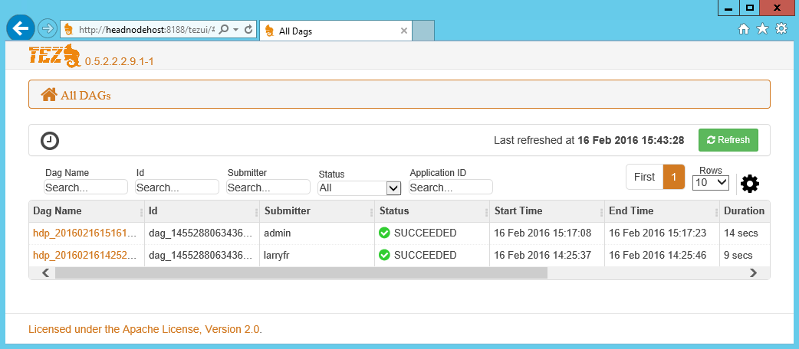
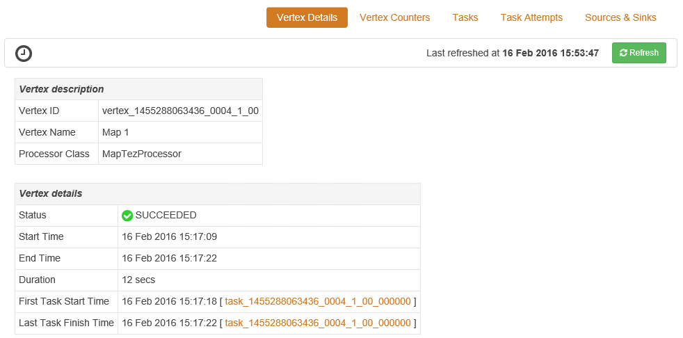

<properties
pageTitle="使用 Windows 型 HDInsight Tez UI |Azure"
description="瞭解如何使用 Tez UI 偵錯 Tez Windows 型 HDInsight HDInsight 的工作。"
services="hdinsight"
documentationCenter=""
authors="Blackmist"
manager="jhubbard"
editor="cgronlun"/>

<tags
ms.service="hdinsight"
ms.devlang="na"
ms.topic="article"
ms.tgt_pltfrm="na"
ms.workload="big-data"
ms.date="10/04/2016"
ms.author="larryfr"/>

# 使用 Tez UI 偵錯 Tez Windows 型 HDInsight 的工作

Tez UI 是一個網頁，可以用來瞭解和偵錯 Tez 作為執行引擎 Windows 型 HDInsight 叢集上的工作。 Tez 使用者介面，可讓您以視覺化方式呈現的連線的項目圖表的工作，每個項目，向下切入擷取統計資料和記錄資訊。

> [AZURE.NOTE] 這份文件中的資訊是 windows HDInsight 叢集特定項目。 在檢視與偵錯 Tez Linux 型 HDInsight 上的資訊，請參閱[使用 Ambari 檢視偵錯 Tez HDInsight 的工作](hdinsight-debug-ambari-tez-view.md)。

## 必要條件

* Windows 型 HDInsight 叢集。 如需建立新的叢集的步驟，請參閱[開始使用 Windows 型 HDInsight](hdinsight-hadoop-tutorial-get-started-windows.md)。

    > [AZURE.IMPORTANT] Tez UI 僅適用於 Windows 型 HDInsight 叢集 2016 年 2 月 8 日之後建立上的。

* Windows 型遠端桌面用戶端。

## 了解 Tez

Tez 是可延伸的架構，提供更大的速度比傳統 MapReduce Hadoop 中的資料處理。 針對 Windows 型 HDInsight 叢集，是一種選擇性引擎，您可以使用下列命令登錄區查詢的一部分來啟用登錄區︰

    set hive.execution.engine=tez;

當工作提交到 Tez 時，它會建立導向非循環圖 (DAG)，描述工作所需的動作的執行順序。 個別的動作是頂點，及執行一段整個工作。 頂點所述的工作的實際執行稱為工作，並可能散佈在多個叢集節點。

### 了解 Tez UI

Tez UI 是網頁提供資訊程序正在執行，或有先前執行使用 Tez。 其可讓您檢視產生的 Tez，DAG 如何分佈於目前叢集，例如使用的工作和頂點，錯誤資訊記憶體計數器。 它可能會提供有用的資訊，在以下情況︰

* 監控長處理程序檢視地圖的進度，和縮小工作。

* 分析歷程記錄的資料的成功或失敗的程序，若要瞭解如何處理可能可以改善或失敗的原因。

## 產生 DAG

如果使用 Tez 引擎目前正在執行，或已發生過去的工作，Tez UI 只會包含資料。 簡單的登錄區查詢通常可以解決不使用 Tez，不過更複雜的查詢的篩選、 群組、 排序，連接等通常會要求 Tez。

使用下列步驟執行，以執行使用 Tez 登錄區查詢。

1. 網頁瀏覽器中，瀏覽至 https://CLUSTERNAME.azurehdinsight.net，其中__CLUSTERNAME__是 HDInsight 叢集的名稱。

2. 在頁面頂端的功能表中，從選取的__登錄區編輯器__。 這會顯示包含下列範例查詢的頁面。

        Select * from hivesampletable

    清除範例查詢，並以下列取代。

        set hive.execution.engine=tez;
        select market, state, country from hivesampletable where deviceplatform='Android' group by market, country, state;

3. 選取 [__送出__] 按鈕。 在頁面底部的 [__工作階段__] 區段會顯示查詢的狀態。 一旦狀態變更為 [__已完成__，請選取 [__檢視詳細資料__連結至檢視結果。 __工作輸出__應如下︰
        
        en-GB   Hessen      Germany
        en-GB   Kingston    Jamaica
        en-GB   Nairobi Area    Kenya

## 使用 Tez UI

> [AZURE.NOTE] Tez UI 僅適用於從桌面叢集標頭節點的所以您必須使用遠端桌面連線至標頭的節點。

1. 從[Azure 入口網站](https://portal.azure.com)中，選取 [HDInsight 叢集]。 從 HDInsight 刀頂端，選取 [__遠端桌面__圖示]。 這會顯示遠端桌面刀

    

2. 從遠端桌面刀中，選取 [連線至叢集主節點的__連線__]。 出現提示時，使用叢集遠端桌面使用者名稱和密碼驗證連線。

    ![遠端桌面連線] 圖示](./media/hdinsight-debug-tez-ui/remotedesktopconnect.png)

    > [AZURE.NOTE] 如果您有沒有啟用遠端桌面連線，提供使用者名稱、 密碼和到期日，然後選取 [啟用遠端桌面的 [__啟用__]。 當已啟用時，使用上述步驟連線。

3. 連線之後，在遠端桌面開啟 Internet Explorer、 選取的瀏覽器中，右上角的齒輪圖示，然後選取__相容性檢視設定__。

4. __相容性檢視設定]__下方，清除的__相容性] 檢視中的顯示內部網路網站__，並__使用 Microsoft 相容性清單__，核取方塊，然後選取__關閉__。

5. 在 Internet Explorer 中，瀏覽至 http://headnodehost:8188/tezui / #/。 這會顯示 Tez UI

    

    Tez UI 載入時，您會看到目前正在執行，或已 DAGs 的清單執行叢集上。 預設檢視包含 Dag 名稱、 識別碼、 要是、 狀態、 開始時間、 結束時間、 持續時間、 應用程式識別碼和佇列。 可以使用右側的頁面的齒輪圖示新增更多的欄。

    如果您只有一個項目，就會在上一節中執行的查詢。 如果您有多個項目，您可以搜尋上方 DAGs，欄位中輸入搜尋準則，然後按下__Enter__。

4. 選取__Dag 名稱__的最新的 DAG 項目。 這會顯示 DAG，相關資訊，以及下載包含 DAG 的相關資訊之 JSON 檔案的 zip 的選項。

    

5. 上方__DAG 詳細資料__有多個可用於顯示 DAG 的相關資訊的連結。

    * __DAG 計數器__會顯示此 DAG 計數器資訊。
    
    * __圖形化檢視__會顯示此 DAG 的圖形化表示。
    
    * __所有的頂點__會顯示在此 DAG 頂點的清單。
    
    * __所有工作__會都顯示在此 DAG 中的所有頂點的工作清單。
    
    * __所有 TaskAttempts__都顯示嘗試執行此 DAG 工作的相關資訊。
    
    > [AZURE.NOTE] 如果您捲動頂點、 工作和 TaskAttempts 的資料行顯示，請注意到有檢視__計數器__和__檢視或下載記錄__每個資料列的連結。

    如果發生與工作失敗，DAG 詳細資料會顯示狀態為 [失敗，以及失敗的任務的相關資訊的連結。 診斷資訊會顯示下方 DAG 詳細資料。

7. 選取__圖形的檢視__。 隨後便會顯示 DAG 的圖形化表示。 您可以將滑鼠移到檢視以顯示相關的資訊中的每個頂點。

    

8. 按一下 [上一個頂點，將會載入該項目__頂點詳細資料__。 按一下__地圖 1__頂點，即可顯示此項目的詳細資料。 選取 [__確認__，以確認瀏覽]。

    

9. 請注意，您現在已在頁面頂端的頂點與工作相關的連結。

    > [AZURE.NOTE] 您也可以前往__DAG 詳細資料__、 選取__頂點詳細資料__，，然後選取 [__地圖 1__頂點到達此頁面。

    * __頂點計數器__會顯示此頂點計數器資訊。
    
    * __工作__會顯示此頂點的工作。
    
    * __任務會__顯示嘗試執行此頂點的工作的相關資訊。
    
    * __來源與接收__顯示資料來源，並接收此頂點。

    > [AZURE.NOTE] 以與 [上一個] 功能表中，您可以捲動欄顯示用於工作、 工作嘗試及來源 Sinks__ 來顯示每個項目的詳細資訊連結。

10. 選取 [__工作__]，然後選取項目為 [ __00_000000__。 這會顯示__工作詳細資料__，這項工作。 從這個畫面中，您可以檢視__任務計數器__和__工作嘗試__。

    

## 後續步驟

現在，您已經學會如何使用 Tez 檢視，進一步瞭解[使用登錄區 HDInsight 上](hdinsight-use-hive.md)。

Tez 詳細技術資訊，請參閱[Hortonworks Tez 頁面](http://hortonworks.com/hadoop/tez/)。
