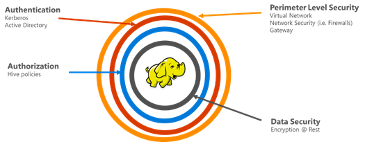

<properties
    pageTitle="安全 HDInsight 概觀 |Microsoft Azure"
    description="了解..."
    services="hdinsight"
    documentationCenter=""
    authors="saurinsh"
    manager="jhubbard"
    editor="cgronlun"
    tags="azure-portal"/>

<tags
    ms.service="hdinsight"
    ms.devlang="na"
    ms.topic="hero-article"
    ms.tgt_pltfrm="na"
    ms.workload="big-data"
    ms.date="10/24/2016"
    ms.author="saurinsh"/>

# 介紹網域 HDInsight 叢集 （預覽版本）

Azure HDInsight，直到今天支援只有單一使用者本機管理員]。 好使用較小的應用程式小組或部門。 Hadoop 以獲得更多常用性中企業類股負載，如需要使用企業成績功能等的 active directory 根據驗證、 多使用者支援與基礎的角色存取控制便會逐漸重要。 使用網域的 HDInsight 叢集時，您可以建立 Active Directory 網域 HDInsight 叢集、 設定從企業可以透過登入 HDInsight 叢集的 Azure Active Directory 驗證的員工的清單。 企業版之外的任何人無法登入，或存取 HDInsight 叢集。 企業系統管理員可以設定基礎的角色存取控制登錄區安全性使用[Apache Ranger](http://hortonworks.com/apache/ranger/)，因此限制存取至只需要與方法很類似的資料。 最後，管理員可以稽核員工的資料存取和完成] 以存取控制項原則，因此可達到高度的管理其企業資源的任何變更。

[AZURE.NOTE]> 在這個預覽中所述的新功能，可僅在 Linux 型 HDInsight 叢集登錄區工作量。 其他工作負載，例如 HBase、 火花、 大量和 Kafka，將會在未來版本中啟用。 

## 優點

企業安全性包含大四大 – 周邊的安全性、 驗證、 授權及加密。

.

### 外圍安全性

HDInsight 中的外圍安全性方法是使用虛擬網路和閘道服務。 現在，企業系統管理員可以建立虛擬網路內 HDInsight 叢集，並使用虛擬網路限制存取的網路安全性群組 （輸入或輸出防火牆規則）。 只在輸入的防火牆規則中定義的 IP 位址無法與 HDInsight 叢集，因此提供周邊安全通訊。 另一層的外圍安全性方法是使用閘道服務。 閘道器服務做為第一行措施 HDInsight 叢集任何內送的要求。 其接受要求，驗證，並只允許邀請為了叢集，因此提供叢集內的其他名稱與資料節點的周邊安全性的其他節點。

### 驗證

使用此公用預覽，企業系統管理員可以提供網域 HDInsight 叢集，[虛擬網路](https://azure.microsoft.com/services/virtual-network/)中。 管理企業的網域就會加入 HDInsight 叢集節點。 這被達成透過[Azure Active Directory 網域服務](https://technet.microsoft.com/library/cc770946.aspx)使用。 叢集內的所有節點都加入企業管理網域。 使用此設定，企業員工可以叢集節點使用自己的網域認證登入。 他們也可以使用其網域認證色調、 Ambari 檢視、 ODBC、 JDBC、 PowerShell 及 REST Api 來互動叢集等其他核准端點驗證方法。 管理員具有完全控制權限制的互動透過以下端點叢集使用者數目。

### 授權

最佳作法，後面接著大部分的企業是不是每位員工，存取所有的企業資源。 同樣地，在這個版本中，管理員可以定義叢集資源基礎的角色存取控制 」 原則。 例如，管理員可以設定[Apache Ranger](http://hortonworks.com/apache/ranger/)的登錄區設定存取控制 」 原則。 這項功能，可確保員工都能存取只需要進行工作的資料量。 SSH 存取叢集也是系統管理員，才能限制。

### 稽核

HDInsight 叢集資源防止未經授權的使用者，保護資料，以及所有叢集資源及資料存取，則需要追蹤未經授權或無意間產生的資源的存取權的。 使用這個預覽中，管理員可以檢視及回報所有存取 HDInsight 叢集資源及資料。 管理員也可以檢視及存取控制 」 原則完成 Apache Ranger 支援端點回報所有變更。 網域 HDInsight 叢集使用熟悉的 Apache Ranger 使用者介面，來搜尋稽核記錄。 在後端，Ranger 會使用[Apache Solr]( http://hortonworks.com/apache/solr/)可用來儲存及搜尋記錄。

### 加密

保護資料是很重要的會議組織的安全性與規範要求，以及限制存取資料從未經授權的員工，它應該也受到保護加密。 HDInsight 叢集、 Azure 儲存體 Blob，和 Azure 資料湖儲存兩個資料儲存區支援靜止透明的伺服器端[加密的資料](../storage/storage-service-encryption.md)。 安全叢集會流暢地使用此伺服器端加密的資料在其他功能的 HDInsight。

## 後續步驟

- 設定網域的 HDInsight 叢集，請參閱 <<c0>設定網域 HDInsight 叢集。
- 管理網域的 HDInsight 叢集，請參閱[管理網域的 HDInsight 叢集](hdinsight-domain-joined-manage.md)。
- 設定群組原則和執行登錄區查詢，請參閱[設定登錄區原則的網域的 HDInsight 叢集](hdinsight-domain-joined-run-hive.md)。
- 執行網域 HDInsight 叢集上使用 SSH 登錄區查詢，請參閱[使用 SSH Linux 為基礎的 Hadoop HDInsight Linux、 Unix，或 OS X 上使用](hdinsight-hadoop-linux-use-ssh-unix.md#connect-to-a-domain-joined-hdinsight-cluster)。