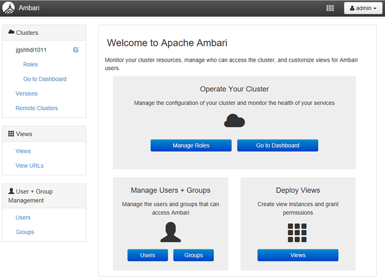
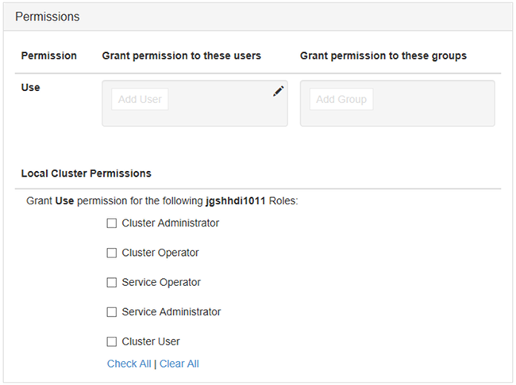

<properties
    pageTitle="管理網域的 HDInsight 叢集 |Microsoft Azure"
    description="瞭解如何管理網域的 HDInsight 叢集"
    services="hdinsight"
    documentationCenter=""
    authors="saurinsh"
    manager="jhubbard"
    editor="cgronlun"
    tags=""/>

<tags
    ms.service="hdinsight"
    ms.devlang="na"
    ms.topic="article"
    ms.tgt_pltfrm="na"
    ms.workload="big-data"
    ms.date="10/25/2016"
    ms.author="saurinsh"/>

# 管理網域的 HDInsight 叢集 （預覽版本）

瞭解使用者和網域的 HDInsight，以及如何管理網域的 HDInsight 叢集的角色。

## 加入網域的 HDInsight 叢集的使用者

未網域加入 HDInsight 叢集具有兩個叢集建立期間所建立的使用者帳戶︰

- **Ambari 管理**︰ 此帳戶亦稱為*Hadoop 使用者*或*HTTP 使用者*。 此帳戶可在 https:// 登入 Ambari&lt;clustername >。 azurehdinsight.net。 也可執行查詢 Ambari 檢視、 執行作業透過外部工具 （亦即 PowerShell Templeton、 Visual Studio），及驗證的登錄區 ODBC 驅動程式 」 和 「 （亦即 Excel 中或 Tableau） 的 BI 工具。

- **SSH 使用者**︰ 此帳戶可使用 SSH，並執行 sudo 命令。 有 Linux Vm 根權限。

加入網域的 HDInsight 叢集有三個新的使用者，除了 Ambari 管理員及 SSH 使用者。

- **Ranger 管理**︰ 此帳戶是本機 Apache Ranger 管理員帳戶。 不 active directory 網域使用者。 設定原則，並讓其他使用者的管理員或委派的管理員 （，這些使用者可以管理原則） 可到此帳戶。 根據預設，使用者名稱是*管理員*，不 Ambari 管理員密碼相同。 密碼可以從 [設定] 頁面中 Ranger 更新。

- **叢集管理員網域使用者**︰ 此帳戶是指定為包括 Ambari 和 Ranger Hadoop 叢集管理員 active directory 網域使用者。 您必須在叢集建立期間提供此使用者的認證。 此使用者擁有下列權限︰

    - 機器加入網域，並將其置於您指定在叢集建立期間 OU 中。
    - 建立您指定在叢集建立期間 OU 中的服務原則。 
    - 建立反向 DNS 項目。

    請注意其他 AD 使用者也擁有這些權限。 

    有一些結束點叢集 (例如，Templeton) 內的不由遊俠，管理，因此它們不安全。 這些結束點已鎖定叢集管理員網域使用者以外的所有使用者。 

- **一般**︰ 叢集建立期間，您可以提供多個 active directory 群組。 這些群組中的使用者會 Ranger 和 Ambari 同步處理。 這些使用者的網域的使用者，而且都可以存取只 Ranger 管理結束點 (例如，Hiveserver2)。 所有 RBAC 原則和稽核會不適用於這些使用者。

## 加入網域的 HDInsight 叢集的角色

加入網域的 HDInsight 有下列角色︰

- 叢集系統管理員
- 叢集運算子
- 服務管理員
- 服務運算子
- 叢集使用者

**若要查看這些角色的權限**

1. 開啟 Ambari 管理使用者介面。  請參閱[開啟 Ambari 管理使用者介面](#open-the-ambari-management-ui)。
2. 從左側功能表中，按一下 [**角色**]。
3. 按一下藍色問號若要查看的權限︰

    

## 開啟 [Ambari 管理使用者介面

1. [Azure 入口網站](https://portal.azure.com)登入。
2. 開啟刀 HDInsight 叢集。 請參閱[清單] 和 [顯示叢集](hdinsight-administer-use-management-portal.md#list-and-show-clusters)。
3. 開啟 Ambari 頂端的功能表中按一下 [**儀表板**]。
4. 登入 Ambari 叢集管理員網域的使用者名稱和密碼。
5. 按一下右上角的 [**管理員**] 下拉式功能表，然後按一下 [**管理 Ambari**。

    

    UI 看起來像︰

    

## 從您的 Active Directory 同步處理的網域使用者的清單

1. 開啟 Ambari 管理使用者介面。  請參閱[開啟 Ambari 管理使用者介面](#open-the-ambari-management-ui)。
2. 從左側功能表中，按一下 [**使用者**]。 您應該會看到 HDInsight 叢集，從您的 Active Directory 同步處理的所有使用者。

    

## 從您的 Active Directory 同步處理的網域群組] 清單

1. 開啟 Ambari 管理使用者介面。  請參閱[開啟 Ambari 管理使用者介面](#open-the-ambari-management-ui)。
2. 從左側功能表中，按一下 [**群組**]。 您應該看到 HDInsight 叢集，從您的 Active Directory 同步處理的所有群組。

    

## 設定登錄區檢視權限

1. 開啟 Ambari 管理使用者介面。  請參閱[開啟 Ambari 管理使用者介面](#open-the-ambari-management-ui)。
2. 從左側功能表中，按一下 [**檢視**]。
3. 按一下 [顯示詳細資料的**登錄區**]。

    

4. 按一下 [設定登錄區檢視的**登錄區檢視**連結]。
5. 捲動到 [**權限**] 區段。

    

6. 按一下 [**新增使用者**] 或 [**新增群組**]，然後指定使用者或群組，可以使用登錄區檢視。 

## 設定使用者的角色

 若要查看清單中的角色和權限，請參閱[角色的網域的 HDInsight 叢集](#roles-of-domain---joined-hdinsight-clusters)。

1. 開啟 Ambari 管理使用者介面。  請參閱[開啟 Ambari 管理使用者介面](#open-the-ambari-management-ui)。
2. 從左側功能表中，按一下 [**角色**]。
3. 按一下 [**新增使用者**或**新增群組**指派不同的角色的使用者和群組]。
 
## 後續步驟

- 設定網域的 HDInsight 叢集，請參閱 <<c0>設定網域 HDInsight 叢集。
- 設定群組原則和執行登錄區查詢，請參閱[設定登錄區原則的網域的 HDInsight 叢集](hdinsight-domain-joined-run-hive.md)。
- 執行網域 HDInsight 叢集上使用 SSH 登錄區查詢，請參閱[使用 SSH Linux 為基礎的 Hadoop HDInsight Linux、 Unix，或 OS X 上使用](hdinsight-hadoop-linux-use-ssh-unix.md#connect-to-a-domain-joined-hdinsight-cluster)。
