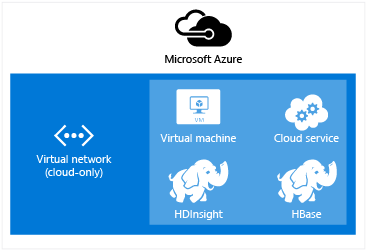

<properties
    pageTitle="擴充的虛擬網路 HDInsight |Microsoft Azure"  
    description="瞭解如何使用 Azure 虛擬網路連線至其他雲端資源或在您的資料中心的資源的 HDInsight"
    services="hdinsight"
    documentationCenter=""
    authors="Blackmist"
    manager="jhubbard"
    editor="cgronlun"/>

<tags
   ms.service="hdinsight"
   ms.devlang="na"
   ms.topic="article"
   ms.tgt_pltfrm="na"
   ms.workload="big-data"
   ms.date="10/21/2016"
   ms.author="larryfr"/>


#<a name="extend-hdinsight-capabilities-by-using-azure-virtual-network"></a>使用 Azure 虛擬網路延伸 HDInsight 功能

Azure 虛擬的網路可讓您延伸您 Hadoop 解決方案，若要將內部部署資源，例如 SQL Server，合併多個 HDInsight 叢集類型，或建立安全的私人網路之間雲端中的資源。

[AZURE.INCLUDE [upgrade-powershell](../../includes/hdinsight-use-latest-powershell-and-cli.md)]


##<a id="whatis"></a>什麼是 Azure 虛擬網路？

[Azure 虛擬網路](https://azure.microsoft.com/documentation/services/virtual-network/)可讓您建立一個包含您的方案，您需要的資源的安全、 持續網路。 虛擬的網路可讓您︰

* 連線一起私人網路 （雲端專用） 中的雲端資源。

    

    使用虛擬網路連結與 Azure HDInsight Azure 服務可讓以下情況︰

    * **叫用 HDInsight 服務或工作**從 Azure 網站或執行 Azure 虛擬機器中的服務。

    * HDInsight 和 Azure SQL 資料庫、 SQL Server 或虛擬機器上執行的其他資料儲存空間方案之間，**直接傳送資料**。

    * **合併多個 HDInsight 伺服器**成單一方案。 HDInsight 叢集了各種不同的類型，對應到工作負載或叢集調整為技術。 沒有建立，結合多個類型，例如大量和上一個叢集 HBase 叢集支援的方法。 使用虛擬網路，可讓多個叢集直接與彼此通訊。

* 使用虛擬私人網路 (VPN) 連線到您的本機資料中心網路 （至網站或點為網站） 雲端資源。

    網站若要設定可讓您可以使用硬體 VPN 或路由及遠端存取服務 Azure 虛擬網路連線的多個資源從您的資料中心。

    

    點-網站設定可讓您使用軟體 VPN 連線至 Azure 虛擬網路的特定的資源。

    

    使用虛擬網路雲端與您的資料中心的連結可讓類似的雲端專用設定案例。 但是，而不是受限於只使用雲端中的資源，您也可以與資源資料中心的。

    * **直接轉接資料**間 HDInsight 和您的資料中心。 範例使用 Sqoop 傳送資料，或從 SQL Server 或讀取線條的商務 (LOB) 應用程式所產生的資料。

    * **叫用 HDInsight 服務或工作**LOB 應用程式。 範例使用的 HBase Java Api 來儲存和從 HDInsight HBase 叢集擷取資料。

如需有關虛擬網路功能的優點，與功能的詳細資訊，請參閱[Azure 虛擬網路概觀](../virtual-network/virtual-networks-overview.md)。

> [AZURE.NOTE] 您必須建立 Azure 虛擬網路之前佈建 HDInsight 叢集。 如需詳細資訊，請參閱[虛擬網路設定工作](https://azure.microsoft.com/documentation/services/virtual-network/)。

## <a name="virtual-network-requirements"></a>虛擬網路需求

> [AZURE.IMPORTANT] 建立虛擬網路上的 HDInsight 叢集需要特定的虛擬網路設定、 本節所述。

###<a name="location-based-virtual-networks"></a>依據位置的虛擬網路

Azure HDInsight 支援只有依據位置的虛擬網路，及目前不適用於虛擬根據相關性] 群組中的網路。

###<a name="classic-or-v2-virtual-network"></a>傳統或 v2 虛擬網路

Windows 型叢集需要傳統的虛擬網路，而 Linux 型叢集需要 Azure 資源管理員虛擬網路。 如果您沒有正確的網路類型，它會無法使用時建立叢集。

如果您不是由您計劃要建立的叢集可用的虛擬網路上有資源，您可以建立新的虛擬網路使用叢集，並將其連線至不相容的虛擬網路。 然後您可以建立叢集請網路版，它將能夠存取其他網路中的資源之後，連接兩個。 如需有關如何連接傳統和新的虛擬網路的詳細資訊，請參閱[連線至新的 VNets 的傳統 VNets](../vpn-gateway/vpn-gateway-connect-different-deployment-models-portal.md)。

###<a name="custom-dns"></a>自訂 DNS

在建立虛擬網路時，Azure HDInsight 例如 Azure 網路上所安裝的服務提供預設名稱解析。 不過，您可能需要例如交叉網路的網域名稱解析的情況下使用您自己的網域名稱系統 (DNS)。 例如，何時位於兩個服務之間的通訊加入虛擬網路。 HDInsight 支援同時預設 Azure 名稱解析，以及自訂的 DNS 時使用 Azure 虛擬網路。

如需有關如何使用您自己的 DNS 伺服器與 Azure 虛擬網路的詳細資訊，請參閱__使用您自己的 DNS 伺服器的名稱解析__] 區段中[的 Vm 和角色執行個體名稱解析](../virtual-network/virtual-networks-name-resolution-for-vms-and-role-instances.md#name-resolution-using-your-own-dns-server)文件。

###<a name="secured-virtual-networks"></a>受到保護的虛擬網路

HDInsight 服務受管理的服務，且期間佈建和執行時，需要存取網際網路。 這是該 Azure 監視健康狀況的叢集，因此啟動叢集資源的容錯移轉、 變更縮放比例作業，透過叢集和其他管理工作的節點數目。

如果您需要安裝 HDInsight 至安全的虛擬網路，您必須允許輸入的存取允許管理 HDInsight 叢集 Azure 下列 IP 位址的連接埠 443 上。

* 168.61.49.99
* 23.99.5.239
* 168.61.48.131
* 138.91.141.162

允許輸入的存取這些位址的連接埠 443 可讓您順利將受到保護的虛擬網路安裝 HDInsight。

> [AZURE.IMPORTANT] HDInsight 不支援限制外寄流量，只輸入流量。 定義時包含 HDInsight 子網路安全性群組規則，僅使用連入的規則。

下列範例會示範如何建立新的網路安全性群組，可讓必要的地址，並在您的虛擬網路的子網路適用於 [安全性] 群組。 這些步驟是假設您有建立您想要安裝到 HDInsight 的虛擬網路和子網路。

__使用 PowerShell 的 Azure__

    $vnetName = "Replace with your virtual network name"
    $resourceGroupName = "Replace with the resource group the virtual network is in"
    $subnetName = "Replace with the name of the subnet that HDInsight will be installed into"
    # Get the Virtual Network object
    $vnet = Get-AzureRmVirtualNetwork `
        -Name $vnetName `
        -ResourceGroupName $resourceGroupName
    # Get the region the Virtual network is in.
    $location = $vnet.Location
    # Get the subnet object
    $subnet = $vnet.Subnets | Where-Object Name -eq $subnetName
    # Create a new Network Security Group.
    # And add exemptions for the HDInsight health and management services.
    $nsg = New-AzureRmNetworkSecurityGroup `
        -Name "hdisecure" `
        -ResourceGroupName $resourceGroupName `
        -Location $location `
        | Add-AzureRmNetworkSecurityRuleConfig `
            -name "hdirule1" `
            -Description "HDI health and management address 168.61.49.99" `
            -Protocol "*" `
            -SourcePortRange "*" `
            -DestinationPortRange "443" `
            -SourceAddressPrefix "168.61.49.99" `
            -DestinationAddressPrefix "VirtualNetwork" `
            -Access Allow `
            -Priority 300 `
            -Direction Inbound `
        | Add-AzureRmNetworkSecurityRuleConfig `
            -Name "hdirule2" `
            -Description "HDI health and management 23.99.5.239" `
            -Protocol "*" `
            -SourcePortRange "*" `
            -DestinationPortRange "443" `
            -SourceAddressPrefix "23.99.5.239" `
            -DestinationAddressPrefix "VirtualNetwork" `
            -Access Allow `
            -Priority 301 `
            -Direction Inbound `
        | Add-AzureRmNetworkSecurityRuleConfig `
            -Name "hdirule3" `
            -Description "HDI health and management 168.61.48.131" `
            -Protocol "*" `
            -SourcePortRange "*" `
            -DestinationPortRange "443" `
            -SourceAddressPrefix "168.61.48.131" `
            -DestinationAddressPrefix "VirtualNetwork" `
            -Access Allow `
            -Priority 302 `
            -Direction Inbound `
        | Add-AzureRmNetworkSecurityRuleConfig `
            -Name "hdirule4" `
            -Description "HDI health and management 138.91.141.162" `
            -Protocol "*" `
            -SourcePortRange "*" `
            -DestinationPortRange "443" `
            -SourceAddressPrefix "138.91.141.162" `
            -DestinationAddressPrefix "VirtualNetwork" `
            -Access Allow `
            -Priority 303 `
            -Direction Inbound
    # Set the changes to the security group
    Set-AzureRmNetworkSecurityGroup -NetworkSecurityGroup $nsg
    # Apply the NSG to the subnet
    Set-AzureRmVirtualNetworkSubnetConfig `
        -VirtualNetwork $vnet `
        -Name $subnetName `
        -AddressPrefix $subnet.AddressPrefix `
        -NetworkSecurityGroupId $nsg

__使用 Azure CLI__

1. 使用下列命令以建立新的網路名稱為安全性群組`hdisecure`。 資源群組包含 Azure 虛擬網路和建立群組中的位置 （區域），取代__RESOURCEGROUPNAME__和__位置__。

        azure network nsg create RESOURCEGROUPNAME hdisecure LOCATION
    
    只要建立群組之後，您會收到 [新增] 群組的詳細資訊。 尋找類似以下的線條，然後儲存`/subscriptions/GUID/resourceGroups/RESOURCEGROUPNAME/providers/Microsoft.Network/networkSecurityGroups/hdisecure`資訊。 接下來的步驟中，將使用它。
    
        data:    Id                              : /subscriptions/GUID/resourceGroups/RESOURCEGROUPNAME/providers/Microsoft.Network/networkSecurityGroups/hdisecure

2. 您可以使用下列新增至新的網路安全性群組的允許從 Azure HDInsight 健康狀況與管理服務的連接埠 443 的輸入的通訊的規則。 __RESOURCEGROUPNAME__取代包含 Azure 虛擬網路的資源群組的名稱。

        azure network nsg rule create RESOURCEGROUPNAME hdisecure hdirule1 -p "*" -o "*" -u "443" -f "168.61.49.99" -e "VirtualNetwork" -c "Allow" -y 300 -r "Inbound"
        azure network nsg rule create RESOURCEGROUPNAME hdisecure hdirule2 -p "*" -o "*" -u "443" -f "23.99.5.239" -e "VirtualNetwork" -c "Allow" -y 301 -r "Inbound"
        azure network nsg rule create RESOURCEGROUPNAME hdisecure hdirule3 -p "*" -o "*" -u "443" -f "168.61.48.131" -e "VirtualNetwork" -c "Allow" -y 302 -r "Inbound"
        azure network nsg rule create RESOURCEGROUPNAME hdisecure hdirule4 -p "*" -o "*" -u "443" -f "138.91.141.162" -e "VirtualNetwork" -c "Allow" -y 303 -r "Inbound"

3. 只要建立規則之後，請使用下列子網路套用新的網路安全性群組。 __RESOURCEGROUPNAME__取代包含 Azure 虛擬網路的資源群組的名稱。 取代__VNETNAME__與__SUBNETNAME__ Azure 虛擬網路安裝 HDInsight 時，您會使用子網路的名稱。

        azure network vnet subnet set RESOURCEGROUPNAME VNETNAME SUBNETNAME -w "/subscriptions/GUID/resourceGroups/RESOURCEGROUPNAME/providers/Microsoft.Network/networkSecurityGroups/hdisecure"
    
    這個命令完成後，您可以順利安裝 HDInsight，至安全的虛擬網路，使用這些步驟中的子網路上。

> [AZURE.IMPORTANT] Azure 雲端上使用上述步驟只開啟 access，HDInsight 健康狀況與管理服務。 這可讓您已成功安裝 HDInsight 叢集子網路，不過預設會封鎖外部虛擬網路從 HDInsight 叢集存取。 您必須新增額外的網路安全性群組規則，如果您想要啟用外部虛擬網路的存取。
>
> 例如，若要從網際網路允許 SSH 存取，您將需要新增類似下列規則︰ 
>
> * Azure PowerShell-```Add-AzureRmNetworkSecurityRuleConfig -Name "SSSH" -Description "SSH" -Protocol "*" -SourcePortRange "*" -DestinationPortRange "22" -SourceAddressPrefix "*" -DestinationAddressPrefix "VirtualNetwork" -Access Allow -Priority 304 -Direction Inbound```
> * Azure CLI-```azure network nsg rule create RESOURCEGROUPNAME hdisecure hdirule4 -p "*" -o "*" -u "22" -f "*" -e "VirtualNetwork" -c "Allow" -y 304 -r "Inbound"```

如需有關網路安全性群組的詳細資訊，請參閱[網路安全性群組概觀](../virtual-network/virtual-networks-nsg.md)。 控制中 Azure 虛擬網路路由的詳細資訊，請參閱[使用者定義的路徑與 IP 轉接](../virtual-network/virtual-networks-udr-overview.md)。

##<a id="tasks"></a>工作和資訊

本節的一般工作的詳細資訊和 HDInsight 使用虛擬網路時，您可能會需要的資訊。

###<a name="determine-the-fqdn"></a>決定 FQDN

HDInsight 叢集會被指派虛擬網路介面的特定完整的網域名稱 (FQDN)。 這是連接到叢集從虛擬網路上其他資源時，應使用的地址。 若要判斷 FQDN，請使用下列 URL 查詢 Ambari 管理服務︰

    https://<clustername>.azurehdinsight.net/ambari/api/v1/clusters/<clustername>.azurehdinsight.net/services/<servicename>/components/<componentname>

> [AZURE.NOTE] 如需有關如何使用 HDInsight Ambari 的詳細資訊，請參閱[監視器 Hadoop 叢集中使用 Ambari API HDInsight](hdinsight-monitor-use-ambari-api.md)。

您必須指定叢集名稱的服務和元件叢集，例如 YARN 資源管理員上執行。

> [AZURE.NOTE] 傳回的資料是 JavaScript 物件標記法 (JSON) 文件包含許多元件的相關資訊。 若要擷取只 FQDN，您應該使用 JSON 剖析器來擷取`host_components[0].HostRoles.host_name`值。

例如，若要從 HDInsight Hadoop 叢集傳回 FQDN，您可以使用以下兩種方法的其中一個來擷取資料的 YARN 資源管理員︰

* [Azure PowerShell](../powershell-install-configure.md)

        $ClusterDnsName = <clustername>
        $Username = <cluster admin username>
        $Password = <cluster admin password>
        $DnsSuffix = ".azurehdinsight.net"
        $ClusterFQDN = $ClusterDnsName + $DnsSuffix

        $webclient = new-object System.Net.WebClient
        $webclient.Credentials = new-object System.Net.NetworkCredential($Username, $Password)

        $Url = "https://" + $ClusterFQDN + "/ambari/api/v1/clusters/" + $ClusterFQDN + "/services/yarn/     components/resourcemanager"
        $Response = $webclient.DownloadString($Url)
        $JsonObject = $Response | ConvertFrom-Json
        $FQDN = $JsonObject.host_components[0].HostRoles.host_name
        Write-host $FQDN

* [cURL](http://curl.haxx.se/)和[jq](http://stedolan.github.io/jq/)

        curl -G -u <username>:<password> https://<clustername>.azurehdinsight.net/ambari/api/v1/clusters/<clustername>.azurehdinsight.net/services/yarn/components/resourcemanager | jq .host_components[0].HostRoles.host_name

###<a name="connecting-to-hbase"></a>連線到 HBase

若要連線至 HBase 遠端使用 Java API，您必須決定 HBase 叢集動物園管理員仲裁地址，然後指定此應用程式中。

若要取得動物園管理員仲裁地址，請使用以下兩種方法的其中一個查詢 Ambari 管理服務︰

* [Azure PowerShell](../powershell-install-configure.md)

        $ClusterDnsName = <clustername>
        $Username = <cluster admin username>
        $Password = <cluster admin password>
        $DnsSuffix = ".azurehdinsight.net"
        $ClusterFQDN = $ClusterDnsName + $DnsSuffix

        $webclient = new-object System.Net.WebClient
        $webclient.Credentials = new-object System.Net.NetworkCredential($Username, $Password)

        $Url = "https://" + $ClusterFQDN + "/ambari/api/v1/clusters/" + $ClusterFQDN + "/configurations?type=hbase-site&tag=default&fields=items/properties/hbase.zookeeper.quorum"
        $Response = $webclient.DownloadString($Url)
        $JsonObject = $Response | ConvertFrom-Json
        Write-host $JsonObject.items[0].properties.'hbase.zookeeper.quorum'

* [cURL](http://curl.haxx.se/)和[jq](http://stedolan.github.io/jq/)

        curl -G -u <username>:<password> "https://<clustername>.azurehdinsight.net/ambari/api/v1/clusters/<clustername>.azurehdinsight.net/configurations?type=hbase-site&tag=default&fields=items/properties/hbase.zookeeper.quorum" | jq .items[0].properties[]

> [AZURE.NOTE] 如需有關如何使用 HDInsight Ambari 的詳細資訊，請參閱[監視器 Hadoop 叢集中使用 Ambari API HDInsight](hdinsight-monitor-use-ambari-api.md)。

一旦您有仲裁資訊，請在用戶端應用程式中使用。

例如 [使用 HBase API Java 應用程式，您會**hbase site.xml**檔案新增至專案和檔案中指定的仲裁資訊如下︰

```
<configuration>
  <property>
    <name>hbase.cluster.distributed</name>
    <value>true</value>
  </property>
  <property>
    <name>hbase.zookeeper.quorum</name>
    <value>zookeeper0.address,zookeeper1.address,zookeeper2.address</value>
  </property>
  <property>
    <name>hbase.zookeeper.property.clientPort</name>
    <value>2181</value>
  </property>
</configuration>
```

###<a name="verify-network-connectivity"></a>確認網路連線

某些服務，例如 SQL Server，可以限制內送的網路連線。 如此可避免 HDInsight 順利使用這些服務。

如果您遇到從 HDInsight 存取服務的問題，請參閱以確保您已啟用網路存取服務的文件。 您也可以驗證網路存取，您可以在相同的虛擬網路上建立 Azure 虛擬機器，並使用用戶端工具驗證虛擬機器可以透過虛擬網路連線至服務。

##<a id="nextsteps"></a>後續步驟

下列範例會示範如何使用 Azure 虛擬網路 HDInsight:

* [大量與 HBase HDInsight 中的分析感應器資料](hdinsight-storm-sensor-data-analysis.md)-示範如何在虛擬網路中，設定大量和 HBase 叢集，以及如何從遠端寫入從大量 HBase 資料。

* [佈建 Hadoop 叢集中 HDInsight](hdinsight-hadoop-provision-linux-clusters.md) -提供的相關資訊佈建 Hadoop 叢集，包括使用 Azure 虛擬網路的資訊。

* [使用 Hadoop HDInsight 中使用 Sqoop](hdinsight-use-sqoop-mac-linux.md) -提供使用 Sqoop 轉移到虛擬網路與 SQL Server 資料的資訊。

若要進一步瞭解 Azure 虛擬網路，請參閱[Azure 虛擬網路概觀](../virtual-network/virtual-networks-overview.md)。
