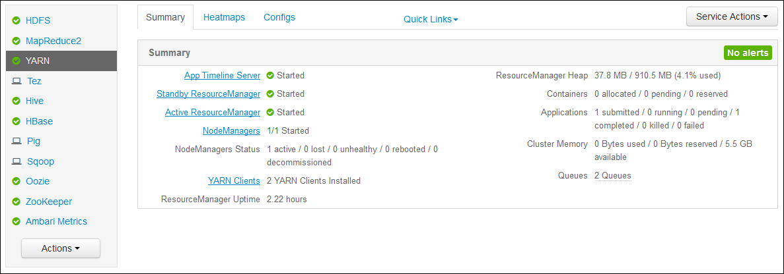

<properties
    pageTitle="Access Hadoop YARN 應用程式登入 Linux 型 HDInsight |Microsoft Azure"
    description="瞭解如何存取 YARN 應用程式的記錄檔 Linux HDInsight (Hadoop) 叢集使用命令列和網頁瀏覽器上。"
    services="hdinsight"
    documentationCenter=""
    tags="azure-portal"
    authors="Blackmist" 
    manager="jhubbard"
    editor="cgronlun"/>

<tags
    ms.service="hdinsight"
    ms.workload="big-data"
    ms.tgt_pltfrm="na"
    ms.devlang="na"
    ms.topic="article"
    ms.date="10/21/2016"
    ms.author="larryfr"/>

# Access YARN 應用程式登入 Linux 型 HDInsight 

這份文件會說明如何存取 YARN （尚未另一個資源談判者） 應用程式中 Azure HDInsight Hadoop 叢集上完成的記錄。

> [AZURE.NOTE] 這份文件中的資訊是特定 Linux 型 HDInsight 叢集。 在 Windows 型叢集上的資訊，請參閱[Access YARN 應用程式登入 Windows 型 HDInsight](hdinsight-hadoop-access-yarn-app-logs.md)

## 必要條件

* Linux 型 HDInsight 叢集。

* 您必須[建立一個 SSH 通道](hdinsight-linux-ambari-ssh-tunnel.md)才能存取 ResourceManager 記錄 web ui。

## YARN 時間表伺服器

[YARN 時間表伺服器](http://hadoop.apache.org/docs/r2.4.0/hadoop-yarn/hadoop-yarn-site/TimelineServer.html)提供的一般資訊已完成的應用程式，以及透過兩種不同的介面架構特定應用程式的資訊。 特別是︰

* 儲存與一般的應用程式上的資訊 HDInsight 叢集擷取已啟用版本 3.1.1.374 或更新版本。
* 時間表伺服器的架構特定應用程式資訊元件不適目前 HDInsight 叢集上。

應用程式的一般資訊包含下列排序的資料︰

* 應用程式識別碼，應用程式的唯一識別碼
* 啟動應用程式的使用者
* 若要完成應用程式，嘗試的詳細資訊
* 使用任何指定的應用程式嘗試容器

## YARN 應用程式和記錄

YARN 支援耦合從應用程式排程/監視資源管理多個程式模型 (MapReduce 正在其中)。 這是透過全域*ResourceManager* (RM)、 每個工作者節點*NodeManagers* (NMs)，以及每個應用程式*ApplicationMasters*反飛彈 （系統）。 每個應用程式 AM 交涉資源 （CPU、 記憶體、 磁碟、 網路） RM.執行您的應用程式 RM 搭配 NMs 授與這些資源，取得做為*容器*。 上午負責追蹤由 RM.分派給該容器的進度 應用程式，可能需要根據性質的應用程式的許多容器。

此外，每個應用程式可能會包含多個*應用程式嘗試*才能完成時當機或遺失的 AM 之間的通訊和 RM. 因此，容器會授與應用程式的特定嘗試。 在意義上，容器提供基本的 YARN 應用程式所執行的工時單位的內容，並在單一工作節點的配置容器上執行完成容器的內容中的所有工作。 請參閱[YARN 概念][YARN-concepts]進一步參照。

應用程式記錄 （和相關聯的容器記錄） 非常重要偵錯問題 Hadoop 應用程式。 提供用於收集與彙總，儲存應用程式與[記錄彙總]的記錄檔的部份架構，YARN[log-aggregation]功能。 記錄檔彙總功能讓您存取應用程式記錄更重要，跨工作者節點上的所有容器會彙總記錄並將它儲存為一個彙總記錄檔每個工作者節點預設檔案系統上，在應用程式完成之後。 您的應用程式可能會使用數百或數以千計的容器，但在單一工作節點上執行的所有容器的記錄一律會彙總至單一檔案]，產生一個記錄檔，每個應用程式所使用的工作者節點。 HDInsight 叢集上的預設會啟用記錄彙總 (3.0 版及以上)，及彙總的記錄可以在下列位置叢集的預設容器中找到︰

    wasbs:///app-logs/<user>/logs/<applicationId>

位置，*使用者*的 [啟動應用程式的使用者名稱，而*applicationId*會 YARN RM.由指定的應用程式的唯一識別碼

彙總的記錄不是直接讀取，他們會以[TFile]撰寫[T-file]，[二進位格式][binary-format]編製索引容器。 若要檢視這些記錄以純文字形式的應用程式或感興趣的容器，您必須使用 YARN ResourceManager 記錄或 CLI 工具。 

##YARN CLI 工具

若要使用的 YARN CLI 工具，您必須先連線到使用 SSH HDInsight 叢集。 針對 SSH 使用 HDInsight 的詳細資訊，請使用下列文件的其中一個︰

- [使用上 HDInsight Linux、 Unix，或 OS X 的 Linux 型 Hadoop SSH](hdinsight-hadoop-linux-use-ssh-unix.md)

- [使用上從 Windows HDInsight Linux 為基礎的 Hadoop SSH](hdinsight-hadoop-linux-use-ssh-windows.md)
    
您可以藉由執行下列命令其中一項，以純文字檢視這些記錄︰

    yarn logs -applicationId <applicationId> -appOwner <user-who-started-the-application>
    yarn logs -applicationId <applicationId> -appOwner <user-who-started-the-application> -containerId <containerId> -nodeAddress <worker-node-address>
    
您必須指定&lt;applicationId >，&lt;使用者-誰-啟動--應用程式 >， &lt;containerId >，及與 ltworker 節點位址 > 資訊時執行這些命令。

##YARN ResourceManager UI

YARN ResourceManager UI 支援叢集 headnode 中，而且可以透過 Ambari 網頁 UI; 存取不過，您必須[建立一個 SSH 通道](hdinsight-linux-ambari-ssh-tunnel.md)的第一個才能存取 ResourceManager ui。

當您建立一個 SSH 通道之後時，請使用下列步驟來檢視的 YARN 記錄︰

1. 在網頁瀏覽器，瀏覽到 https://CLUSTERNAME.azurehdinsight.net。 CLUSTERNAME 換成您 HDInsight 叢集的名稱。

2. 從左側的服務清單中，選取 [ __YARN__]。

    

3. 從 [__快速連結__] 下拉式清單中，選取一個叢集標頭節點，然後選取__ResourceManager 記錄__。

    
    
    您會看到 YARN 記錄檔的連結清單。

[YARN-timeline-server]:http://hadoop.apache.org/docs/r2.4.0/hadoop-yarn/hadoop-yarn-site/TimelineServer.html
[log-aggregation]:http://hortonworks.com/blog/simplifying-user-logs-management-and-access-in-yarn/
[T-file]:https://issues.apache.org/jira/secure/attachment/12396286/TFile%20Specification%2020081217.pdf
[binary-format]:https://issues.apache.org/jira/browse/HADOOP-3315
[YARN-concepts]:http://hortonworks.com/blog/apache-hadoop-yarn-concepts-and-applications/
