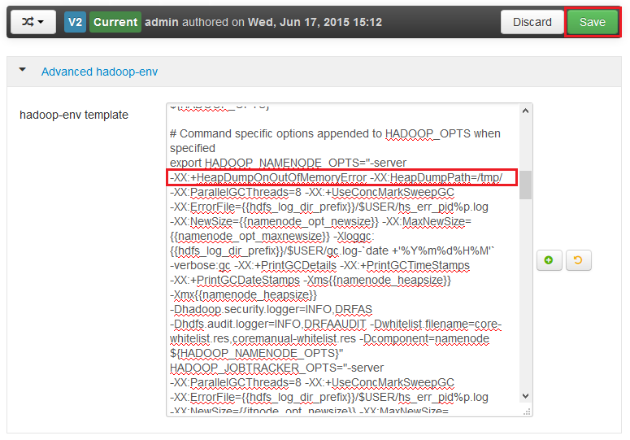

<properties
    pageTitle="啟用的 HDInsight Hadoop 服務堆積傾印 |Microsoft Azure"
    description="啟用堆積傾印 Hadoop 服務與 Linux 型 HDInsight 叢集偵錯和分析。"
    services="hdinsight"
    documentationCenter=""
    authors="Blackmist"
    manager="jhubbard"
    editor="cgronlun"
    tags="azure-portal"/>

<tags
    ms.service="hdinsight"
    ms.workload="big-data"
    ms.tgt_pltfrm="na"
    ms.devlang="na"
    ms.topic="article"
    ms.date="09/27/2016"
    ms.author="larryfr"/>

#啟用堆積傾印的 Hadoop 服務 Linux HDInsight （預覽版本）

[AZURE.INCLUDE [heapdump-selector](../../includes/hdinsight-selector-heap-dump.md)]

堆積傾印包含應用程式的記憶體，包括變數的值建立傾印的時間的快照。 因此，如果他們是很有用的診斷在執行階段所發生的問題。

> [AZURE.NOTE] 本文中的資訊僅適用於 Linux 型 HDInsight。 在 Windows 型 HDInsight 上的資訊，請參閱[啟用的 windows HDInsight Hadoop 服務堆積傾印](hdinsight-hadoop-collect-debug-heap-dumps.md)

## 服務

您可以啟用堆積傾印下列服務︰

*  **hcatalog** tempelton
*  **登錄區**-hiveserver2 metastore、 derbyserver
*  **mapreduce** jobhistoryserver
*  **yarn** -resourcemanager nodemanager、 timelineserver
*  **hdfs** -datanode secondarynamenode、 namenode

您也可以啟用堆積傾印對應，並減少 HDInsight 程序執行。

## 了解堆積傾印設定

堆積傾印已啟用傳遞選項 (有時稱為選擇從，或參數) 至 JVM 時啟動服務。 如需大部分 Hadoop 服務，這可以完成修改啟動服務所用的命令介面指令碼。

在 [每個指令碼有匯出， ** \* \_OPTS**，其中包含傳遞至 JVM 的選項。 例如，在**hadoop env.sh**指令碼行的開頭`export HADOOP_NAMENODE_OPTS=`包含 NameNode 服務的選項。

對應，並減少程序會稍有不同，這些是 MapReduce 服務的子程序。 每個對應或減少子容器中執行的程序，而且有包含這些 JVM 選項的兩個項目。 同時包含在**mapred site.xml**:

* **mapreduce.admin.map.child.java.opts**
* **mapreduce.admin.reduce.child.java.opts**

> [AZURE.NOTE] 建議使用 Ambari 修改指令碼和 mapred site.xml 設定]，以 Ambari 會處理複寫各叢集節點的變更。 請參閱[使用 Ambari](#using-ambari)節的特定的步驟。

###啟用堆積傾印

OutOfMemoryError 發生時，下列選項可讓堆積傾印︰

    -XX:+HeapDumpOnOutOfMemoryError

**+**表示已啟用此選項。 預設會停用。

> [AZURE.WARNING] 堆積傾印未啟用 Hadoop 服務上 HDInsight 根據預設，當傾印檔案可能大。 如果您啟用這些疑難排解，請記得重現問題並收集傾印檔案之後，停用它們。

###傾印位置

傾印檔案的預設位置是目前的工作目錄。 您可以控制位置的檔案儲存在使用下列選項︰

    -XX:HeapDumpPath=/path

例如，使用`-XX:HeapDumpPath=/tmp`會儲存在 /tmp 目錄傾印。

###指令碼

**OutOfMemoryError**發生時，您也可以觸發指令碼。 讓您瞭解發生錯誤，例如觸發通知。 這被控制使用下列選項︰

    -XX:OnOutOfMemoryError=/path/to/script

> [AZURE.NOTE] 由於 Hadoop 分散式的系統，使用任何指令碼必須放在叢集服務上執行的所有節點上。
>
> 執行指令碼必須也會在執行存新檔]，及必須提供的服務帳戶可存取的位置權限。 例如，您可能想要儲存中的指令碼`/usr/local/bin`並使用`chmod go+rx /usr/local/bin/filename.sh`授與讀取及執行權限。

##使用 Ambari

若要修改的服務設定，請使用下列步驟︰

1. 開啟叢集 Ambari 網頁 UI。 URL 會 https://YOURCLUSTERNAME.azurehdinsight.net 」。

    出現提示時，驗證 HTTP 帳戶名稱的網站 (預設︰ 管理員，) 和密碼，為您的叢集。

    > [AZURE.NOTE] 您可能會提示您一次以 Ambari 的使用者名稱和密碼。 如果是這樣，只要重新輸入相同的帳戶名稱和密碼

2. 使用左邊的清單，選取您要修改的 [服務] 區域。 例如， **HDFS**。 在 [管理中心] 區域中，選取 [**設定**] 索引標籤。

    ![Ambari web HDFS 設定] 索引標籤為選取的圖像](./media/hdinsight-hadoop-heap-dump-linux/serviceconfig.png)

3. 使用**篩選...**項目，請**選擇從**輸入。 這會篩選僅這些包含此文字中，設定項目清單，快速尋找 shell 指令碼或**範本**可用來設定這些選項。

    

4. 尋找**\* \_OPTS**服務項目您想要啟用堆積傾印，並新增您想要啟用的選項。 在下圖中，我已新增`-XX:+HeapDumpOnOutOfMemoryError -XX:HeapDumpPath=/tmp/`至**HADOOP\_NAMENODE\_OPTS**項目︰

    

    > [AZURE.NOTE] 當啟用堆積地圖傾印或減少子程序時，您會改為查看欄位標記為**mapreduce.admin.map.child.java.opts**和**mapreduce.admin.reduce.child.java.opts**。

    使用 [**儲存**] 按鈕以儲存變更。 您可輸入簡短附註，描述所做的變更。

5. 之後已套用所做的變更，則**必須重新啟動**] 圖示會顯示一或多個服務旁邊。

    ![重新啟動必要的圖示，然後重新啟動] 按鈕](./media/hdinsight-hadoop-heap-dump-linux/restartrequiredicon.png)

6. 選取 [需要重新啟動，每一項服務，並使用**上進行的維修作業模式開啟**[**服務動作**] 按鈕。 如此可避免通知您重新啟動時產生此服務。

    ![開啟維護模式] 功能表](./media/hdinsight-hadoop-heap-dump-linux/maintenancemode.png)

7. 一次您已啟用維護模式，請使用 [**重新啟動**] 按鈕以**重新啟動所有受影響的**服務

    

    > [AZURE.NOTE] **重新啟動**] 按鈕的項目可能會用於其他服務。

8. 後重新啟動服務，請使用 [**服務動作**] 按鈕，**開啟維護模式**。 若要繼續監視服務的通知的此 Ambari。
