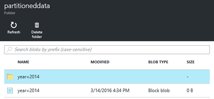

<properties
   pageTitle="建立使用 Azure 資料工廠 HDInsight 視 Linux 型 Hadoop 叢集 |Microsoft Azure"
    description="瞭解如何建立使用 Azure 資料工廠視 HDInsight 叢集。"
   services="hdinsight"
   documentationCenter=""
   tags="azure-portal"
   authors="mumian"
   manager="jhubbard"
   editor="cgronlun"/>

<tags
   ms.service="hdinsight"
   ms.devlang="na"
   ms.topic="article"
   ms.tgt_pltfrm="na"
   ms.workload="big-data"
   ms.date="10/06/2016"
   ms.author="jgao"/>

# 建立使用 Azure 資料工廠 HDInsight 視 Linux 型 Hadoop 叢集

[AZURE.INCLUDE [selector](../../includes/hdinsight-selector-create-clusters.md)]

[Azure 資料工廠](../data-factory/data-factory-introduction.md)是以雲端為基礎的資料整合服務協調，會自動執行的動作及資料轉換。 在本文中，您將瞭解如何建立[Azure HDInsight 視連結的服務](../data-factory/data-factory-compute-linked-services.md#azure-hdinsight-on-demand-linked-service)，並使用叢集執行登錄區工作 Azure 資料工廠。 以下是高層級的流程︰

1. 建立 HDInsight 叢集視。
2. 執行閱讀原始 web 記錄資料來源 blob 儲存體帳戶、 轉換資料，以及寫入到目的地 blob 儲存體帳戶輸出的登錄區工作。 
3. 刪除叢集根據存留時間設定。

在資料工廠管線通話中定義的登錄區活動預先定義的 HiveQL 指令碼。 指令碼會建立參照 Azure Blob 儲存體中儲存的原始 web 記錄資料的外部表格，然後依 year 和 month 分割的原始資料。

以下是每個月的範例資料列中輸入的檔案。

    2014-01-01,02:01:09,SAMPLEWEBSITE,GET,/blogposts/mvc4/step2.png,X-ARR-LOG-ID=2ec4b8ad-3cf0-4442-93ab-837317ece6a1,80,-,1.54.23.196,Mozilla/5.0+(Windows+NT+6.3;+WOW64)+AppleWebKit/537.36+(KHTML,+like+Gecko)+Chrome/31.0.1650.63+Safari/537.36,-,http://weblogs.asp.net/sample/archive/2007/12/09/asp-net-mvc-framework-part-4-handling-form-edit-and-post-scenarios.aspx,\N,200,0,0,53175,871 
    2014-02-01,02:01:10,SAMPLEWEBSITE,GET,/blogposts/mvc4/step7.png,X-ARR-LOG-ID=d7472a26-431a-4a4d-99eb-c7b4fda2cf4c,80,-,1.54.23.196,Mozilla/5.0+(Windows+NT+6.3;+WOW64)+AppleWebKit/537.36+(KHTML,+like+Gecko)+Chrome/31.0.1650.63+Safari/537.36,-,http://weblogs.asp.net/sample/archive/2007/12/09/asp-net-mvc-framework-part-4-handling-form-edit-and-post-scenarios.aspx,\N,200,0,0,30184,871
    2014-03-01,02:01:10,SAMPLEWEBSITE,GET,/blogposts/mvc4/step7.png,X-ARR-LOG-ID=d7472a26-431a-4a4d-99eb-c7b4fda2cf4c,80,-,1.54.23.196,Mozilla/5.0+(Windows+NT+6.3;+WOW64)+AppleWebKit/537.36+(KHTML,+like+Gecko)+Chrome/31.0.1650.63+Safari/537.36,-,http://weblogs.asp.net/sample/archive/2007/12/09/asp-net-mvc-framework-part-4-handling-form-edit-and-post-scenarios.aspx,\N,200,0,0,30184,871

指令碼會建立三個根據先前輸入的輸出資料夾。 每個資料夾的內容從每個月的項目使用的檔案。

    adfgetstarted/partitioneddata/year=2014/month=1/000000_0
    adfgetstarted/partitioneddata/year=2014/month=2/000000_0
    adfgetstarted/partitioneddata/year=2014/month=3/000000_0

除了登錄區活動資料工廠資料轉換活動的清單，請參閱[轉換及分析使用 Azure 資料工廠](../data-factory/data-factory-data-transformation-activities.md)。

有許多優點，與使用資料工廠 HDInsight:

- HDInsight 叢集帳單被累每分鐘，無論您或不使用它們。 使用資料工廠，會建立叢集視。 與工作完成時，會自動刪除 「 叢集。  因此您僅支付的執行時間和簡短的空閒時間 （時間存留） 的工作。
- 您可以建立使用資料工廠管線工作流程。
- 您可以排程遞迴工作。  

> [AZURE.NOTE] 目前，您可以從 Azure 資料工廠只建立 Linux 型 HDInsight 叢集版本 3.2 捨位。

##先決條件︰

本文中的指示進行之前，您必須具備下列項目︰

- [Azure 訂閱](https://azure.microsoft.com/documentation/videos/get-azure-free-trial-for-testing-hadoop-in-hdinsight/)。
- Azure CLI 或 Azure PowerShell。 

    [AZURE.INCLUDE [use-latest-version](../../includes/hdinsight-use-latest-powershell-and-cli.md)]

##準備儲存帳戶

在這個案例中，您可以使用三個儲存帳戶︰

- 預設的 HDInsight 叢集的儲存空間帳戶
- 輸入資料的儲存空間帳戶
- 輸出資料的儲存空間帳戶

若要簡化教學課程中,，您可以使用儲存帳戶來有三個用途。 Azure CLI 並在此區段中找到的 PowerShell 的 Azure 範例指令碼執行下列工作︰

1. 登入 Azure。
2. 建立 Azure 資源群組。
3. 建立 Azure 儲存體帳戶。
4. 儲存帳戶建立 Blob 容器
5. 將下列兩個檔案複製到 Blob 容器中︰

    - 輸入的資料檔︰ [https://hditutorialdata.blob.core.windows.net/adfhiveactivity/inputdata/input.log](https://hditutorialdata.blob.core.windows.net/adfhiveactivity/inputdata/input.log)
    - HiveQL 指令碼︰ [https://hditutorialdata.blob.core.windows.net/adfhiveactivity/script/partitionweblogs.hql](https://hditutorialdata.blob.core.windows.net/adfhiveactivity/script/partitionweblogs.hql)

    兩個檔案會儲存在公用 Blob 容器。 

>[AZURE.IMPORTANT] 寫下資源群組的名稱、 儲存體帳戶名稱和您的指令碼中使用的儲存空間帳戶金鑰。  您需要這些中下一節。

**準備儲存空間，並使用 Azure CLI 將檔案複製**

    azure login
    
    azure config mode arm

    azure group create --name "<Azure Resource Group Name>" --location "East US 2"

    azure storage account create --resource-group "<Azure Resource Group Name>" --location "East US 2" --type "LRS" <Azure Storage Account Name>

    azure storage account keys list --resource-group "<Azure Resource Group Name>" "<Azure Storage Account Name>"
    azure storage container create "adfgetstarted" --account-name "<Azure Storage AccountName>" --account-key "<Azure Storage Account Key>"

    azure storage blob copy start "https://hditutorialdata.blob.core.windows.net/adfhiveactivity/inputdata/input.log" --dest-account-name "<Azure Storage Account Name>" --dest-account-key "<Azure Storage Account Key>" --dest-container "adfgetstarted" 
    azure storage blob copy start "https://hditutorialdata.blob.core.windows.net/adfhiveactivity/script/partitionweblogs.hql" --dest-account-name "<Azure Storage Account Name>" --dest-account-key "<Azure Storage Account Key>" --dest-container "adfgetstarted" 

容器名稱是*adfgetstarted*。  讓它。 否則，您需要更新資源管理範本。

如果您需要使用這個 CLI 指令碼的說明，請參閱[使用 Azure CLI 與 Azure 儲存體](../storage/storage-azure-cli.md)。

**準備儲存空間，並使用 PowerShell 的 Azure 將檔案複製**

    $resourceGroupName = "<Azure Resource Group Name>"
    $storageAccountName = "<Azure Storage Account Name>"
    $location = "East US 2"

    $sourceStorageAccountName = "hditutorialdata"  
    $sourceContainerName = "adfhiveactivity"

    $destStorageAccountName = $storageAccountName
    $destContainerName = "adfgetstarted" # don't change this value.

    ####################################
    # Connect to Azure
    ####################################
    #region - Connect to Azure subscription
    Write-Host "`nConnecting to your Azure subscription ..." -ForegroundColor Green
    try{Get-AzureRmContext}
    catch{Login-AzureRmAccount}
    #endregion

    ####################################
    # Create a resource group, storage, and container
    ####################################

    #region - create Azure resources
    Write-Host "`nCreating resource group, storage account and blob container ..." -ForegroundColor Green

    New-AzureRmResourceGroup -Name $resourceGroupName -Location $location 
    New-AzureRmStorageAccount `
        -ResourceGroupName $resourceGroupName `
        -Name $destStorageAccountName `
        -type Standard_LRS `
        -Location $location 

    $destStorageAccountKey = (Get-AzureRmStorageAccountKey `
        -ResourceGroupName $resourceGroupName `
        -Name $destStorageAccountName)[0].Value

    $sourceContext = New-AzureStorageContext `
        -StorageAccountName $sourceStorageAccountName `
        -Anonymous
    $destContext = New-AzureStorageContext `
        -StorageAccountName $destStorageAccountName `
        -StorageAccountKey $destStorageAccountKey

    New-AzureStorageContainer -Name $destContainerName -Context $destContext
    #endregion

    ####################################
    # Copy files
    ####################################
    #region - copy files
    Write-Host "`nCopying files ..." -ForegroundColor Green

    $blobs = Get-AzureStorageBlob `
        -Context $sourceContext `
        -Container $sourceContainerName 

    $blobs|Start-AzureStorageBlobCopy `
        -DestContext $destContext `
        -DestContainer $destContainerName

    Write-Host "`nCopied files ..." -ForegroundColor Green
    Get-AzureStorageBlob -Context $destContext -Container $destContainerName 
    #endregion

    Write-host "`nYou will use the following values:" -ForegroundColor Green
    write-host "`nResource group name: $resourceGroupName"
    Write-host "Storage Account Name: $destStorageAccountName"
    write-host "Storage Account Key: $destStorageAccountKey"

    Write-host "`nScript completed" -ForegroundColor Green

如果您需要使用這個 PowerShell 指令碼的說明，請參閱[使用 PowerShell 的 Azure，與 Azure 儲存體](../storage/storage-powershell-guide-full.md)。

**若要檢查的儲存空間帳戶和內容**

1. [Azure 入口網站](https://portal.azure.com)登入。
2. 在左窗格中按一下 [**資源群組**]。
3. 按兩下您建立 CLI 或 PowerShell 指令碼中的資源群組名稱。 如果您有太多列的資源群組，請使用篩選器。 
4. 在 [**資源**] 方塊中，您應該有一列，除非您與其他專案共用資源群組的資源。 資源是以您先前指定的名稱的儲存空間帳戶。 按一下 [儲存體帳戶名稱]。
5. 按一下 [ **Blob**磚。
6. 按一下 [ **adfgetstarted**容器。 您會看到兩個資料夾︰**輸入的資料**和**指令碼**。
7. 開啟資料夾，然後核取資料夾中的檔案。
 
## 建立資料工廠

儲存帳戶、 輸入的資料，及準備 HiveQL 指令碼，您就可以建立 Azure 資料工廠項目。 有幾種方法可以建立資料 factory。 您可以使用 Azure 入口網站在本教學課程撥打自訂資源管理範本。 您也可以從[Azure CLI](../resource-group-template-deploy.md#deploy-with-azure-cli-for-mac-linux-and-windows)和[PowerShell 的 Azure](../resource-group-template-deploy.md#deploy-with-powershell)呼叫資源管理範本。 其他資料工廠建立的方法，請參閱[教學課程︰ 建立您的第一個資料工廠](../data-factory/data-factory-build-your-first-pipeline.md)。

最上層的資源管理範本包含︰

    {
        "contentVersion": "1.0.0.0",
        "$schema": "http://schema.management.azure.com/schemas/2015-01-01/deploymentTemplate.json#",
        "parameters": { ...
        },
        "variables": { ...
        },
        "resources": [
            {
                "name": "[parameters('dataFactoryName')]",
                "apiVersion": "[variables('apiVersion')]",
                "type": "Microsoft.DataFactory/datafactories",
                "location": "westus",
                "resources": [
                    { ... },
                    { ... },
                    { ... },
                    { ... }
                ]
            }
        ]
    }

包含一個資料工廠資源稱為*hdinsight 登錄區-隨選*（名稱沒有顯示在螢幕擷取畫面）。 資料工廠正在只支援西美國地區碼和北美歐洲地區。 

*Hdinsight 登錄區-隨選*資源包含四個的資源︰

- 儲存帳戶用來做為預設 HDInsight 儲存帳戶、 輸入的資料的儲存空間及輸出資料儲存區 linkedservice。
- 若要建立 HDInsight 叢集 linkedservice:

        {
            "dependsOn": [ ... ],
            "type": "linkedservices",
            "name": "[variables('hdInsightOnDemandLinkedServiceName')]",
            "apiVersion": "[variables('apiVersion')]",
            "properties": {
                "type": "HDInsightOnDemand",
                "typeProperties": {
                    "osType": "linux",
                    "version": "3.2",
                    "clusterSize": 1,
                    "sshUserName": "myuser",                            
                    "sshPassword": "MyPassword!",
                    "timeToLive": "00:30:00",
                    "linkedServiceName": "[variables('storageLinkedServiceName')]"
                }
            }
        },

    即使未指定，為儲存帳戶的同一個區域中建立叢集。
    
    請注意*timeToLive*設定。 資料工廠會在叢集在閒置 30 分鐘後自動刪除叢集。
- 輸入資料的資料集。 以下被定義檔案名稱和資料夾名稱︰

        "fileName": "input.log",
        "folderPath": "adfgetstarted/inputdata",
        
- 輸出資料，然後管線資料處理資料集。 以下定義的輸出路徑︰
        
        "folderPath": "adfgetstarted/partitioneddata",

    [資料集可用性](../data-factory/data-factory-create-datasets.md#Availability)設定如下所示︰
    
        "availability": {
            "frequency": "Month",
            "interval": 1,
            "style": "EndOfInterval"
        },

    Azure 資料工廠輸出資料集的可用磁碟機管道的郵件。 這表示扇形區不會產生每月上個月的最後一天。 如需詳細資訊，請參閱[資料工廠排程和執行](../data-factory/data-factory-scheduling-and-execution.md)。

    管線定義如下所示︰
    
        {
            "dependsOn": [ ... ],
            "type": "datapipelines",
            "name": "[parameters('dataFactoryName')]",
            "apiVersion": "[variables('apiVersion')]",
            "properties": {
                "description": "Azure Data Factory pipeline with an Hadoop Hive activity",
                "activities": [
                    { ...}
                ],
                "start": "2016-01-01T00:00:00Z",
                "end": "2016-01-31T00:00:00Z",
                "isPaused": false
            }
        }
                
    其中一個活動。 *啟動*和*結束*的活動具有過去的日期，這就表示只有一個扇形區。 如果結束未來的日期，資料 factory 時間時，就會建立另一個扇形區。 如需詳細資訊，請參閱[資料工廠排程和執行](../data-factory/data-factory-scheduling-and-execution.md)。

    下列 Json 指令碼是活動定義︰
    
        "activities": [
            {
                "type": "HDInsightHive",
                "typeProperties": {
                    "scriptPath": "adfgetstarted/script/partitionweblogs.hql",
                    "scriptLinkedService": "[variables('storageLinkedServiceName')]",
                    "defines": {
                        "inputtable": "[concat('wasbs://adfgetstarted@', parameters('storageAccountName'), '.blob.core.windows.net/inputdata')]",
                        "partitionedtable": "[concat('wasbs://adfgetstarted@', parameters('storageAccountName'), '.blob.core.windows.net/partitioneddata')]"
                    }
                },
                "inputs": [
                    {
                        "name": "AzureBlobInput"
                    }
                ],
                "outputs": [
                    {
                        "name": "AzureBlobOutput"
                    }
                ],
                "policy": {
                    "concurrency": 1,
                    "retry": 3
                },
                "name": "RunSampleHiveActivity",
                "linkedServiceName": "HDInsightOnDemandLinkedService"
            }
        ],
    
    定義的輸入與輸出，指令碼路徑。
    
**若要建立資料工廠**

1. 按一下 [登入 Azure 及開啟資源管理範本 Azure 入口網站中的下列圖像。 範本位於 https://hditutorialdata.blob.core.windows.net/adfhiveactivity/data-factory-hdinsight-on-demand.json。 

    

2. 輸入**DATAFACTORYNAME**、 **STORAGEACCOUNTNAME**和**STORAGEACCOUNTKEY**在最後一個區段中，您建立的帳戶，然後按一下**[確定]**。 資料工廠名稱必須是全域唯一的。
3. 在 [**資源] 群組**中，選取 [在最後一節中所使用的相同資源群組]。
4. 按一下**法律條款**]，然後再按一下 [**建立**。
5. 按一下 [**建立**]。 您會看到一個磚稱為**部署範本部署**儀表板上。 請等待磚文字變更為 [資源群組名稱。 若要建立 HDInsight 叢集通常需要關於 20 分鐘。
6. 按一下磚來開啟 [資源] 群組。 現在，您應該看到更多資料工廠資源除了儲存帳戶資源列。
7. 按一下 [ **hdinsight 登錄區-隨選**]。
8. 按一下 [**圖表**] 磚。 下圖顯示一個輸入的資料集，並將輸出資料集的活動︰

    
    
    資源管理範本中定義的名稱。
9. 按兩下**AzureBlobOutput**。
10. 在 [**最近] 更新扇形區**，您應該看到一塊扇形區。 如果正在**進行中**的狀態，等到變更為 [**準備好**。

**若要檢查資料工廠輸出**

1. 在最後一個工作階段中使用的相同程序，檢查 adfgetstarted 容器的容器。 有兩個新的容器，除了**adfgetsarted**:

    - adfhdinsight-hive-on-demand-hdinsightondemandlinked-xxxxxxxxxxxxx︰ 這是預設的容器 HDInsight 叢集。 預設容器名稱遵循模式: 「 adf<yourdatafactoryname>-linkedservicename datetimestamp 」。 
    - adfjobs︰ 這是 ADF 工作記錄檔的容器。
    
    資料工廠輸出會儲存於 afgetstarted 中，為您設定資源管理範本中。 
2. 按一下 [ **adfgetstarted**]。
3. 按兩下**partitioneddata**。 您會看到**年 = 2014年**資料夾因為所有網站記錄也會標示 2014 年的都日期。 

    

    如果您清單中向下切入時，您應該看到三個資料夾的一月、 二月和三月。 還有記錄每個月。

    

##清理教學課程

視需要 HDInsight 連結服務時，每次進行處理，除非已有現有的即時叢集 (timeToLive); 需要的扇形區，被建立 HDInsight 叢集並且會刪除叢集，完成處理程序。 每個叢集，Azure 資料工廠建立做為預設檔案系統叢集 Azure blob 儲存體。  即使刪除 HDInsight 叢集時，預設 blob 儲存體容器和相關聯的儲存帳戶不會刪除。 這是設計。 當處理更多的扇形區，您會看到您 Azure blob 儲存體中的許多容器。 如果您不需要進行疑難排解的工作，您可能要以減少儲存空間成本將它們刪除。 這些容器的名稱所遵循的圖樣的線條: 「 adfyourdatafactoryname-linkedservicename-datetimestamp 」。 

[Azure 資源管理員](../azure-resource-manager/resource-group-overview.md)用來部署、 管理及監視您群組的解決方案。  刪除資源群組，將會刪除群組內的所有元件。  

**若要刪除 [資源] 群組**

1. [Azure 入口網站](https://portal.azure.com)登入。
2. 在左窗格中按一下 [**資源群組**]。
3. 按兩下您建立 CLI 或 PowerShell 指令碼中的資源群組名稱。 如果您有太多列的資源群組，請使用篩選器。 它會在新的刀開啟資源群組。
4. 在 [**資源**] 方塊中，您應該有預設儲存帳戶和資料工廠列出除非您與其他專案共用資源群組。
5. 刀上方，按一下 [**刪除**]。 如此一來，您也會刪除儲存帳戶及儲存在儲存帳戶中的資料。
6. 輸入資源的群組名稱，然後再按一下 [**刪除**]。

以防您不想要刪除儲存帳戶，當您刪除資源群組時，您可以考慮下列架構設計隔開商務資料從預設儲存帳戶。 在此情況下，您會有一個資源群組的商務資料，儲存帳戶及其他資源群組預設儲存帳戶和資料 factory。  當您刪除 [第二個 [資源] 群組時，並不會影響商務資料儲存區帳戶。  若要這麼做︰ 

- 將下列文字新增至最上層的資源群組以及 Microsoft.DataFactory/datafactories 資源在資源管理範本中。 它會建立新的儲存空間帳戶︰

        {
            "name": "[parameters('defaultStorageAccountName')]",
            "type": "Microsoft.Storage/storageAccounts",
            "location": "[parameters('location')]",
            "apiVersion": "[variables('defaultApiVersion')]",
            "dependsOn": [ ],
            "tags": {

            },
            "properties": {
                "accountType": "Standard_LRS"
            }
        },

- 新增連結的服務端點到新的儲存空間帳戶︰

        {
            "dependsOn": [ "[concat('Microsoft.DataFactory/dataFactories/', parameters('dataFactoryName'))]" ],
            "type": "linkedservices",
            "name": "[variables('defaultStorageLinkedServiceName')]",
            "apiVersion": "[variables('apiVersion')]",
            "properties": {
                "type": "AzureStorage",
                "typeProperties": {
                    "connectionString": "[concat('DefaultEndpointsProtocol=https;AccountName=',parameters('defaultStorageAccountName'),';AccountKey=',listKeys(resourceId('Microsoft.Storage/storageAccounts', variables('defaultStorageAccountName')), variables('defaultApiVersion')).key1)]"
                }
            }
        },
    
- 設定其他 dependsOn 和 additionalLinkedServiceNames HDInsight 視需要連結服務︰

        {
            "dependsOn": [
                "[concat('Microsoft.DataFactory/dataFactories/', parameters('dataFactoryName'))]",
                "[concat('Microsoft.DataFactory/dataFactories/', parameters('dataFactoryName'), '/linkedservices/', variables('defaultStorageLinkedServiceName'))]",
                "[concat('Microsoft.DataFactory/dataFactories/', parameters('dataFactoryName'), '/linkedservices/', variables('storageLinkedServiceName'))]"
                
            ],
            "type": "linkedservices",
            "name": "[variables('hdInsightOnDemandLinkedServiceName')]",
            "apiVersion": "[variables('apiVersion')]",
            "properties": {
                "type": "HDInsightOnDemand",
                "typeProperties": {
                    "osType": "linux",
                    "version": "3.2",
                    "clusterSize": 1,
                    "sshUserName": "myuser",                            
                    "sshPassword": "MyPassword!",
                    "timeToLive": "00:30:00",
                    "linkedServiceName": "[variables('storageLinkedServiceName')]",
                    "additionalLinkedServiceNames": "[variables('defaultStorageLinkedServiceName')]"
                }
            }
        },            

##後續步驟
本文中，您已經學會如何使用 Azure 資料工廠建立視 HDInsight 叢集處理工作區。 若要瞭解更多︰

- [Hadoop 教學課程︰ 開始使用 Linux 型 Hadoop HDInsight](hdinsight-hadoop-linux-tutorial-get-started.md)
- [建立 HDInsight Linux 型 Hadoop 叢集](hdinsight-hadoop-provision-linux-clusters.md)
- [HDInsight 文件](https://azure.microsoft.com/documentation/services/hdinsight/)
- [資料工廠文件](https://azure.microsoft.com/documentation/services/data-factory/)

