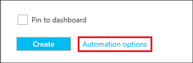

<properties
   pageTitle="建立使用 Azure 資源管理員範本的 HDInsight Linux 型 Hadoop 叢集 |Microsoft Azure"
    description="瞭解如何建立叢集 Azure HDInsight 使用 Azure Azure 資源管理員範本。"
   services="hdinsight"
   documentationCenter=""
   tags="azure-portal"
   authors="mumian"
   manager="jhubbard"
   editor="cgronlun"/>

<tags
   ms.service="hdinsight"
   ms.devlang="na"
   ms.topic="article"
   ms.tgt_pltfrm="na"
   ms.workload="big-data"
   ms.date="09/02/2016"
   ms.author="jgao"/>

# 建立使用 Azure 資源管理員範本的 HDInsight Linux 型 Hadoop 叢集

[AZURE.INCLUDE [selector](../../includes/hdinsight-selector-create-clusters.md)]

瞭解如何建立 HDInsight 叢集使用 Azure 資源 Manager(ARM) 範本。 如需詳細資訊，請參閱[部署具有 Azure 資源管理員範本的應用程式](../resource-group-template-deploy.md)。 其他叢集建立的工具和功能按一下此頁面上方的索引標籤上選取，或請參閱[叢集建立方法](hdinsight-provision-clusters.md#cluster-creation-methods)。

##先決條件︰

[AZURE.INCLUDE [delete-cluster-warning](../../includes/hdinsight-delete-cluster-warning.md)]

本文中的指示進行之前，您必須具備下列項目︰

- [Azure 訂閱](https://azure.microsoft.com/documentation/videos/get-azure-free-trial-for-testing-hadoop-in-hdinsight/)。
- Azure PowerShell 及/或 Azure CLI

    [AZURE.INCLUDE [use-latest-version](../../includes/hdinsight-use-latest-powershell-and-cli.md)]

### 存取控制需求

[AZURE.INCLUDE [access-control](../../includes/hdinsight-access-control-requirements.md)]

## 資源管理員範本

資源管理員範本，可以輕鬆地建立 HDInsight 叢集、 其相依資源 （例如預設儲存的帳戶） 及其他資源 （例如，若要使用 Apache Sqoop Azure SQL 資料庫），您的應用程式，在單一、 協同作業。 在範本中，您可以定義所需的應用程式的資源，並指定部署參數輸入不同環境中的值。 範本包含 JSON 和可用來建構您的部署中的值的運算式。

資源管理員範本來建立 HDInsight 叢集和相依 Azure 儲存體帳戶，請參閱[附錄 A](#appx-a-arm-template)。 使用跨平台[VSCode](https://code.visualstudio.com/#alt-downloads) [資源管理員副檔名](https://marketplace.visualstudio.com/items?itemName=msazurermtools.azurerm-vscode-tools)或文字編輯器來將範本儲存至您工作站上的檔案。 您將學習如何呼叫使用不同的方法的範本。

如需有關資源管理員範本的詳細資訊，請參閱

- [作者 Azure 資源管理員範本](../resource-group-authoring-templates.md)
- [部署 Azure 資源管理員範本與應用程式](../resource-group-template-deploy.md)

若要瞭解 JSON 結構描述的某些項目，您可以依照下列程序︰

1. 開啟要建立 HDInsight 叢集[Azure 入口網站](https://porta.azure.com)。  請參閱[建立 Linux 為基礎的叢集 HDInsight 使用 Azure 入口網站中](hdinsight-hadoop-create-linux-clusters-portal.md)。
2. 設定必要的項目，您需要 JSON 結構描述的項目]。
3. 再按一下 [**建立**]，請按一下**自動化選項**下, 圖所示︰

    

    入口網站建立根據您設定的資源管理員範本。
## 使用 PowerShell 部署

下列程序建立 Linux 型 HDInsight 叢集。

**若要部署使用資源管理員範本**

1. 儲存您的工作站[附錄 A](#appx-a-arm-template) json 檔案。 在 PowerShell 指令碼的檔案名稱會是*C:\HDITutorials-ARM\hdinsight-arm-template.json*。
2. 如有需要請設定參數和變數。
3. 執行使用下列 PowerShell 指令碼的範本︰

        ####################################
        # Set these variables
        ####################################
        #region - used for creating Azure service names
        $nameToken = "<Enter an Alias>" 
        $templateFile = "C:\HDITutorials-ARM\hdinsight-arm-template.json"
        #endregion

        ####################################
        # Service names and varialbes
        ####################################
        #region - service names
        $namePrefix = $nameToken.ToLower() + (Get-Date -Format "MMdd")

        $resourceGroupName = $namePrefix + "rg"
        $hdinsightClusterName = $namePrefix + "hdi"
        $defaultStorageAccountName = $namePrefix + "store"
        $defaultBlobContainerName = $hdinsightClusterName

        $location = "East US 2"

        $armDeploymentName = $namePrefix
        #endregion

        ####################################
        # Connect to Azure
        ####################################
        #region - Connect to Azure subscription
        Write-Host "`nConnecting to your Azure subscription ..." -ForegroundColor Green
        try{Get-AzureRmContext}
        catch{Login-AzureRmAccount}
        #endregion

        # Create a resource group
        New-AzureRmResourceGroup -Name $resourceGroupName -Location $Location

        # Create cluster and the dependent storage accounge
        $parameters = @{clusterName="$hdinsightClusterName"}

        New-AzureRmResourceGroupDeployment `
            -Name $armDeploymentName `
            -ResourceGroupName $resourceGroupName `
            -TemplateFile $templateFile `
            -TemplateParameterObject $parameters

        # List cluster
        Get-AzureRmHDInsightCluster -ResourceGroupName $resourceGroupName -ClusterName $hdinsightClusterName 

    PowerShell 指令碼只設定叢集名稱。 儲存體帳戶名稱已在範本中的硬式編碼。 系統會提示您輸入叢集使用者的密碼 （預設的使用者名稱是*管理員*）;（預設 SSH 使用者名稱是*sshuser*） SSH 使用者的密碼。  
    
如需詳細資訊，請參閱[使用 PowerShell 進行部署](../resource-group-template-deploy.md#deploy-with-powershell)。

## 透過 Azure CLI 部署

下列範例會建立叢集其從屬參照儲存帳戶和容器呼叫資源管理員範本︰

    azure login
    azure config mode arm
    azure group create -n hdi1229rg -l "East US"
    azure group deployment create --resource-group "hdi1229rg" --name "hdi1229" --template-file "C:\HDITutorials-ARM\hdinsight-arm-template.json"
    
會提示您輸入叢集名稱、 叢集使用者密碼 （預設的使用者名稱是*管理員*） 和 （預設 SSH 使用者名稱是*sshuser*） SSH 使用者的密碼。 若要提供內嵌參數︰

    azure group deployment create --resource-group "hdi1229rg" --name "hdi1229" --template-file "c:\Tutorials\HDInsightARM\create-linux-based-hadoop-cluster-in-hdinsight.json" --parameters '{\"clusterName\":{\"value\":\"hdi1229\"},\"clusterLoginPassword\":{\"value\":\"Pass@word1\"},\"sshPassword\":{\"value\":\"Pass@word1\"}}'

## 部署以 REST API

請參閱[以 REST API 部署](../resource-group-template-deploy.md#deploy-with-the-rest-api)。

## 使用 Visual Studio 中部署

使用 Visual Studio 中，您可以建立資源群組專案，並將其部署到 Azure 中透過使用者介面。 選取要包含在專案中的資源類型，這些資源會自動新增到資源管理員範本。 專案也會提供的 PowerShell 指令碼部署範本。

使用 Visual Studio 與資源群組簡介資訊，請參閱[建立及部署 Visual Studio 透過 Azure 資源群組](../vs-azure-tools-resource-groups-deployment-projects-create-deploy.md)。

##後續步驟
本文中，您已經學會多種方式可以建立 HDInsight 叢集。 若要深入瞭解，請參閱下列文章︰

- 部署資源的.NET 用戶端文件庫的範例，請參閱[部署資源使用.NET 文件庫和範本](../virtual-machines/virtual-machines-windows-csharp-template.md)。
- 如需在您採取進階的部署應用程式範例，請參閱[佈建及部署 Azure 中預測 microservices](../app-service-web/app-service-deploy-complex-application-predictably.md)。
- 在不同環境中部署您的方案，請參閱[開發和 Microsoft Azure 中的測試環境](../solution-dev-test-environments.md)。
- 若要瞭解 Azure 資源管理員範本的節，請參閱[撰寫範本](../resource-group-authoring-templates.md)。
- 您可以在 Azure 資源管理員範本中使用的函數的清單，請參閱[範本函數](../resource-group-template-functions.md)。

##Appx a︰ 資源管理員範本

下列 Azure 資源管理員範本建立 Linux 型 Hadoop 叢集相依 Azure 儲存體帳戶。 

> [AZURE.NOTE] 範例包括登錄區 metastore 和 Oozie metastore 的設定資訊。  移除 [] 區段中，或先設定 [] 區段中，才能使用範本。

    {
    "$schema": "https://schema.management.azure.com/schemas/2015-01-01/deploymentTemplate.json#",
    "contentVersion": "1.0.0.0",
    "parameters": {
        "clusterName": {
        "type": "string",
        "metadata": {
            "description": "The name of the HDInsight cluster to create."
        }
        },
        "clusterLoginUserName": {
        "type": "string",
        "defaultValue": "admin",
        "metadata": {
            "description": "These credentials can be used to submit jobs to the cluster and to log into cluster dashboards."
        }
        },
        "clusterLoginPassword": {
        "type": "securestring",
        "metadata": {
            "description": "The password must be at least 10 characters in length and must contain at least one digit, one non-alphanumeric character, and one upper or lower case letter."
        }
        },
        "sshUserName": {
        "type": "string",
        "defaultValue": "sshuser",
        "metadata": {
            "description": "These credentials can be used to remotely access the cluster."
        }
        },
        "sshPassword": {
        "type": "securestring",
        "metadata": {
            "description": "The password must be at least 10 characters in length and must contain at least one digit, one non-alphanumeric character, and one upper or lower case letter."
        }
        },
        "location": {
        "type": "string",
        "defaultValue": "East US",
        "allowedValues": [
            "East US",
            "East US 2",
            "North Central US",
            "South Central US",
            "West US",
            "North Europe",
            "West Europe",
            "East Asia",
            "Southeast Asia",
            "Japan East",
            "Japan West",
            "Australia East",
            "Australia Southeast"
        ],
        "metadata": {
            "description": "The location where all azure resources will be deployed."
        }
        },
        "clusterType": {
        "type": "string",
        "defaultValue": "hadoop",
        "allowedValues": [
            "hadoop",
            "hbase",
            "storm",
            "spark"
        ],
        "metadata": {
            "description": "The type of the HDInsight cluster to create."
        }
        },
        "clusterWorkerNodeCount": {
        "type": "int",
        "defaultValue": 2,
        "metadata": {
            "description": "The number of nodes in the HDInsight cluster."
        }
        }
    },
    "variables": {
        "defaultApiVersion": "2015-05-01-preview",
        "clusterApiVersion": "2015-03-01-preview",
        "clusterStorageAccountName": "[concat(parameters('clusterName'),'store')]"
    },
    "resources": [
        {
        "name": "[variables('clusterStorageAccountName')]",
        "type": "Microsoft.Storage/storageAccounts",
        "location": "[parameters('location')]",
        "apiVersion": "[variables('defaultApiVersion')]",
        "dependsOn": [ ],
        "tags": { },
        "properties": {
            "accountType": "Standard_LRS"
        }
        },
        {
        "name": "[parameters('clusterName')]",
        "type": "Microsoft.HDInsight/clusters",
        "location": "[parameters('location')]",
        "apiVersion": "[variables('clusterApiVersion')]",
        "dependsOn": [ "[concat('Microsoft.Storage/storageAccounts/',variables('clusterStorageAccountName'))]" ],
        "tags": {

        },
        "properties": {
            "clusterVersion": "3.4",
            "osType": "Linux",
            "tier": "standard",
            "clusterDefinition": {
            "kind": "[parameters('clusterType')]",
            "configurations": {
                "gateway": {
                "restAuthCredential.isEnabled": true,
                "restAuthCredential.username": "[parameters('clusterLoginUserName')]",
                "restAuthCredential.password": "[parameters('clusterLoginPassword')]"
                },
                "hive-site": {
                    "javax.jdo.option.ConnectionDriverName": "com.microsoft.sqlserver.jdbc.SQLServerDriver",
                    "javax.jdo.option.ConnectionURL": "jdbc:sqlserver://myadla0901dbserver.database.windows.net;database=myhive20160901;encrypt=true;trustServerCertificate=true;create=false;loginTimeout=300",
                    "javax.jdo.option.ConnectionUserName": "johndole",
                    "javax.jdo.option.ConnectionPassword": "myPassword$"
                },
                "hive-env": {
                    "hive_database": "Existing MSSQL Server database with SQL authentication",
                    "hive_database_name": "myhive20160901",
                    "hive_database_type": "mssql",
                    "hive_existing_mssql_server_database": "myhive20160901",
                    "hive_existing_mssql_server_host": "myadla0901dbserver.database.windows.net",
                    "hive_hostname": "myadla0901dbserver.database.windows.net"
                },
                "oozie-site": {
                    "oozie.service.JPAService.jdbc.driver": "com.microsoft.sqlserver.jdbc.SQLServerDriver",
                    "oozie.service.JPAService.jdbc.url": "jdbc:sqlserver://myadla0901dbserver.database.windows.net;database=myhive20160901;encrypt=true;trustServerCertificate=true;create=false;loginTimeout=300",
                    "oozie.service.JPAService.jdbc.username": "johndole",
                    "oozie.service.JPAService.jdbc.password": "myPassword$",
                    "oozie.db.schema.name": "oozie"
                },
                "oozie-env": {
                    "oozie_database": "Existing MSSQL Server database with SQL authentication",
                    "oozie_database_name": "myhive20160901",
                    "oozie_database_type": "mssql",
                    "oozie_existing_mssql_server_database": "myhive20160901",
                    "oozie_existing_mssql_server_host": "myadla0901dbserver.database.windows.net",
                    "oozie_hostname": "myadla0901dbserver.database.windows.net"
                }            
            }
            },
            "storageProfile": {
            "storageaccounts": [
                {
                "name": "[concat(variables('clusterStorageAccountName'),'.blob.core.windows.net')]",
                "isDefault": true,
                "container": "[parameters('clusterName')]",
                "key": "[listKeys(resourceId('Microsoft.Storage/storageAccounts', variables('clusterStorageAccountName')), variables('defaultApiVersion')).key1]"
                }
            ]
            },
            "computeProfile": {
            "roles": [
                {
                "name": "headnode",
                "targetInstanceCount": "2",
                "hardwareProfile": {
                    "vmSize": "Standard_D3"
                },
                "osProfile": {
                    "linuxOperatingSystemProfile": {
                    "username": "[parameters('sshUserName')]",
                    "password": "[parameters('sshPassword')]"
                    }
                }
                },
                {
                "name": "workernode",
                "targetInstanceCount": "[parameters('clusterWorkerNodeCount')]",
                "hardwareProfile": {
                    "vmSize": "Standard_D3"
                },
                "osProfile": {
                    "linuxOperatingSystemProfile": {
                    "username": "[parameters('sshUserName')]",
                    "password": "[parameters('sshPassword')]"
                    }
                }
                }
            ]
            }
        }
        }
    ],
    "outputs": {
        "cluster": {
        "type": "object",
        "value": "[reference(resourceId('Microsoft.HDInsight/clusters',parameters('clusterName')))]"
        }
    }
    }
