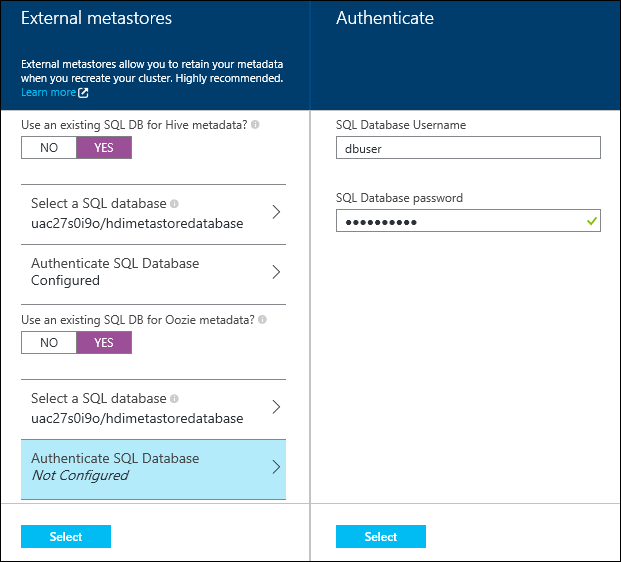

<properties
    pageTitle="在使用入口網站的 HDInsight Linux 上建立 Hadoop、 HBase、 或火花叢集 |Microsoft Azure"
    description="瞭解如何建立 Hadoop、 HBase、 或火花叢集 linux HDInsight 使用網頁瀏覽器和 Azure 預覽入口網站。"
    services="hdinsight"
    documentationCenter=""
    authors="nitinme"
    manager="jhubbard"
    editor="cgronlun"
    tags="azure-portal"/>

<tags
    ms.service="hdinsight"
    ms.devlang="na"
    ms.topic="article"
    ms.tgt_pltfrm="na"
    ms.workload="big-data"
    ms.date="10/05/2016"
    ms.author="nitinme"/>

#HDInsight 使用 Azure 入口網站中建立 Linux 型叢集

[AZURE.INCLUDE [selector](../../includes/hdinsight-selector-create-clusters.md)]

Azure 入口網站是網頁式管理服務及工具裝載於 Microsoft Azure 雲端中的資源。 本文中，您將學習如何建立 Linux 型 HDInsight 叢集使用入口網站。

## 必要條件

[AZURE.INCLUDE [delete-cluster-warning](../../includes/hdinsight-delete-cluster-warning.md)]

- **Azure 訂閱**。 請參閱[取得 Azure 免費試用版](https://azure.microsoft.com/documentation/videos/get-azure-free-trial-for-testing-hadoop-in-hdinsight/)。
- __新的網頁瀏覽器__。 Azure 入口網站使用 html 5 和 Javascript]，並可能無法在舊版的網頁瀏覽器中正確運作。

### 存取控制需求

[AZURE.INCLUDE [access-control](../../includes/hdinsight-access-control-requirements.md)]

##建立叢集

Azure 入口網站公開大部分的叢集內容。 使用 Azure 資源管理員範本，您可以隱藏大量的詳細資料。 如需詳細資訊，請參閱[建立 Linux 型 Hadoop 叢集 HDInsight 使用 Azure 資源管理員範本中](hdinsight-hadoop-create-linux-clusters-arm-templates.md)。

1. [Azure 入口網站](https://portal.azure.com)登入。

2. 按一下 [**新增**]，按一下 [**資料分析**，，再按一下 [ **HDInsight**。

    
3. 輸入**叢集名稱**︰ 此名稱必須是全域唯一。
4. 按一下 [**選取叢集類型**]，然後選取︰

    - **叢集類型**︰ 如果您不知道如何選擇，請選取 [ **Hadoop**。 這是最常用的叢集類型。

        > [AZURE.IMPORTANT] HDInsight 叢集了各種不同的類型，對應到工作負載或叢集調整為技術。 沒有建立，結合多個類型，例如大量和上一個叢集 HBase 叢集支援的方法。 

    - **作業系統**︰ 選取**Linux**。
    - **版本**︰ 如果您不知道如何選擇使用預設版本。 如需詳細資訊，請參閱[HDInsight 叢集版本](hdinsight-component-versioning.md)。
    - **叢集層**︰ Azure HDInsight 提供兩種類型的大型資料雲端方案︰ 標準層和進階版層。 如需詳細資訊，請參閱[叢集層](hdinsight-hadoop-provision-linux-clusters.md#cluster-tiers)。
    
    

4. 按一下以選取 [將會用於叢集 Azure 訂閱的**訂閱**]。

5. 按一下 [**資源群組**來選取現有的資源群組，或按一下 [**新增**]，建立新的資源群組

    > [AZURE.NOTE] 這個項目會預設為其中一個現有的資源群組中，如果有的話。

6. 按一下 [**認證**]，然後輸入管理員使用者的密碼。 您也必須輸入**SSH 使用者名稱**與**密碼**或**公用鍵**，將會用於 SSH 使用者進行驗證。 使用公開金鑰是建議的方法。 若要儲存的認證設定底部，按一下 [**選取**]。

    

    如需有關如何使用 HDInsight SSH 的詳細資訊，請參閱下列文章︰

    * [使用上 HDInsight Linux、 Unix，或 OS X 的 Linux 型 Hadoop SSH](hdinsight-hadoop-linux-use-ssh-unix.md)
    * [使用上從 Windows HDInsight Linux 為基礎的 Hadoop SSH](hdinsight-hadoop-linux-use-ssh-windows.md)

7. 按一下 [**資料來源**選擇現有的資料來源叢集，或建立新的範本。

    

    目前您可以選取 Azure 儲存體帳戶為 HDInsight 叢集的資料來源。 使用下列命令以了解**資料來源**刀上的項目。

    - **選取方法**︰ 將此設定為**從所有的訂閱**以啟用瀏覽的儲存空間從您的訂閱的帳戶。 如果您想要輸入的**儲存空間名稱**與現有的儲存空間帳戶的**便捷鍵**，請將此設定為**便捷鍵**。

    - **選取儲存帳戶 / 新**︰ 按一下 [瀏覽並選取您想要與叢集關聯現有儲存帳戶的 [**選取儲存的帳戶**。 或者，按一下 [**新增**]，建立新的儲存空間帳戶。 使用功能變數出現在輸入的儲存體帳戶名稱。 名稱時，會出現綠色的核取。

    - **選擇預設的容器**︰ 使用此輸入要用於叢集預設容器的名稱。 您可以輸入任何的名稱，我們建議使用相同的名稱和叢集，讓您容易辨識的容器用於此特定叢集。

    - **位置**︰ 儲存帳戶，或將建立在地理區域。

        > [AZURE.IMPORTANT] 選取預設資料來源的位置，也會設定 HDInsight 叢集的位置。 叢集及預設值的資料來源必須位於相同的區域。
        
    - **叢集 AAD 身分識別**︰ 藉由設定它，您讓叢集存取根據 AAD 設定 Azure 資料湖存放區。

    按一下 [**選取**要儲存資料來源設定]。

8. 按一下 [若要顯示資訊將會建立此叢集節點的**節點價格層級**]。 設定叢集，您需要的工作者節點數目。 刀內會顯示叢集估計的成本。

    
    
    > [AZURE.IMPORTANT] 如果您打算 32 個以上的工作者節點，在叢集建立，或藉由縮放叢集之後建立，您就必須選取至少 8 個核心與 14 GB ram 的標頭節點大小。
    >
    > 如需有關節點大小和相關聯的成本的詳細資訊，請參閱[HDInsight 價格](https://azure.microsoft.com/pricing/details/hdinsight/)。

    按一下 [**選取**要儲存節點價格的設定。

9. 按一下 [選取叢集版本，以及設定其他選用的設定，例如加入**虛擬網路**的**選用的設定**，設定**外部 Metastore**保留的資料登錄區和 Oozie，自訂安裝自訂元件，叢集使用指令碼動作或額外的儲存空間帳戶使用叢集。

    * **虛擬網路**︰ 選取 Azure 虛擬網路和子網路，如果您想要放置到虛擬網路叢集。  

        

        如需 HDInsight 使用虛擬網路，包括特定設定需求虛擬網路，請參閱[使用 Azure 虛擬網路延伸 HDInsight 功能](hdinsight-extend-hadoop-virtual-network.md)。

    * 按一下 [**外部 Metastores** ，指定您要用來儲存登錄區及 Oozie 叢集相關聯的中繼資料的 SQL 資料庫]。
    
        > [AZURE.NOTE] Metastore 設定不適用於 HBase 叢集類型。

        

        **使用現有的 SQL 資料庫的登錄區**中繼資料，按一下 [**是**]、 選取 SQL 資料庫，然後提供使用者名稱與密碼資料庫。 如果您想要**使用現有的 SQL DB Oozie 中繼資料**，請重複這些步驟。 直到您會回到上**選擇性組態**刀，請按一下 [**選取**]。

        >[AZURE.NOTE] 用於 metastore Azure SQL 資料庫必須允許連線至其他 Azure 服務，包括 Azure HDInsight。 Azure SQL 資料庫儀表板上，在右側，按一下 [伺服器名稱。 這是在其執行 SQL 資料庫執行個體的伺服器。 一次您是在 [伺服器] 檢視中，按一下 [**設定**]，然後針對**Azure 服務**，按一下 [ ****]，然後再按一下 [**儲存**。

        &nbsp;

        > [AZURE.IMPORTANT] 在建立 metastore，務必使用包含連字號或連字號的資料庫名稱，因為這會導致失敗叢集建立程序。

    * **指令碼動作**如果您想要使用自訂指令碼自訂叢集，和叢集正在建立。 如需有關的指令碼動作的詳細資訊，請參閱[使用指令碼的巨集指令的自訂 HDInsight 叢集](hdinsight-hadoop-customize-cluster-linux.md)。 螢幕擷取畫面所示，請在 [指令碼動作刀提供詳細資料。

        

    * 按一下 [**連結的儲存空間帳戶**指定叢集與相關的額外儲存空間帳戶]。 在**Azure 儲存金鑰**刀中，按一下 [**新增儲存空間鍵**，然後選取現有的儲存空間帳戶，或建立新的帳戶。

        

        建立叢集之後，您也可以新增額外的儲存空間的帳戶。  請參閱[自訂 Linux 型 HDInsight 叢集使用指令碼動作](hdinsight-hadoop-customize-cluster-linux.md)。

        後重新開啟**新的 HDInsight 叢集**刀以前，請按一下 [**選取**]。
        
        除了 Blob 儲存體帳戶，您也可以連結 Azure 資料湖存放區。 設定完成藉由設定 AAD 從您設定的預設儲存帳戶及預設容器的資料來源。

10. 在**新 HDInsight 叢集**防禦，以確定**固定至 Startboard**已選取，然後再按一下 [**建立**]。 這會建立叢集，並為其新增 Startboard Azure 入口網站的方塊。 圖示會指出叢集佈建，並會變更為完成佈建後，顯示 [HDInsight] 圖示。

  	| 佈建時 | 佈建完成 |
  	| ------------------ | --------------------- |
  	|  |  |

    > [AZURE.NOTE] 它會需要一些時間叢集會建立通常約 15 分鐘。 使用並排 Startboard 或在頁面左側的**通知**項目上，若要查看提供的程序。

11. 建立程序完成之後，請按一下 [從啟動叢集刀 Startboard 叢集的方塊。 叢集刀提供例如名稱、 其所屬的 [資源] 群組、 位置、 作業系統、 URL 叢集儀表板等叢集的基本資訊。

    

    若要瞭解圖示上方此刀，以及 [**基本資訊**] 區段中，使用下列︰

    * **設定**及**所有的設定**︰ 顯示**設定**刀叢集，可讓您存取叢集詳細的設定資訊。

    * **儀表板**、**叢集儀表板**和**URL**︰ 這些是所有存取叢集儀表板，也就是叢集上執行的工作入口網站的方式。

    * **安全的命令介面**︰ 存取使用 SSH 叢集所需的資訊。

    * **刪除**︰ 刪除 HDInsight 叢集。

    * **快速入門**(): 顯示的資訊可協助您開始使用 HDInsight。

    * **使用者**(): 可讓您設定為其他使用者的_入口網站_管理的權限，此叢集 Azure 訂閱。

        > [AZURE.IMPORTANT] 這_只_會影響 access 和 Azure 入口網站中，在此叢集的權限，不會影響可以連線至或提交到 HDInsight 叢集工作的人員。

    * **標記**(![事項] 標記圖示](./media/hdinsight-hadoop-create-linux-cluster-portal/tags.png)): 標籤可讓您設定以定義您的雲端服務自訂分類的金鑰/值組。 比方說，您可能會建立名為 [__專案__]，，，然後使用特定專案相關聯的所有服務的 [常見的值。

##自訂叢集

- 請參閱[自訂 HDInsight 叢集使用啟動安裝程式](hdinsight-hadoop-customize-cluster-bootstrap.md)。
- 請參閱[自訂 Linux 型 HDInsight 叢集使用指令碼動作](hdinsight-hadoop-customize-cluster-linux.md)。

##刪除叢集

[AZURE.INCLUDE [delete-cluster-warning](../../includes/hdinsight-delete-cluster-warning.md)]

##後續步驟

既然您已成功建立 HDInsight 叢集，請使用下列若要瞭解如何使用叢集︰

###Hadoop 叢集

* [使用 HDInsight 的登錄區](hdinsight-use-hive.md)
* [使用 HDInsight 的豬](hdinsight-use-pig.md)
* [使用 HDInsight MapReduce](hdinsight-use-mapreduce.md)

###HBase 叢集

* [在 HDInsight HBase 快速入門](hdinsight-hbase-tutorial-get-started-linux.md)
* [Java 為開發應用程式上 HDInsight HBase](hdinsight-hbase-build-java-maven-linux.md)

###大量叢集

* [開發上 HDInsight 大量 Java 拓撲](hdinsight-storm-develop-java-topology.md)
* [使用大量上 HDInsight Python 元件](hdinsight-storm-develop-python-topology.md)
* [部署，並監控與上 HDInsight 大量的拓撲](hdinsight-storm-deploy-monitor-topology-linux.md)

###火花叢集

* [建立使用 Scala 獨立應用程式](hdinsight-apache-spark-create-standalone-application.md)
* [在使用晚總火花叢集從遠端執行工作](hdinsight-apache-spark-livy-rest-interface.md)
* [使用 BI 火花︰ 執行火花 HDInsight 中使用的 BI 工具的互動式的資料分析](hdinsight-apache-spark-use-bi-tools.md)
* [與電腦學習火花︰ 使用火花 HDInsight 預測食物檢查結果中](hdinsight-apache-spark-machine-learning-mllib-ipython.md)
* [火花串流︰ 使用火花 HDInsight 建置即時串流應用程式中](hdinsight-apache-spark-eventhub-streaming.md)
