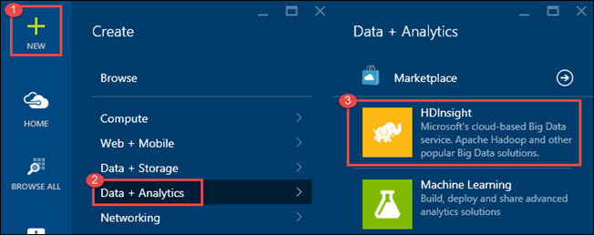
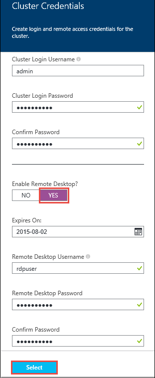
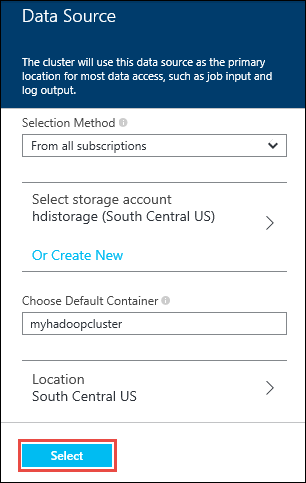
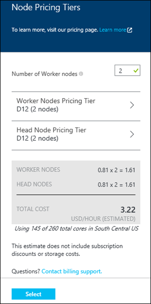
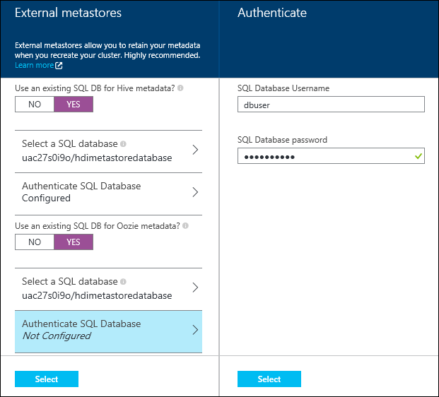
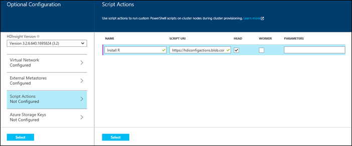
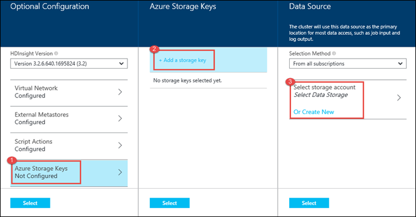
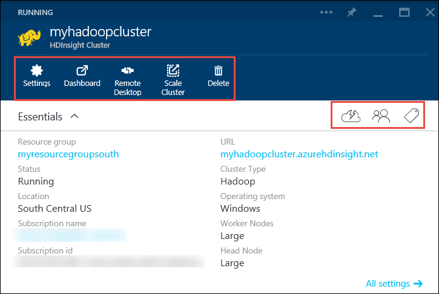

<properties
   pageTitle="建立 HDInsight Hadoop 叢集 |Microsoft Azure"
    description="瞭解如何建立叢集 Azure HDInsight 的 Azure 入口網站。"
   services="hdinsight"
   documentationCenter=""
   tags="azure-portal"
   authors="mumian"
   manager="jhubbard"
   editor="cgronlun"/>

<tags
   ms.service="hdinsight"
   ms.devlang="na"
   ms.topic="article"
   ms.tgt_pltfrm="na"
   ms.workload="big-data"
   ms.date="09/02/2016"
   ms.author="jgao"/>

# HDInsight 使用 Azure 入口網站中建立 Windows 型 Hadoop 叢集

[AZURE.INCLUDE [selector](../../includes/hdinsight-selector-create-clusters.md)]

瞭解如何建立 Hadoop 叢集 HDInsight 使用 Azure 入口網站中。 Microsoft [Azure 入口網站](../azure-portal-overview.md)是您可以在此佈建和管理 Azure 資源的中央位置。 Azure 入口網站是一種 HDInsight 中建立或 Linux 型 Windows 型 Hadoop 叢集，您可以使用的工具。 其他叢集建立的工具和功能按一下此頁面上方的索引標籤上選取，或請參閱[叢集建立方法](hdinsight-provision-clusters.md#cluster-creation-methods)。

##先決條件︰

[AZURE.INCLUDE [delete-cluster-warning](../../includes/hdinsight-delete-cluster-warning.md)]

本文中的指示進行之前，您必須具備下列項目︰

- Azure 的訂閱。 請參閱[取得 Azure 免費試用版](https://azure.microsoft.com/documentation/videos/get-azure-free-trial-for-testing-hadoop-in-hdinsight/)。

### 存取控制需求

[AZURE.INCLUDE [access-control](../../includes/hdinsight-access-control-requirements.md)]

## 建立叢集

**若要建立 HDInsight 叢集**

1. [Azure 入口網站](https://portal.azure.com)登入。
2. 按一下 [**新增**]，按一下 [**資料分析**，，再按一下 [ **HDInsight**。

    

3. 輸入或選取下列值︰

    * **叢集名稱**︰ 輸入叢集的名稱。 綠色核取會顯示叢集名稱旁邊的名稱。

    * **叢集類型**︰ 選取**Hadoop**。 其他選項 inclue **HBase****大量**，與**火花**。

        > [AZURE.IMPORTANT] HDInsight 叢集了各種不同的類型，對應到工作負載或叢集調整為技術。 沒有建立，結合多個類型，例如大量和上一個叢集 HBase 叢集支援的方法。

    * **叢集作業系統**︰ 選取**視窗]**。 若要建立 Linux 基底叢集，選取 [ **Linux**]。
    * **版本**︰ 請參閱[HDInsight 版本](hdinsight-component-versioning.md)。
    * **訂閱**︰ 選取 [將會用於建立此叢集 Azure 訂閱]。
    * **資源群組**︰ 選取 [現有的或建立新的資源群組。 這個項目會預設為其中一個現有的資源群組中，如果有的話。
    * **認證**︰ 設定使用者名稱和密碼 Hadoop （HTTP 使用者）。 如果您啟用叢集遠端桌面時，您必須設定遠端桌面使用者的使用者名稱和密碼，帳戶到期日。 按一下 [儲存變更底部的 [**選取**]。

        

    * **資料來源**︰ 建立新的或選取要作為預設檔案系統叢集現有 Azure 儲存體帳戶。

        

        * **選取方法**︰ 將此設定為**從所有的訂閱**以啟用瀏覽的儲存空間從您的訂閱的帳戶。 如果您想要輸入的**儲存空間名稱**與現有的儲存空間帳戶的**便捷鍵**，請將此設定為**便捷鍵**。
        * **選取儲存帳戶 / 建立新的**︰ 按一下 [瀏覽並選取您想要與叢集關聯現有儲存帳戶的 [**選取儲存的帳戶**。 或者，按一下 [**建立新**建立的新儲存的帳戶。 使用功能變數出現在輸入的儲存體帳戶名稱。 名稱時，會出現綠色的核取。
        * **選擇預設的容器**︰ 使用此輸入要用於叢集預設容器的名稱。 您可以輸入任何的名稱，我們建議使用相同的名稱和叢集，讓您容易辨識的容器用於此特定叢集。
        * **位置**︰ 儲存帳戶，或將建立在地理區域。 此位置會決定叢集位置。  共同找出叢集和其預設儲存帳戶必須在同一個 Azure 資料中心。
    
    * **節點價格層**︰ 設定叢集，您需要的工作者節點數目。 刀內會顯示叢集估計的成本。
  

        

    * **選用設定**中選取叢集的版本，以及設定其他選用的設定，例如加入**虛擬網路**設定**外部 Metastore**登錄區和 Oozie，保留的資料使用指令碼動作自訂叢集安裝自訂元件，或與叢集額外儲存空間的帳戶。

    * **HDInsight 版本**︰ 選取您想要使用叢集的版本。 如需詳細資訊，請參閱[HDInsight 叢集版本](hdinsight-component-versioning.md)。
    * **虛擬網路**︰ 選取 Azure 虛擬網路和子網路，如果您想要放置到虛擬網路叢集。  

        

        如需 HDInsight 使用虛擬網路，包括特定設定需求虛擬網路，請參閱[使用 Azure 虛擬網路延伸 HDInsight capbilities](hdinsight-extend-hadoop-virtual-network.md)。
  

        
    * **外部 Metastores**︰ 指定要將登錄區及 Oozie 叢集相關聯的中繼資料儲存 Azure SQL 資料庫。
 
        > [AZURE.NOTE] Metastore 設定不適用於 HBase 叢集類型。

    

    **使用現有的 SQL 資料庫的登錄區**中繼資料，按一下 [**是**]、 選取 SQL 資料庫，然後提供使用者名稱與密碼資料庫。 如果您想要**使用現有的 SQL DB Oozie 中繼資料**，請重複這些步驟。 直到您會回到上**選擇性組態**刀，請按一下 [**選取**]。

    >[AZURE.NOTE] 用於 metastore Azure SQL 資料庫必須允許連線至其他 Azure 服務，包括 Azure HDInsight。 Azure SQL 資料庫儀表板上，在右側，按一下 [伺服器名稱。 這是在其執行 SQL 資料庫執行個體的伺服器。 一次您是在 [伺服器] 檢視中，按一下 [**設定**]，然後針對**Azure 服務**，按一下 [ ****]，然後再按一下 [**儲存**。

            &nbsp;

            > [AZURE.IMPORTANT] 在建立 metastore，務必使用包含連字號或連字號的資料庫名稱，因為這會導致失敗叢集建立程序。
        
        * **Script Actions** if you want to use a custom script to customize a cluster, as the cluster is being created. For more information about script actions, see [Customize HDInsight clusters using Script Action](hdinsight-hadoop-customize-cluster.md). On the Script Actions blade provide the details as shown in the screen capture.
    

            

        * **Azure Storage Keys**: Specify additional storage accounts to associate with the cluster. In the **Azure Storage Keys** blade, click **Add a storage key**, and then select an existing storage account or create a new account.
    

            

4. 按一下 [**建立**]。 選取 [**固定至 Startboard**會將叢集磚新增至您的入口網站的 Startboard。 圖示會指出叢集建立，並會變更為顯示 [HDInsight] 圖示，建立完成。
    
    它會需要一些時間叢集會建立通常約 15 分鐘。 使用並排 Startboard 或在頁面左側的**通知**項目上，若要查看提供的程序。
    

5. 建立完成後，按一下 [從啟動叢集刀 Startboard 叢集的方塊。 叢集刀提供例如名稱、 其所屬的 [資源] 群組、 位置、 作業系統、 URL 叢集儀表板等叢集的基本資訊。

    

    若要瞭解圖示上方此刀，以及 [**基本資訊**] 區段中，使用下列︰

    * **設定**及**所有的設定**︰ 顯示**設定**刀叢集，可讓您存取叢集詳細的設定資訊。
    * **儀表板**、**叢集儀表板**和**URL**︰ 這些是所有存取叢集儀表板，也就是叢集上執行的工作入口網站的方式。
    * **遠端桌面**︰ 可讓您以啟用或停用遠端桌面叢集節點。
    * **縮放比例叢集**︰ 可讓您變更此叢集工作者節點數目。
    * **刪除**︰ 刪除 HDInsight 叢集。
    * **快速入門**(): 顯示的資訊可協助您開始使用 HDInsight。
    * **使用者**(): 可讓您設定為其他使用者的_入口網站_管理的權限，此叢集 Azure 訂閱。
    

        > [AZURE.IMPORTANT] 這_只_會影響存取和權限]，在入口網站，這個叢集，不會影響可以連線至或提交到 HDInsight 叢集工作的人員。
        
    * **標記**(![事項] 標記圖示](./media/hdinsight-provision-clusters/tags.png)): 標籤可讓您設定以定義您的雲端服務自訂分類的金鑰/值組。 比方說，您可能會建立名為 [__專案__]，，，然後使用特定專案相關聯的所有服務的 [常見的值。

##自訂叢集

- 請參閱[自訂 HDInsight 叢集使用啟動安裝程式](hdinsight-hadoop-customize-cluster-bootstrap.md)。
- 請參閱[自訂 Windows 型 HDInsight 叢集使用指令碼動作](hdinsight-hadoop-customize-cluster.md)。

##後續步驟
本文中，您已經學會多種方式可以建立 HDInsight 叢集。 若要深入瞭解，請參閱下列文章︰

* [Azure HDInsight 快速入門](hdinsight-hadoop-linux-tutorial-get-started.md)-瞭解如何開始使用您的 HDInsight 叢集
* [送出 Hadoop 工作以程式設計方式](hdinsight-submit-hadoop-jobs-programmatically.md)-瞭解程式設計的方式將工作提交給 HDInsight
* [使用 [Azure 入口網站管理 Hadoop 叢集 HDInsight 中](hdinsight-administer-use-management-portal.md)

