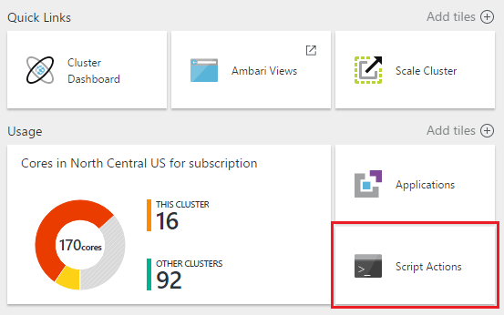

<properties
    pageTitle="自訂使用指令碼動作的 HDInsight 叢集 |Microsoft Azure"
    description="瞭解如何新增自訂的元件至 Linux 型 HDInsight 叢集使用指令碼的動作。 指令碼動作是艦隊指令碼的叢集節點，並可用於自訂叢集設定，或新增額外的服務與公用程式，例如色調、 Solr 或。"
    services="hdinsight"
    documentationCenter=""
    authors="Blackmist"
    manager="jhubbard"
    editor="cgronlun"
    tags="azure-portal"/>

<tags
    ms.service="hdinsight"
    ms.workload="big-data"
    ms.tgt_pltfrm="na"
    ms.devlang="na"
    ms.topic="article"
    ms.date="09/06/2016"
    ms.author="larryfr"/>

# 自訂 Linux 型 HDInsight 叢集使用指令碼的巨集指令

HDInsight 提供稱為呼叫自訂叢集的自訂指令碼的**指令碼的巨集指令**設定選項。 這些指令碼叢集建立期間，或已執行的叢集，可以使用，而且用來安裝額外元件或變更設定的設定。

> [AZURE.NOTE] 使用指令碼動作已執行的叢集上的功能只適用於 Linux 型 HDInsight 叢集。 使用 Windows 型叢集指令碼動作的詳細資訊，請參閱 <<c0>自訂 HDInsight 叢集使用指令碼動作 (Windows)。

指令碼動作也可發佈至 Azure Marketplace 為 HDInsight 應用程式。 部分這份文件中的範例顯示如何安裝 HDInsight 應用程式使用 PowerShell 和.NET SDK 的指令碼動作命令。 如需有關 HDInsight 應用程式的詳細資訊，請參閱[Azure Marketplace 發佈 HDInsight 應用程式](hdinsight-apps-publish-applications.md)。 

## 了解指令碼動作

指令碼動作是直接將指令碼，所提供的 URL，參數及參數值，然後再執行 HDInsight 叢集節點艦隊。 以下是特性和指令碼動作的功能。

* 必須儲存在可存取的 HDInsight URI。 以下是可能的儲存位置︰

    * 可能的 blob 儲存體帳戶 HDInsight 叢集帳戶主要或額外儲存空間。 HDInsight 授與存取兩種類型的儲存空間帳戶叢集建立期間，因為這些提供使用非公用指令碼的巨集指令。
    
    * 公開 URI，例如 Azure Blob、 GitHub、 OneDrive、 Dropbox 等等。
    
    儲存在 blob 容器 （公開可） 的指令碼 URI 的範例，請參閱[範例指令碼動作指令碼](#example-script-action-scripts)] 區段。

* 若要__在特定節點類型上執行__，例如標頭節點或工作者節點，可以加以限制。

    > [AZURE.NOTE] 用於 HDInsight 進階版，您可以指定的指令碼應用於邊緣節點。

* 可以__保存__或__臨機操作__。

    __Persisted__指令碼是指令碼來套用至工作者節點，會自動執行擴充叢集時所建立的新節點。

    持續性的指令碼也可能會將變更套用至另一個節點類型，例如標頭的節點，但功能觀點保存指令碼的唯一原因是適用於叢集橫向擴充時所建立的新背景工作節點。

    > [AZURE.IMPORTANT] 持續性的指令碼動作必須具備唯一的名稱。

    __臨機操作__指令碼並不會保存。不過，您就可以升階臨機操作保存的指令碼，指令碼，或降階臨機操作的指令碼保存指令碼。

    > [AZURE.IMPORTANT] 叢集建立時所用的指令碼動作會自動保存。
    >
    > 即使您明確指出他們應該保存指令碼，不會失敗。

* 可以接受__參數__在執行時使用的指令碼。

* 會在叢集節點上執行的__根層級權限__。

* 可透過__Azure 入口網站__、 __PowerShell 的 Azure__、 __Azure CLI__或__HDInsight.NET SDK__

    [AZURE.INCLUDE [upgrade-powershell](../../includes/hdinsight-use-latest-powershell-cli-and-dotnet-sdk.md)]

若要協助了解哪些指令碼已套用至叢集，和中決定的升級或降級、 叢集的指令碼識別碼會保留已進行所有指令碼錯誤。

> [AZURE.IMPORTANT] 沒有自動方法若要復原的指令碼動作所做的變更。 如果您要還原指令碼的效果，您必須瞭解哪些變更並手動反轉其 （或提供反轉其指令碼動作）。

### 叢集建立程序中的指令碼動作

叢集建立時所用的指令碼動作是從現有的叢集執行的動作的指令碼稍有不同︰

* 指令碼會__自動保留__。

* 指令碼__錯誤__可能會導致失敗叢集建立程序。

下圖說明指令碼的巨集指令執行期間建立程序時︰

![HDInsight 叢集自訂以及期間叢集建立階段][img-hdi-cluster-states]

HDInsight 正在設定時，會執行指令碼。 此階段指令碼執行平行叢集中的所有指定節點，並會以根權限執行的節點。

> [AZURE.NOTE] 因為指令碼叢集節點上執行的根層級權限，您可以執行停止和開始服務，包括 Hadoop 相關服務等作業。 如果您停止服務，您必須確定 Ambari 服務及其他 Hadoop 相關服務會啟動並執行指令碼完成執行之前。 這些服務，才能成功地決定健康狀況與叢集狀態時所建立。

叢集建立期間，您可以指定多個叫用的指令碼動作中所指定的順序。

> [AZURE.IMPORTANT] 60 分鐘內，都必須完成的指令碼動作或他們會逾時。 期間叢集佈建，指令碼會執行與其他安裝和設定程序。 資源，例如 CPU 時間或網路頻寬競爭可能會導致採取更長的時間完成不在您的開發環境中的指令碼。
>
> 若要最小化執行指令碼的時間，避免工作，例如下載，以及編譯的來源應用程式。 而預先編譯的應用程式，讓它可以快速下載叢集二進位儲存 Azure Blob 儲存體。

###在執行叢集上的指令碼動作

不同於已執行的叢集執行的動作叢集建立，在 [指令碼失敗時所用的指令碼並不會自動會叢集變更為 [失敗狀態。 指令碼完成後，叢集應傳回 「 執行中 」 的狀態。

> [AZURE.IMPORTANT] 這不表示您執行的叢集是受執行不正確的指令碼。 例如，指令碼可以刪除時所需檔案叢集，變更設定，讓服務失敗等。
>
> 根權限，因此請確定您了解指令碼會先將它套用至您的叢集執行指令碼動作。

套用時的指令碼至叢集，叢集狀態會變更為從__已接受__，然後__HDInsight 設定__，__執行__並最後返回__執行__成功的指令碼。 指令碼狀態會記錄在 [指令碼的巨集指令歷程記錄]，您可以使用此來判斷是否指令碼成功或失敗。 例如， `Get-AzureRmHDInsightScriptActionHistory` PowerShell 指令程式可用來檢視指令碼的狀態。 它會傳回類似下列資訊︰

    ScriptExecutionId : 635918532516474303
    StartTime         : 2/23/2016 7:40:55 PM
    EndTime           : 2/23/2016 7:41:05 PM
    Status            : Succeeded

> [AZURE.NOTE] 如果您變更了叢集使用者] （管理） 密碼後建立叢集，這可能會導致指令碼針對此叢集失敗執行的動作。 如果您有任何必要的指令碼動作的目標工作者節點，這些可能會失敗，當您新增到叢集節點調整大小的作業。

## 範例指令碼動作指令碼

從 Azure 入口網站，PowerShell 的 Azure、 Azure CLI 或 HDInsight.NET SDK 可指令碼動作指令碼。 HDInsight 提供指令碼 HDInsight 叢集上安裝下列元件︰

名稱 | 指令碼
----- | -----
**新增 Azure 儲存體帳戶** | https://hdiconfigactions.blob.core.windows.net/linuxaddstorageaccountv01/add-storage-account-v01.sh。 請參閱[套用執行叢集指令碼的動作](#apply-a-script-action-to-a-running-cluster)。
**安裝色調** | https://hdiconfigactions.blob.core.windows.net/linuxhueconfigactionv02/install-hue-uber-v02.sh。 請參閱[安裝並使用色調上 HDInsight 叢集](hdinsight-hadoop-hue-linux.md)。
**安裝 R** | https://hdiconfigactions.blob.core.windows.net/linuxrconfigactionv01/r-installer-v01.sh。 請參閱[安裝並使用 R HDInsight 叢集上](hdinsight-hadoop-r-scripts-linux.md)。
**安裝 Solr** | https://hdiconfigactions.blob.core.windows.net/linuxsolrconfigactionv01/solr-installer-v01.sh。 請參閱[安裝並使用 Solr 上 HDInsight 叢集](hdinsight-hadoop-solr-install-linux.md)。
**安裝 Giraph** | https://hdiconfigactions.blob.core.windows.net/linuxgiraphconfigactionv01/giraph-installer-v01.sh。 請參閱[安裝並使用 Giraph 上 HDInsight 叢集](hdinsight-hadoop-giraph-install-linux.md)。
| **預先載入登錄區文件庫** | https://hdiconfigactions.blob.core.windows.net/linuxsetupcustomhivelibsv01/setup-customhivelibs-v01.sh。 請參閱[新增登錄區文件庫 HDInsight 叢集上](hdinsight-hadoop-add-hive-libraries.md) |

## 在叢集建立期間使用指令碼的巨集指令

本節提供不同的方式時，可以使用指令碼動作建立 HDInsight 叢集-從 Azure] 入口網站中，使用 Azure 資源管理員範本、 使用 PowerShell Cmdlet，以及使用.NET SDK 範例。

### 在 [從 Azure 入口網站的叢集建立期間使用指令碼的巨集指令

1. 開始建立叢集所述，[建立 Hadoop 叢集 HDInsight 中](hdinsight-provision-clusters.md#portal)。

2. __選用的設定__] 底下的**指令碼動作**刀中，按一下 [**新增指令碼動作**提供詳細資料的指令碼動作，如下所示︰

    

  	| 屬性 | 值 |
  	| -------- | ----- |
  	| 名稱 | 指定指令碼動作的名稱。 |
  	| 指令碼 URI | 指定自訂叢集叫用的指令碼 URI。 |
  	| 不對/工作者 | 在上執行的自訂指令碼指定節點 （**不對**、**工作**或**動物園管理員**）。 |
  	| 參數 | 如果所需的指令碼，請指定參數。 |

    按下 ENTER，若要新增一個以上的指令碼動作，以叢集上安裝多個元件。

3. 按一下 [儲存設定並繼續進行叢集建立的 [**選取**]。

### 使用 [從 Azure 資源管理員範本的指令碼] 動作

在此區段中，我們使用 Azure 資源管理員範本來建立 HDInsight 叢集及也使用指令碼指令叢集上安裝自訂元件 (在此範例中 R)。 本節提供範例範本來建立使用指令碼的巨集指令。

> [AZURE.NOTE] 本節中的步驟會示範使用指令碼動作建立叢集。 如需建立叢集從 HDInsight 應用程式範本的範例，請參閱[安裝自訂 HDInsight 應用程式](hdinsight-apps-install-custom-applications.md)。

#### 開始之前

* 設定工作站執行 HDInsight Powershell 指令程式的相關資訊，請參閱[安裝及設定 PowerShell 的 Azure](../powershell-install-configure.md)。
* 瞭解如何建立範本，請參閱[撰寫 Azure 資源管理員範本](../resource-group-authoring-templates.md)的相關指示。
* 如果您先前未使用 PowerShell 的 Azure 與資源管理員，請參閱[使用 PowerShell 的 Azure 與 Azure 資源管理員](../powershell-azure-resource-manager.md)。

#### 建立叢集使用指令碼的巨集指令

1. 將下列範本複製到您的電腦上的位置。 此範本上 headnodes 安裝 Giraph 以及叢集工作者節點。 您也可以驗證 JSON 範本是否有效。 貼入[JSONLint](http://jsonlint.com/)，線上 JSON 驗證工具範本內容。

            {
            "$schema": "http://schema.management.azure.com/schemas/2015-01-01/deploymentTemplate.json#",
            "contentVersion": "1.0.0.0",
            "parameters": {
                "clusterLocation": {
                    "type": "string",
                    "defaultValue": "West US",
                    "allowedValues": [ "West US" ]
                },
                "clusterName": {
                    "type": "string"
                },
                "clusterUserName": {
                    "type": "string",
                    "defaultValue": "admin"
                },
                "clusterUserPassword": {
                    "type": "securestring"
                },
                "sshUserName": {
                    "type": "string",
                    "defaultValue": "username"
                },
                "sshPassword": {
                    "type": "securestring"
                },
                "clusterStorageAccountName": {
                    "type": "string"
                },
                "clusterStorageAccountResourceGroup": {
                    "type": "string"
                },
                "clusterStorageType": {
                    "type": "string",
                    "defaultValue": "Standard_LRS",
                    "allowedValues": [
                        "Standard_LRS",
                        "Standard_GRS",
                        "Standard_ZRS"
                    ]
                },
                "clusterStorageAccountContainer": {
                    "type": "string"
                },
                "clusterHeadNodeCount": {
                    "type": "int",
                    "defaultValue": 1
                },
                "clusterWorkerNodeCount": {
                    "type": "int",
                    "defaultValue": 2
                }
            },
            "variables": {
            },
            "resources": [
                {
                    "name": "[parameters('clusterStorageAccountName')]",
                    "type": "Microsoft.Storage/storageAccounts",
                    "location": "[parameters('clusterLocation')]",
                    "apiVersion": "2015-05-01-preview",
                    "dependsOn": [ ],
                    "tags": { },
                    "properties": {
                        "accountType": "[parameters('clusterStorageType')]"
                    }
                },
                {
                    "name": "[parameters('clusterName')]",
                    "type": "Microsoft.HDInsight/clusters",
                    "location": "[parameters('clusterLocation')]",
                    "apiVersion": "2015-03-01-preview",
                    "dependsOn": [
                        "[concat('Microsoft.Storage/storageAccounts/', parameters('clusterStorageAccountName'))]"
                    ],
                    "tags": { },
                    "properties": {
                        "clusterVersion": "3.2",
                        "osType": "Linux",
                        "clusterDefinition": {
                            "kind": "hadoop",
                            "configurations": {
                                "gateway": {
                                    "restAuthCredential.isEnabled": true,
                                    "restAuthCredential.username": "[parameters('clusterUserName')]",
                                    "restAuthCredential.password": "[parameters('clusterUserPassword')]"
                                }
                            }
                        },
                        "storageProfile": {
                            "storageaccounts": [
                                {
                                    "name": "[concat(parameters('clusterStorageAccountName'),'.blob.core.windows.net')]",
                                    "isDefault": true,
                                    "container": "[parameters('clusterStorageAccountContainer')]",
                                    "key": "[listKeys(resourceId('Microsoft.Storage/storageAccounts', parameters('clusterStorageAccountName')), '2015-05-01-preview').key1]"
                                }
                            ]
                        },
                        "computeProfile": {
                            "roles": [
                                {
                                    "name": "headnode",
                                    "targetInstanceCount": "[parameters('clusterHeadNodeCount')]",
                                    "hardwareProfile": {
                                        "vmSize": "Large"
                                    },
                                    "osProfile": {
                                        "linuxOperatingSystemProfile": {
                                            "username": "[parameters('sshUserName')]",
                                            "password": "[parameters('sshPassword')]"
                                        }
                                    },
                                    "scriptActions": [
                                        {
                                            "name": "installGiraph",
                                            "uri": "https://hdiconfigactions.blob.core.windows.net/linuxgiraphconfigactionv01/giraph-installer-v01.sh",
                                            "parameters": ""
                                        }
                                    ]
                                },
                                {
                                    "name": "workernode",
                                    "targetInstanceCount": "[parameters('clusterWorkerNodeCount')]",
                                    "hardwareProfile": {
                                        "vmSize": "Large"
                                    },
                                    "osProfile": {
                                        "linuxOperatingSystemProfile": {
                                            "username": "[parameters('sshUserName')]",
                                            "password": "[parameters('sshPassword')]"
                                        }
                                    },
                                    "scriptActions": [
                                        {
                                            "name": "installR",
                                            "uri": "https://hdiconfigactions.blob.core.windows.net/linuxrconfigactionv01/r-installer-v01.sh",
                                            "parameters": ""
                                        }
                                    ]
                                }
                            ]
                        }
                    }
                }
            ],
            "outputs": {
                "cluster":{
                    "type" : "object",
                    "value" : "[reference(resourceId('Microsoft.HDInsight/clusters',parameters('clusterName')))]"
                }
            }
        }

2. 開始 PowerShell 的 Azure 和登入您的 Azure 帳戶。 提供您的認證後,] 命令會傳回您的帳戶的相關資訊。

        Add-AzureRmAccount

        Id                             Type       ...
        --                             ----
        someone@example.com            User       ...

3. 如果您有多個訂閱，提供您想要使用的部署的訂閱識別碼。

        Select-AzureRmSubscription -SubscriptionID <YourSubscriptionId>

    > [AZURE.NOTE] 您可以使用`Get-AzureRmSubscription`即可取得您的帳戶，其中包含每個訂閱 Id 相關聯的所有訂閱的清單。

5. 如果您沒有現有的資源群組，建立新的資源群組。 提供您的方案，您需要的位置與資源群組的名稱。 會傳回新的資源群組的摘要。

        New-AzureRmResourceGroup -Name myresourcegroup -Location "West US"

        ResourceGroupName : myresourcegroup
        Location          : westus
        ProvisioningState : Succeeded
        Tags              :
        Permissions       :
                            Actions  NotActions
                            =======  ==========
                            *
        ResourceId        : /subscriptions/######/resourceGroups/ExampleResourceGroup

6. 若要建立新的部署資源群組，請執行**新增 AzureRmResourceGroupDeployment**命令，然後提供必要的參數。 參數會包含您的部署，您建立的範本名稱資源的群組，以及路徑或 URL 的名稱。 如果您的範本需要任何參數，您必須傳遞的參數也。 在此情況下，安裝 R 叢集上的指令碼動作不需要任何參數。

        New-AzureRmResourceGroupDeployment -Name mydeployment -ResourceGroupName myresourcegroup -TemplateFile <PathOrLinkToTemplate>

    系統會提示您提供的範本中定義的參數值。

7. 當已部署資源群組時，您會看到部署的摘要。

          DeploymentName    : mydeployment
          ResourceGroupName : myresourcegroup
          ProvisioningState : Succeeded
          Timestamp         : 8/17/2015 7:00:27 PM
          Mode              : Incremental
          ...

8. 如果您的部署失敗，您可以使用下列 cmdlet，以取得失敗的相關資訊。

        Get-AzureRmResourceGroupDeployment -ResourceGroupName myresourcegroup -ProvisioningState Failed

### 使用指令碼動作，從 PowerShell 的 Azure 叢集建立期間

在此區段中，我們可以使用 [[新增 AzureRmHDInsightScriptAction](https://msdn.microsoft.com/library/mt603527.aspx) cmdlet 叫用來自訂叢集使用指令碼的巨集指令的指令碼。 在進行之前，請確定您有安裝並設定 PowerShell 的 Azure。 設定工作站執行 HDInsight PowerShell 指令程式的相關資訊，請參閱[安裝及設定 PowerShell 的 Azure](../powershell-install-configure.md)。

執行下列步驟︰

1. 開啟 Azure PowerShell 主控台和 Azure 訂閱登入後使用，宣告一些 PowerShell 變數︰

        # LOGIN TO ZURE
        Login-AzureRmAccount

        # PROVIDE VALUES FOR THESE VARIABLES
        $subscriptionId = "<SubscriptionId>"        # ID of the Azure subscription
        $clusterName = "<HDInsightClusterName>"         # HDInsight cluster name
        $storageAccountName = "<StorageAccountName>"    # Azure storage account that hosts the default container
        $storageAccountKey = "<StorageAccountKey>"      # Key for the storage account
        $containerName = $clusterName
        $location = "<MicrosoftDataCenter>"             # Location of the HDInsight cluster. It must be in the same data center as the storage account.
        $clusterNodes = <ClusterSizeInNumbers>          # The number of nodes in the HDInsight cluster.
        $resourceGroupName = "<ResourceGroupName>"      # The resource group that the HDInsight cluster will be created in

2. 指定 （例如，叢集節點） 的設定值，使用預設儲存空間。

        # SPECIFY THE CONFIGURATION OPTIONS
        Select-AzureRmSubscription -SubscriptionId $subscriptionId
        $config = New-AzureRmHDInsightClusterConfig
        $config.DefaultStorageAccountName="$storageAccountName.blob.core.windows.net"
        $config.DefaultStorageAccountKey=$storageAccountKey

3. 您可以使用 [**新增 AzureRmHDInsightScriptAction** cmdlet 來叫用的指令碼。 下列範例會使用叢集上所安裝 Giraph 指令碼︰

        # INVOKE THE SCRIPT USING THE SCRIPT ACTION FOR HEADNODE AND WORKERNODE
        $config = Add-AzureRmHDInsightScriptAction -Config $config -Name "Install Giraph"  -NodeType HeadNode -Uri https://hdiconfigactions.blob.core.windows.net/linuxgiraphconfigactionv01/giraph-installer-v01.sh
        $config = Add-AzureRmHDInsightScriptAction -Config $config -Name "Install Giraph"  -NodeType WorkerNode -Uri https://hdiconfigactions.blob.core.windows.net/linuxgiraphconfigactionv01/giraph-installer-v01.sh

    **新增 AzureRmHDInsightScriptAction** cmdlet 採用下列參數︰

  	| 參數 | 定義 |
  	| --------- | ---------- |
  	| 設定 | 設定物件動作資訊會新增至哪些指令碼。 |
  	| 名稱 | 指令碼動作的名稱。 |
  	| 節點類型 | 指定要在其執行的自訂指令碼節點。 有效的值是 （若要安裝在） **HeadNode** **WorkerNode** （若要安裝所有資料節點上），或**ZookeeperNode** （若要安裝動物園管理員節點上）。 |
  	| 參數 | 所需的指令碼的參數。 |
  	| Uri | 指定要執行的指令碼的 URI。 |

4. 設定叢集管理員/HTTPS 使用者︰

        $httpCreds = get-credential

    出現提示時，名稱]，輸入 「 系統 」，然後輸入密碼。

5. 設定 SSH 認證︰

        $sshCreds = get-credential

    出現提示時，請輸入 SSH 使用者名稱和密碼。 如果您要保護的憑證，而不是密碼 SSH 帳戶，請使用空白的密碼，然後設定`$sshPublicKey`憑證公開金鑰您想要使用的內容。 例如︰

        $sshPublicKey = Get-Content .\path\to\public.key -Raw

4. 最後，建立叢集︰

        New-AzureRmHDInsightCluster -config $config -clustername $clusterName -DefaultStorageContainer $containerName -Location $location -ResourceGroupName $resourceGroupName -ClusterSizeInNodes $clusterNodes -HttpCredential $httpCreds -SshCredential $sshCreds -OSType Linux

    如果您使用公開金鑰以 SSH 的帳戶，您也必須指定`-SshPublicKey $sshPublicKey`做為參數。

可能需要幾分鐘，才能建立叢集。

### 使用指令碼動作，從 HDInsight.NET SDK 叢集建立期間

HDInsight.NET SDK 提供用戶端文件庫，可讓您更輕鬆地使用 HDInsight.NET 應用程式。 程式碼範例中，請參閱[建立 Linux 型叢集中使用.NET SDK 的 HDInsight](hdinsight-hadoop-create-linux-clusters-dotnet-sdk.md#use-script-action)。

## 若要執行的叢集套用指令碼的巨集指令

本節提供不同的方式，您可以將指令碼動作套用至執行 HDInsight 叢集; 範例從 Azure] 入口網站中，使用 PowerShell Cmdlet，使用跨平台 Azure CLI，以及使用.NET SDK。 本節中使用保存指令碼巨集指令執行叢集新增現有 Azure 儲存體帳戶。 您也可以使用其他的指令碼動作，請參閱[範例指令碼動作指令碼](#example-script-action-scripts)。

### 套用指令碼的巨集指令執行叢集 Azure 入口網站

1. 從[Azure 入口網站](https://portal.azure.com)中，選取 [HDInsight 叢集]。

2. 從 HDInsight 叢集刀中，選取__指令碼動作__磚。

    

    > [AZURE.NOTE] 您可以也選取__所有設定__，，然後都選取 [設定刀從 [__指令碼動作__。

4. 從指令碼動作刀頂端，選取 [__新的送出__]。

    

5. 從 [新增指令碼動作刀中，輸入下列資訊。

    * __名稱__︰ 使用這個指令碼動作好記的名稱。 在此範例中， `Add Storage account`。
    * __指令碼 URI__: URI 指令碼。 在此範例中，`https://hdiconfigactions.blob.core.windows.net/linuxaddstorageaccountv01/add-storage-account-v01.sh`
    * __不對____工作者__，與__動物園管理員__︰ 檢查這個指令碼應該套用至節點。 在此範例中，會檢查不對、 工作和動物園管理員。
    * __參數__︰ 如果指令碼接受參數，其在這裡輸入。 在此範例中，輸入儲存體帳戶名稱，然後儲存帳戶金鑰︰

        

        在螢幕擷取畫面，`contosodata`現有 Azure 儲存體帳戶，第二行是儲存帳戶金鑰]。
    * __PERSISTED__︰ 如果您想要保存指令碼，它將會套用至新的工作者節點叢集不按比例縮放時，請核取此項目。

6. 最後，若要套用到叢集的指令碼中使用 [__建立__] 按鈕。

### 執行叢集套用 Azure PowerShell 指令碼的巨集指令

在進行之前，請確定您有安裝並設定 PowerShell 的 Azure。 設定工作站執行 HDInsight PowerShell 指令程式的相關資訊，請參閱[安裝及設定 PowerShell 的 Azure](../powershell-install-configure.md)。

1. 開啟 Azure PowerShell 主控台和 Azure 訂閱登入後使用，宣告一些 PowerShell 變數︰

        # LOGIN TO ZURE
        Login-AzureRmAccount

        # PROVIDE VALUES FOR THESE VARIABLES
        $clusterName = "<HDInsightClusterName>"         # HDInsight cluster name
        $saName = "<ScriptActionName>"                  # Name of the script action
        $saURI = "<URI to the script>"                  # The URI where the script is located
        $nodeTypes = "headnode", "workernode"
        
    > [AZURE.NOTE] 如果使用 HDInsight 進階版叢集，您可以使用的節點類型`"edgenode"`邊緣節點上執行指令碼。

2. 若要套用到叢集的指令碼中使用下列命令︰

        Submit-AzureRmHDInsightScriptAction -ClusterName $clusterName -Name $saName -Uri $saURI -NodeTypes $nodeTypes -PersistOnSuccess

    工作完成後，您應該會收到下列類似的資訊︰

        OperationState  : Succeeded
        ErrorMessage    :
        Name            : Giraph
        Uri             : https://hdiconfigactions.blob.core.windows.net/linuxgiraphconfigactionv01/giraph-installer-v01.sh
        Parameters      :
        NodeTypes       : {HeadNode, WorkerNode}

### 套用 Azure CLI 執行叢集指令碼的巨集指令

在進行之前，請確定您有安裝並設定 Azure CLI。 如需詳細資訊，請參閱[安裝 Azure CLI](../xplat-cli-install.md)。

    [AZURE.INCLUDE [use-latest-version](../../includes/hdinsight-use-latest-cli.md)] 

1. 開啟命令介面工作階段、 終端機、 命令提示字元或您的系統其他命令列，然後切換至 Azure 資源管理員模式中使用下列命令。

        azure config mode arm

2. 使用下列項目會驗證 Azure 訂閱。

        azure login

3. 使用下列命令以執行叢集套用指令碼的巨集指令

        azure hdinsight script-action create <clustername> -g <resourcegroupname> -n <scriptname> -u <scriptURI> -t <nodetypes>

    如果您省略參數，此命令時，系統會提示您它們。 如果您使用指定的指令碼`-u`接受參數，您可以將其指定使用`-p`參數。

    有效__nodetypes__是__headnode__ __workernode__，與__動物園管理員__。 如果指令碼應該套用至多個節點類型，指定類型以分隔 ';'。 例如， `-n headnode;workernode`。

    若要保存指令碼，新增`--persistOnSuccess`。 您也可以保存在日後指令碼，使用`azure hdinsight script-action persisted set`。
    
    工作完成後，您會收到下列類似的輸出。
    
        info:    Executing command hdinsight script-action create
        + Executing Script Action on HDInsight cluster
        data:    Operation Info
        data:    ---------------
        data:    Operation status:
        data:    Operation ID:  b707b10e-e633-45c0-baa9-8aed3d348c13
        info:    hdinsight script-action create command OK

### 套用到使用 REST API 執行叢集的指令碼的巨集指令

請參閱[在執行叢集上執行指令碼動作](https://msdn.microsoft.com/library/azure/mt668441.aspx)。
### 套用 HDInsight.NET SDK 執行叢集指令碼的巨集指令

若要將指令碼套用至叢集使用.NET SDK 的範例，請參閱[https://github.com/Azure-Samples/hdinsight-dotnet-script-action](https://github.com/Azure-Samples/hdinsight-dotnet-script-action)。

## 檢視歷程記錄、 宣傳及降階指令碼動作

### 使用 [Azure 入口網站

1. 從[Azure 入口網站](https://portal.azure.com)中，選取 [HDInsight 叢集]。

2. 從 HDInsight 叢集刀中，選取 [__設定__]。

    ![[設定] 圖示](./media/hdinsight-hadoop-customize-cluster-linux/settingsicon.png)

3. 從設定刀中，選取 [__指令碼動作__]。

    

4. 持續性的指令碼，以及套用至叢集，指令碼的歷程記錄清單會顯示在 [指令碼動作刀上。 在以下的螢幕擷取畫面，您可以看到指令碼已 Solr 執行此叢集，但尚未保存沒有指令碼的動作。

    

5. 選取 [歷程記錄] 中的 [指令碼會顯示此指令碼屬性刀。 從刀頂端，您可以重新執行指令碼，或將它升級。

    

6. 您也可以使用__...__若要執行的動作，例如重新執行指令碼動作刀上的項目右邊，仍然存在，或 （適用於保存動作） 刪除。

    

### 使用 PowerShell 的 Azure

| 使用下列項目... | 若要... |
| ----- | ----- |
| 取得 AzureRmHDInsightPersistedScriptAction | 擷取保存指令碼動作的詳細資訊 |
| 取得 AzureRmHDInsightScriptActionHistory | 擷取歷程記錄的指令碼動作套用至叢集或特定的指令碼的詳細資料 |
| 設定 AzureRmHDInsightPersistedScriptAction | 升階為保存指令碼的巨集指令的臨機操作的指令碼動作 |
| 移除 AzureRmHDInsightPersistedScriptAction | 將降級臨機操作動作保存指令碼動作 |

> [AZURE.IMPORTANT] 使用`Remove-AzureRmHDInsightPersistedScriptAction`不的復原動作執行指令碼，它只會移除保存旗標，好讓指令碼不會執行新增到叢集新工作者節點。

下列範例指令碼說明如何使用 cmdlet 升階，然後降階指令碼。

    # Get a history of scripts
    Get-AzureRmHDInsightScriptActionHistory -ClusterName mycluster

    # From the list, we want to get information on a specific script
    Get-AzureRmHDInsightScriptActionHistory -ClusterName mycluster -ScriptExecutionId 635920937765978529

    # Promote this to a persisted script
    # Note: the script must have a unique name to be promoted
    # if the name is not unique, you will receive an error
    Set-AzureRmHDInsightPersistedScriptAction -ClusterName mycluster -ScriptExecutionId 635920937765978529

    # Demote the script back to ad hoc
    # Note that demotion uses the unique script name instead of
    # execution ID.
    Remove-AzureRmHDInsightPersistedScriptAction -ClusterName mycluster -Name "Install Giraph"

### 使用 Azure CLI

| 使用下列項目... | 若要... |
| ----- | ----- |
| `azure hdinsight script-action persisted list <clustername>` | 擷取保存指令碼動作清單 |
| `azure hdinsight script-action persisted show <clustername> <scriptname>` | 擷取特定保存指令碼動作的詳細資訊 |
| `azure hdinsight script-action history list <clustername>` | 擷取指令碼動作套用至叢集歷程的記錄 |
| `azure hdinsight script-action history show <clustername> <scriptname>` | 擷取特定的指令碼動作的詳細資訊 |
| `azure hdinsight script action persisted set <clustername> <scriptexecutionid>` | 升階為保存指令碼的巨集指令的臨機操作的指令碼動作 |
| `azure hdinsight script-action persisted delete <clustername> <scriptname>` | 將降級臨機操作動作保存指令碼動作 |

> [AZURE.IMPORTANT] 使用`azure hdinsight script-action persisted delete`不的復原動作執行指令碼，它只會移除保存的標幟，好讓指令碼不會執行新增到叢集新工作者節點。

### 使用 HDInsight.NET SDK

使用.NET SDK 從叢集擷取指令碼歷程記錄的範例，升階或降階指令碼，請參閱[https://github.com/Azure-Samples/hdinsight-dotnet-script-action](https://github.com/Azure-Samples/hdinsight-dotnet-script-action)。

> [AZURE.NOTE] 本範例示範如何將安裝使用.NET SDK HDInsight 應用程式。

## 疑難排解

您可以使用 Ambari 網頁 UI 來檢視指令碼動作所記錄的資訊。 如果使用指令碼叢集期間的 [建立]，然後叢集建立指令碼中的錯誤導致失敗，記錄，也會出現在叢集相關聯的預設儲存帳戶。 本節提供如何擷取記錄使用下列兩個選項的資訊。

### 使用 Ambari 網頁 UI

1. 在瀏覽器中瀏覽至 https://CLUSTERNAME.azurehdinsight.net。 CLUSTERNAME 換成您 HDInsight 叢集的名稱。

    出現提示時，輸入叢集的管理員帳戶的名稱 （系統） 和密碼。 您可能必須重新輸入 web 表單中的管理員認證。

2. 從頁面頂端列中，選取__選項__項目。 這會顯示目前和之前執行的作業清單透過 Ambari 叢集上。

    

3. 尋找的項目__執行\_customscriptaction__ [__作業__] 欄中。 指令碼動作會執行時，會建立這些項目。

    

    選取此項目，然後執行叢集上的向下切入檢視 STDOUT 和 STDERR 輸出指令碼時產生的連結]。

### Access 記錄從預設儲存帳戶

如果叢集建立發生錯誤，無法在 [指令碼的巨集指令，指令碼動作記錄還是可以直接從叢集相關聯的預設儲存帳戶存取。

* 儲存記錄檔可在`\STORAGE_ACOCUNT_NAME\DEFAULT_CONTAINER_NAME\custom-scriptaction-logs\CLUSTER_NAME\DATE`。

    

    下，記錄會分別 headnode、 workernode，及動物園管理員節點組織。 以下是一些範例︰
    * **Headnode** - `<uniqueidentifier>AmbariDb-hn0-<generated_value>.cloudapp.net`
    * **工作者節點** - `<uniqueidentifier>AmbariDb-wn0-<generated_value>.cloudapp.net`
    * **動物園管理員節點** - `<uniqueidentifier>AmbariDb-zk0-<generated_value>.cloudapp.net`

* 所有 stdout 和 stderr 的相對應的主機上都傳至儲存的帳戶。 有**輸出-\*.txt**和**錯誤-\*.txt**的每個指令碼動作。 輸出 *.txt 檔案包含您使用的是執行主機的指令碼的 URI 相關資訊。 例如

        'Start downloading script locally: ', u'https://hdiconfigactions.blob.core.windows.net/linuxrconfigactionv01/r-installer-v01.sh'

* 有可能在重複建立指令碼動作叢集使用相同的名稱。 在這種情況下，您可以區分相關記錄根據日期資料夾名稱。 例如，將會叢集 (mycluster) 在不同的日期上建立的資料夾結構︰
    * `\STORAGE_ACOCUNT_NAME\DEFAULT_CONTAINER_NAME\custom-scriptaction-logs\mycluster\2015-10-04`
    * `\STORAGE_ACOCUNT_NAME\DEFAULT_CONTAINER_NAME\custom-scriptaction-logs\mycluster\2015-10-05`

* 如果您建立具有相同名稱的指令碼的巨集指令叢集同一天，您可以使用唯一的前置詞，以識別相關的記錄檔。

* 如果您建立叢集結尾時，可能是日期的記錄檔跨兩天。 在這種情況下，您會看到兩個不同的日期相同叢集。

* 最多 5 分鐘，尤其是對於大型叢集，可能需要上傳到預設的容器的記錄檔。 因此，如果您想要存取記錄，您應該立即刪除叢集如果指令碼的巨集指令失敗。

## HDInsight 叢集上所用的開啟來源軟體支援

Microsoft Azure HDInsight 服務是彈性的平台可讓您使用的周圍 Hadoop 格式開啟來源技術生態建置在雲端的大型資料應用程式。 Microsoft Azure 提供一般等級的支援開啟來源技術[支援常見問題集 Azure 網站](https://azure.microsoft.com/support/faq/)的 [**支援範圍**] 區段中所述。 HDInsight 服務會提供其他支援層級的部分元件，如下所述。

有兩種類型的開啟來源元件所提供的 HDInsight 服務︰

- **內建的元件**-HDInsight 叢集上已預先安裝下列元件，並提供叢集核心功能。 例如，YARN ResourceManager、 登錄區查詢語言 (HiveQL) 及 Mahout 文件庫隸屬於此類別中。 叢集元件的完整清單有[HDInsight 所提供之 Hadoop 叢集版本中的新功能？](hdinsight-component-versioning.md)。

- **自訂元件**-，以在叢集，使用者可以安裝，或使用您的工作量中的任何可用的社群中或建立您的元件。

> [AZURE.WARNING] 完全支援元件提供 HDInsight 叢集，以及 Microsoft 支援服務會協助找出並解決這些元件的相關問題。
>
> 自訂元件收到合理的支援，以協助您進一步疑難排解問題。 這可能會導致解決問題，或詢問要加入找到該技術深專業知識的位置開啟來源技術可用的頻道。 例如，有許多都可以使用，這樣的社群網站︰[適用於 HDInsight MSDN 論壇](https://social.msdn.microsoft.com/Forums/azure/en-US/home?forum=hdinsight)、 [http://stackoverflow.com](http://stackoverflow.com)。 也 Apache 專案有[http://apache.org](http://apache.org)，在專案網站，例如︰ [Hadoop](http://hadoop.apache.org/)。

HDInsight 服務會提供數種方式可使用自訂的元件。 如何使用或元件安裝叢集上，無論適用於支援相同層級。 以下是最常見的方式，可以使用自訂的元件 HDInsight 叢集上的清單︰

1. 可以叢集送出工作送出 Hadoop 或其他類型的工作可執行或使用自訂的元件。

2. 叢集自訂-叢集建立期間，您可以指定其他設定] 和 [叢集節點將會安裝的自訂元件。

3. 範例-常用的自訂元件、 Microsoft 與其他人可能會提供如何使用這些元件，HDInsight 叢集上的範例。 下列範例會提供不支援。

##疑難排解

###歷程記錄不會顯示叢集建立時所用的指令碼

如果您的叢集建立之前 2016 年 3 月 15 日，您可能不會出現任何叢集建立時所用的指令碼的指令碼動作歷程記錄中的項目。 不過，如果您調整叢集 2016 年 3 月 15 日之後叢集建立期間使用的指令碼會出現在歷程記錄時它們會套用至新叢集節點調整大小的作業的一部分。

有兩個例外狀況︰

* 如果您的叢集建立 2015 年 9 月 1 日之前。 這是已引入指令碼動作，因此這個日期之前所建立的任何叢集可以不使用指令碼動作叢集建立的。

* 如果您叢集建立時所用的指令碼的多個動作，並使用多個指令碼，相同的名稱或相同的名稱、 相同 URI，但不同參數的多個指令碼。 在這種情況下，您會收到下列錯誤。

    沒有新的指令碼動作可執行此叢集，因為現有的指令碼中的衝突指令碼名稱。 在 [叢集提供的指令碼名稱建立必須是唯一的所有。 現有的指令碼仍然會執行上調整大小。

## 後續步驟

建立及自訂叢集使用指令碼，請參閱下列內容的資訊與範例︰

- [開發 HDInsight 指令碼動作指令碼](hdinsight-hadoop-script-actions-linux.md)
- [安裝並使用 Solr HDInsight 叢集上](hdinsight-hadoop-solr-install-linux.md)
- [安裝並使用 Giraph HDInsight 叢集上](hdinsight-hadoop-giraph-install-linux.md)

[img-hdi-cluster-states]: ./media/hdinsight-hadoop-customize-cluster-linux/HDI-Cluster-state.png "在叢集建立期間的階段"
