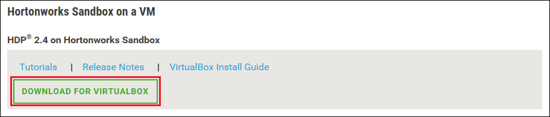

<properties
    pageTitle="若要深入瞭解 Hadoop 使用 Hadoop 沙箱 |Microsoft Azure"
    description="若要開始學習使用 Hadoop 生態，您可以設定 Hadoop 沙箱 Hortonworks 從 Azure 虛擬機器上。 "
    keywords="hadoop 模擬器，hadoop 沙箱"
    editor="cgronlun"
    manager="jhubbard"
    services="hdinsight"
    authors="nitinme"
    documentationCenter=""
    tags="azure-portal"/>

<tags
    ms.service="hdinsight"
    ms.workload="big-data"
    ms.tgt_pltfrm="na"
    ms.devlang="na"
    ms.topic="article"
    ms.date="08/24/2016"
    ms.author="nitinme"/>

# Hadoop 生態使用 Hadoop 沙箱虛擬機器中的快速入門

瞭解如何從 Hortonworks 安裝 Hadoop 沙箱，若要深入瞭解 Hadoop 生態虛擬機器。 沙箱提供本機的開發環境，若要深入瞭解 Hadoop、 Hadoop 分散式檔案系統 (HDFS) 及工作送出。

## 必要條件

* [Oracle VirtualBox](https://www.virtualbox.org/)

熟悉 Hadoop 後，您可以以開始使用 Hadoop Azure 上建立 HDInsight 叢集。 如需有關如何開始的詳細資訊，請參閱[開始使用 Hadoop HDInsight 上](hdinsight-hadoop-linux-tutorial-get-started.md)。

## 下載並安裝虛擬機器

1. 從[http://hortonworks.com/downloads/#sandbox](http://hortonworks.com/downloads/#sandbox)，選取 [__下載的 VIRTUALBOX__項目上 Hortonworks 沙箱 HDP 2.4 的。 會提示您先開始下載 Hortonworks 以註冊。

    

2. 從相同的網頁上，選取在 Hortonworks 沙箱 HDP 2.4 __VirtualBox 安裝指南__。 這會下載 PDF 包含虛擬機器的安裝指示。

    

## 啟動虛擬機器

1. 開始 VirtualBox、 選取 Hortonworks 沙箱，選取 [__開始__]，然後__標準開始__。

    

2. 在虛擬機器已經完成啟動程序時，它會顯示登入指示進行。 開啟網頁瀏覽器，然後瀏覽至 [顯示的 URL (通常 http://127.0.0.1:8888)。

## 設定密碼

1. 從 Hortonworks 沙箱頁面的__開始__步驟，選取 [__進階選項] 檢視__。 在 [登入使用 SSH 沙箱此頁面上使用的資訊。 使用提供名稱和密碼。

    > [AZURE.NOTE] 如果您沒有安裝 SSH 用戶端，您可以使用在虛擬機器在所提供的 web 式 SSH __http://localhost:4200 /__。

    第一次您連線使用 SSH，系統會提示若要變更根帳戶的密碼。 輸入新密碼，當您登入您在未來使用 SSH 會使用。

2. 登入，輸入下列命令︰

        ambari-admin-password-reset
    
    出現提示時，提供 Ambari 管理員帳戶的密碼。 當您存取 Ambari Web UI 時，這將會使用。

## 使用 [群組] 命令

1. 從沙箱 SSH 連線，請啟動登錄區殼層使用下列命令︰

        hive

2. 一旦殼層開始，使用下列命令以檢視沙箱會提供的資料表︰

        show tables;

3. 若要擷取的 10 個資料列，使用下列`sample_07`表格︰

        select * from sample_07 limit 10;

## 後續步驟

* [瞭解如何使用 Hortonworks 沙箱 Visual Studio](hdinsight-hadoop-emulator-visual-studio.md)
* [學習 Hortonworks 沙箱的 ropes](http://hortonworks.com/hadoop-tutorial/learning-the-ropes-of-the-hortonworks-sandbox/)
* [Hadoop 教學課程-HDP 快速入門](http://hortonworks.com/hadoop-tutorial/hello-world-an-introduction-to-hadoop-hcatalog-hive-and-pig/)