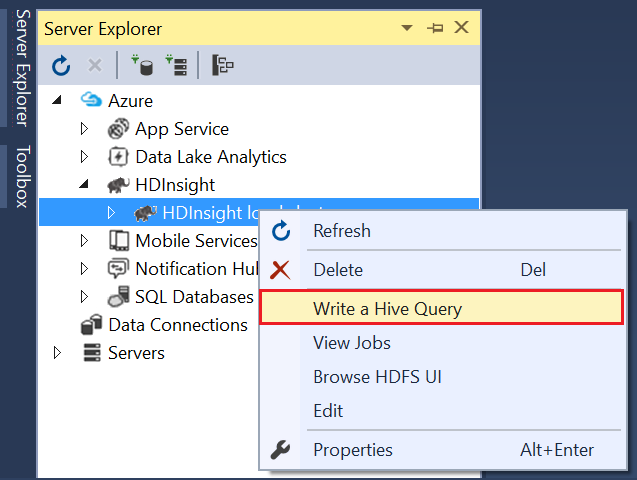
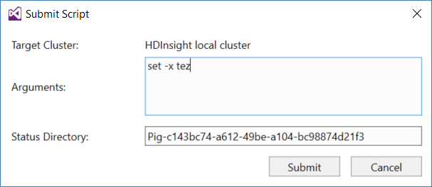
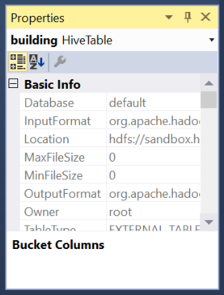

<properties
pageTitle="使用 Microsoft Azure 資料湖的工具來 Visual Studio 與 Hortonworks 沙箱 |Microsoft Azure"
description="瞭解如何在 VIsual Studio Azure 資料湖工具使用 Hortonworks 沙箱 （本機 VM 以執行）。使用這些工具，您可以建立並執行登錄區與豬工作沙箱和檢視的工作輸出及歷程記錄。"
services="hdinsight"
documentationCenter=""
authors="Blackmist"
manager="paulettm"
editor="cgronlun"/>

<tags
ms.service="hdinsight"
ms.devlang="na"
ms.topic="article"
ms.tgt_pltfrm="na"
ms.workload="big-data"
ms.date="08/26/2016"
ms.author="larryfr"/>

# 使用 Visual Studio 與 Hortonworks 沙箱 Azure 資料湖工具

Visual Studio 的 Azure 資料湖工具包含工具使用一般 Hadoop 叢集，除了使用 Azure 資料湖和 HDInsight 的工具。 這份文件提供 Azure 資料湖工具使用 Hortonworks 沙箱所需的步驟，在本機的虛擬機器中執行。

使用 Hortonworks 沙箱，可讓您處理 Hadoop 本機上的開發環境。 一旦您已經開發解決方案，並且想要將其部署在小數位數，您可以然後移動到 HDInsight 叢集。

## 必要條件

* 在您的開發環境虛擬機器中執行 Hortonworks 沙箱。 撰寫這份文件，在 Oracle VirtualBox，使用[在 Hadoop 生態中開始使用](hdinsight-hadoop-emulator-get-started.md)文件中的資訊已設定好執行沙箱測試。

* Visual Studio 2013 或 2015，任何版本。

* [Azure SDK.net](https://azure.microsoft.com/downloads/) 2.7.1 或更新版本

* [Visual Studio azure 資料湖工具](https://www.microsoft.com/download/details.aspx?id=49504)

## 設定沙箱的密碼

請確定 Hortonworks 沙箱會執行，然後依照[Hadoop 生態系統中的快速入門](hdinsight-hadoop-emulator-get-started.md#set-passwords)的 SSH 設定密碼`root`帳戶]，然後 Ambari`admin`帳戶。 從 Visual Studio 沙箱連結時，會使用這些密碼。

## 連線至沙箱的工具

1. 開啟 Visual Studio 中，然後選取 [__檢視__]，再__伺服器總管]__。

2. 從__伺服器總管__] 中，以滑鼠右鍵按一下 [ __HDInsight__項目，然後按一下__連線到 HDInsight 模擬器__。

    

3. 從 [__連線至 HDInsight 模擬器__] 對話方塊中，輸入您為 Ambari 設定的密碼。

    

    選取 [__下一步__以繼續進行。

4. 使用__密碼__] 欄位中輸入您設定密碼`root`帳戶。 將其他欄位為預設值。

    

    選取 [__下一步__以繼續進行。

5. 驗證完成的服務，請等候。 在某些情況下，驗證可能會失敗，並提示您更新設定。 發生這種情況，請選取 [__更新__] 按鈕，並等待的設定和驗證服務才能完成。

    ![錯誤與 [更新] 按鈕](./media/hdinsight-hadoop-emulator-visual-studio/fail-and-update.png)

    > [AZURE.NOTE] 更新程序使用 Ambari 修改以預期的 Azure 資料湖工具的 Visual Studio Hortonworks 沙箱設定。

    完成驗證後，請選取 [__完成__] 完成設定。

    

    > [AZURE.NOTE] 視您的開發環境和記憶體配置給虛擬機器數量的速度，而定，可能需要幾分鐘的時間來設定和驗證服務。

執行這些步驟之後，您現在有 「 HDInsight 本機叢集 」 中的項目伺服器總管 HDInsight] 區段下。

## 撰寫登錄區查詢

登錄區會提供類似 SQL 查詢語言 (HiveQL，) 使用結構化資料。 若要瞭解如何針對本機叢集執行臨機操作查詢中使用下列步驟。

1. 在 [__伺服器總管]__中，以滑鼠右鍵按一下本機叢集您先前新增的項目，然後選取__撰寫登錄區查詢__。

    

    這會開啟新的查詢視窗，可讓您快速輸入處理及送出到本機叢集查詢。

2. 在新的 [查詢] 視窗中，輸入下列資訊︰

        select count(*) from sample_08;
    
    從 [查詢] 視窗的頂端，確認已本機叢集，該設定，然後再選取 [__提交__]。 將其他的值 （__批次__與伺服器的名稱，） 保留預設值。

    ![查詢視窗並送出] 按鈕](./media/hdinsight-hadoop-emulator-visual-studio/submit-hive.png)

    請注意，您也可以使用__送出__] 旁的下拉式功能表，選取 [__進階__。 這會開啟可讓您提交工作時提供其他選項] 對話方塊。

    

3. 一旦您提交查詢時，會出現 [工作狀態。 在工作中，為處理 Hadoop，這會提供資訊。 __工作狀態__項目提供工作的目前狀態。 將會定期更新的狀態，或您可以使用 [重新整理] 圖示，以手動重新整理狀態。

    

    一旦__工作狀態__會變更為 [__已完成__，則會顯示導向非循環圖 (DAG)。 此說明的執行路徑由 Tez （預設執行引擎的登錄區上的本機叢集。） 
    
    > [AZURE.NOTE] 當使用 Linux 型 HDInsight 叢集 Tez 也是預設值。 無法在 Windows 型 HDInsight; 預設值若要使用它，您必須新增線條`set hive.execution.engine = tez;`登錄區查詢的開頭。 

    若要檢視輸出中使用__工作輸出__] 連結。 在此情況下，則__823__;sample_08 資料表中的資料列數目。 您可以使用的__工作記錄__和__下載 YARN 記錄__的連結，檢視工作的診斷資訊。

4. 您也可以將 [__批次__] 欄位變更為__互動式__，以互動的方式執行登錄區工作，然後選取 [__執行__。 

    

    這會傳送到__HiveServer2 輸出__視窗處理期間所產生的輸出記錄檔。
    
    > [AZURE.NOTE] 這是完成工作後的__工作記錄__連結提供的相同資訊。

    

## 建立群組專案

您也可以建立包含多個登錄區指令碼的專案。 當您有關聯的指令碼，您需要將放在一起，或大小時維持使用版本控制系統時，這是很有用。

1. 在 Visual Studio 中，選取 [__檔案__]、 [__新增__] 和 [then__Project__。

2. 從專案清單中，展開 [__範本__] __Azure 資料湖__，然後選取__登錄區 (HDInsight)__。 從範本清單中，選取 [__登錄區範例__。 輸入的名稱和位置，然後選取__[確定]__。

    

__登錄區範例__專案包含兩個指令碼， __WebLogAnalysis.hql__和__SensorDataAnalysis.hql__。 您可以送出這些頂端的視窗中使用相同的 [__送出__] 按鈕。

## 建立專案的豬

登錄區會提供類似 SQL 語言的使用結構化資料，豬提供可讓您開發套用至您的資料轉換的管線語言 （豬拉丁）。 若要使用本機叢集豬使用下列步驟。

1. 開啟 Visual Studio，然後選取 [__檔案__]、 [__新增__]，然後__專案__。 從專案清單中，展開 [__範本__] __Azure 資料湖__，然後選取__豬 (HDInsight)__。 從範本清單中，選取 [__豬應用程式__]。 輸入名稱，位置，然後按一下__[確定]__。

    

2. 輸入下列為此專案以建立__script.pig__檔案的內容。

        a = LOAD '/demo/data/Website/Website-Logs' AS (
            log_id:int, 
            ip_address:chararray, 
            date:chararray, 
            time:chararray, 
            landing_page:chararray, 
            source:chararray);
        b = FILTER a BY (log_id > 100);
        c = GROUP b BY ip_address;
        DUMP c;

    時的豬比登錄區使用不同的語言，請執行工作的方式是透過 [__送出__] 按鈕兩個語言之間一致的。 向下選取下拉式清單，__送出__] 旁的豬顯示進階送出] 對話方塊。

    
    
3. 工作狀態和輸出也會顯示相同的登錄區查詢。

    

## 檢視工作

Azure 資料湖工具也可讓您輕鬆地檢視已進行的工作相關的資訊 Hadoop 上執行。 若要查看本機叢集上執行的工作，已使用下列步驟。

1. 從__伺服器總管__] 中，在本機叢集上，以滑鼠右鍵按一下，然後選取__檢視的工作__。 這會顯示已提交的工作清單至叢集。

    

2. 從工作清單中，選取一個檢視的工作詳細資料。

    ![選取 [工作]](./media/hdinsight-hadoop-emulator-visual-studio/view-job-details.png)

    所顯示的資訊很類似您執行登錄區或豬查詢，完成檢視輸出與記錄資訊的連結後所看到的內容。

3. 您也可以修改，然後重新提交從這裡開始工作。

## 檢視登錄區資料庫

1. 在 [__伺服器總管]__中，展開 [ __HDInsight 本機叢集__項目，然後再展開__登錄區資料庫__。 這會顯示在本機叢集__預設值]__ ，然後__xademo__資料庫。 展開資料庫會顯示在資料庫中的資料表。

    

2. 展開表格會顯示該資料表的資料行。 您可以用滑鼠右鍵按一下資料表，並選取快速檢視 [資料__檢視前 100 資料列__。

    

### 資料庫及表格的內容

您可能已經注意到，您可以選取檢視上的資料庫或表格的__屬性__。 在內容視窗會顯示選取的項目詳細資料。

### 建立表格

若要建立新的資料表，資料庫，以滑鼠右鍵按一下，然後選取 [__建立表格__。

然後，您可以建立使用表單的資料表。 您可以看到原始 HiveQL 用來建立資料表底部的這個頁面。

## 後續步驟

* [學習 Hortonworks 沙箱的 ropes](http://hortonworks.com/hadoop-tutorial/learning-the-ropes-of-the-hortonworks-sandbox/)
* [Hadoop 教學課程-HDP 快速入門](http://hortonworks.com/hadoop-tutorial/hello-world-an-introduction-to-hadoop-hcatalog-hive-and-pig/)