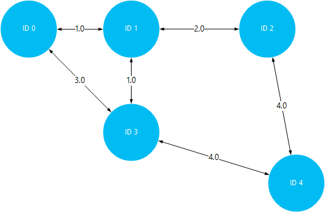

<properties
    pageTitle="安裝和 Linux HDInsight (Hadoop) 上使用 Giraph |Microsoft Azure"
    description="瞭解如何安裝 Giraph 上 Linux 型 HDInsight 叢集使用指令碼的動作。 指令碼動作可讓您叢集建立時，變更叢集設定或自訂安裝的服務與公用程式。"
    services="hdinsight"
    documentationCenter=""
    authors="Blackmist"
    manager="jhubbard"
    editor="cgronlun"
    tags="azure-portal"/>

<tags
    ms.service="hdinsight"
    ms.workload="big-data"
    ms.tgt_pltfrm="na"
    ms.devlang="na"
    ms.topic="article"
    ms.date="10/17/2016"
    ms.author="larryfr"/>

# 安裝 Giraph 上 HDInsight Hadoop 叢集，並使用 Giraph 處理大型的圖形

自訂叢集使用**指令碼的巨集指令**，您可以在任何類型的中叢集 Hadoop Azure HDInsight 上安裝 Giraph。

本主題中，您將學習如何安裝 Giraph 使用指令碼] 動作。 一旦您已安裝 Giraph，您也會學習如何使用 Giraph 最常見的應用程式，這是處理大型的圖形。

> [AZURE.NOTE] 本文中的資訊是特定 Linux 型 HDInsight 叢集。 使用 Windows 型叢集的資訊，請參閱[HDInsight Hadoop 叢集 (Windows) 上的安裝 Giraph](hdinsight-hadoop-giraph-install.md)

## 什麼是 Giraph？

[Apache Giraph](http://giraph.apache.org/)可讓您執行使用 Hadoop，處理的圖表，可以使用 Azure HDInsight。 圖形的模型物件，例如網路上的大型網際網路，例如路由器或人員 （有時稱為社交圖形） 的社交網路之間的關聯性之間的連線之間的關聯。 圖形處理可讓您將圖形中的物件之間的關聯性的相關的原因例如︰

- 根據您目前的關聯性的潛在朋友識別。
- 用來識別網路中的兩個電腦之間的短路由。
- 計算頁面排名的網頁。

> [AZURE.WARNING] 完全支援元件提供 HDInsight 叢集，以及 Microsoft 支援服務會協助找出並解決這些元件的相關問題。
>
> 自訂元素，例如 Giraph，會收到合理的支援，以協助您進一步疑難排解問題。 這可能會導致解決問題，或詢問要加入找到該技術深專業知識的位置開啟來源技術可用的頻道。 例如，有許多都可以使用，這樣的社群網站︰[適用於 HDInsight MSDN 論壇](https://social.msdn.microsoft.com/Forums/azure/en-US/home?forum=hdinsight)、 [http://stackoverflow.com](http://stackoverflow.com)。 也 Apache 專案有[http://apache.org](http://apache.org)，在專案網站，例如︰ [Hadoop](http://hadoop.apache.org/)。

##指令碼功能

這個指令碼會執行下列動作︰

* 若要安裝 Giraph`/usr/hdp/current/giraph`
* 複製`giraph-examples.jar`叢集預設儲存空間 (WASB) 檔案︰`/example/jars/giraph-examples.jar`

## 安裝 Giraph 使用指令碼的動作

範例指令碼 HDInsight 叢集上安裝 Giraph 位於下列位置。

    https://hdiconfigactions.blob.core.windows.net/linuxgiraphconfigactionv01/giraph-installer-v01.sh

本節提供如何使用 Azure 入口網站中建立叢集時使用範例指令碼的指示。 

> [AZURE.NOTE] Azure PowerShell 的 Azure CLI、 HDInsight.NET sdk，您可以 Azure 資源管理員範本也可套用指令碼動作。 您也可以執行叢集套用指令碼動作。 如需詳細資訊，請參閱[自訂 HDInsight 叢集指令碼動作](hdinsight-hadoop-customize-cluster-linux.md)。

1. 以開始建立叢集使用[建立 Linux 型 HDInsight 叢集](hdinsight-hadoop-create-linux-clusters-portal.md)中的步驟，但未完成建立。

2. 在**選擇性組態**刀中，選取 [**指令碼動作**]，然後提供以下資訊︰

    * __名稱__︰ 輸入指令碼動作易記的名稱。
    * __指令碼 URI__: https://hdiconfigactions.blob.core.windows.net/linuxgiraphconfigactionv01/giraph-installer-v01.sh
    * __不對__︰ 核取此選項
    * __工作__︰ 將此核取
    * __動物園管理員__︰ 將此核取
    * __參數__︰ 將此欄位保留空白

3. 在**指令碼動作**底部，使用 [**選取**] 按鈕儲存設定。 最後，使用**選用設定**刀底部的 [**選取**] 按鈕，儲存的選用的設定資訊。

4. 繼續建立叢集，[建立 Linux 型 HDInsight 叢集](hdinsight-hadoop-create-linux-clusters-portal.md)所述。

## 如何在 HDInsight 使用 Giraph？

建立完成叢集之後，請使用下列步驟以執行隨附 Giraph SimpleShortestPathsComputation 範例。 這會實作基本<a href = "http://people.apache.org/~edwardyoon/documents/pregel.pdf">Pregel</a>實作尋找圖形中的物件之間最短的路徑。

1. 連線到使用 SSH HDInsight 叢集︰

        ssh USERNAME@CLUSTERNAME-ssh.azurehdinsight.net

    如需有關如何使用 HDInsight SSH 的詳細資訊，請參閱下列各項︰

    * [使用上 HDInsight Linux、 Unix，或 OS X 的 Linux 型 Hadoop SSH](hdinsight-hadoop-linux-use-ssh-unix.md)

    * [使用上從 Windows HDInsight Linux 為基礎的 Hadoop SSH](hdinsight-hadoop-linux-use-ssh-windows.md)

1. 若要建立新的檔名為__tiny_graph.txt__使用下列動作︰

        nano tiny_graph.txt

    使用下列做為此檔案的內容︰

        [0,0,[[1,1],[3,3]]]
        [1,0,[[0,1],[2,2],[3,1]]]
        [2,0,[[1,2],[4,4]]]
        [3,0,[[0,3],[1,1],[4,4]]]
        [4,0,[[3,4],[2,4]]]

    此資料說明物件導向的圖形，使用格式之間的關聯性 [來源\_識別碼、 來源\_值，[[目的地\_識別碼]，[邊緣\_值]，...]]。 每一列代表之間的關聯性**來源\_識別碼**物件及一或多**目的地\_識別碼**物件。 **邊緣\_值**（或粗細） 可以視為強度或**source_id**之間的連線的距離和**目的地\_識別碼**。

    繪製，並使用值 （或粗細） 作為物件之間的距離，上述資料可能看起來像這樣︰

    

2. 若要儲存檔案，使用__Ctrl + X__，然後__Y__和最後__Enter__來接受的檔案名稱。

3. 將資料儲存成 HDInsight 叢集主要儲存使用下列動作︰

        hdfs dfs -put tiny_graph.txt /example/data/tiny_graph.txt

4. 執行 SimpleShortestPathsComputation 範例使用下列命令。

         yarn jar /usr/hdp/current/giraph/giraph-examples.jar org.apache.giraph.GiraphRunner org.apache.giraph.examples.SimpleShortestPathsComputation -ca mapred.job.tracker=headnodehost:9010 -vif org.apache.giraph.io.formats.JsonLongDoubleFloatDoubleVertexInputFormat -vip /example/data/tiny_graph.txt -vof org.apache.giraph.io.formats.IdWithValueTextOutputFormat -op /example/output/shortestpaths -w 2

    下表說明使用這個命令參數。

  	| 參數 | 功能 |
  	| --------- | ------------ |
  	| `jar /usr/hdp/current/giraph/giraph-examples.jar` | Jar 檔案包含範例。 |
  	| `org.apache.giraph.GiraphRunner` | 若要開始範例所使用的類別。 |
  	| `org.apache.giraph.examples.SimpleShortestPathsCoputation` | 範例會執行。 在此情況下，它會計算之間識別碼為 1，該圖表中的所有其他識別碼最短的路徑。 |
  	| `-ca mapred.job.tracker=headnodehost:9010` | 叢集 headnode。 |
  	| `-vif org.apache.giraph.io.formats.JsonLongDoubleFloatDoubleVertexInputFromat` | 輸入要用於輸入資料格式。 |
  	| `-vip /example/data/tiny_graph.txt` | 輸入的資料檔案。 |
  	| `-vof org.apache.giraph.io.formats.IdWithValueTextOutputFormat` | 輸出格式。 在此情況下，識別碼，並以純文字值。 |
  	| `-op /example/output/shortestpaths` | 輸出位置。 |
  	| `-w 2` | 若要使用的同事的數字。 在此例中，2。 |

    如需有關這些項目，以及使用 Giraph 範例其他參數的詳細資訊，請參閱[Giraph 快速入門](http://giraph.apache.org/quick_start.html)。

5. 完成工作之後，結果會儲存在__wasbs: / 範例/出/shotestpaths__目錄。 建立的檔案會將開始__組件-m-__ ] 和 [結束與數字，表示第一個、 第二個等檔案。 若要檢視輸出使用下列動作︰

        hdfs dfs -text /example/output/shortestpaths/*

    輸出應如下︰

        0   1.0
        4   5.0
        2   2.0
        1   0.0
        3   1.0

    範例為固定值起始 SimpleShortestPathComputation 物件識別碼為 1，並尋找其他物件最短的路徑。 輸出應該閱讀為讓`destination_id distance`，其中距離邊緣運動物件識別碼 1 與目標識別碼之間的值 （或粗細）

    視覺化此，您可以驗證結果來再行識別碼為 1，所有其他物件的最短的路徑。 請注意，最短的路徑之間編號 1 和 ID 4 5。 這是總之間的距離識別碼為 1，3，然後識別碼 3 和 4。

    

## 後續步驟

- [色調 HDInsight 上的安裝並使用叢集](hdinsight-hadoop-hue-linux.md)。 色調是 web 輕鬆建立、 執行及儲存的豬和登錄區工作，以及您 HDInsight 瀏覽預設儲存空間叢集的使用者介面。

- [HDInsight 叢集上的安裝 R](hdinsight-hadoop-r-scripts-linux.md)︰ 如何使用指示叢集自訂安裝和使用 R HDInsight Hadoop 叢集上。 R 是開啟來源語言] 和 [統計計算環境。 它會提供數百個內建的統計函數和結合層面的功能和物件導向程式設計自己程式設計語言。 同時也會提供更多圖形功能。

- [安裝的 Solr HDInsight 叢集上](hdinsight-hadoop-solr-install-linux.md)。 使用叢集自訂安裝 Solr HDInsight Hadoop 叢集上。 Solr 可讓您執行強大的搜尋作業，儲存資料。
