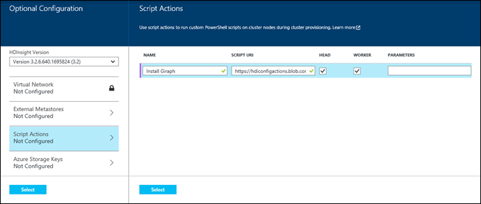
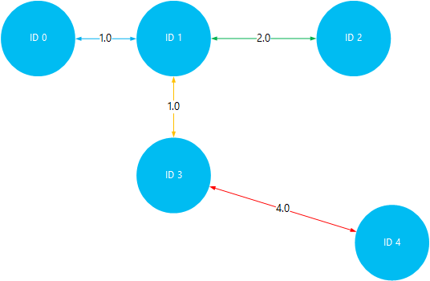

<properties
    pageTitle="安裝並使用 Giraph 中 HDInsight Hadoop 叢集上 |Microsoft Azure"
    description="瞭解如何自訂 HDInsight 叢集 Giraph，以及如何使用 Giraph。"
    services="hdinsight"
    documentationCenter=""
    authors="nitinme"
    manager="jhubbard"
    editor="cgronlun"
    tags="azure-portal"/>

<tags
    ms.service="hdinsight"
    ms.workload="big-data"
    ms.tgt_pltfrm="na"
    ms.devlang="na"
    ms.topic="article"
    ms.date="02/05/2016"
    ms.author="nitinme"/>

# 在安裝及使用 Giraph HDInsight

瞭解如何自訂 Windows 根據的 HDInsight 叢集與 Giraph 使用指令碼動作，以及如何使用 Giraph 處理大型的圖形。 使用 Giraph 與 Linux 叢集資訊，請參閱[HDInsight Hadoop 叢集 (Linux) 上的安裝 Giraph](hdinsight-hadoop-giraph-install-linux.md)。
 
使用*指令碼的巨集指令*，您可以在 Azure HDInsight 安裝 Giraph 上任何類型的叢集 （Hadoop 大量、 HBase、 火花）。 使用唯讀 Azure 儲存體 blob [https://hdiconfigactions.blob.core.windows.net/giraphconfigactionv01/giraph-installer-v01.ps1](https://hdiconfigactions.blob.core.windows.net/giraphconfigactionv01/giraph-installer-v01.ps1)在從 HDInsight 叢集上安裝 Giraph 範例指令碼。 範例指令碼只適用於 HDInsight 叢集版本 3.1。 如需有關 HDInsight 叢集版本的詳細資訊，請參閱[HDInsight 叢集版本](hdinsight-component-versioning.md)。

**相關的文章**

- [HDInsight Hadoop 叢集 (Linux) 上安裝 Giraph](hdinsight-hadoop-giraph-install-linux.md)
- [建立 Hadoop 叢集 HDInsight 中](hdinsight-provision-clusters.md)︰ 建立 HDInsight 叢集的一般資訊。
- [自訂使用指令碼的巨集指令的 HDInsight 叢集][hdinsight-cluster-customize]︰ 自訂 HDInsight 叢集使用指令碼的巨集指令的一般資訊。
- [HDInsight 開發指令碼動作指令碼](hdinsight-hadoop-script-actions.md)。

## 什麼是 Giraph？

<a href="http://giraph.apache.org/" target="_blank">Apache Giraph</a>可讓您執行使用 Hadoop，處理的圖表，可以使用 Azure HDInsight。 圖形的模型物件，例如網路上的大型網際網路，例如路由器或人員 （有時稱為社交圖形） 的社交網路之間的關聯性之間的連線之間的關聯。 圖形處理可讓您將圖形中的物件之間的關聯性的相關的原因例如︰

- 根據您目前的關聯性的潛在朋友識別。
- 用來識別網路中的兩個電腦之間的短路由。
- 計算頁面排名的網頁。

## 安裝 Giraph 使用入口網站

1. 開始使用 [**建立自訂**] 選項中，建立叢集，所述，[建立 Hadoop 叢集 HDInsight 中](hdinsight-provision-clusters.md#portal)。
2. 在精靈的**指令碼動作**頁面上，按一下 [**新增指令碼動作**提供詳細資料的指令碼動作，如下所示︰

    

    <table border='1'>
        <tr><th>屬性</th><th>值</th></tr>
        <tr><td>名稱</td>
            <td>指定指令碼動作的名稱。 例如，<b>安裝 Giraph</b>。</td></tr>
        <tr><td>指令碼 URI</td>
            <td>指定自訂叢集叫用的指令碼統一資源識別元 (URI)。 例如， <i>https://hdiconfigactions.blob.core.windows.net/giraphconfigactionv01/giraph-installer-v01.ps1</i></td></tr>
        <tr><td>節點類型</td>
            <td>指定要在其執行的自訂指令碼的節點。 您可以選擇<b>所有節點</b>、<b>僅不對節點</b>或<b>只工作者節點</b>。
        <tr><td>參數</td>
            <td>如果所需的指令碼，請指定參數。 安裝 Giraph 的指令碼不需要任何參數，因此您可以在此保留空白。</td></tr>
    </table>

    您可以新增一個以上的指令碼動作，以叢集上安裝多個元件。 您已新增的指令碼之後，請按一下 [開始建立叢集核取記號。

## 使用 Giraph

我們使用 SimpleShortestPathsComputation 範例示範基本<a href = "http://people.apache.org/~edwardyoon/documents/pregel.pdf">Pregel</a>實作尋找圖形中的物件之間最短的路徑。 若要上傳的範例資料和範例 jar，請執行工作使用 SimpleShortestPathsComputation 範例中，請使用下列步驟，然後檢視結果。

1. 上傳至 Azure Blob 儲存體的範例資料檔案。 在本機工作站，建立名為**tiny_graph.txt**的新檔案。 包含下列行︰

        [0,0,[[1,1],[3,3]]]
        [1,0,[[0,1],[2,2],[3,1]]]
        [2,0,[[1,2],[4,4]]]
        [3,0,[[0,3],[1,1],[4,4]]]
        [4,0,[[3,4],[2,4]]]

    檔案上傳 tiny_graph.txt 至 HDInsight 叢集主要的儲存空間。 瞭解如何上傳的資料，請參閱[上傳的 HDInsight Hadoop 工作資料](hdinsight-upload-data.md)的相關指示。

    此資料說明物件導向的圖形，使用格式之間的關聯性 [來源\_識別碼、 來源\_值，[[目的地\_識別碼]，[邊緣\_值]，...]]。 每一列代表之間的關聯性**來源\_識別碼**物件及一或多**目的地\_識別碼**物件。 **邊緣\_值**（或粗細） 可以視為強度或**source_id**之間的連線的距離和**目的地\_識別碼**。

    繪製，並使用值 （或粗細） 作為物件之間的距離，上述資料可能看起來像這樣︰

    

4. 執行 SimpleShortestPathsComputation 範例。 若要執行此範例使用 tiny_graph.txt 檔案做為輸入使用下列 PowerShell 的 Azure cmdlet。 

    [AZURE.INCLUDE [upgrade-powershell](../../includes/hdinsight-use-latest-powershell.md)]

        $clusterName = "clustername"
        # Giraph examples jar
        $jarFile = "wasbs:///example/jars/giraph-examples.jar"
        # Arguments for this job
        $jobArguments = "org.apache.giraph.examples.SimpleShortestPathsComputation",
                        "-ca", "mapred.job.tracker=headnodehost:9010",
                        "-vif", "org.apache.giraph.io.formats.JsonLongDoubleFloatDoubleVertexInputFormat",
                        "-vip", "wasbs:///example/data/tiny_graph.txt",
                        "-vof", "org.apache.giraph.io.formats.IdWithValueTextOutputFormat",
                        "-op",  "wasbs:///example/output/shortestpaths",
                        "-w", "2"
        # Create the definition
        $jobDefinition = New-AzureHDInsightMapReduceJobDefinition
          -JarFile $jarFile
          -ClassName "org.apache.giraph.GiraphRunner"
          -Arguments $jobArguments

        # Run the job, write output to the Azure PowerShell window
        $job = Start-AzureHDInsightJob -Cluster $clusterName -JobDefinition $jobDefinition
        Write-Host "Wait for the job to complete ..." -ForegroundColor Green
        Wait-AzureHDInsightJob -Job $job
        Write-Host "STDERR"
        Get-AzureHDInsightJobOutput -Cluster $clusterName -JobId $job.JobId -StandardError
        Write-Host "Display the standard output ..." -ForegroundColor Green
        Get-AzureHDInsightJobOutput -Cluster $clusterName -JobId $job.JobId -StandardOutput

    在上述範例中， **clustername**換成您已安裝的 Giraph 的 HDInsight 叢集的名稱。

5. 檢視結果。 完成工作之後，結果會儲存在兩個輸出檔案__wasbs: / 範例/出/shotestpaths__資料夾。 檔案被稱為__組件-m-00001__和__組件-m-00002__。 若要下載並檢視輸出下列步驟執行︰

        $subscriptionName = "<SubscriptionName>"       # Azure subscription name
        $storageAccountName = "<StorageAccountName>"   # Azure Storage account name
        $containerName = "<ContainerName>"             # Blob storage container name

        # Select the current subscription
        Select-AzureSubscription $subscriptionName

        # Create the Storage account context object
        $storageAccountKey = Get-AzureStorageKey $storageAccountName | %{ $_.Primary }
        $storageContext = New-AzureStorageContext -StorageAccountName $storageAccountName -StorageAccountKey $storageAccountKey

        # Download the job output to the workstation
        Get-AzureStorageBlobContent -Container $containerName -Blob example/output/shortestpaths/part-m-00001 -Context $storageContext -Force
        Get-AzureStorageBlobContent -Container $containerName -Blob example/output/shortestpaths/part-m-00002 -Context $storageContext -Force

    將您的工作站上目前的目錄中建立__範例/輸出/shortestpaths__目錄結構，並將兩個輸出檔案下載到該位置。

    您可以使用 [__貓__cmdlet 來顯示內容的檔案︰

        Cat example/output/shortestpaths/part*

    輸出應如下︰

        0   1.0
        4   5.0
        2   2.0
        1   0.0
        3   1.0

    範例為固定值起始 SimpleShortestPathComputation 物件識別碼為 1，並尋找其他物件最短的路徑。 輸出應該閱讀為讓`destination_id distance`，其中距離邊緣運動物件識別碼 1 與目標識別碼之間的值 （或粗細）

    視覺化此，您可以驗證結果來再行識別碼為 1，所有其他物件的最短的路徑。 請注意，最短的路徑之間編號 1 和 ID 4 5。 這是總之間的距離識別碼為 1，3，然後識別碼 3 和 4。

    

## 安裝 Giraph 使用 Aure PowerShell

請參閱[自訂 HDInsight 叢集使用指令碼動作](hdinsight-hadoop-customize-cluster.md#call_scripts_using_powershell)。  範例會示範如何安裝火花使用 PowerShell 的 Azure。 您需要自訂使用[https://hdiconfigactions.blob.core.windows.net/giraphconfigactionv01/giraph-installer-v01.ps1](https://hdiconfigactions.blob.core.windows.net/giraphconfigactionv01/giraph-installer-v01.ps1)的指令碼。

## 安裝 Giraph 使用.NET SDK

請參閱[自訂 HDInsight 叢集使用指令碼動作](hdinsight-hadoop-customize-cluster.md#call_scripts_using_azure_powershell)。 範例會示範如何安裝火花使用.NET SDK。 您需要自訂使用[https://hdiconfigactions.blob.core.windows.net/giraphconfigactionv01/giraph-installer-v01.ps1](https://hdiconfigactions.blob.core.windows.net/giraphconfigactionv01/giraph-installer-v01.ps1)的指令碼。

## 另請參閱

- [HDInsight Hadoop 叢集 (Linux) 上安裝 Giraph](hdinsight-hadoop-giraph-install-linux.md)
- [建立 Hadoop 叢集 HDInsight 中](hdinsight-provision-clusters.md)︰ 建立 HDInsight 叢集的一般資訊。
- [自訂使用指令碼的巨集指令的 HDInsight 叢集][hdinsight-cluster-customize]︰ 自訂 HDInsight 叢集使用指令碼的巨集指令的一般資訊。
- [HDInsight 開發指令碼動作指令碼](hdinsight-hadoop-script-actions.md)。
- [安裝並使用火花 HDInsight 叢集上][hdinsight-install-spark]︰ 了解如何安裝火花的指令碼動作範例。
- [HDInsight 叢集上安裝 R][hdinsight-install-r]︰ 指令碼動作範例，了解如何安裝。
- [HDInsight 叢集上的安裝 Solr](hdinsight-hadoop-solr-install.md)︰ 了解如何安裝 Solr 的指令碼動作範例。

[tools]: https://github.com/Blackmist/hdinsight-tools
[aps]: http://azure.microsoft.com/documentation/articles/install-configure-powershell/

[powershell-install]: ../powershell-install-configure.md
[hdinsight-provision]: hdinsight-provision-clusters.md
[hdinsight-install-r]: hdinsight-hadoop-r-scripts.md
[hdinsight-install-spark]: hdinsight-hadoop-spark-install.md
[hdinsight-cluster-customize]: hdinsight-hadoop-customize-cluster.md
