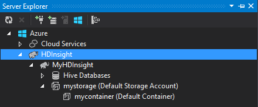

<properties
    pageTitle="使用 C# 登錄區與 Hadoop 中 HDInsight 的豬 |Microsoft Azure"
    description="瞭解如何使用登錄區及串流中 Azure HDInsight 的豬 C# 使用者定義函數 (UDF)。"
    services="hdinsight"
    documentationCenter=""
    authors="Blackmist"
    manager="jhubbard"
    editor="cgronlun"
    tags="azure-portal"/>

<tags
    ms.service="hdinsight"
    ms.workload="big-data"
    ms.tgt_pltfrm="na"
    ms.devlang="dotnet"
    ms.topic="article"
    ms.date="10/28/2016"
    ms.author="larryfr"/>

#登錄區和豬串流中 HDInsight Hadoop 上使用 C# 使用者定義函數

登錄區及豬適合用於處理中 Azure HDInsight 的資料，但有時候您需要更多用途的語言。 登錄區和豬都可以讓您撥號給外部使用者定義函數 (Udf)，或是串流的程式碼。

在此文件，瞭解如何使用 C# 登錄區與豬。

##必要條件

* Windows 7 或更新版本。

* Visual Studio 中的下列版本︰

    * Visual Studio 2012 專業/進階/Ultimate 與[更新 4](http://www.microsoft.com/download/details.aspx?id=39305)

    * Visual Studio 2013 社群/專業/進階/Ultimate 與[更新 4](https://www.microsoft.com/download/details.aspx?id=44921)

    * Visual Studio 2015

* Hadoop HDInsight 叢集-請參閱[佈建 HDInsight 叢集](hdinsight-provision-clusters.md)的步驟來建立叢集

* Visual Studio Hadoop 工具。 如需安裝及設定工具] 的步驟，請參閱[開始使用 Visual Studio HDInsight Hadoop 工具](hdinsight-hadoop-visual-studio-tools-get-started.md)。

##.NET 上 HDInsight

在 Windows 型 HDInsight 叢集上的預設安裝.NET 一般語言執行階段 (CLR) 和架構。 這可讓您使用 C# 應用程式登錄區與豬串流 （間傳遞資料的登錄區/豬及 C# 應用程式透過 stdout/stdin）。

> [AZURE.NOTE] 目前沒有執行.NET Framework Udf Linux 型 HDInsight 叢集上支援。 

##.NET 和串流

串流涉及登錄區及豬傳遞給外部應用程式的資料，透過 stdout，並透過 stdin 接收結果。 C# 應用程式，最簡單這是透過`Console.ReadLine()`和`Console.WriteLine()`。

因為登錄區和豬叫用的應用程式在執行階段，**主控台應用程式**範本應用於 C# 專案。

##登錄區及 C & #35;

###建立 C# 專案

1. 開啟 Visual Studio 並建立新的方案。 專案類型] 中，選取**主控台應用程式**，並為新的專案**HiveCSharp**的名稱。

2. **Program.cs**的內容取代下列動作︰

        using System;
        using System.Security.Cryptography;
        using System.Text;
        using System.Threading.Tasks;

        namespace HiveCSharp
        {
            class Program
            {
                static void Main(string[] args)
                {
                    string line;
                    // Read stdin in a loop
                    while ((line = Console.ReadLine()) != null)
                    {
                        // Parse the string, trimming line feeds
                        // and splitting fields at tabs
                        line = line.TrimEnd('\n');
                        string[] field = line.Split('\t');
                        string phoneLabel = field[1] + ' ' + field[2];
                        // Emit new data to stdout, delimited by tabs
                        Console.WriteLine("{0}\t{1}\t{2}", field[0], phoneLabel, GetMD5Hash(phoneLabel));
                    }
                }
                /// 

                /// Returns an MD5 hash for the given string
                /// 

                /// <param name="input">string value</param>
                /// <returns>an MD5 hash</returns>
                static string GetMD5Hash(string input)
                {
                    // Step 1, calculate MD5 hash from input
                    MD5 md5 = System.Security.Cryptography.MD5.Create();
                    byte[] inputBytes = System.Text.Encoding.ASCII.GetBytes(input);
                    byte[] hash = md5.ComputeHash(inputBytes);

                    // Step 2, convert byte array to hex string
                    StringBuilder sb = new StringBuilder();
                    for (int i = 0; i < hash.Length; i++)
                    {
                        sb.Append(hash[i].ToString("x2"));
                    }
                    return sb.ToString();
                }
            }
        }

3. 建立專案。

###上傳至儲存空間

1. 在 Visual Studio 中，開啟 [**伺服器總管**]。

3. 展開**Azure**，然後再展開 [ **HDInsight**。

4. 如果出現提示，輸入您 Azure 訂閱的認證，然後再按一下 [**登入**]。

5. 展開 HDInsight 叢集您想要部署這個應用程式，然後再展開 [**預設儲存帳戶**。

    

6. 按兩下**預設容器**叢集。 這會開啟新視窗會顯示預設容器中的內容。

7. 按一下 [上傳] 圖示，然後瀏覽至**HiveCSharp**專案**bin\debug**資料夾。 最後，選取 [ **HiveCSharp.exe**檔案，然後按一下 [**確定**]。

    ![上傳] 圖示](./media/hdinsight-hadoop-hive-pig-udf-dotnet-csharp/upload.png)

8. 上傳完成之後，您可以使用登錄區查詢的應用程式。

###登錄區查詢

1. 在 Visual Studio 中，開啟 [**伺服器總管**]。

2. 展開**Azure**，然後再展開 [ **HDInsight**。

5. 叢集部署**HiveCSharp**應用程式，以滑鼠右鍵按一下，然後再選取 [**撰寫登錄區查詢**。

6. 使用下列登錄區查詢︰

        add file wasbs:///HiveCSharp.exe;

        SELECT TRANSFORM (clientid, devicemake, devicemodel)
        USING 'HiveCSharp.exe' AS
        (clientid string, phoneLabel string, phoneHash string)
        FROM hivesampletable
        ORDER BY clientid LIMIT 50;

    選取`clientid`， `devicemake`，及`devicemodel`欄位從`hivesampletable`，並將欄位傳遞給 HiveCSharp.exe 應用程式。 查詢預期傳回三個欄位，儲存為應用程式`clientid`， `phoneLabel`，及`phoneHash`。 查詢也必須預設儲存容器的根目錄中尋找 HiveCSharp.exe (`add file wasbs:///HiveCSharp.exe`)。

5. 按一下 [送出到 HDInsight 叢集工作**送出**]。 隨即會開啟 [**登錄區工作摘要**] 視窗。

6. 按一下 [重新整理摘要，直到**工作狀態**變更為 [**已完成**的 [**重新整理**]。 若要檢視工作輸出，按一下 [**工作輸出**]。

##C 並 #35; 然後的豬

###建立 C# 專案

1. 開啟 Visual Studio 並建立新的方案。 專案類型] 中，選取**主控台應用程式**，並為新的專案**PigUDF**的名稱。

2. **Program.cs**檔案的內容取代下列動作︰

        using System;

        namespace PigUDF
        {
            class Program
            {
                static void Main(string[] args)
                {
                    string line;
                    // Read stdin in a loop
                    while ((line = Console.ReadLine()) != null)
                    {
                        // Fix formatting on lines that begin with an exception
                        if(line.StartsWith("java.lang.Exception"))
                        {
                            // Trim the error info off the beginning and add a note to the end of the line
                            line = line.Remove(0, 21) + " - java.lang.Exception";
                        }
                        // Split the fields apart at tab characters
                        string[] field = line.Split('\t');
                        // Put fields back together for writing
                        Console.WriteLine(String.Join("\t",field));
                    }
                }
            }
        }

    這個應用程式將會剖析寄件者的豬，並重新格式化行開頭的各行`java.lang.Exception`。

3. 儲存**Program.cs**，，然後建立專案。

###上傳應用程式

1. 豬串流預期本機叢集檔案系統上的應用程式。 HDInsight 叢集，啟用遠端桌面，然後按照指示[連線至 HDInsight 叢集使用 RDP](hdinsight-administer-use-management-portal.md#rdp)在連線至該。

2. 連線之後， **PigUDF.exe**複製**bin/偵錯**目錄 PigUDF 專案，在您的本機電腦上，並貼上叢集**%pig_home%**目錄。

###使用豬拉丁從應用程式

1. 從遠端桌面工作階段，請在桌面上使用**Hadoop 命令列**圖示開始 Hadoop 命令列。

2. 若要開始的豬命令列使用下列︰

        cd %PIG_HOME%
        bin\pig

    您將會看到與`grunt>`提示。

3. 輸入下列命令以執行簡單的豬工作使用.NET Framework 應用程式︰

        DEFINE streamer `pigudf.exe` SHIP('pigudf.exe');
        LOGS = LOAD 'wasbs:///example/data/sample.log' as (LINE:chararray);
        LOG = FILTER LOGS by LINE is not null;
        DETAILS = STREAM LOG through streamer as (col1, col2, col3, col4, col5);
        DUMP DETAILS;

    `DEFINE`陳述式所建立的別名`streamer`pigudf.exe 應用程式和`SHIP`分散叢集節點。 更新版本中，`streamer`使用`STREAM`運算子來處理單一線條包含於記錄中，將資料傳回一系列的欄。

> [AZURE.NOTE] 用於串流應用程式名稱必須以雙方\`（反） 字元何時別名，及 ' （單引號） 時使用`SHIP`。

3. 輸入後的最後一行，應該開始工作。 最後，會傳回輸出如下︰

        (2012-02-03 20:11:56 SampleClass5 [WARN] problem finding id 1358451042 - java.lang.Exception)
        (2012-02-03 20:11:56 SampleClass5 [DEBUG] detail for id 1976092771)
        (2012-02-03 20:11:56 SampleClass5 [TRACE] verbose detail for id 1317358561)
        (2012-02-03 20:11:56 SampleClass5 [TRACE] verbose detail for id 1737534798)
        (2012-02-03 20:11:56 SampleClass7 [DEBUG] detail for id 1475865947)

##摘要

在此文件中，您已經學會如何使用登錄區與豬的.NET Framework 應用程式上 HDInsight。 如果您想要瞭解如何使用 Python 登錄區與豬，請參閱[使用登錄區與 HDInsight 的豬的 Python](hdinsight-python.md)。

若要使用的豬及登錄區，並深入瞭解如何使用 MapReduce 的其他方法，請參閱下列內容︰

* [使用 HDInsight 的登錄區](hdinsight-use-hive.md)

* [使用 HDInsight 的豬](hdinsight-use-pig.md)

* [使用 HDInsight MapReduce](hdinsight-use-mapreduce.md)
