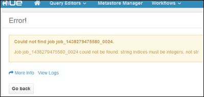

<properties
    pageTitle="Hadoop 色調使用 HDInsight Linux 叢集上 |Microsoft Azure"
    description="瞭解如何安裝和使用 Hadoop 叢集 HDInsight linux 的色調。"
    services="hdinsight"
    documentationCenter=""
    authors="nitinme"
    manager="jhubbard"
    editor="cgronlun"/>

<tags 
    ms.service="hdinsight" 
    ms.workload="big-data" 
    ms.tgt_pltfrm="na" 
    ms.devlang="na" 
    ms.topic="article" 
    ms.date="09/13/2016" 
    ms.author="nitinme"/>

# 安裝並使用色調 HDInsight Hadoop 叢集上

瞭解如何安裝色調 HDInsight Linux 叢集上，並使用通道路由至色調的要求。

## 什麼是色調？

色調是一組用來與 Hadoop 叢集互動的 Web 應用程式。 您可以使用色調瀏覽 Hadoop 叢集 (如果 HDInsight 叢集 WASB) 相關聯的儲存空間，請執行的工作區及豬指令碼等。下列元件，可在 HDInsight Hadoop 叢集色調安裝。

* Beeswax 登錄區編輯器
* 豬
* Metastore 管理員
* Oozie
* （此交談 WASB 預設的容器） FileBrowser
* 在瀏覽器工作

> [AZURE.WARNING] 完全支援元件提供 HDInsight 叢集，以及 Microsoft 支援服務會協助找出並解決這些元件的相關問題。
>
> 自訂元件收到合理的支援，以協助您進一步疑難排解問題。 這可能會導致解決問題，或詢問要加入找到該技術深專業知識的位置開啟來源技術可用的頻道。 例如，有許多都可以使用，這樣的社群網站︰[適用於 HDInsight MSDN 論壇](https://social.msdn.microsoft.com/Forums/azure/en-US/home?forum=hdinsight)、 [http://stackoverflow.com](http://stackoverflow.com)。 也 Apache 專案有[http://apache.org](http://apache.org)，在專案網站，例如︰ [Hadoop](http://hadoop.apache.org/)。

## 安裝色調使用指令碼的動作

下列指令碼動作可用來安裝色調 Linux 型 HDInsight 叢集上。
https://hdiconfigactions.blob.core.windows.net/linuxhueconfigactionv02/install-hue-uber-v02.sh
    
本節提供有關如何佈建叢集使用 Azure 入口網站時，使用指令碼的指示。 

> [AZURE.NOTE] Azure PowerShell 的 Azure CLI、 HDInsight.NET sdk，您可以 Azure 資源管理員範本也可套用指令碼動作。 您也可以執行叢集套用指令碼動作。 如需詳細資訊，請參閱[自訂 HDInsight 叢集指令碼動作](hdinsight-hadoop-customize-cluster-linux.md)。

1. 開始使用步驟中[linux 佈建 HDInsight 叢集](hdinsight-hadoop-provision-linux-clusters.md#portal)，提供叢集，但未完成佈建。

    > [AZURE.NOTE] 若要安裝色調 HDInsight 叢集上，建議的 headnode 大小會至少 A4 （8 個核心、 14 GB 的記憶體）。

2. 在**選用設定**刀中，選取 [**指令碼動作**]，然後提供的資訊，如下所示︰

    

    * __名稱__︰ 輸入指令碼動作易記的名稱。
    * __指令碼 URI__: https://hdiconfigactions.blob.core.windows.net/linuxhueconfigactionv02/install-hue-uber-v02.sh
    * __不對__︰ 核取此選項
    * __工作__︰ 留白。
    * __動物園管理員__︰ 留白。
    * __參數__︰ 留白。

3. 在**指令碼動作**底部，使用 [**選取**] 按鈕儲存設定。 最後，使用**選用設定**刀底部的 [**選取**] 按鈕，儲存的選用的設定資訊。

4. 繼續佈建叢集， [linux 佈建 HDInsight 叢集](hdinsight-hadoop-provision-linux-clusters.md#portal)所述。

## 使用 HDInsight 叢集色調

SSH 通道是唯一的方法存取色調叢集上，執行。 透過 SSH 通道，可讓即可直接移至叢集的 headnode 正在色調流量。 叢集完成佈建後，請使用下列步驟使用色調 HDInsight Linux 叢集上。

1. 使用中[使用 SSH 通道存取 Ambari 網頁 UI、 ResourceManager、 JobHistory、 NameNode、 Oozie 及其他網站使用者介面的](hdinsight-linux-ambari-ssh-tunnel.md)資訊來建立 HDInsight 叢集，從用戶端系統 SSH 通道，然後設定 [網頁瀏覽器 SSH 通道作為 proxy。

2. 當您建立一個 SSH 通道並設定您的瀏覽器，瀏覽 proxy 流量時，您必須找到主要的主節點的主機名稱。 您可以使用連接埠 22 SSH 叢集連線。 例如，`ssh USERNAME@CLUSTERNAME-ssh.azurehdinsight.net`位置__的使用者名稱__您 SSH 的使用者名稱，而__CLUSTERNAME__會叢集的名稱。

    如需有關使用 SSH 的詳細資訊，請參閱下列文件︰

    * [使用從 Linux、 Unix 或 Mac OS X 的用戶端 Linux 為基礎的 HDInsight SSH](hdinsight-hadoop-linux-use-ssh-unix.md)
    * [從 Windows 用戶端 Linux 為基礎的 HDInsight 搭配使用 SSH](hdinsight-hadoop-linux-use-ssh-windows.md)

3. 連線之後，請使用下列命令以取得主要 headnode 的完整的網域名稱︰

        hostname -f

    這會傳回類似下列名稱︰

        hn0-myhdi-nfebtpfdv1nubcidphpap2eq2b.ex.internal.cloudapp.net
    
    這是色調網站所在的主要 headnode 主機名稱。

2. 使用瀏覽器開啟在 http://HOSTNAME:8888 色調入口網站。 主機名稱換成您取得在上一個步驟中的名稱。

    > [AZURE.NOTE] 當您第一次登入時，系統會提示您建立帳戶登入 [色調] 入口網站。 您在此處所指定的認證會侷限於入口網站，並不相關的系統管理員或佈建時指定叢集 SSH 使用者認證。

    ![登入 [色調] 入口網站](./media/hdinsight-hadoop-hue-linux/HDI.Hue.Portal.Login.png "指定的認證以色調入口網站")

### 執行登錄區查詢

1. 從 [色調] 入口網站中，按一下 [**查詢編輯器**，然後按一下以開啟登錄區編輯器] 中的 [**登錄區**。

    

2. 在 [**協助**] 索引標籤的 [**資料庫**] 下，您應該會看到**hivesampletable**。 這是隨附於 HDInsight 上的所有 Hadoop 叢集範例表格。 在右窗格中，輸入範例查詢，查看輸出上在下方窗格中的 [**結果**] 索引標籤螢幕擷取畫面所示。

    

    您也可以使用 [**圖表**] 索引標籤以查看結果的視覺呈現。

### 瀏覽叢集存放區

1. 從 [色調] 入口網站中，按一下 [**檔案瀏覽器**功能表列的右上角。

2. 預設檔案瀏覽器會開啟**/user/myuser**目錄。 按一下 [斜線前使用者的目錄中，前往 [叢集相關聯的 Azure 儲存容器的根目錄的路徑。

    

3. 以滑鼠右鍵按一下檔案或資料夾，請參閱可用的作業。 使用在右上角的 [**上傳**] 按鈕上, 傳檔案到目前的目錄。 若要建立新的檔案或目錄中使用 [**新增**] 按鈕。

> [AZURE.NOTE] 色調檔案瀏覽器可以只顯示預設的容器 HDInsight 叢集相關聯的內容。 任何額外儲存空間帳戶/容器，您可能會有與相關聯叢集不會使用檔案瀏覽器存取。 不過，叢集相關聯的其他容器一定會存取登錄區工作。 例如，如果您輸入的命令`dfs -ls wasbs://newcontainer@mystore.blob.core.windows.net`在登錄區編輯器中，您可以看到其他的容器的內容。 這個命令，在**newcontainer**不是預設的容器叢集相關聯。

## 重要考量事項

1. 用來安裝色調的指令碼會安裝，只在叢集的主要 headnode。

2. 在安裝期間，會重新啟動更新與設定的多個 Hadoop 服務 （HDFS、 YARN、 MR2、 Oozie）。 安裝 [色調] 指令碼完成之後，可能需要一些時間啟動其他 Hadoop 服務。 這一開始可能會影響色調的效能。 一旦所有服務都開始，色調會完全正常運作。

3.  色調將不瞭解 Tez 工作，目前預設的登錄區。 如果您要作為登錄區執行引擎 MapReduce，更新指令碼，指令碼中使用下列命令︰

        set hive.execution.engine=mr;

4.  使用 Linux 叢集，您可以讓位置服務執行主要 headnode 資源管理員無法在次要上執行時的案例。 使用色調叢集上檢視執行工作的詳細資料時，這種情況可能會導致錯誤 （如下所示）。 不過，您可以在工作完成時，檢視工作詳細資料。

    

    這是因為的已知問題。 因應措施，修改 Ambari，以便在主要 headnode 上也執行作用中的資源管理員。

5.  色調 HDInsight 叢集使用 Azure 儲存體使用時，請瞭解 WebHDFS `wasbs://`。 因此，使用指令碼的巨集指令的自訂指令碼會安裝 WebWasb，也就是交談 WASB WebHDFS 相容服務。 因此，即使色調入口網站指出 HDFS 位置 （例如，當您將滑鼠移**檔案瀏覽器**） 中的，則應該解譯為 WASB。

## 後續步驟

- [安裝的 Giraph HDInsight 叢集上](hdinsight-hadoop-giraph-install-linux.md)。 使用叢集自訂安裝 Giraph HDInsight Hadoop 叢集上。 Giraph 可讓您執行圖形處理使用 Hadoop，並使用 Azure HDInsight。

- [安裝的 Solr HDInsight 叢集上](hdinsight-hadoop-solr-install-linux.md)。 使用叢集自訂安裝 Solr HDInsight Hadoop 叢集上。 Solr 可讓您執行強大的搜尋作業上儲存的資料。

- [HDInsight 叢集上的安裝 R](hdinsight-hadoop-r-scripts-linux.md)。 使用叢集自訂安裝 R HDInsight Hadoop 叢集上。 R 是開啟來源語言] 和 [統計計算環境。 它會提供數百個內建的統計函數和結合層面的功能和物件導向程式設計自己程式設計語言。 同時也會提供更多圖形功能。

[powershell-install-configure]: install-configure-powershell-linux.md
[hdinsight-provision]: hdinsight-provision-clusters-linux.md
[hdinsight-cluster-customize]: hdinsight-hadoop-customize-cluster-linux.md
