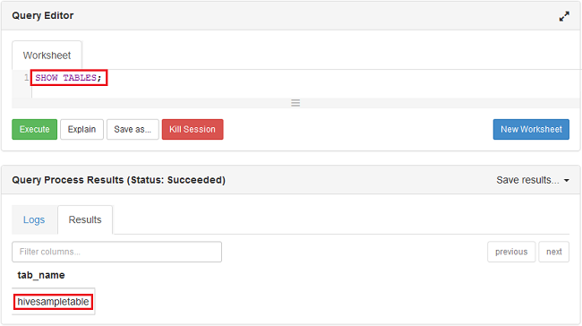

<properties
    pageTitle="Linux 教學課程︰ 開始使用 Hadoop 與登錄區 |Microsoft Azure"
    description="遵循此 Linux 教學課程以開始使用 Hadoop HDInsight。 瞭解如何佈建 Linux 叢集，並登錄區含有資料的查詢。"
    services="hdinsight"
    documentationCenter=""
    authors="mumian"
    manager="jhubbard"
    editor="cgronlun"
    tags="azure-portal"/>

<tags
    ms.service="hdinsight"
    ms.devlang="na"
    ms.topic="hero-article"
    ms.tgt_pltfrm="na"
    ms.workload="big-data"
    ms.date="09/14/2016"
    ms.author="jgao"/>

# Hadoop 教學課程︰ 開始使用 Linux 型 Hadoop HDInsight

> [AZURE.SELECTOR]
- [Linux 型](hdinsight-hadoop-linux-tutorial-get-started.md)
- [Windows 型](hdinsight-hadoop-tutorial-get-started-windows.md)

瞭解如何建立 Linux [Hadoop](http://hadoop.apache.org/)叢集中 HDInsight，以及如何 HDInsight 中執行的工作區。 [Apache 登錄區](https://hive.apache.org/)是在 Hadoop 生態最常用的元件。 目前 HDInsight 隨附 4 不同的叢集類型︰ [Hadoop](hdinsight-hadoop-introduction.md)、[火花](hdinsight-apache-spark-overview.md)、 [HBase](hdinsight-hbase-overview.md)和[大量](hdinsight-storm-overview.md)。  每個叢集類型支援一組不同的元件。 所有 4 叢集類型支援登錄區。 HDInsight 中的支援元件的清單，請參閱[HDInsight 所提供之 Hadoop 叢集版本中的新功能？](hdinsight-component-versioning.md)  

[AZURE.INCLUDE [delete-cluster-warning](../../includes/hdinsight-delete-cluster-warning.md)]

## 必要條件

本教學課程之前，您必須具備︰

- **Azure 訂閱**︰ 若要建立的免費一個月的試用帳戶，請瀏覽至[azure.microsoft.com/free](https://azure.microsoft.com/free)。

### 存取控制需求

[AZURE.INCLUDE [access-control](../../includes/hdinsight-access-control-requirements.md)]

## 建立叢集

大部分的 Hadoop 工作是批次工作。 您建立叢集、 執行某些工作，並刪除叢集。 在此區段中，您將建立 Linux 型 Hadoop 叢集 HDInsight 使用[Azure 資源管理員範本](../resource-group-template-deploy.md)中。 資源管理員範本已完全自訂;其可讓您輕鬆地建立 Azure HDInsight 等的資源。 資源管理員範本體驗不需要遵循此教學課程。 如需其他叢集建立方法與了解在本教學課程中使用的內容，請參閱[建立 HDInsight 叢集](hdinsight-hadoop-provision-linux-clusters.md)。 在此教學課程中使用的資源管理員範本位於公用 blob 容器， [https://hditutorialdata.blob.core.windows.net/armtemplates/create-linux-based-hadoop-cluster-in-hdinsight.json](https://hditutorialdata.blob.core.windows.net/armtemplates/create-linux-based-hadoop-cluster-in-hdinsight.json)。 

1. 按一下 [登入 Azure 及開啟資源管理員範本 Azure 入口網站中的下列圖像。 

    

2. 從**參數**刀中，輸入下列資訊︰

    .

    - **ClusterName**︰ 輸入您要建立 Hadoop 叢集的名稱。
    - **叢集登入名稱和密碼**︰ 預設的登入名稱是**管理員**。
    - **SSH 使用者名稱和密碼**︰ 預設的使用者名稱是**sshuser**。  您可以將其重新命名。 
    
    其他參數是選擇性的追蹤此教學課程。 您可以將它們一樣。 
    
    每個叢集有 Azure Blob 儲存體帳戶相依性。 通常稱為預設儲存的帳戶。 HDInsight 叢集和其預設儲存帳戶必須共同位於相同的 Azure 區域中。 刪除叢集並不會刪除儲存的帳戶。 在範本中，預設儲存體帳戶名稱被定義為叢集名稱 」 存放區 」 加上。 
    
3. 按一下**[確定**] 儲存參數。
4. 從**自訂部署**刀中，輸入**新的資源群組名稱**，建立新的資源群組。  資源群組已群組叢集、 從屬參照儲存帳戶及其他 s 容器。 資源群組的位置可能不同的叢集位置。
5. 按一下**法律條款**]，然後再按一下 [**建立**。
6. 請確認 [**固定至儀表板**核取方塊已選取，然後再按一下 [**建立**]。 您會看到標題為 「 」**部署範本部署**新的方塊。 建立叢集需要瞭解大約 20 分鐘。 
7.  叢集建立後，磚的標題會變更為您所指定的資源群組名稱。 與入口網站會自動開啟兩個刀叢集與叢集設定。 

    .

    有兩個所列的資源，叢集和預設儲存的帳戶。

##執行登錄區查詢

[Apache 登錄區](hdinsight-use-hive.md)是用於 HDInsight 的最常用元件。 有多種方式 HDInsight 中執行的工作區。 在本教學課程中，您會使用 [Ambari 登錄區檢視從入口網站執行某些登錄區工作。 送出登錄區工作的其他方法，請參閱[使用登錄區中 HDInsight](hdinsight-use-hive.md)]。

1. 瀏覽至**https://&lt;ClusterName >。 azurehdinsight.net**，其中&lt;ClusterName > 是叢集您建立開啟 Ambari 前一節。
2. 輸入 Hadoop 使用者名稱和密碼，您在前一節中指定。 預設的使用者名稱是**管理員**。
3. 下圖所示，請開啟**登錄區檢視**︰

    .
4. 在 [頁面的 [__查詢編輯器__] 區段中，貼上到工作表的下列 HiveQL 陳述式︰

        SHOW TABLES;

    >[AZURE.NOTE] 以分號所需的登錄區。       
        
5. 按一下 [__執行__]。 __查詢的程序結果__區段應該出現在 [查詢編輯器] 下方，並顯示工作的相關資訊。 

    查詢完成之後，[__查詢程序結果__] 區段會顯示作業的結果。 您應該看到一個稱為**hivesampletable**的資料表。 此範例的登錄區資料表隨附所有 HDInsight 叢集。

    .

6. 重複步驟 4 和 5，執行下列查詢︰

        SELECT * FROM hivesampletable;

    > [AZURE.TIP] 請注意，在左上方的 [__查詢程序結果__] 區段中，__將結果__的下拉式清單您可以使用此下載結果]，或將它們儲存在 HDInsight 儲存為 CSV 檔案。

7. 按一下 [**歷程記錄**，取得的工作清單]。

當您完成群組工作後，您可以[匯出至 Azure SQL 資料庫或 SQL Server 資料庫的結果](hdinsight-use-sqoop-mac-linux.md)，您也可以[使用 Excel 的結果以視覺化方式呈現](hdinsight-connect-excel-power-query.md)。 如需有關如何使用登錄區中 HDInsight 的詳細資訊，請參閱[使用登錄區和 HiveQL Hadoop HDInsight 分析的範例 Apache log4j 檔案中使用](hdinsight-use-hive.md)。

##清理教學課程

完成本教學課程後，您可能會想要刪除叢集。 HDInsight，與您的資料會儲存於 Azure 儲存體，以便在不使用安全地刪除叢集。 您也會針對 HDInsight 叢集，即使沒有使用。 由於叢集費用多次多儲存空間的費用，讓經濟叢集時無法使用。 

>[AZURE.NOTE] 使用[Azure 資料工廠](hdinsight-hadoop-create-linux-clusters-adf.md)，您可以建立 HDInsight 叢集視情況下，並設定自動刪除叢集 TimeToLive 設定。 

**若要刪除叢集及/或預設儲存帳戶**

1. [Azure 入口網站](https://portal.azure.com)登入。
2. 從入口網站的儀表板，按一下 [建立叢集時，使用資源群組名稱] 方塊。
3. 按一下 [資源刀，若要刪除包含叢集及預設儲存帳戶; [資源] 群組中的 [**刪除**或按一下 [**資源**圖磚上的叢集名稱，然後按一下 [叢集刀中的 [**刪除**。 請注意，刪除資源群組會刪除儲存帳戶。 如果您想要保留的儲存空間帳戶，選擇 [刪除叢集只。

## 後續步驟

在本教學課程中，您已經學會如何建立 Linux 型 HDInsight 叢集使用資源管理員範本，以及如何執行基本的登錄區查詢。

若要進一步瞭解分析 HDInsight 的資料，請參閱下列各項︰

- 若要進一步瞭解使用 HDInsight 登錄區，包括如何執行登錄區查詢從 Visual Studio 中，請參閱[使用登錄區與 HDInsight][hdinsight-use-hive]。

- 若要瞭解豬，語言用於轉換的資料，請參閱[使用豬與 HDInsight][hdinsight-use-pig]。

- 若要瞭解 MapReduce，來撰寫之程式的處理資料的 Hadoop，請參閱[使用 MapReduce 與 HDInsight][hdinsight-use-mapreduce]。

- 若要瞭解如何使用 Visual Studio HDInsight 工具來分析 HDInsight 的資料，請參閱[開始使用 Visual Studio Hadoop HDInsight 工具](hdinsight-hadoop-visual-studio-tools-get-started.md)。

如果您準備好開始使用您自己的資料，並進一步了解如何 HDInsight 儲存資料或如何取得資料至 HDInsight 需要請參閱下列各項︰

- HDInsight 如何使用 Azure blob 儲存體的資訊，請參閱[使用 HDInsight 的使用 Azure Blob 儲存體](hdinsight-hadoop-use-blob-storage.md)。

- 如何上傳至 HDInsight 的資料的詳細資訊，請參閱[上傳至 HDInsight 的資料][hdinsight-upload-data]。

如果您想要進一步瞭解建立或管理 HDInsight 叢集，請參閱下列各項︰

- 若要瞭解管理 Linux 型 HDInsight 叢集，請參閱[使用 Ambari 管理 HDInsight 叢集](hdinsight-hadoop-manage-ambari.md)。

- 若要進一步瞭解建立 HDInsight 叢集時，您可以選取的選項，請參閱[建立的 HDInsight linux 使用自訂的選項](hdinsight-hadoop-provision-linux-clusters.md)。

- 如果您熟悉 Linux，以及 Hadoop，但想要知道 Hadoop 上 HDInsight 的相關詳細資訊，請參閱[使用 linux HDInsight](hdinsight-hadoop-linux-information.md)。 例如，此提供的資訊︰

    * 裝載於叢集，例如 Ambari 和 WebHCat 服務的 Url
    * Hadoop 檔案及範例本機檔案系統上的位置
    * 使用的 Azure 儲存空間 (WASB)，而不是 HDFS 做為預設資料儲存區

[1]: ../HDInsight/hdinsight-hadoop-visual-studio-tools-get-started.md

[hdinsight-provision]: hdinsight-provision-clusters.md
[hdinsight-admin-powershell]: hdinsight-administer-use-powershell.md
[hdinsight-upload-data]: hdinsight-upload-data.md
[hdinsight-use-mapreduce]: hdinsight-use-mapreduce.md
[hdinsight-use-hive]: hdinsight-use-hive.md
[hdinsight-use-pig]: hdinsight-use-pig.md

[powershell-download]: http://go.microsoft.com/fwlink/p/?linkid=320376&clcid=0x409
[powershell-install-configure]: powershell-install-configure.md
[powershell-open]: powershell-install-configure.md#Install

[img-hdi-dashboard]: ./media/hdinsight-hadoop-tutorial-get-started-windows/HDI.dashboard.png
[img-hdi-dashboard-query-select]: ./media/hdinsight-hadoop-tutorial-get-started-windows/HDI.dashboard.query.select.png
[img-hdi-dashboard-query-select-result]: ./media/hdinsight-hadoop-tutorial-get-started-windows/HDI.dashboard.query.select.result.png
[img-hdi-dashboard-query-select-result-output]: ./media/hdinsight-hadoop-tutorial-get-started-windows/HDI.dashboard.query.select.result.output.png
[img-hdi-dashboard-query-browse-output]: ./media/hdinsight-hadoop-tutorial-get-started-windows/HDI.dashboard.query.browse.output.png
[image-hdi-clusterstatus]: ./media/hdinsight-hadoop-tutorial-get-started-windows/HDI.ClusterStatus.png
[image-hdi-gettingstarted-powerquery-importdata]: ./media/hdinsight-hadoop-tutorial-get-started-windows/HDI.GettingStarted.PowerQuery.ImportData.png
[image-hdi-gettingstarted-powerquery-importdata2]: ./media/hdinsight-hadoop-tutorial-get-started-windows/HDI.GettingStarted.PowerQuery.ImportData2.png
