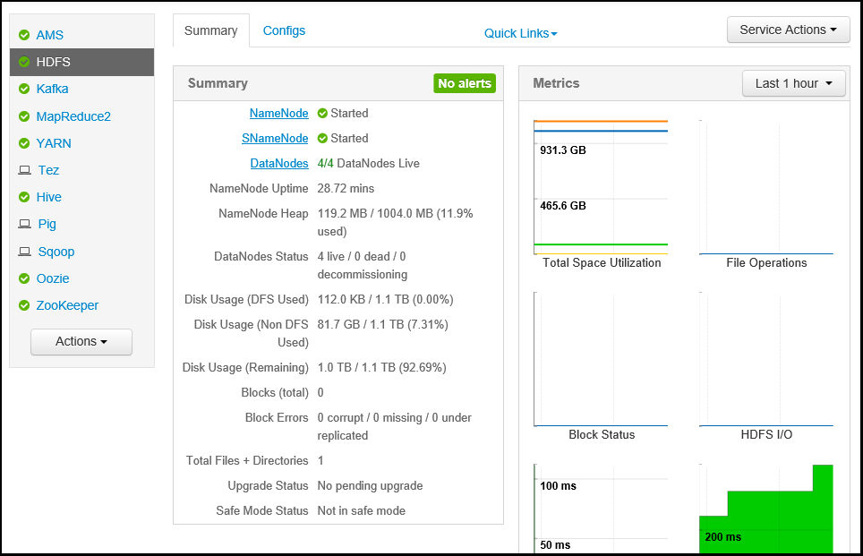

<properties
   pageTitle="監控和管理 HDInsight 叢集使用 Apache Ambari Web UI |Microsoft Azure"
   description="瞭解如何使用 Ambari 監控和管理 Linux 型 HDInsight 叢集。 在此文件中，您將學習如何使用 HDInsight 叢集隨附在 Ambari Web ui。"
   services="hdinsight"
   documentationCenter=""
   authors="Blackmist"
   manager="jhubbard"
   editor="cgronlun"
    tags="azure-portal"/>

<tags
   ms.service="hdinsight"
   ms.devlang="na"
   ms.topic="article"
   ms.tgt_pltfrm="na"
   ms.workload="big-data"
   ms.date="09/27/2016"
   ms.author="larryfr"/>

#使用 Ambari Web UI 管理 HDInsight 叢集

[AZURE.INCLUDE [ambari-selector](../../includes/hdinsight-ambari-selector.md)]

管理並提供容易使用的網頁 UI 和 REST API 監視 Hadoop 叢集，可簡化 Apache Ambari。 Ambari 包含在 Linux 型 HDInsight 叢集，用來監視叢集，並變更的設定。

在此文件中，您將學習如何使用 HDInsight 叢集 Ambari 網路使用者介面。

##什麼是 Ambari？

<a href="http://ambari.apache.org" target="_blank">Apache Ambari</a>讓 Hadoop 管理簡單提供容易使用 web 可用於佈建、 管理及監視 Hadoop 叢集的使用者介面。 開發人員可以將這些功能整合到他們的應用程式，使用<a href="https://github.com/apache/ambari/blob/trunk/ambari-server/docs/api/v1/index.md" target="_blank">Ambari REST Api</a>。

預設 Linux 型 HDInsight 叢集提供 Ambari 網路使用者介面。 

##連線

Ambari Web UI 會提供 HDInsight 叢集在 HTTPS://CLUSTERNAME.azurehdidnsight.net，其中__CLUSTERNAME__是叢集的名稱。 

> [AZURE.IMPORTANT] 連線到 Ambari HDInsight 上需要 HTTPS。 您也必須驗證 Ambari 使用的管理員帳戶的名稱 （預設為__管理員__，） 和建立叢集時所提供的密碼。

##SSH proxy

> [AZURE.NOTE] 時 Ambari 叢集存取直接在網際網路上，從 Ambari 網路使用者介面 （例如 JobTracker，） 的一些連結不是在網際網路上公開。 因此，您會收到 「 找不到伺服器 」 錯誤，在嘗試存取這些功能，除非您使用 proxy web 流量叢集主節點安全命令介面 (SSH) 通道。

建立使用 Ambari SSH 通道資訊，請參閱[使用 SSH 通道存取 Ambari 網頁 UI、 ResourceManager、 JobHistory、 NameNode、 Oozie 及其他網站使用者介面的](hdinsight-linux-ambari-ssh-tunnel.md)。

##Ambari 網頁 UI

連接至 Ambari Web UI 時，系統會提示驗證至頁面。 使用叢集管理員使用者 （預設管理員，） 及叢集建立您使用的密碼。

頁面會隨即開啟，請注意，在頂端列]。 此頁面包含下列資訊與控制項︰

* **Ambari 標誌**-隨即會開啟儀表板，可以用來監視叢集。

* **叢集名稱 # 選項**-顯示進行中的 Ambari 運算的數目。 選取叢集名稱或**# 選項**會顯示背景作業的清單。

* **# 通知**-警告] 或 [如果有任何叢集的要徑警示。 選取這會顯示通知的清單。

* **儀表板**-會顯示儀表板。

* **服務**-叢集服務的資訊和組態設定。

* **主機**-叢集節點的資訊和組態設定。

* **通知**-記錄的資訊、 警告和重要的通知。

* **管理員**-軟體堆疊/服務叢集、 服務帳戶資訊，以及 Kerberos 安全性上所安裝。

* **管理員] 按鈕**-位於 Ambari 管理使用者設定與登出。

##監控

###通知

Ambari 提供許多警示，會有狀態下列其中一項︰

* **[確定]**

* **警告**

* **要徑**

* **未知**

**[確定]**以外的通知會導致**# 通知**項目按一下頂端的頁面顯示數字的提醒。 選取此項目會顯示通知及他們的狀態。

通知會組織成不同的預設群組，可以檢視 [**提醒**] 頁面。

您可以使用 [**動作**] 功能表，然後選取 [**管理通知群組**管理群組。 這個選項可讓您修改現有的群組，或建立新群組。

![管理提醒的群組] 對話方塊](./media/hdinsight-hadoop-manage-ambari/manage-alerts.png)

您也可以建立提醒通知的 [**動作**] 功能表。 這個選項可讓您建立特定的提醒嚴重性組合發生時，傳送通知透過**電子郵件**或**SNMP**的觸發程序。 例如，您可以傳送通知時通知的**預設 YARN** ] 群組中的任何設定為 [**要徑**。

![建立提醒] 對話方塊](./media/hdinsight-hadoop-manage-ambari/create-alert-notification.png)

###叢集

儀表板中的 [**標準**] 索引標籤包含一系列的小工具，可讓您更容易監視概覽叢集的狀態。 多個小工具，例如**CPU 使用率**，提供在按一下時的其他資訊。

[ **Heatmaps** ] 索引標籤會顯示指標，為彩色 heatmaps，從公式列前往綠色為紅色。

如需詳細叢集內節點的詳細資訊，選取**主辦城市**]，然後選取您感興趣的特定節點。

###服務

在儀表板上的**服務**資訊看板提供快速深入叢集上執行之服務的狀態。 要用來代表狀態或應該採取的例如黃色資源符號如果服務需要回收的動作的各種不同的圖示。

選取服務，會顯示在該服務的詳細的資訊。

####快速連結

某些服務會顯示在頁面頂端的 [**快速連結**] 連結。 這可用來存取服務的 Ui，例如︰

* **工作歷程記錄**-MapReduce 工作歷程記錄。

* **資源管理員**-YARN ResourceManager ui。

* **NameNode** -Hadoop 分散式檔案系統 (HDFS) NameNode ui。

* **Oozie 網頁 UI** Oozie ui。

選取任何這些連結，會在您的瀏覽器，它將會顯示選取的頁面中開啟新的索引標籤。

> [AZURE.NOTE] 選取任何服務的**快速連結**連結會導致 「 找不到伺服器 」 的錯誤，除非您正在使用安全通訊端層 (SSL) 通道叢集 proxy 網路流量。 這是因為 web 應用程式用來顯示這項資訊不會在網際網路上公開。
>
> 在使用 HDInsight SSL 通道資訊，請參閱[使用 SSH 通道存取 Ambari 網頁 UI、 ResourceManager、 JobHistory、 NameNode、 Oozie 及使用者介面的其他網頁](hdinsight-linux-ambari-ssh-tunnel.md)

##管理

###Ambari 使用者、 群組和權限

管理使用者、 群組和權限不應使用 HDInsight 叢集。

###主機

[**主辦城市**] 頁面會列出所有叢集主機。 若要管理主機，請遵循下列步驟。

> [AZURE.NOTE] 新增、 解除委任或 recommissioning 主機不應使用 HDInsight 叢集。

1. 選取您想要管理主機。

2. 您可以使用 [**動作**] 功能表，選取您想要執行的動作︰

    * **啟動所有元件**-都開始 」 主機上的所有元件。

    * **停止所有元件**-都停止 」 主機上的所有元件。

    * **重新啟動所有元件**-停駐點並開始主機上的所有元件。

    * **開啟進行的維修作業模式**-主機隱藏通知。 如果您執行的動作會產生通知，例如重新啟動服務執行服務所依賴的應該啟用此。

    * **關閉進行的維修作業模式**-傳回主機標準警示。

    * **停止**-停駐點 DataNode 或 NodeManagers 主機上。

    * **開始**-開始 DataNode 或 NodeManagers 主機上。

    * **重新啟動**-停駐點與啟動 DataNode 或 NodeManagers 主機上。

    * **解除委任**-從叢集移除主機。

        > [AZURE.NOTE] 不要在 HDInsight 叢集上使用此動作。

    * **Recommission** -新增到叢集先前解除委任 host （主機）。

        > [AZURE.NOTE] 不要在 HDInsight 叢集上使用此動作。

###服務

從 [**儀表板**或**服務**] 頁面上，使用 [**動作**] 按鈕的服務清單底部停止和開始的所有服務。

> [AZURE.WARNING] 時__新增的服務__會列於此功能表，它不應將服務新增至 HDInsight 叢集。 使用指令碼動作期間叢集佈建加入新的服務。 如需有關如何使用指令碼動作的詳細資訊，請參閱[自訂 HDInsight 叢集使用指令碼的動作](hdinsight-hadoop-customize-cluster-linux.md)。

當 [**動作**] 按鈕，可以重新啟動所有服務時，通常您想要啟動、 停止或重新都啟動特定的服務。 若要在個別的服務上執行動作中使用下列步驟︰

1. 從 [**儀表板**或**服務**] 頁面上，選取 [服務。

2. 從 [**摘要**] 索引標籤上，使用 [**服務動作**] 按鈕並選取要採取的動作。 這會重新啟動所有節點的服務。

    

    > [AZURE.NOTE] 重新啟動某些服務，叢集正在執行時，可能會產生通知。 若要避免此問題，您可以使用 [**服務動作**] 按鈕之前執行重新啟用服務**進行的維修作業模式**。

3. 已選取動作，在頁面頂端的**# 作業**項目會增加顯示已發生背景作業。 如果設定為顯示，則會顯示清單中的 [背景] 作業。

    > [AZURE.NOTE] 如果您啟用服務**進行的維修作業模式**，請記得要停用這項作業完成後，請使用 [**服務動作**] 按鈕。

若要設定服務，請使用下列步驟︰

1. 從 [**儀表板**或**服務**] 頁面上，選取 [服務。

2. 選取 [**設定**] 索引標籤。 將會顯示目前的設定。 也會顯示先前設定的清單。

    

3. 使用修改設定，所顯示的欄位，然後選取 [**儲存**]。 或選取先前的設定，然後選取 [**在目前**回復成先前的設定。

##Ambari 檢視

Ambari 檢視可讓使用者介面項目插入 Ambari 網路使用者介面的開發人員使用[Ambari 檢視架構](https://cwiki.apache.org/confluence/display/AMBARI/Views)。 HDInsight 提供以下檢視 Hadoop 叢集類型︰

* Yarn 佇列管理員︰ 佇列管理員的檢視及修改 YARN 佇列提供簡單的使用者介面。
* 登錄區檢視: 登錄區檢視可讓您直接從網頁瀏覽器中執行登錄區查詢。 您可以儲存查詢，檢視結果，將結果儲存到叢集存放區，或下載到您的本機系統的結果。 如需有關如何使用登錄區檢視的詳細資訊，請參閱[使用登錄區檢視與 HDInsight](hdinsight-hadoop-use-hive-ambari-view.md)。
* Tez 檢視︰ Tez 檢視可讓您進一步瞭解並最佳化檢視資訊執行 Tez 工作的方式，以及工作使用何種資源的工作。
