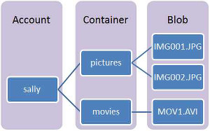

<properties
    pageTitle="在 HDInsight Linux 上建立 Hadoop、 HBase、 或火花叢集 |Microsoft Azure"
    description="瞭解如何建立 Hadoop、 HBase 大量，或 HDInsight 使用瀏覽器中，Azure CLI PowerShell 的 Azure、 其餘部分中，或透過 SDK 激起 linux 叢集。"
    services="hdinsight"
    documentationCenter=""
    authors="mumian"
    manager="jhubbard"
    editor="cgronlun"
    tags="azure-portal"/>

<tags
    ms.service="hdinsight"
    ms.devlang="na"
    ms.topic="article"
    ms.tgt_pltfrm="na"
    ms.workload="big-data"
    ms.date="10/18/2016"
    ms.author="jgao"/>

# 建立 HDInsight Linux 型 Hadoop 叢集

[AZURE.INCLUDE [selector](../../includes/hdinsight-selector-create-clusters.md)]

Hadoop 叢集包含多個的虛擬機器 （節點） 所使用的分散式處理的叢集上的工作。 Azure 抽取實作詳細資料的安裝和設定個別節點，，因此您僅可提供一般設定資訊。 本文中，您瞭解這些設定的設定。

## 存取控制需求

[AZURE.INCLUDE [access-control](../../includes/hdinsight-access-control-requirements.md)]

## 叢集類型

目前，Azure HDInsight 提供五種不同叢集，各有一組的元件，可提供特定功能。

| 叢集類型 | 功能 |
| ------------ | ----------------------------- |
| Hadoop       | 查詢及分析 （批次工作）     |
| HBase        | NoSQL 資料儲存區            |
| 大量        | 即時事件處理 |
| 火花        | 記憶體內處理、 互動式查詢微批次串流處理 |
| [互動式登錄區 （預覽版本）](hdinsight-hadoop-use-interactive-hive.md) | 記憶體內快取互動式和更快速地登錄區查詢|
| R 伺服器上火花 （預覽版本） | 各種不同的大型資料的統計資料、 建立預測模型及電腦學習功能 |

每個叢集類型有自己的數字，叢集內的節點、 術語節點叢集，以及每個節點類型的預設虛擬記憶體大小。 下表中，針對每個節點類型的節點數目是括號括住。

| 類型| 節點 | 圖表|
|-----|------|--------|
|Hadoop| 不對節點 (2)，資料節點 （1 +）||
|HBase|不對伺服器 (2)，區域 （1 +、） 母片/動物園管理員節點 (3)||
|大量|Nimbus 節點 (2)，主管伺服器 （1 +、） 動物園管理員節點 (3)||
|火花|不對節點 (2)，工作者節點 （1 +、） 動物園管理員節點 (3) （A1 動物園虛擬記憶體大小的免費）||

下表列出 HDInsight 預設 VM 大小︰

- 巴西南部和西部日本以外的所有支援的區域︰

  	|叢集類型                     | Hadoop               | HBase                | 大量                | 火花                                                                 | R 伺服器 |
  	|---------------------------------|----------------------|----------------------|----------------------|-----------------------------------------------------------------------|-----------------------------------------------------------------------|
  	|不對 – 預設虛擬記憶體大小           | D3 v2                | D3 v2                | A3                   | D12 v2                                                                | D12 v2                                                                |
  	|不對 – 建議 VM 大小      | D3 v2 D4 v2、 D12 v2 | D3 v2 D4 v2、 D12 v2 | A3、 A4 A5           | D12 v2、 D13 v2 D14 v2                                                | D12 v2、 D13 v2 D14 v2                                                |
  	|工作者 – 預設虛擬記憶體大小         | D3 v2                | D3 v2                | D3 v2                | Windows: D12 v2;Linux: D4 v2                                         | Windows: D12 v2;Linux: D4 v2                                         |
  	|工作者 – 建議 VM 大小    | D3 v2 D4 v2、 D12 v2 | D3 v2 D4 v2、 D12 v2 | D3 v2 D4 v2、 D12 v2 | Windows: D12 v2 D13 v2、 D14 v2;Linux: D4 v2 D12 v2、 D13 v2、 D14 v2 | Windows: D12 v2 D13 v2、 D14 v2;Linux: D4 v2 D12 v2、 D13 v2、 D14 v2 |
  	|動物園管理員 – 預設虛擬記憶體大小      |                      | A3                   | A2                   |                                                                       |
  	|動物園管理員 – 建議 VM 大小 |                      | A3、 A4 A5           | A2、 A3、 A4           |                                                                       |
  	|邊界-預設虛擬記憶體大小           |                      |                      |                      |                                                                       | Windows: D12 v2;Linux: D4 v2                                         |
  	|邊緣-建議虛擬記憶體大小       |                      |                      |                      |                                                                       | Windows: D12 v2 D13 v2、 D14 v2;Linux: D4 v2 D12 v2、 D13 v2、 D14 v2 |

- 巴西南部和日本西部只 （沒有 v2 大小以下）︰

  	|叢集類型                     | Hadoop      | HBase       | 大量      | 火花                                          |R 伺服器|
  	|---------------------------------|-------------|-------------|------------|------------------------------------------------|--------|
  	|不對 – 預設虛擬記憶體大小           | D3          | D3          | A3         | D12                                            | D12|
  	|不對 – 建議 VM 大小      | D3 D4，D12 | D3 D4，D12 | A3、 A4 A5 | D12、 D13，D14                                  | D12、 D13，D14|
  	|工作者 – 預設虛擬記憶體大小         | D3          | D3          | D3         | Windows: D12;Linux: D4                        | Windows: D12;Linux: D4|
  	|工作者 – 建議 VM 大小    | D3 D4，D12 | D3 D4，D12 | D3 D4，D12| Windows: D12、 D13，D14;Linux: D4，D12、 D13 D14| Windows: D12、 D13，D14;Linux: D4，D12、 D13 D14|
  	|動物園管理員 – 預設虛擬記憶體大小      |             | A2          | A2         |                                                | |
  	|動物園管理員 – 建議 VM 大小 |             | A2、 A3、 A4  | A2、 A3、 A4 |                                                | |
  	|邊界 – 預設 VM 大小          |             |             |            |                                                | Windows: D12;Linux: D4 |
  	|邊緣而建議 VM 大小      |             |             |            |                                                | Windows: D12、 D13，D14;Linux: D4，D12、 D13 D14 |

請注意，不對稱為*Nimbus*大量叢集類型。 工作者即*地區*HBase 叢集類型以及*主管*大量叢集類型。

> [AZURE.IMPORTANT] 如果您打算在叢集建立，或藉由建立後縮放叢集有 32 個以上的工作者節點，您就必須選取至少 8 核心和 14 GB 的 RAM 標頭節點大小。

您可以使用[指令碼動作](#customize-clusters-using-script-action)這些基本類型的檔案，以新增色調或 R 等其他元件。

> [AZURE.IMPORTANT] HDInsight 叢集了各種不同的類型，對應到工作負載或叢集調整為技術。 沒有建立，結合多個類型，例如大量和上一個叢集 HBase 叢集支援的方法。 

如果您的方案需要的分散到多個 HDInsight 叢集類型的技術，您應該建立 Azure 虛擬網路，並建立虛擬網路中的必要的叢集類型。 這個選項可讓叢集及部署，即可直接彼此任何程式碼。

如需有關如何使用 HDInsight Azure 虛擬網路的詳細資訊，請參閱[Azure 虛擬網路的延伸 HDInsight](hdinsight-extend-hadoop-virtual-network.md)。

如需使用 Azure 虛擬網路中的兩個叢集類型的範例，請參閱[大量與 HBase 分析感應器資料](hdinsight-storm-sensor-data-analysis.md)。

## 叢集層

Azure HDInsight 提供兩種類型的大型資料雲端方案︰ 標準和[進階版](hdinsight-component-versioning.md#hdinsight-standard-and-hdinsight-premium)。 HDInsight 進階版包含 R 和其他附加元件。 只有 HDInsight 版本 3.4 支援 HDInsight 進階版。

下表列出的 HDInsight 叢集類型及 HDInsight 進階版支援矩陣。

| 叢集類型 | 標準 | 進階版  |
|--------------|---------------|--------------|
| Hadoop       | [是]           | [是]          |
| 火花        | [是]           | [是]          |
| HBase        | [是]           | 無           |
| 大量        | [是]           | 無           |
| 在火花 R 伺服器 | 無 | [是] |

更多叢集類型會包含在 HDInsight 進階版時，就會更新此表格。 下圖顯示 [選擇叢集類型的 Azure 入口網站資訊。

## 基本的設定選項

以下是用來建立 HDInsight 叢集基本的設定選項。

### 叢集名稱 ###

叢集名稱用來識別叢集。 叢集名稱必須是全域唯一的它必須遵守下列命名指導方針︰

- 欄位必須包含介於 3 至 63 個字元的字串。
- 功能變數可以包含字母、 數字和連字號。

### 叢集類型###

請參閱[叢集類型](#cluster-types)和[叢集層](#cluster-tiers)。

### 作業系統 ###

您可以建立 HDInsight 叢集在下列兩個作業系統其中一項︰

- 在 Linux HDInsight。  HDInsight 提供的設定 Linux 叢集 Azure 上的選項。 設定 Linux 叢集，如果您熟悉 Linux 或 Unix，從現有的 Linux 型 Hadoop 方案，升級或 Linux 的內建的 Hadoop 生態元件想輕鬆整合。 如需詳細資訊，請參閱[快速入門中 HDInsight linux Hadoop](hdinsight-hadoop-linux-tutorial-get-started.md)。
- 在 Windows （Windows Server 2012 R2 資料中心） HDInsight。

### HDInsight 版本###

這用來判斷 HDInsight 這個叢集所需的版本。 如需詳細資訊，請參閱[Hadoop 叢集版本和中 HDInsight 元件](https://go.microsoft.com/fwLink/?LinkID=320896&clcid=0x409)。

### 訂閱名稱###

每個 HDInsight 叢集連結至 Azure 訂閱。

### 資源群組名稱 ###

[Azure 資源管理員](../azure-resource-manager/resource-group-overview.md)可協助您使用的資源] 群組中，為應用程式中稱為 Azure 資源群組。 您可以部署、 更新、 監控或刪除的所有資源在單一協同作業應用程式。

### 認證###

HDInsight 叢集，您可以在叢集建立期間設定兩個使用者帳戶︰

- HTTP 使用者。 預設的使用者名稱是 Azure 入口網站上使用基本設定的*管理員*。 有時候稱為 「 叢集使用者]。
- SSH 使用者 （Linux 叢集）。 這用來連線到使用 SSH 叢集。 [使用 SSH 與 Linux 為基礎的 Hadoop HDInsight Linux、 Unix，或 OS X 上](hdinsight-hadoop-linux-use-ssh-unix.md)或[使用 SSH Linux 為基礎的 Hadoop HDInsight 從 Windows 上的](hdinsight-hadoop-linux-use-ssh-unix.md)步驟，即可建立叢集之後，您可以建立其他 SSH 使用者帳戶。

    >[AZURE.NOTE] 針對 windows 叢集，您可以建立連線到使用 RDP 叢集 RDP 使用者。

### 資料來源###

原始的 Hadoop 分散式檔案系統 (HDFS) 叢集上使用多個本機磁碟。 HDInsight 的資料儲存區使用 Azure Blob 儲存體。 Azure Blob 儲存體是完美整合 HDInsight 健全、 用途的儲存空間方案。 透過 HDFS 介面中 HDInsight, 元件的完整可以直接在 Blob 儲存體中的結構化或非結構化資料上作業。 將資料儲存在 Blob 儲存體，可協助您安全地刪除 HDInsight 叢集所使用的計算，而不遺失使用者資料。

在設定期間，您必須指定 Azure 儲存體帳戶和 Azure Blob 儲存體容器 Azure 儲存體帳戶。 某些建立程序必須 Azure 儲存體帳戶預先建立的 Blob 儲存容器。 Blob 儲存容器會使用叢集作為預設儲存位置。 或者，您可以指定其他的 Azure 儲存體帳戶 （連結的儲存區） 叢集存取。 叢集也可以存取任何 Blob 儲存容器使用完整公用讀取權限或公用只二進位大型物件的讀取權限設定。  如需詳細資訊，請參閱[管理資源的存取權 Azure 儲存空間](../storage/storage-manage-access-to-resources.md)。

>[AZURE.NOTE] 下圖所示 Blob 儲存體容器會提供一組二進位大型物件的群組。

我們不建議使用預設 Blob 存放容器，以儲存商務資料。 考慮每次使用，以減少儲存空間成本後，請刪除預設 Blob 儲存體容器。 預設的容器包含應用程式與系統的筆記記錄。 請確認刪除容器之前擷取記錄檔。

>[AZURE.WARNING] 不支援共用一個 Blob 儲存容器的多重叢集。

如需有關使用次要 Blob 儲存體的詳細資訊，請參閱[使用 Azure Blob 儲存體與 HDInsight](hdinsight-hadoop-use-blob-storage.md)。

除了 Azure Blob 儲存體，您也可以使用[Azure 資料湖存放](../data-lake-store/data-lake-store-overview.md)在 HDInsight HBase 叢集的預設儲存帳戶以及所有四個 HDInsight 叢集類型連結的儲存空間。 如需詳細資訊，請參閱[建立資料湖存放 HDInsight 叢集使用 Azure 入口網站](../data-lake-store/data-lake-store-hdinsight-hadoop-use-portal.md)。

### 位置 （地區） ###

HDInsight 叢集和其預設儲存帳戶必須位於同一 Azure 的位置。

支援的區域的清單，按一下 [**地區**] 下拉式清單上[HDInsight 價格](https://go.microsoft.com/fwLink/?LinkID=282635&clcid=0x409)。

### 價格層級節點###

客戶叢集生命週期期間是向收費的節點的使用方式。 在建立叢集計費啟動和停駐點刪除叢集時。 無法解除配置或保留叢集。

不同的叢集類型各有不同類型的節點，節點，節點大小的數字。 比方說，Hadoop 叢集類型有兩個_標頭節點_和預設值為四個_資料節點_，而大量叢集類型有兩個_nimbus 節點_，三個_動物園管理員節點_，預設值為 4 個_主管節點_。 數節點和節點的虛擬機器大小取決於 HDInsight 叢集的成本。 比方說，如果您知道您將會執行需要大量記憶體的作業，您可能要選取更多記憶體計算資源。 學習的目的，建議使用一個資料節點。 如需有關 HDInsight 價格的詳細資訊，請參閱[HDInsight 價格](https://go.microsoft.com/fwLink/?LinkID=282635&clcid=0x409)。

>[AZURE.NOTE] 叢集大小限制的 Azure 訂閱而異。 連絡帳單支援，以增加限制。

>使用您的叢集節點不會計算為虛擬機器因為節點所用的虛擬機器影像 HDInsight 服務的實作詳細資料。 計算核心節點使用計算總數計算核心使用您的訂閱。 您可以查看可用的核心和核心建立 HDInsight 叢集會使用節點價格層刀摘要區段中，叢集數。

當您使用 Azure 入口網站設定叢集時，節點大小是透過__節點價格層__刀。 您也可以查看不同的節點大小相關聯的成本。 以下螢幕擷取畫面顯示 Linux 基底 Hadoop 叢集的選項。

下表顯示支援 HDInsight 叢集與容量所提供的大小。

#### 標準層︰ 的數列####

在傳統的部署模型，某些 VM 大小是 PowerShell 和 CLI 稍有不同。
* Standard_A3 是大
* Standard_A4 是 ExtraLarge

|大小 |CPU 核心|記憶體|Nic (Max)|最大值。 磁碟大小|最大值。 資料磁碟 (每個 1023 GB)|最大值。 IOPS (每個磁碟 500)|
|---|---|---|---|---|---|---|
|Standard_A3\Large|4|7 GB|2|暫時 = 285 GB |8|8 x 500|
|Standard_A4\ExtraLarge|8|14 GB|4|暫時 = 605 GB |16|16 x 500|
|Standard_A6|4|28 GB|2|暫時 = 285 GB |8|8 x 500|
|Standard_A7|8|56 GB|4|暫時 = 605 GB |16|16 x 500|

#### 標準層︰ D 數列####

|大小 |CPU 核心|記憶體|Nic (Max)|最大值。 磁碟大小|最大值。 資料磁碟 (每個 1023 GB)|最大值。 IOPS (每個磁碟 500)|
|---|---|---|---|---|---|---|
|Standard_D3 |4|14 GB|4|暫時 (SSD) = 200 GB |8|8 x 500|
|Standard_D4 |8|28 GB|8|暫時 (SSD) = 400 GB |16|16 x 500|
|Standard_D12 |4|28 GB|4|暫時 (SSD) = 200 GB |8|8 x 500|
|Standard_D13 |8|56 GB|8|暫時 (SSD) = 400 GB |16|16 x 500|
|Standard_D14 |16|112 GB|8|暫時 (SSD) = 800 GB |32|32 x 500|

#### 標準層︰ Dv2 數列####

|大小 |CPU 核心|記憶體|Nic (Max)|最大值。 磁碟大小|最大值。 資料磁碟 (每個 1023 GB)|最大值。 IOPS (每個磁碟 500)|
|---|---|---|---|---|---|---|
|Standard_D3_v2 |4|14 GB|4|暫時 (SSD) = 200 GB |8|8 x 500|
|Standard_D4_v2 |8|28 GB|8|暫時 (SSD) = 400 GB |16|16 x 500|
|Standard_D12_v2 |4|28 GB|4|暫時 (SSD) = 200 GB |8|8 x 500|
|Standard_D13_v2 |8|56 GB|8|暫時 (SSD) = 400 GB |16|16 x 500|
|Standard_D14_v2 |16|112 GB|8|暫時 (SSD) = 800 GB |32|32 x 500|    

瞭解當您打算使用這些資源的部署考量，請參閱[虛擬機器的大小](../virtual-machines/virtual-machines-windows-sizes.md)。 如有各種大小的價格資訊，請參閱[HDInsight 價格](https://azure.microsoft.com/pricing/details/hdinsight)。   

> [AZURE.IMPORTANT] 如果您打算在叢集建立，或藉由建立後縮放叢集有 32 個以上的工作者節點，您就必須選取至少 8 核心和 14 GB 的 RAM 標頭節點大小。

計費啟動建立叢集時，以及刪除叢集時停駐點。 如需有關價格的詳細資訊，請參閱[HDInsight 定價詳細資料](https://azure.microsoft.com/pricing/details/hdinsight/)。

## 使用額外的儲存空間

在某些情況下，您可能會想要新增額外的儲存空間到叢集。 例如，您可能會有不同的地理區域或不同的服務的多個 Azure 儲存體帳戶，但您要分析所有與 HDInsight。

當您建立 HDInsight 叢集或叢集建立之後，您可以新增儲存空間的帳戶。  請參閱[自訂 Linux 型 HDInsight 叢集使用指令碼動作](hdinsight-hadoop-customize-cluster-linux.md)。

如需有關次要 Blob 儲存體的詳細資訊，請參閱[使用 HDInsight 的使用 Azure Blob 儲存體](hdinsight-hadoop-use-blob-storage.md)。 如需有關次要資料湖儲存空間的詳細資訊，請參閱[建立 HDInsight 叢集資料湖存放區使用 Azure 入口網站](../data-lake-store/data-lake-store-hdinsight-hadoop-use-portal.md)。

## 使用登錄區/Oozie metastore

我們強烈建議您使用的是自訂的 metastore，如果您想要刪除 HDInsight 叢集後保留登錄區資料表。 您可以將該 metastore 附加至另一個 HDInsight 叢集。

> [AZURE.IMPORTANT] 無法共用 HDInsight metastore 建立的一個 HDInsight 叢集版，請在不同的 HDInsight 叢集版本。 如需 HDInsight 版本的清單，請參閱[支援的 HDInsight 版本](hdinsight-component-versioning.md#supported-hdinsight-versions)。

Metastore 包含登錄區及 Oozie 中繼資料，例如登錄區資料表、 磁碟分割區、 結構描述和資料行。 Metastore 可協助您，這樣就不必重新建立 [登錄區資料表或 Oozie 工作，當您建立新的叢集保留您登錄區及 Oozie 中繼資料。 根據預設，登錄區使用內嵌的 Azure SQL 資料庫來儲存此資訊。 內嵌的資料庫刪除叢集時，無法保留中繼資料。 當您建立的登錄區資料表中 HDInsight 叢集與設定登錄區 metastore 時，當您重新建立使用相同的登錄區 metastore 叢集時，仍會保留這些表格。

Metastore 設定不適用於 HBase 叢集類型。

> [AZURE.IMPORTANT] 在建立自訂的 metastore 時，請勿使用包含連字號或連字號的資料庫名稱。 這可能會導致失敗叢集建立程序。

## 使用 Azure 虛擬網路

[Azure 虛擬網路](https://azure.microsoft.com/documentation/services/virtual-network/)，您可以建立一個包含您的方案，您需要的資源的安全、 持續網路。 使用虛擬網路，您可以︰

* 連線一起私人網路 （雲端專用） 中的雲端資源。

    

* 使用虛擬私人網路 (VPN) 連線到您的本機資料中心網路 （至網站或點為網站） 雲端資源。

| 網站-設定 | 點-網站設定 |
| -------------------------- | --------------------------- |
| 使用網站的設定，您可以連線的多個資源從您的資料中心 Azure 虛擬網路使用硬體 VPN 或路徑和遠端存取服務。  | 以點為網站設定，您可以使用軟體 VPN 特定的資源連線至 Azure 虛擬網路。  |

Windows 型叢集需要 v1 （傳統） 虛擬網路，而 Linux 型叢集需要 v2 （Azure 資源管理員） 虛擬網路。 如果您沒有正確的網路類型，它會無法使用時建立叢集。

如需有關 HDInsight 使用虛擬網路，包括特定設定需求虛擬網路，請參閱[使用 Azure 虛擬網路延伸 HDInsight 功能](hdinsight-extend-hadoop-virtual-network.md)。

## 自訂叢集使用 HDInsight 叢集自訂 （啟動安裝）

有時候，您要設定下列設定檔︰

- clusterIdentity.xml
- 核心 site.xml
- gateway.xml
- hbase env.xml
- hbase site.xml
- hdfs site.xml
- 登錄區 env.xml
- 登錄區 site.xml
- mapred 網站
- oozie site.xml
- oozie env.xml
- 大量 site.xml
- tez site.xml
- webhcat site.xml
- yarn site.xml

若要保留的叢集生命所做的變更，您可以使用 HDInsight 叢集自訂期間建立程序，或者您可以使用 Ambari 中 Linux 型叢集。 如需詳細資訊，請參閱[使用啟動安裝程式的自訂 HDInsight 叢集](hdinsight-hadoop-customize-cluster-bootstrap.md)。

>[AZURE.NOTE] Windows 型叢集無法保留的變更，因為重新圖像。 如需詳細資訊，請參閱[角色執行個體重新啟動到期 OS 升級](http://blogs.msdn.com/b/kwill/archive/2012/09/19/role-instance-restarts-due-to-os-upgrades.aspx)。  若要保留的叢集生命週期透過所做的變更，您必須使用 HDInsight 叢集自訂期間建立程序。

## 自訂叢集使用指令碼的巨集指令

您可以安裝的附加元件，或使用在建立指令碼自訂叢集設定。 這類指令碼叫用透過**指令碼的巨集指令**，這是可從 Azure 入口網站、 HDInsight Windows PowerShell cmdlet 或 HDInsight.NET SDK 設定選項。 如需詳細資訊，請參閱[使用指令碼的巨集指令的自訂 HDInsight 叢集](hdinsight-hadoop-customize-cluster-linux.md)。

部分的原生 Java 元件，例如 Mahout 與重疊顯示，可以執行叢集上，為 Java 封存 (JAR) 檔案。 這些 JAR 檔案可以發佈至 Azure Blob 儲存體並提交給 HDInsight 叢集透過 Hadoop 工作送出機制。 如需詳細資訊，請參閱[提交 Hadoop 工作以程式設計方式](hdinsight-submit-hadoop-jobs-programmatically.md)。

>[AZURE.NOTE] 如果您有問題部署 HDInsight 叢集 JAR 檔案或呼叫 JAR HDInsight 叢集上的檔案，請連絡[Microsoft 支援服務](https://azure.microsoft.com/support/options/)。

> 階層式 HDInsight 不支援，而且不會有資格申請 Microsoft 支援服務。 支援的元件的清單，請參閱[HDInsight 所提供之叢集版本中的新功能？](hdinsight-component-versioning.md)

## 您可以使用邊緣節點

 空白的邊緣節點是使用相同的用戶端工具安裝並設定與 headnodes Linux 虛擬機器。 您可以使用邊緣節點存取叢集、 測試您的用戶端應用程式，並裝載您的用戶端應用程式。 如需詳細資訊，請參閱[使用空白的邊緣節點中 HDInsight](hdinsight-apps-use-edge-node.md)。
 
## 叢集建立方法

本文中，您已經學會建立 Linux 型 HDInsight 叢集的基本資訊。 請使用下表有關如何建立使用方法最適合您需求的特定資訊。

| 建立與叢集 | 網頁瀏覽器 | 命令列 | REST API | SDK | Linux、 Mac OS X 或 Unix | Windows |
| ------------------------------- |:----------------------:|:--------------------:|:------------------:|:------------:|:-----------------------------:|:------------:|
| [Azure 入口網站](hdinsight-hadoop-create-linux-clusters-portal.md) | ✔     | &nbsp; | &nbsp; | &nbsp; | ✔      | ✔ |
| [Azure 資料工廠](hdinsight-hadoop-create-linux-clusters-adf.md) | ✔     | ✔  | ✔  |✔  | ✔      | ✔ |
| [Azure CLI](hdinsight-hadoop-create-linux-clusters-azure-cli.md)         | &nbsp; | ✔     | &nbsp; | &nbsp; | ✔      | ✔ |
| [Azure PowerShell](hdinsight-hadoop-create-linux-clusters-azure-powershell.md) | &nbsp; | ✔     | &nbsp; | &nbsp; | ✔ | ✔ |
| [捲曲](hdinsight-hadoop-create-linux-clusters-curl-rest.md) | &nbsp; | ✔     | ✔ | &nbsp; | ✔      | ✔ |
| [.NET SDK](hdinsight-hadoop-create-linux-clusters-dotnet-sdk.md) | &nbsp; | &nbsp; | &nbsp; | ✔ | ✔      | ✔ |
| [Azure 資源管理員範本](hdinsight-hadoop-create-linux-clusters-arm-templates.md) | &nbsp; | ✔     | &nbsp; | &nbsp; | ✔      | ✔ |
