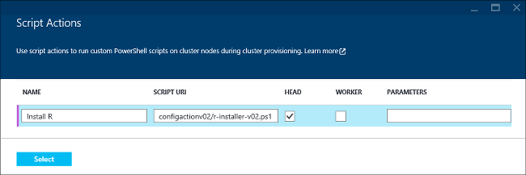

<properties
    pageTitle="若要自訂叢集 HDInsight R 使用 |Microsoft Azure"
    description="瞭解如何安裝 R 使用指令碼動作，並使用 R HDInsight 叢集上。"
    services="hdinsight"
    documentationCenter=""
    tags="azure-portal"
    authors="mumian"
    manager="jhubbard"
    editor="cgronlun"/>

<tags
    ms.service="hdinsight"
    ms.workload="big-data"
    ms.tgt_pltfrm="na"
    ms.devlang="na"
    ms.topic="article"
    ms.date="09/14/2016"
    ms.author="jgao"/>

# 安裝並使用 R HDInsight Hadoop 叢集上

瞭解如何自訂視窗以 R 使用指令碼動作，根據 HDInsight 叢集，以及如何使用 HDInsight R 叢集。 [進階版層](https://azure.microsoft.com/pricing/details/hdinsight/)提供的 HDInsight 包含 R 伺服器 HDInsight 叢集的一部分。 這個選項可讓使用 MapReduce 和火花來執行分散的運算 R 指令碼。 如需詳細資訊，請參閱[開始使用 HDInsight R 伺服器](hdinsight-hadoop-r-server-get-started.md)。 R 使用 Linux 叢集的詳細資訊，請參閱[安裝並使用 R HDinsight Hadoop 叢集 (Linux) 上](hdinsight-hadoop-r-scripts-linux.md)。
 
使用*指令碼的巨集指令*，您可以在 Azure HDInsight 安裝 R 上任何類型的叢集 （Hadoop 大量、 HBase、 火花）。 使用唯讀 Azure 儲存體 blob [https://hdiconfigactions.blob.core.windows.net/rconfigactionv02/r-installer-v02.ps1](https://hdiconfigactions.blob.core.windows.net/rconfigactionv02/r-installer-v02.ps1)在從 HDInsight 叢集上安裝 R 範例指令碼。 

**相關的文章**

- [安裝並使用 HDinsight Hadoop 叢集 (Linux) 上的 [R](hdinsight-hadoop-r-scripts-linux.md)
- [建立 Hadoop 叢集 HDInsight 中](hdinsight-provision-clusters.md)︰ 建立 HDInsight 叢集的一般資訊
- [自訂使用指令碼的巨集指令的 HDInsight 叢集][hdinsight-cluster-customize]︰ 自訂 HDInsight 叢集使用指令碼的巨集指令的一般資訊
- [開發 HDInsight 指令碼動作指令碼](hdinsight-hadoop-script-actions.md)

## R 是什麼？

<a href="http://www.r-project.org/" target="_blank">R 專案統計計算</a>是開啟來源語言] 和 [統計計算環境。 R 提供數百個內建統計函數和結合層面的功能和物件導向程式設計自己程式設計語言。 同時也會提供更多圖形功能。 R 是慣用的程式設計環境最專業統計學家和科學家在各種不同的欄位。

R 是相容的 Azure Blob 儲存體 (WASB)，使其可以使用 HDInsight R 處理有儲存的資料。  

## 安裝 R

使用唯讀 blob Azure 儲存體中從 HDInsight 叢集上安裝 R[範例指令碼](https://hdiconfigactions.blob.core.windows.net/rconfigactionv02/r-installer-v02.ps1)。 本節提供有關如何建立使用 Azure 入口網站叢集時使用範例指令碼的指示。

> [AZURE.NOTE] HDInsight 叢集版本 3.1 的推出範例指令碼。 如需有關 HDInsight 叢集版本的詳細資訊，請參閱[HDInsight 叢集版本](hdinsight-component-versioning.md)。

1. 當您從入口網站建立 HDInsight 叢集時，按一下 [**選擇性的設定**]，然後按一下 [**指令碼動作**。
2. 在 [**指令碼動作**] 頁面中，輸入下列值︰

    

    <table border='1'>
        <tr><th>屬性</th><th>值</th></tr>
        <tr><td>名稱</td>
            <td>指定的指令碼動作，例如，<b>安裝 R</b>的名稱。</td></tr>
        <tr><td>指令碼 URI</td>
            <td>指定自訂叢集，例如<i>https://hdiconfigactions.blob.core.windows.net/rconfigactionv02/r-installer-v02.ps1</i>叫用的指令碼 URI</td></tr>
        <tr><td>節點類型</td>
            <td>指定要在其執行的自訂指令碼的節點。 您可以選擇<b>所有節點</b>、<b>僅不對節點</b>或<b>工作者節點</b>只。
        <tr><td>參數</td>
            <td>如果所需的指令碼，請指定參數。 不過，安裝 R 的指令碼不需要任何參數，因此您可以在此保留空白。</td></tr>
    </table>

    您可以新增一個以上的指令碼動作，以叢集上安裝多個元件。 您已新增的指令碼之後，請按一下 [開始能建立叢集核取記號。

您也可以使用指令碼 HDInsight 上安裝 R，使用 PowerShell 的 Azure 或 HDInsight.NET SDK。 本文稍後的提供這些程序的相關指示。

## 執行 R 指令碼
本節說明如何使用 HDInsight Hadoop 叢集上執行 R 指令碼。

1. **建立遠端桌面連線到叢集**︰ 從入口網站中，為您建立的安裝，R 叢集啟用遠端桌面，然後連線至 [叢集。 如需相關指示，請參閱[連線至 HDInsight 叢集使用 RDP](hdinsight-administer-use-management-portal.md#rdp)。

2. **開啟 [R 主控台**︰ R 安裝會連結到 R 主控台主節點的桌面。 按一下以開啟 [R 主控台。

3. **執行 R 指令碼**︰ 可以直接從 R 主控台執行 R 指令碼，貼上，選取它，然後按 ENTER 鍵。 以下是簡單範例指令碼會產生的數字 1 到 100，然後將其乘以 2。

        library(rmr2)
        library(rhdfs)
        ints = to.dfs(1:100)
        calc = mapreduce(input = ints, map = function(k, v) cbind(v, 2*v))
        from.dfs(calc)

前兩行呼叫 RHadoop 文件庫與 r 一起安裝的最後一列列印主控台結果。 輸出看起來應該像這樣︰

    [1,]  1 2
    [2,]  2 4
    .
    .
    .
    [98,]  98 196
    [99,]  99 198
    [100,] 100 200

## 安裝 R 使用 Aure PowerShell

請參閱[自訂 HDInsight 叢集使用指令碼動作](hdinsight-hadoop-customize-cluster.md#call_scripts_using_powershell)。  範例會示範如何安裝火花使用 PowerShell 的 Azure。 您需要自訂使用[https://hdiconfigactions.blob.core.windows.net/rconfigactionv02/r-installer-v02.ps1](https://hdiconfigactions.blob.core.windows.net/rconfigactionv02/r-installer-v02.ps1)的指令碼。

## 安裝使用.NET SDK R

請參閱[自訂 HDInsight 叢集使用指令碼動作](hdinsight-hadoop-customize-cluster.md#call_scripts_using_azure_powershell)。 範例會示範如何安裝火花使用.NET SDK。 您需要自訂使用[https://hdiconfigactions.blob.core.windows.net/rconfigactionv02/r-installer-v02.ps1](https://hdiconfigactions.blob.core.windows.net/rconfigactionv02/r-installer-v02.ps11)的指令碼。

## 另請參閱

- [安裝並使用 HDinsight Hadoop 叢集 (Linux) 上的 [R](hdinsight-hadoop-r-scripts-linux.md)
- [建立 Hadoop 叢集 HDInsight 中](hdinsight-provision-clusters.md)︰ 建立 HDInsight 叢集的一般資訊
- [自訂使用指令碼的巨集指令的 HDInsight 叢集][hdinsight-cluster-customize]︰ 自訂 HDInsight 叢集使用指令碼的巨集指令的一般資訊
- [開發 HDInsight 指令碼動作指令碼](hdinsight-hadoop-script-actions.md)
- [安裝並使用火花 HDInsight 叢集上][hdinsight-install-spark]︰ 了解如何安裝火花的指令碼動作範例
- [HDInsight 叢集上的安裝 Giraph](hdinsight-hadoop-giraph-install.md)︰ 了解如何安裝 Giraph 的指令碼動作範例
- [HDInsight 叢集上的安裝 Solr](hdinsight-hadoop-solr-install-linux.md)︰ 了解如何安裝 Solr 的指令碼動作範例。

[powershell-install-configure]: powershell-install-configure.md
[hdinsight-provision]: ../hdinsight-provision-clusters/
[hdinsight-cluster-customize]: hdinsight-hadoop-customize-cluster-linux.md
[hdinsight-install-spark]: hdinsight-apache-spark-jupyter-spark-sql.md
