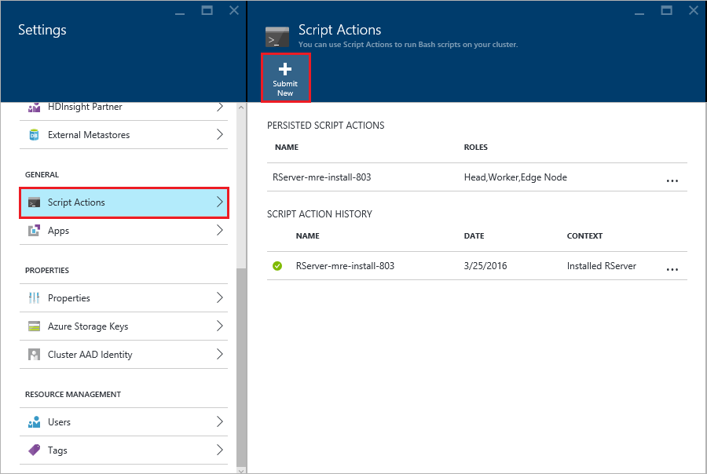

<properties
   pageTitle="開始使用 HDInsight （預覽版本） 上的 R 伺服器 |Azure"
   description="瞭解如何建立 Apache 火花 HDInsight (Hadoop) 叢集包括 R Server （預覽版本） 上，然後再提交叢集 R 指令碼。"
   services="HDInsight"
   documentationCenter=""
   authors="jeffstokes72"
   manager="jhubbard"
   editor="cgronlun"
/>

<tags
   ms.service="HDInsight"
   ms.devlang="R"
   ms.topic="article"
   ms.tgt_pltfrm="na"
   ms.workload="data-services"
   ms.date="08/19/2016"
   ms.author="jeffstok"
/>

# 開始使用 R 伺服器上 HDInsight （預覽版本）

提供的 HDInsight 的進階版層包含 R Server （預覽版本） HDInsight 叢集的一部分。 這個選項可讓使用 MapReduce 和火花來執行分散的運算 R 指令碼。 在此文件中，您將學習如何建立新的 R 伺服器上 HDInsight，然後執行示範如何使用的分散式 R 計算的火花 R 指令碼。

## 必要條件

* __Azure 訂閱__︰ 此教學課程之前，您必須擁有 Azure 訂閱。 如需詳細資訊，請參閱[取得 Azure 免費試用版](https://azure.microsoft.com/documentation/videos/get-azure-free-trial-for-testing-hadoop-in-hdinsight/)。

* __安全命令介面 (SSH) 用戶端__︰ SSH 用戶端用來從遠端連線到 HDInsight 叢集，並直接在叢集上執行命令。 Linux 與 OS X Unix，系統會提供透過 SSH 用戶端`ssh`] 命令。 Windows 系統，我們建議您[PuTTY](http://www.chiark.greenend.org.uk/~sgtatham/putty/download.html)。

    * __（選擇性） SSH 索引鍵__︰ 您可以用來連線到使用密碼或公開金鑰叢集 SSH 帳戶來保護。 使用密碼，並可讓您快速入門而不需要建立的公用/私人組;不過，使用索引鍵是更加安全。
    
        這份文件中的步驟假設您使用的密碼。 如何建立和使用 HDInsight SSH 索引鍵的資訊，請參閱下列文件︰
        
        * [HDInsight SSH 使用從 Linux、 Unix 或 OS X 的用戶端](hdinsight-hadoop-linux-use-ssh-unix.md)
        
        * [從 Windows 用戶端中使用 HDInsight SSH](hdinsight-hadoop-linux-use-ssh-windows.md)

### 存取控制需求

[AZURE.INCLUDE [access-control](../../includes/hdinsight-access-control-requirements.md)]

## 建立叢集

> [AZURE.NOTE] 這份文件中的步驟建立 R 伺服器上 HDInsight 使用基本的設定資訊。 其他叢集設定的設定 （例如新增額外的儲存空間帳戶，或使用 Azure 虛擬網路或建立登錄區 metastore），請參閱[建立 Linux 型 HDInsight 叢集](hdinsight-hadoop-provision-linux-clusters.md)。

1. [Azure 入口網站](https://portal.azure.com)登入。

2. __新增__、__資料 + 分析__，依序選取__HDInsight__。

    

3. 在 [__叢集名稱__] 欄位中輸入叢集的名稱。 如果您有多個 Azure 訂閱，請使用__訂閱__項目，選取您想要使用的項目。

    

4. 選取 [__選取叢集類型__。 在__叢集類型__刀中，選取下列選項︰

    * __叢集類型__︰ 火花 R 伺服器
    
    * __叢集層__︰ 進階版

    在 [預設值，保留其他選項，然後使用 [__選取__] 按鈕儲存叢集類型。
    
    
    
    > [AZURE.NOTE] 您也可以新增至 （例如 Hadoop 或 HBase，） 其他 HDInsight 叢集類型的 R 伺服器，選取叢集類型]，然後選取 [__進階版__。

5. 選取 [**資源群組**查看現有的資源群組的清單，然後選取 [建立叢集中的項目]。 或者，您可以選取 [**建立新檔案**，然後輸入 [新的資源群組的名稱。 綠色核取記號會出現表示有新的群組名稱。

    > [AZURE.NOTE] 這個項目會預設為其中一個現有的資源群組中，如果有的話。
    
    若要儲存的資源群組使用 [__選取__] 按鈕。

6. 選取**憑證**，然後輸入**叢集登入的使用者名稱**] 和 [**叢集登入密碼**]。

    輸入__SSH 使用者名稱__。  SSH 用來從遠端叢集使用__安全命令介面 (SSH)__用戶端連線。 您可以指定 SSH 使用者在此對話方塊中，或之後建立叢集 （叢集設定索引標籤）。 R 伺服器設定為預期的 「 remoteuser 」 __SSH 使用者名稱__。  如果您使用不同的使用者名稱，則必須執行額外的步驟，建立叢集後。
    
    

    __SSH 驗證類型__︰ 選取驗證類型的__密碼__，除非您想要使用公用金鑰。  如果您想要透過遠端用戶端，例如 RTVS、 RStudio 或其他桌面 IDE 叢集上存取 R 伺服器，您將需要的公用/私人組。   

    若要建立並使用公用/私人金鑰組選取公開金鑰 」，然後繼續，如下所示。  這些指示假設您有 Cygwin ssh-keygen 或等同安裝。

    -    產生公用/私人組，從您的膝上型電腦命令提示字元︰
      
            ssh-keygen-t rsa-b 2048 – f < 私人索引鍵的檔案名稱 >
      
    -    這會例如建立私密金鑰檔案及下名稱 < 私人金鑰-檔名 >.pub，公開金鑰檔案 davec 和 davec.pub。  然後指定公開金鑰檔案 (*.pub) 指派 HDI 叢集認證時︰
      
          
      
    -    變更您的膝上型電腦上的私人索引鍵檔權限
      
            chmod 600 < 私人索引鍵的檔案名稱 >
      
    -    使用私密金鑰檔 SSH 遠端登入，例如︰
      
            ssh – i < 私人索引鍵的檔案名稱 >remoteuser@<hostname public ip>
      
      或部分的定義您 Hadoop 火花計算內容 R 伺服器的用戶端上 （作為 Hadoop 用戶端的線上[RevoScaleR Hadoop 火花快速入門指南](https://msdn.microsoft.com/microsoft-r/scaler-spark-getting-started)的 [[建立計算的火花內容](https://msdn.microsoft.com/microsoft-r/scaler-spark-getting-started#creating-a-compute-context-for-spark)] 區段中，請參閱使用 Microsoft R 伺服器）。

7. 選取 [若要選取叢集的資料來源的**資料來源**]。 選取現有的儲存空間帳戶，選取 [__選取儲存的帳戶__，然後選取 [帳戶]，或建立新帳戶使用__選取儲存的帳戶__] 區段中的 [__新增__連結]。

    如果您選取 [__新增__]，您必須輸入新的儲存空間帳戶的名稱。 如果名稱會接受，會出現綠色的核取記號。

    __預設的容器__會預設為叢集的名稱。 請將此值。
    
    選取要選取的區域，以建立儲存帳戶中的__位置__。
    
    > [AZURE.IMPORTANT] 選取預設資料來源的位置，也會設定 HDInsight 叢集的位置。 叢集及預設值的資料來源必須位於相同的區域。

    使用 [**選取**] 按鈕以儲存資料來源設定。
    
    

8. 選取 [若要顯示資訊將會建立此叢集節點的**節點價格層級**]。 除非您知道您需要更大的叢集，保留工作者節點數目的預設值`4`。 刀內會顯示叢集估計的成本。

    > [AZURE.NOTE] 如有需要您可以重新調整大小叢集稍後透過入口網站 (叢集]-> [設定]-> [縮放比例叢集) 以增加或減少的工作者節點數目。  這會有幫助閒置到達便下叢集時在不使用，或新增容量，以符合需求的較大的工作。

    縮放叢集、 資料節點，以及邊緣節點時，請謹記的因素包括︰  
   
    - 資料變大時上火花, 分散式 R 伺服器分析的效能是比例工作者節點的數。  
    - R 伺服器分析的效能是線性正在分析資料的大小。 例如︰  
        - 小少量的資料，效能會在本機的計算內容上邊緣節點分析時的最佳。  如要本機和火花計算內容適合的案例的詳細資訊請參閱計算內容選項 R 伺服器上 HDInsight。 
        - 如果您登入邊緣節點，並執行那里 R 指令碼然後所有但 ScaleR 接收函數將<strong>本機</strong>的邊緣節點上執行，因此記憶體和數字的邊緣節點的核心應該要調整大小會相應地。 相同適用於您 R 伺服器上使用 HDI 為遠端計算內容從膝上型電腦。
    
    

    您可以使用 [**選取**] 按鈕，儲存價格設定的節點。
    
9. 在**新的 HDInsight 叢集**刀中，請確認已選取 [**固定至 Startboard** ，，然後選取 [**建立**。 這會建立叢集，並為其新增 Startboard Azure 入口網站的方塊。 圖示會指出叢集建立，並會變更為顯示 [HDInsight] 圖示，建立完成。

  	| 建立時 | 建立完成 |
  	| ------------------ | --------------------- |
  	|  |  |

    > [AZURE.NOTE] 它會需要一些時間叢集會建立通常約 15 分鐘。 若要查看的建立程序中使用 Startboard，或在頁面左側的**通知**項目] 方塊。

## 連線至 R 伺服器邊緣節點

連線到使用 SSH HDInsight 叢集 R 伺服器邊緣節點︰

    ssh USERNAME@r-server.CLUSTERNAME-ssh.azurehdinsight.net
    
> [AZURE.NOTE] 您也可以找到`R-Server.CLUSTERNAME-ssh.azurehdinsight.net`選取叢集，然後__所有設定__、__應用程式__，以及__RServer__Azure 入口網站中的地址。 這會顯示邊緣節點的 SSH 結束點資訊。
>
> 
    
如果您是使用密碼保護您 SSH 的使用者帳戶，系統會提示您輸入。 如果您使用公開金鑰，您可能必須使用`-i`參數指定相符的私人索引鍵。 例如， `ssh -i ~/.ssh/id_rsa USERNAME@R-Server.CLUSTERNAME-ssh.azurehdinsight.net`。
    
如需有關使用 Linux 型 HDInsight SSH 的詳細資訊，請參閱下列文章︰

* [使用上 HDInsight Linux、 Unix，或 OS X 的 Linux 型 Hadoop SSH](hdinsight-hadoop-linux-use-ssh-unix.md)

* [使用上從 Windows HDInsight Linux 為基礎的 Hadoop SSH](hdinsight-hadoop-linux-use-ssh-windows.md)

連線之後，您將會送達在類似下列提示。

    username@ed00-myrser:~$

## 使用 「 R 主控台

1. 從 SSH 工作階段，使用下列命令來啟動 R 主控台。

        R
    
    您會看到類似以下的輸出。
    
        R version 3.2.2 (2015-08-14) -- "Fire Safety"
        Copyright (C) 2015 The R Foundation for Statistical Computing
        Platform: x86_64-pc-linux-gnu (64-bit)

        R is free software and comes with ABSOLUTELY NO WARRANTY.
        You are welcome to redistribute it under certain conditions.
        Type 'license()' or 'licence()' for distribution details.

        Natural language support but running in an English locale

        R is a collaborative project with many contributors.
        Type 'contributors()' for more information and
        'citation()' on how to cite R or R packages in publications.

        Type 'demo()' for some demos, 'help()' for on-line help, or
        'help.start()' for an HTML browser interface to help.
        Type 'q()' to quit R.

        Microsoft R Server version 8.0: an enhanced distribution of R
        Microsoft packages Copyright (C) 2016 Microsoft Corporation

        Type 'readme()' for release notes.

        >

2. 從`>`提示，您可以輸入 R 程式碼。 R 伺服器包含套件，可讓您輕鬆地與 Hadoop 互動，以及執行分散的運算。 例如，使用下列命令來檢視 HDInsight 叢集的預設檔案系統的根目錄。

        rxHadoopListFiles("/")
    
    您也可以使用 WASB 樣式處理。
    
        rxHadoopListFiles("wasbs:///")

## 從遠端執行個體的 Microsoft R 伺服器或 Microsoft R 用戶端 HDI 上使用 R 伺服器

每個前一節的公用/私人金鑰組存取叢集使用，有可能是從遠端執行個體的 Microsoft R 伺服器或在桌上型電腦或膝上型電腦上執行的 Microsoft R 用戶端的設定存取 HDI Hadoop 火花計算內容 （Hadoop 用戶端的線上[RevoScaleR Hadoop 火花快速入門指南](https://msdn.microsoft.com/microsoft-r/scaler-spark-getting-started)的 [[建立計算的火花內容](https://msdn.microsoft.com/microsoft-r/scaler-spark-getting-started#creating-a-compute-context-for-spark)] 區段中，請參閱使用 Microsoft R 伺服器）。  若要執行，因此您將需要指定下列選項定義 RxSpark 時計算您的膝上型電腦上的內容︰ hdfsShareDir，shareDir，sshUsername，sshHostname，sshSwitches，及 sshProfileScript。 例如︰

    
    myNameNode <- "default"
    myPort <- 0 
 
    mySshHostname  <- 'rkrrehdi1-ssh.azurehdinsight.net'  # HDI secure shell hostname
    mySshUsername  <- 'remoteuser'# HDI SSH username
    mySshSwitches  <- '-i /cygdrive/c/Data/R/davec'   # HDI SSH private key
 
    myhdfsShareDir <- paste("/user/RevoShare", mySshUsername, sep="/")
    myShareDir <- paste("/var/RevoShare" , mySshUsername, sep="/")
 
    mySparkCluster <- RxSpark(
      hdfsShareDir = myhdfsShareDir,
      shareDir     = myShareDir,
      sshUsername  = mySshUsername,
      sshHostname  = mySshHostname,
      sshSwitches  = mySshSwitches,
      sshProfileScript = '/etc/profile',
      nameNode     = myNameNode,
      port         = myPort,
      consoleOutput= TRUE
    )

    
 
## 使用計算內容

計算內容可讓您控制是否計算將本機上執行的邊緣節點，或是否它的分佈，HDInsight 叢集節點。
        
1. 從 [R 主控台中使用下列範例資料載入 HDInsight 的預設儲存空間。

        # Set the HDFS (WASB) location of example data
        bigDataDirRoot <- "/example/data"
        # create a local folder for storaging data temporarily
        source <- "/tmp/AirOnTimeCSV2012"
        dir.create(source)
        # Download data to the tmp folder
        remoteDir <- "http://packages.revolutionanalytics.com/datasets/AirOnTimeCSV2012"
        download.file(file.path(remoteDir, "airOT201201.csv"), file.path(source, "airOT201201.csv"))
        download.file(file.path(remoteDir, "airOT201202.csv"), file.path(source, "airOT201202.csv"))
        download.file(file.path(remoteDir, "airOT201203.csv"), file.path(source, "airOT201203.csv"))
        download.file(file.path(remoteDir, "airOT201204.csv"), file.path(source, "airOT201204.csv"))
        download.file(file.path(remoteDir, "airOT201205.csv"), file.path(source, "airOT201205.csv"))
        download.file(file.path(remoteDir, "airOT201206.csv"), file.path(source, "airOT201206.csv"))
        download.file(file.path(remoteDir, "airOT201207.csv"), file.path(source, "airOT201207.csv"))
        download.file(file.path(remoteDir, "airOT201208.csv"), file.path(source, "airOT201208.csv"))
        download.file(file.path(remoteDir, "airOT201209.csv"), file.path(source, "airOT201209.csv"))
        download.file(file.path(remoteDir, "airOT201210.csv"), file.path(source, "airOT201210.csv"))
        download.file(file.path(remoteDir, "airOT201211.csv"), file.path(source, "airOT201211.csv"))
        download.file(file.path(remoteDir, "airOT201212.csv"), file.path(source, "airOT201212.csv"))
        # Set directory in bigDataDirRoot to load the data into
        inputDir <- file.path(bigDataDirRoot,"AirOnTimeCSV2012") 
        # Make the directory
        rxHadoopMakeDir(inputDir)
        # Copy the data from source to input
        rxHadoopCopyFromLocal(source, bigDataDirRoot)

2. 接下來，讓我們來建立一些資料資訊和定義兩個資料來源，以便我們可以使用的資料。

        # Define the HDFS (WASB) file system
        hdfsFS <- RxHdfsFileSystem()
        # Create info list for the airline data
        airlineColInfo <- list(
            DAY_OF_WEEK = list(type = "factor"),
            ORIGIN = list(type = "factor"),
            DEST = list(type = "factor"),
            DEP_TIME = list(type = "integer"),
            ARR_DEL15 = list(type = "logical"))

        # get all the column names
        varNames <- names(airlineColInfo)

        # Define the text data source in hdfs
        airOnTimeData <- RxTextData(inputDir, colInfo = airlineColInfo, varsToKeep = varNames, fileSystem = hdfsFS)
        # Define the text data source in local system
        airOnTimeDataLocal <- RxTextData(source, colInfo = airlineColInfo, varsToKeep = varNames)

        # formula to use
        formula = "ARR_DEL15 ~ ORIGIN + DAY_OF_WEEK + DEP_TIME + DEST"

3. 讓我們來執行資料使用本機後勤迴歸計算內容。

        # Set a local compute context
        rxSetComputeContext("local")
        # Run a logistic regression
        system.time(
            modelLocal <- rxLogit(formula, data = airOnTimeDataLocal)
        )
        # Display a summary 
        summary(modelLocal)

    您應該會看到類似以下的線條結尾的輸出。

        Data: airOnTimeDataLocal (RxTextData Data Source)
        File name: /tmp/AirOnTimeCSV2012
        Dependent variable(s): ARR_DEL15
        Total independent variables: 634 (Including number dropped: 3)
        Number of valid observations: 6005381
        Number of missing observations: 91381
        -2*LogLikelihood: 5143814.1504 (Residual deviance on 6004750 degrees of freedom)

        Coefficients:
                        Estimate Std. Error z value Pr(>|z|)
        (Intercept)   -3.370e+00  1.051e+00  -3.208  0.00134 **
        ORIGIN=JFK     4.549e-01  7.915e-01   0.575  0.56548
        ORIGIN=LAX     5.265e-01  7.915e-01   0.665  0.50590
        ......
        DEST=SHD       5.975e-01  9.371e-01   0.638  0.52377
        DEST=TTN       4.563e-01  9.520e-01   0.479  0.63172
        DEST=LAR      -1.270e+00  7.575e-01  -1.676  0.09364 .
        DEST=BPT         Dropped    Dropped Dropped  Dropped
        ---
        Signif. codes:  0 ‘***’ 0.001 ‘**’ 0.01 ‘*’ 0.05 ‘.’ 0.1 ‘ ’ 1

        Condition number of final variance-covariance matrix: 11904202
        Number of iterations: 7

4. 下一步，讓我們來執行相同後勤迴歸分析使用火花的內容。 火花內容會透過 HDInsight 叢集內的所有工作者節點散佈處理程序。

        # Define the Spark compute context 
        mySparkCluster <- RxSpark()
        # Set the compute context 
        rxSetComputeContext(mySparkCluster)
        # Run a logistic regression 
        system.time(  
            modelSpark <- rxLogit(formula, data = airOnTimeData)
        )
        # Display a summary
        summary(modelSpark)

    > [AZURE.NOTE] 您也可以使用 MapReduce 分散運算叢集節點。 計算內容的詳細資訊，請參閱[計算 R 伺服器上 HDInsight 進階內容選項](hdinsight-hadoop-r-server-compute-contexts.md)。

## 分散到多個節點 R 程式碼

R 伺服器就可以輕鬆地現有 R 程式碼，橫跨多個叢集節點中使用`rxExec`。 執行參數整理或模擬時，這是很有用。 以下是如何使用範例`rxExec`。

    rxExec( function() {Sys.info()["nodename"]}, timesToRun = 4 )
    
如果您仍在使用火花或 MapReduce 內容，這會傳回工作者節點的節點名稱不值的程式碼 (`Sys.info()["nodename"]`) 在上執行。 例如，在四個節點叢集上，您可能會收到類似以下的輸出。

    $rxElem1
        nodename
    "wn3-myrser"

    $rxElem2
        nodename
    "wn0-myrser"

    $rxElem3
        nodename
    "wn3-myrser"

    $rxElem4
        nodename
    "wn3-myrser"

## 安裝 R 套件

如果您想要安裝其他 R 套件上邊緣節點，您可以使用`install.packages()`直接從內 R 主控台邊緣節點透過 SSH 連線時。 不過，如果您需要安裝 R 套件上叢集工作者節點，您必須使用指令碼的巨集指令。

指令碼動作是用來變更 HDInsight 叢集，或安裝其他軟體艦隊指令碼。 在此情況下，若要安裝其他 R 套件。 若要安裝其他封包使用指令碼的巨集指令，請使用下列步驟。

> [AZURE.IMPORTANT] 使用指令碼動作安裝其他 R 套件僅能在建立叢集之後。 它不應該用於叢集建立期間，當指令碼依賴 R 伺服器完全安裝和設定。

1. 從[Azure 入口網站](https://portal.azure.com)中，選取 [在 HDInsight 叢集 R 伺服器]。

2. 從叢集刀中，選取 [__所有設定__]，然後按一下 [__指令碼動作__。 從__指令碼動作__刀中，選取 [__提交新__提交新的指令碼動作]。

    

3. 從 [__送出指令碼動作__刀，提供下列資訊。

  - __名稱__︰ 好記的名稱來識別這個指令碼
  - __被指令碼 URI__:`http://mrsactionscripts.blob.core.windows.net/rpackages-v01/InstallRPackages.sh`
  - __不對__︰ 應該是__取消核取__
  - __工作__︰ 這個應該__已核取__
  - __動物園管理員__︰ 應該是__取消核取__
  - __參數__︰ 安裝 R 套件。 例如，`bitops stringr arules`
  - __Persist 此指令碼...__: 這個應該__已核取__  

    > [AZURE.NOTE] 1.根據預設，所有 R 套件已都安裝從 Microsoft MRAN 存放庫 R 伺服器的已都安裝的版本與一致的快照。  如果您想要安裝套件的較新版本，然後不相容的一些風險，不過這有可能是由指定`useCRAN`為套件的第一個項目] 清單中，例如︰ `useCRAN bitops, stringr, arules`.  
    > 2. 有些 R 套件會要求其他 Linux 系統文件庫。 為了方便，我們已預先安裝所需的上方 100 熱門 R 套件的相依性。 不過，如果您安裝的 R 封裝需要這些限制，超出的文件庫，然後必須下載用以下的基本指令碼，並新增步驟，將安裝系統文件庫。 然後，您必須上傳到公用 blob 容器 Azure 儲存體中的已修改的指令碼，並使用已修改的指令碼來安裝套件。
    > 如需開發指令碼動作的詳細資訊，請參閱[指令碼動作開發](hdinsight-hadoop-script-actions-linux.md)。  

    

4. 選取 [__建立__]，以執行指令碼]。 指令碼完成後，R 封包將可供所有工作者節點。
    
## 後續步驟

瞭解如何建立新的 HDInsight 叢集包含 R 伺服器，以及使用 R 主控台 SSH 工作階段中的基本概念，使用下列命令以探索 HDInsight R 伺服器所使用的其他方法。

- [新增 RStudio 伺服器 HDInsight premium](hdinsight-hadoop-r-server-install-r-studio.md)

- [計算 R 伺服器上 HDInsight 進階內容選項](hdinsight-hadoop-r-server-compute-contexts.md)

- [Azure 存放區上的選項 R 伺服器 HDInsight 進階版](hdinsight-hadoop-r-server-storage.md)

### Azure 資源管理員範本

如果您有興趣的自動化建立 R 伺服器上使用 Azure 資源管理員範本的 HDInsight，請參閱下列範例範本。

* [使用 SSH 公開金鑰 HDInsight 叢集上建立 R 伺服器](http://go.microsoft.com/fwlink/p/?LinkID=780809)
* [使用 SSH 密碼的 HDInsight 叢集上建立 R 伺服器](http://go.microsoft.com/fwlink/p/?LinkID=780810)

兩個範本建立新的 HDInsight 叢集與相關聯的儲存空間的帳戶，並可從 Azure CLI、 PowerShell 的 Azure 或 Azure 入口網站。

一般使用 Azure 資源管理員範本的詳細資訊，請參閱[建立 Linux 型 Hadoop 叢集 HDInsight 使用 Azure 資源管理員範本中](hdinsight-hadoop-create-linux-clusters-arm-templates.md)。
