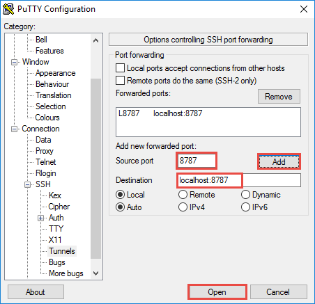
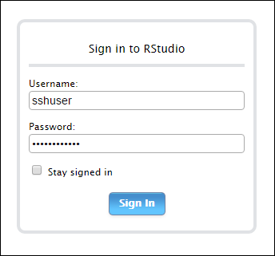
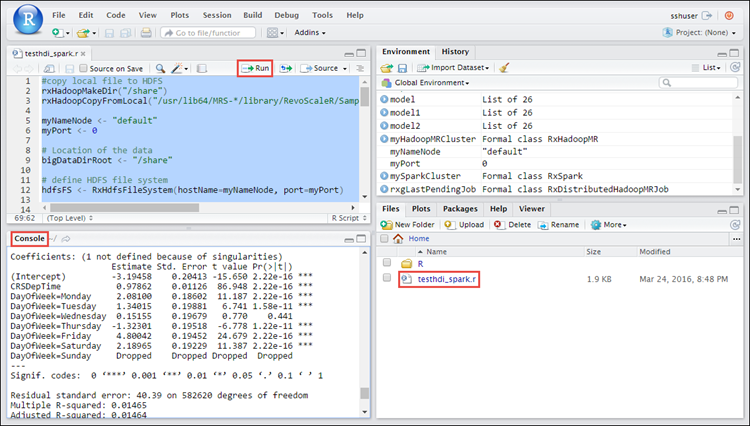

<properties
    pageTitle="安裝 RStudio HDInsight （預覽版本） 上的 R 伺服器 |Microsoft Azure"
    description="如何安裝 RStudio 與 R 伺服器上 HDInsight （預覽版本）。"
    services="hdinsight"
    documentationCenter=""
    authors="jeffstokes72"
    manager="jhubbard"
    editor="cgronlun"/>

<tags
   ms.service="hdinsight"
   ms.devlang="na"
   ms.topic="article"
   ms.tgt_pltfrm="na"
   ms.workload="big-data"
   ms.date="09/16/2016"
   ms.author="jeffstok"/>

# 安裝 RStudio 與 R 伺服器上 HDInsight （預覽版本）

有多個整合式的開發環境 (IDE) 可供 R 今天，包括 Microsoft 的最近本項[Visual Studio R 工具](https://www.visualstudio.com/en-us/features/rtvs-vs.aspx)(RTVS)，一系列的桌面和伺服器[RStudio](https://www.rstudio.com/products/rstudio-server/)，或 Walware 的蝕型[StatET](http://www.walware.de/goto/statet)工具。 最常用 linux 是提供遠端用戶端使用瀏覽器為基礎的 IDE [RStudio 伺服器](https://www.rstudio.com/products/rstudio-server/)的使用。  邊緣叢集的節點 HDInsight 進階版安裝 RStudio 伺服器提供完整的 IDE 體驗的開發與 R 指令碼的執行與 R 伺服器叢集，並可比預設使用的 R 主控台大幅提高生產力。

在本文中，您將學習如何社群 （免費） 上安裝新版 RStudio 伺服器叢集的邊緣節點使用自訂指令碼。 如果您偏好的 RStudio Server 自由授權的 Pro 版本，您必須按照[RStudio 伺服器](https://www.rstudio.com/products/rstudio/download-server/)的安裝指示。

> [AZURE.NOTE] 這份文件中的步驟需要 HDInsight 叢集上 R 伺服器，並將無法正常運作如果您使用的 HDInsight 叢集 R 安裝使用[安裝 R 指令碼巨集指令](hdinsight-hadoop-r-scripts-linux.md)的位置。

## 必要條件

* Azure HDInsight 的叢集安裝 R 伺服器。 如需相關指示，請參閱[開始使用 HDInsight 叢集 R 伺服器](hdinsight-hadoop-r-server-get-started.md)。
* SSH 用戶端。 Linux 和 Unix 散佈或 Macintosh OS X，`ssh`命令提供的作業系統。 Windows 上，我們建議您[Cygwin](http://www.redhat.com/services/custom/cygwin/) [OpenSSH 選項](https://www.youtube.com/watch?v=CwYSvvGaiWU)，或[PuTTY](http://www.chiark.greenend.org.uk/~sgtatham/putty/download.html)。  

## 使用自訂指令碼叢集上安裝 RStudio

1. 找出叢集的邊緣節點。 R 伺服器 HDInsight 叢集，下列是主節點和邊緣節點的命名慣例。

    * 不對節點-`CLUSTERNAME-ssh.azurehdinsight.net`
    * 邊緣節點-`R-Server.CLUSTERNAME-ssh.azurehdinsight.net` 

2. 使用上述命名模式叢集的邊緣節點將 SSH。 
 
    * 如果您從 Linux 用戶端連線，請參閱[Linux 型 HDInsight 叢集的連線](hdinsight-hadoop-linux-use-ssh-unix.md#connect-to-a-linux-based-hdinsight-cluster)。
    * 如果您從 Windows 用戶端連線，請參閱[使用 PuTTY Linux 型 HDInsight 叢集的連線](hdinsight-hadoop-linux-use-ssh-windows.md#connect-to-a-linux-based-hdinsight-cluster)。

3. 您連線之後，就會叢集根使用者。 在工作 SSH 階段，請使用下列命令。

        sudo su -

4. 下載安裝 RStudio 的自訂指令碼。 使用下列命令。

        wget http://mrsactionscripts.blob.core.windows.net/rstudio-server-community-v01/InstallRStudio.sh

5. 變更自訂指令碼檔案的權限，並執行指令碼。 使用下列命令。

        chmod 755 InstallRStudio.sh
        ./InstallRStudio.sh

6. 如果您用 SSH 密碼建立 HDInsight 叢集與 R 伺服器時，可以略過此步驟，並繼續到下一步]。 如果您是使用 SSH 鍵改為建立叢集，您必須設定 SSH 使用者的密碼。 連線至 RStudio 時，您會需要此密碼。 執行下列命令。 出現提示時輸入**目前 Kerberos 密碼**，只要按下**enter 鍵**。  請注意，您必須取代`USERNAME`與 HDInsight 叢集 SSH 使用者。

        passwd USERNAME
        Current Kerberos password:
        New password:
        Retype new password:
        Current Kerberos password:
        
    如果您的密碼已成功設定，您應該會看到如下的訊息。

        passwd: password updated successfully

    結束 SSH 工作階段。

7. 建立一個 SSH 通道叢集對應`localhost:8787`HDInsight 叢集用戶端電腦上。 您必須建立 SSH 通道，然後再開啟新的瀏覽器工作階段。

    * 在 Linux 用戶端或 Windows 用戶端與[Cygwin](http://www.redhat.com/services/custom/cygwin/)然後開啟終端機工作階段，請使用下列命令。

            ssh -L localhost:8787:localhost:8787 USERNAME@R-Server.CLUSTERNAME-ssh.azurehdinsight.net
            
        取代 HDInsight 叢集，SSH 使用者的**使用者名稱**和取代**CLUSTERNAME** HDInsight 叢集的名稱與您也可以使用 SSH 鍵，而不是密碼藉由新增`-i id_rsa_key`     

    * 如果使用 Windows 用戶端與 PuTTY 則

        1.  開啟 PuTTY，並輸入您的連線資訊。 如果您不熟悉 PuTTY，請參閱[使用 SSH 與 Linux 為基礎的 Hadoop HDInsight 從 Windows 上](hdinsight-hadoop-linux-use-ssh-windows.md)關於如何使用 HDInsight 資訊。
        2.  在 [左邊] 對話方塊的 [**類別**] 區段中，展開**連線**、 展開**SSH**，，然後選取**通道**。
        3.  **控制 SSH 連接埠轉送選項**表單上提供下列資訊︰

            * **來源連接埠**-您想要轉寄的用戶端的連接埠。 例如， **8787**。
            * **目的地**-必須對應到本機的用戶端電腦的目的地。 例如， **localhost:8787**。

            

        4. 按一下 [**新增**]，若要新增設定]，，然後按一下 [**開啟**] 以開啟 SSH 的連線。
        5. 出現提示時，登入伺服器。 這會建立 SSH 工作階段，並啟用通道。

8. 開啟網頁瀏覽器，然後輸入下列根據您所輸入的通道的連接埠的 URL。

        http://localhost:8787/ 

9. 會提示您輸入 SSH 使用者名稱和密碼連線至叢集。 如果您使用 SSH 鍵建立叢集時，您必須輸入您在上述步驟 5 中建立的密碼。

    

10. 若要測試是否 RStudio 安裝成功，您可以執行的測試執行 R 的指令碼根據叢集 MapReduce 與火花工作。 回到 SSH 主控台，然後輸入下列命令以下載測試指令碼 RStudio 中執行。

    * 如果您是以 R 建立 Hadoop 叢集，請使用此命令。
        
            wget http://mrsactionscripts.blob.core.windows.net/rstudio-server-community-v01/testhdi.r

    * 如果您是以 R 建立火花叢集，請使用此命令。

            wget http://mrsactionscripts.blob.core.windows.net/rstudio-server-community-v01/testhdi_spark.r

11. 在 RStudio，您會看到您已下載的測試指令碼。 按兩下要開啟選取的檔案，內容，再按一下 [**執行**的檔案。 您應該會看到 [**主控台**] 窗格中的輸出。
 
    

另一個選項是輸入`source(testhdi.r)`或`source(testhdi_spark.r)`執行指令碼。

## 另請參閱

- [計算 R 伺服器上 HDInsight 叢集內容選項](hdinsight-hadoop-r-server-compute-contexts.md)

- [Azure 存放區上的選項 R 伺服器 HDInsight 進階版](hdinsight-hadoop-r-server-storage.md)

 
