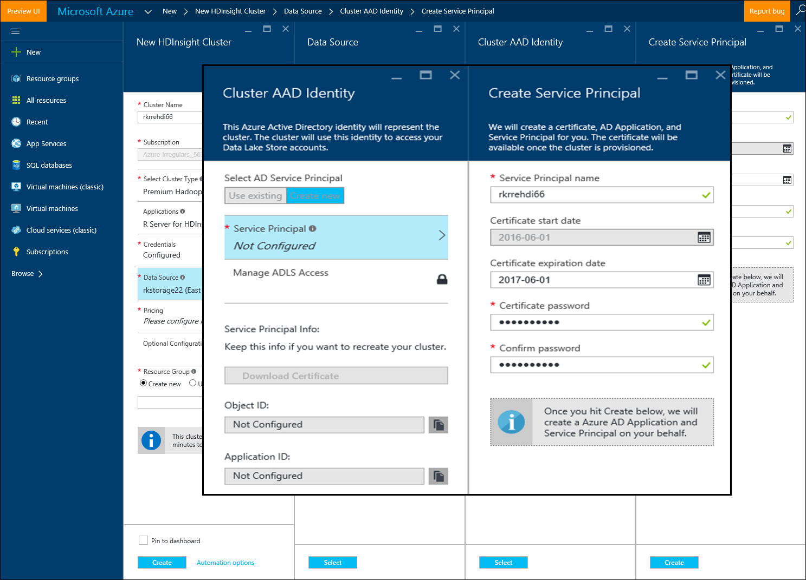

<properties
   pageTitle="Azure 存放區上的選項 R 伺服器 HDInsight （預覽版本） |Microsoft Azure"
   description="深入了解 HDInsight （預覽版本） 上與 R 伺服器的使用者可以使用不同的儲存選項"
   services="HDInsight"
   documentationCenter=""
   authors="jeffstokes72"
   manager="jhubbard"
   editor="cgronlun"
/>

<tags
   ms.service="HDInsight"
   ms.devlang="R"
   ms.topic="article"
   ms.tgt_pltfrm="na"
   ms.workload="data-services"
   ms.date="09/01/2016"
   ms.author="jeffstok"
/>

# <a name="azure-storage-options-for-r-server-on-hdinsight-preview"></a>Azure 存放區上的選項 R 伺服器 HDInsight （預覽版本）

HDInsight （預覽版本） 上的 Microsoft R 伺服器有權存取兩個 Azure Blob 和[Azure 資料湖儲存空間](https://azure.microsoft.com/services/data-lake-store/)，做為保存資料，程式碼，結果分析、 物件和等。

當您建立 Hadoop 叢集 HDInsight 中時，您可以指定 Azure 儲存體帳戶。 從該帳戶的特定 Blob 儲存體容器會保留檔案系統叢集您建立 （例如，Hadoop 分散式檔案系統）。 為了效能，HDInsight 叢集會建立在相同的資料中心，為您所指定的主要儲存帳戶。 如需詳細資訊，請參閱[使用 Azure Blob 儲存體，與 HDInsight](hdinsight-hadoop-use-blob-storage.md "與 HDInsight 的使用 Azure Blob 儲存體")。   


## <a name="use-multiple-azure-blob-storage-accounts"></a>使用多個 Azure Blob 儲存體帳戶

如有需要，您可以與您 HDI 叢集存取多個 Azure 儲存體帳戶或容器。 若要這麼做，您需要在 ui 上指定的額外儲存空間帳戶，當您建立叢集，然後遵循下列步驟使用它們。  

1.  建立 HDInsight 叢集**storage1**和稱為**container1**的預設容器儲存體帳戶名稱。
2. 指定稱為**storage2**的額外儲存空間帳戶。  
3. 將 mycsv.csv 檔複製到 /share 目錄，並執行分析該檔案。  

    ````
    hadoop fs –mkdir /share
    hadoop fs –copyFromLocal myscsv.scv /share  
    ````

3.  R 程式碼中，設定名稱節點預設值**，**並設定您的目錄及處理的檔案。  

    ````
    myNameNode <- "default"
    myPort <- 0
    ````

  資料的位置︰  

    bigDataDirRoot <-「 / 共用 」  

  定義火花計算內容︰

    mySparkCluster <-RxSpark(consoleOutput=TRUE)

  設定計算內容︰

    rxSetComputeContext(mySparkCluster)

  定義 Hadoop 分散式檔案系統 (HDFS) 檔案系統︰

    hdfsFS <-RxHdfsFileSystem (主機名稱 = myNameNode，連接埠 = myPort)

  指定輸入的檔案以分析 HDFS:

    inputFile <-file.path(bigDataDirRoot,"mycsv.csv")

儲存帳戶的所有目錄和檔案參考指向wasbs://container1@storage1.blob.core.windows.net。 這是**預設儲存帳戶**與 HDInsight 叢集相關聯。

現在，假設您想要處理檔案，稱為 mySpecial.csv 位於 /private **container2** **storage2**中的目錄。

在您的 R 程式碼，指向 [ **storage2**儲存體帳戶名稱節點參照]。

    myNameNode <- "wasbs://container2@storage2.blob.core.windows.net"
    myPort <- 0

  資料的位置︰

    bigDataDirRoot <- "/private"

  定義火花計算內容︰

    mySparkCluster <- RxSpark(consoleOutput=TRUE, nameNode=myNameNode, port=myPort)

  設定計算內容︰

    rxSetComputeContext(mySparkCluster)

  定義 HDFS 檔案系統︰

    hdfsFS <- RxHdfsFileSystem(hostName=myNameNode, port=myPort)

  指定輸入的檔案以分析 HDFS:

    inputFile <-file.path(bigDataDirRoot,"mySpecial.csv")

目錄及檔案參照的所有現在儲存的帳戶，指向wasbs://container2@storage2.blob.core.windows.net。 這是您指定**名稱節點**。

請注意，您必須設定 /user/RevoShare/<SSH username>目錄**storage2** ，如下所示︰

    hadoop fs -mkdir wasbs://container2@storage2.blob.core.windows.net/user
    hadoop fs -mkdir wasbs://container2@storage2.blob.core.windows.net/user/RevoShare
    hadoop fs -mkdir wasbs://container2@storage2.blob.core.windows.net/user/RevoShare/<RDP username>

## <a name="use-an-azure-data-lake-store"></a>使用 Azure 資料湖存放區

若要使用資料湖儲存您的 HDInsight 帳戶，您需要每個您想要使用的 Azure 資料湖儲存區可讓您叢集存取。 儲存在使用 R 指令碼很像您使用的次要儲存體帳戶 （如上述程序中所述）。

## <a name="add-cluster-access-to-your-azure-data-lake-stores"></a>新增叢集存取您的 Azure 資料湖存放區

您可以使用 HDInsight 叢集與相關聯的 Azure Active Directory (Azure AD) 服務原則，以存取資料湖存放區。

### <a name="to-add-a-service-principal"></a>若要新增的服務原則
1. 當您建立 HDInsight 叢集時，請從 [**資料來源**] 索引標籤中選取**叢集 AAD 身分識別**。
2. 在**叢集 AAD 身分識別**] 對話方塊中，**選取 AD 服務主要**，底下選取**新的建立**。

提供服務主要名稱，並為其建立密碼之後，隨即會開啟新的索引標籤您可以建立服務主要關聯與您的資料湖存放區。

請注意，您也可以新增存取資料湖存放區稍後開啟資料湖儲存 Azure 入口網站中，前往 [**資料總管** > **存取**。  下列是一個對話方塊，顯示如何建立服務主要和關聯的 「 rkadl11 」 資料湖存放區的範例。




## <a name="use-the-data-lake-store-with-r-server"></a>使用資料湖存放區與 R 伺服器
後存取資料湖存放區，您可以使用的存放區中 R 伺服器上 HDInsight 即次要 Azure 儲存體帳戶的方式。 唯一的差異，就是前置詞**wasb: / /**變更為**adl: / /** ，如下所示︰

````
# Point to the ADL store (e.g. ADLtest)
myNameNode <- "adl://rkadl1.azuredatalakestore.net"
myPort <- 0

# Location of the data (assumes a /share directory on the ADL account)
bigDataDirRoot <- "/share"  

# Define Spark compute context
mySparkCluster <- RxSpark(consoleOutput=TRUE, nameNode=myNameNode, port=myPort)

# Set compute context
rxSetComputeContext(mySparkCluster)

# Define HDFS file system
hdfsFS <- RxHdfsFileSystem(hostName=myNameNode, port=myPort)

# Specify the input file in HDFS to analyze
inputFile <-file.path(bigDataDirRoot,"AirlineDemoSmall.csv")

# Create factors for days of the week
colInfo <- list(DayOfWeek = list(type = "factor",
               levels = c("Monday", "Tuesday", "Wednesday", "Thursday",
                          "Friday", "Saturday", "Sunday")))

# Define the data source
airDS <- RxTextData(file = inputFile, missingValueString = "M",
                    colInfo  = colInfo, fileSystem = hdfsFS)

# Run a linear regression
model <- rxLinMod(ArrDelay~CRSDepTime+DayOfWeek, data = airDS)
````

以下是可用來設定資料湖儲存帳戶與 RevoShare 目錄並新增上述範例中的範例.csv 檔案的命令︰

````
hadoop fs -mkdir adl://rkadl1.azuredatalakestore.net/user
hadoop fs -mkdir adl://rkadl1.azuredatalakestore.net/user/RevoShare
hadoop fs -mkdir adl://rkadl1.azuredatalakestore.net/user/RevoShare/<user>

hadoop fs -mkdir adl://rkadl1.azuredatalakestore.net/share

hadoop fs -copyFromLocal /usr/lib64/R Server-7.4.1/library/RevoScaleR/SampleData/AirlineDemoSmall.csv adl://rkadl1.azuredatalakestore.net/share

hadoop fs –ls adl://rkadl1.azuredatalakestore.net/share
````

## <a name="use-azure-files-on-the-edge-node"></a>Azure 上使用檔案的邊緣節點

此外，還有稱為[Azure 檔案](../storage/storage-how-to-use-files-linux.md "Azure 檔案")的邊緣節點上使用方便的資料儲存選項。 讓您裝載 Linux 檔案系統的 Azure 儲存體檔案共用。 這會十分方便儲存資料檔、 R 指令碼和結果物件時合理的上邊緣節點，而不是 HDFS 使用原生檔案系統可能會稍後需要的項目。

Azure 檔案的主要優點是可以裝載檔案共用，並使用任何已受支援的作業系統，例如 Windows 或 Linux 的系統。 例如，其可由另一個含有您或其他小組 HDInsight 叢集、 Azure VM，或甚至內部部署系統。


## <a name="next-steps"></a>後續步驟

瞭解如何使用 R 主控台從 SSH 工作階段，以及如何建立新的 HDInsight 叢集包含 R 伺服器的基本概念，請使用下列連結探索 HDInsight R 伺服器所使用的其他方法。

- [R 伺服器上 HDInsight 的概觀](hdinsight-hadoop-r-server-overview.md)
- [Hadoop 上 R server 快速入門](hdinsight-hadoop-r-server-get-started.md)
- [新增 RStudio 伺服器 HDInsight premium](hdinsight-hadoop-r-server-install-r-studio.md)
- [計算 R 伺服器上 HDInsight 內容選項](hdinsight-hadoop-r-server-compute-contexts.md)
