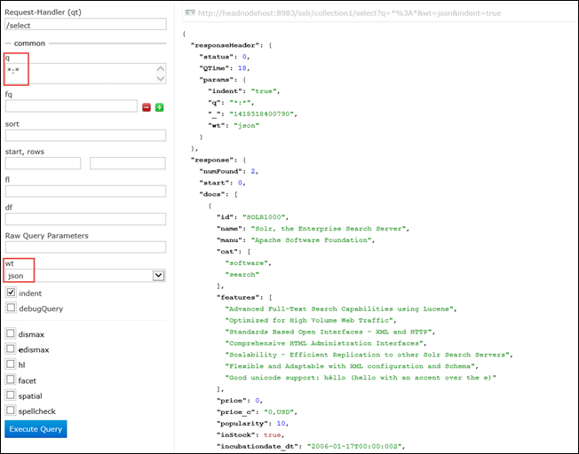

<properties
    pageTitle="使用指令碼指令 Linux 型 HDInsight 上安裝 Solr |Microsoft Azure"
    description="瞭解如何安裝 Solr 上 Linux 型 HDInsight Hadoop 叢集使用指令碼的動作。"
    services="hdinsight"
    documentationCenter=""
    authors="Blackmist"
    manager="jhubbard"
    editor="cgronlun"
    tags="azure-portal"/>

<tags
    ms.service="hdinsight"
    ms.workload="big-data"
    ms.tgt_pltfrm="na"
    ms.devlang="na"
    ms.topic="article"
    ms.date="10/03/2016"
    ms.author="larryfr"/>

# 安裝並使用 Solr HDInsight Hadoop 叢集上

本主題中，您將學習如何在 Azure HDInsight 上安裝 Solr，使用指令碼] 動作。 Solr 是強大的搜尋的平台，並提供 [Hadoop 所管理的資料中的 [企業層級的搜尋功能。 一旦您已安裝 Solr HDInsight 叢集上，您也會學習如何使用 Solr 搜尋資料。

> [AZURE.NOTE] 這份文件中的步驟需要 Linux 型 HDInsight 叢集。 在使用 Windows 型叢集 Solr 資訊，請參閱[安裝並使用 Solr 上 HDinsight Hadoop 叢集 (Windows)](hdinsight-hadoop-solr-install.md)

使用本主題中的範例指令碼會建立 Solr 叢集特定設定。 如果您想要使用不同的集合、 擊碎、 結構、 複本等設定 Solr 叢集，您必須修改的指令碼及 Solr 二進位檔案。

## 什麼是 Solr？

[Apache Solr](http://lucene.apache.org/solr/features.html)是企業搜尋平台可從資料中的強大全文檢索搜尋。 Hadoop 啟用儲存和管理大量資料，請 Apache Solr 提供的搜尋功能來快速擷取資料。 本主題說明如何自訂安裝 Solr HDInsight 叢集。

> [AZURE.WARNING] 完全支援元件提供 HDInsight 叢集，以及 Microsoft 支援服務會協助找出並解決這些元件的相關問題。
>
> 自訂元素，例如 Solr，會收到合理的支援，以協助您進一步疑難排解問題。 這可能會導致解決問題，或詢問要加入找到該技術深專業知識的位置開啟來源技術可用的頻道。 例如，有許多都可以使用，這樣的社群網站︰[適用於 HDInsight MSDN 論壇](https://social.msdn.microsoft.com/Forums/azure/en-US/home?forum=hdinsight)、 [http://stackoverflow.com](http://stackoverflow.com)。 也 Apache 專案有[http://apache.org](http://apache.org)，在專案網站，例如︰ [Hadoop](http://hadoop.apache.org/)。

## 指令碼功能

這個指令碼 HDInsight 叢集進行下列變更︰

* 將安裝 Solr`/usr/hdp/current/solr`
* 建立新的使用者， __solrusr__，這用來執行 Solr 服務
* 設定__solruser__的擁有者`/usr/hdp/current/solr`
* 新增[同時](http://upstart.ubuntu.com/)設定將會開始 Solr，如果叢集節點重新啟動。 Solr 也會自動安裝後啟動叢集節點

## 安裝 Solr 使用指令碼的動作

範例指令碼 HDInsight 叢集上安裝 Solr 位於下列位置。

    https://hdiconfigactions.blob.core.windows.net/linuxsolrconfigactionv01/solr-installer-v01.sh

本節提供如何使用 Azure 入口網站中建立新的叢集時使用範例指令碼的指示。 

> [AZURE.NOTE] Azure PowerShell 的 Azure CLI、 HDInsight.NET sdk，您可以 Azure 資源管理員範本也可套用指令碼動作。 您也可以執行叢集套用指令碼動作。 如需詳細資訊，請參閱[自訂 HDInsight 叢集指令碼動作](hdinsight-hadoop-customize-cluster-linux.md)。

1. 開始佈建叢集，依照步驟中[佈建 Linux 型 HDInsight 叢集](hdinsight-hadoop-create-linux-clusters-portal.md)，但未完成佈建中。

2. 在**選擇性組態**刀中，選取 [**指令碼動作**]，然後提供以下資訊︰

    * __名稱__︰ 輸入指令碼動作易記的名稱。
    * __指令碼 URI__: https://hdiconfigactions.blob.core.windows.net/linuxsolrconfigactionv01/solr-installer-v01.sh
    * __不對__︰ 核取此選項
    * __工作__︰ 核取此選項
    * __動物園管理員__︰ 核取此選項即可在動物園管理員節點上安裝
    * __參數__︰ 將此欄位保留空白

3. 在**指令碼動作**底部，使用 [**選取**] 按鈕儲存設定。 最後，使用**選用設定**刀底部的 [**選取**] 按鈕，儲存的選用的設定資訊。

4. 繼續佈建叢集，[佈建 Linux 型 HDInsight 叢集](hdinsight-hadoop-create-linux-clusters-portal.md)所述。

## 如何在 HDInsight 使用 Solr？

### 編製索引的資料

您必須開始編製索引作業的一些資料檔案的 Solr。 Solr 然後可用來執行搜尋查詢的索引的資料。 使用下列步驟 Solr，以新增一些範例資料，然後進行查詢︰

1. 連線到使用 SSH HDInsight 叢集︰

        ssh USERNAME@CLUSTERNAME-ssh.azurehdinsight.net

    如需有關如何使用 HDInsight SSH 的詳細資訊，請參閱下列各項︰

    * [使用上 HDInsight Linux、 Unix，或 OS X 的 Linux 型 Hadoop SSH](hdinsight-hadoop-linux-use-ssh-unix.md)

    * [使用上從 Windows HDInsight Linux 為基礎的 Hadoop SSH](hdinsight-hadoop-linux-use-ssh-windows.md)

    > [AZURE.IMPORTANT] 步驟稍後此文件讓使用 SSL 通道的連線至 Solr web 使用者介面。 才能使用這些步驟，您必須建立 SSL 通道，並設定您的瀏覽器使用。
    >
    > 如需詳細資訊，請參閱[使用 SSH 通道存取 Ambari 網頁 UI、 ResourceManager、 JobHistory、 NameNode、 Oozie 及使用者介面的其他網頁](hdinsight-linux-ambari-ssh-tunnel.md)

2. 您可以使用下列命令，讓 Solr 索引範例資料︰

        cd /usr/hdp/current/solr/example/exampledocs
        java -jar post.jar solr.xml monitor.xml

    您會看到下列輸出主控台上︰

        POSTing file solr.xml
        POSTing file monitor.xml
        2 files indexed.
        COMMITting Solr index changes to http://localhost:8983/solr/update..
        Time spent: 0:00:01.624

    Post.jar 公用程式的兩個樣本文件、 **solr.xml**與**monitor.xml**索引 Solr。 這些會儲存在__collection1__ Solr 內。

3. 您可以使用下列查詢公開 Solr REST API:

        curl "http://localhost:8983/solr/collection1/select?q=*%3A*&wt=json&indent=true"

    此問題對__collection1__比對任何文件的查詢__\*:\* __ (編碼為\*%3a\*在 [查詢字串) 和回應應傳回 json 的。 回應應如下︰

            "response": {
                "numFound": 2,
                "start": 0,
                "maxScore": 1,
                "docs": [
                  {
                    "id": "SOLR1000",
                    "name": "Solr, the Enterprise Search Server",
                    "manu": "Apache Software Foundation",
                    "cat": [
                      "software",
                      "search"
                    ],
                    "features": [
                      "Advanced Full-Text Search Capabilities using Lucene",
                      "Optimized for High Volume Web Traffic",
                      "Standards Based Open Interfaces - XML and HTTP",
                      "Comprehensive HTML Administration Interfaces",
                      "Scalability - Efficient Replication to other Solr Search Servers",
                      "Flexible and Adaptable with XML configuration and Schema",
                      "Good unicode support: héllo (hello with an accent over the e)"
                    ],
                    "price": 0,
                    "price_c": "0,USD",
                    "popularity": 10,
                    "inStock": true,
                    "incubationdate_dt": "2006-01-17T00:00:00Z",
                    "_version_": 1486960636996878300
                  },
                  {
                    "id": "3007WFP",
                    "name": "Dell Widescreen UltraSharp 3007WFP",
                    "manu": "Dell, Inc.",
                    "manu_id_s": "dell",
                    "cat": [
                      "electronics and computer1"
                    ],
                    "features": [
                      "30\" TFT active matrix LCD, 2560 x 1600, .25mm dot pitch, 700:1 contrast"
                    ],
                    "includes": "USB cable",
                    "weight": 401.6,
                    "price": 2199,
                    "price_c": "2199,USD",
                    "popularity": 6,
                    "inStock": true,
                    "store": "43.17614,-90.57341",
                    "_version_": 1486960637584081000
                  }
                ]
              }

### 使用 [Solr 儀表板

[Solr 儀表板是使用者介面，可讓您透過網頁瀏覽器使用 Solr 的 web。 [Solr 儀表板不會直接從 HDInsight 叢集，在網際網路上公開，但必須使用 SSH 通道存取。 如需有關使用 SSH 通道的詳細資訊，請參閱[使用 SSH 通道存取 Ambari 網頁 UI、 ResourceManager、 JobHistory、 NameNode、 Oozie 及使用者介面的其他網頁](hdinsight-linux-ambari-ssh-tunnel.md)

一旦您已建立一個 SSH 通道，請使用 [Solr 儀表板中使用下列步驟︰

1. 決定主要 headnode 的主機名稱︰

    1. 使用 SSH 連線至連接埠 22 叢集。 例如，`ssh USERNAME@CLUSTERNAME-ssh.azurehdinsight.net`位置__的使用者名稱__您 SSH 的使用者名稱，而__CLUSTERNAME__會叢集的名稱。

        如需有關使用 SSH 的詳細資訊，請參閱下列文件︰

        * [使用從 Linux、 Unix 或 Mac OS X 的用戶端 Linux 為基礎的 HDInsight SSH](hdinsight-hadoop-linux-use-ssh-unix.md)

        * [從 Windows 用戶端 Linux 為基礎的 HDInsight 搭配使用 SSH](hdinsight-hadoop-linux-use-ssh-windows.md)
    
    3. 使用下列命令以取得完整的主機名稱︰

            hostname -f

        這會傳回類似下列名稱︰

            hn0-myhdi-nfebtpfdv1nubcidphpap2eq2b.ex.internal.cloudapp.net
    
        這是主機名稱應使用下列步驟。
    
1. 使用瀏覽器連線到__http://HOSTNAME:8983/solr / #/__、__主機名稱__是您在先前的步驟取決於的名稱的位置。 

    透過前端節點 HDInsight 叢集 SSH 通道傳閱要求。 您應該會看到類似以下的頁面︰

    

2. 從左側的窗格中，使用**核心選取器**下拉式清單選取**collection1**。 多個項目他們應該出現__collection1__下方。

3. 從下方__collection1__的項目，請選取 [__查詢__]。 您可以使用下列的值，填入 [搜尋] 頁面︰

    * 在 [**問**文字] 方塊中輸入**\*:**\*。 這會傳回所有已編製索引的文件中 Solr。 如果您想要搜尋特定的文件中的字串，您可以輸入該的字串。

    * 在 [ **wt**文字] 方塊中，選取的輸出格式。 預設值為**json**。

    最後，選取搜尋 pate 底部的 [**執行查詢**] 按鈕。

    

    輸出傳回我們用於編製索引作業 Solr 兩個文件。 輸出類似下列各項︰

            "response": {
                "numFound": 2,
                "start": 0,
                "maxScore": 1,
                "docs": [
                  {
                    "id": "SOLR1000",
                    "name": "Solr, the Enterprise Search Server",
                    "manu": "Apache Software Foundation",
                    "cat": [
                      "software",
                      "search"
                    ],
                    "features": [
                      "Advanced Full-Text Search Capabilities using Lucene",
                      "Optimized for High Volume Web Traffic",
                      "Standards Based Open Interfaces - XML and HTTP",
                      "Comprehensive HTML Administration Interfaces",
                      "Scalability - Efficient Replication to other Solr Search Servers",
                      "Flexible and Adaptable with XML configuration and Schema",
                      "Good unicode support: héllo (hello with an accent over the e)"
                    ],
                    "price": 0,
                    "price_c": "0,USD",
                    "popularity": 10,
                    "inStock": true,
                    "incubationdate_dt": "2006-01-17T00:00:00Z",
                    "_version_": 1486960636996878300
                  },
                  {
                    "id": "3007WFP",
                    "name": "Dell Widescreen UltraSharp 3007WFP",
                    "manu": "Dell, Inc.",
                    "manu_id_s": "dell",
                    "cat": [
                      "electronics and computer1"
                    ],
                    "features": [
                      "30\" TFT active matrix LCD, 2560 x 1600, .25mm dot pitch, 700:1 contrast"
                    ],
                    "includes": "USB cable",
                    "weight": 401.6,
                    "price": 2199,
                    "price_c": "2199,USD",
                    "popularity": 6,
                    "inStock": true,
                    "store": "43.17614,-90.57341",
                    "_version_": 1486960637584081000
                  }
                ]
              }

### 啟動和停止 Solr

如果您需要手動停止或啟動太陽能，請使用下列命令︰

    sudo stop solr

    sudo start solr

## 備份索引的資料

好的做法是應該備份到 Azure Blob 儲存體 Solr 叢集節點索引的資料。 執行下列步驟來執行這項操作︰

1. 連線到叢集使用 SSH，然後使用下列命令以取得主節點的主機名稱︰

        hostname -f
        
2. 您可以使用下列建立索引的資料的快照。 傳回的前一個命令名稱取代__主機名稱__︰

        curl http://HOSTNAME:8983/solr/replication?command=backup

    您應該會看到的回應，像這樣︰

        <?xml version="1.0" encoding="UTF-8"?>
        <response>
          <lst name="responseHeader">
            <int name="status">0</int>
            <int name="QTime">9</int>
          </lst>
          <str name="status">OK</str>
        </response>

2. 接下來，請變更目錄__/usr/hdp/current/solr/example/solr__。 會有每個集合以下的子目錄。 每個集合目錄包含__資料__目錄，即為該集合快照在哪裡找到。

    例如，如果您是使用步驟之前編製索引的範例文件， __/usr/hdp/current/solr/example/solr/collection1/data__目錄現在應該會包含名為__快照。 # # #__ # 的所在位置的日期和時間的快照。

3. 建立壓縮的保存使用命令，類似以下的快照集資料夾︰

        tar -zcf snapshot.20150806185338855.tgz snapshot.20150806185338855

    這會建立新的封存名為__snapshot.20150806185338855.tgz__，其中包含__snapshot.20150806185338855__目錄的內容。

3. 然後，您可以儲存封存叢集的主要存放裝置使用下列命令︰

    hadoop fs-copyFromLocal snapshot.20150806185338855.tgz/範例/資料

    > [AZURE.NOTE] 若要建立專屬的目錄，以儲存 Solr 快照集。 例如， `hadoop fs -mkdir /solrbackup`。

如需有關使用 Solr 備份與還原的詳細資訊，請參閱[撥出及還原備份的 SolrCores](https://cwiki.apache.org/confluence/display/solr/Making+and+Restoring+Backups+of+SolrCores)。

## 另請參閱

- [色調 HDInsight 上的安裝並使用叢集](hdinsight-hadoop-hue-linux.md)。 色調是 web 輕鬆建立、 執行及儲存的豬和登錄區工作，以及您 HDInsight 瀏覽預設儲存空間叢集的使用者介面。

- [HDInsight 叢集上安裝 R][hdinsight-install-r]。 使用叢集自訂安裝 R HDInsight Hadoop 叢集上。 R 是開啟來源語言] 和 [統計計算環境。 它會提供數百個內建的統計函數和結合層面的功能和物件導向程式設計自己程式設計語言。 同時也會提供更多圖形功能。

- [安裝的 Giraph HDInsight 叢集上](hdinsight-hadoop-giraph-install-linux.md)。 使用叢集自訂安裝 Giraph HDInsight Hadoop 叢集上。 Giraph 可讓您執行使用 Hadoop，處理的圖表，可以使用 Azure HDInsight。

- [HDInsight 叢集上安裝的色調](hdinsight-hadoop-hue-linux.md)。 使用叢集自訂安裝選項可設定色調 HDInsight Hadoop 叢集上。 色調是一組用來與 Hadoop 叢集互動的 Web 應用程式。

[hdinsight-install-r]: hdinsight-hadoop-r-scripts-linux.md
[hdinsight-cluster-customize]: hdinsight-hadoop-customize-cluster-linux.md
