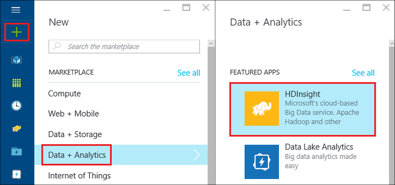
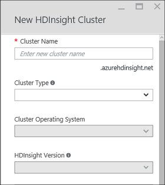

<properties
   pageTitle="Hadoop 教學課程︰ 開始使用 Windows 上 Hadoop |Microsoft Azure"
   description="開始使用 Hadoop HDInsight 中。 瞭解如何建立 Hadoop 叢集 Windows 上，執行登錄區查詢資料，並分析輸出在 Excel 中。"
   keywords="hadoop 教學課程中，在 windows 上，hadoop 叢集 hadoop 瞭解 hadoop，登錄區查詢"
   services="hdinsight"
   documentationCenter=""
   authors="nitinme"
   manager="jhubbard"
   editor="cgronlun"
   tags="azure-portal"/>

<tags
   ms.service="hdinsight"
   ms.devlang="na"
   ms.topic="article"
   ms.tgt_pltfrm="na"
   ms.workload="big-data"
   ms.date="03/07/2016"
   ms.author="nitinme"/>

# Hadoop 教學課程︰ 開始使用 Windows 上的 HDInsight Hadoop

> [AZURE.SELECTOR]
- [Linux 型](../hdinsight-hadoop-linux-tutorial-get-started.md)
- [Windows 型](../hdinsight-hadoop-tutorial-get-started-windows.md)

若要可協助您瞭解 Hadoop Windows 上的，並開始使用 HDInsight，此教學課程教您如何 Hadoop 叢集非結構化資料上執行登錄區查詢及分析 Microsoft Excel 中的結果。

>[AZURE.NOTE] 這份文件中的資訊是 Windows 型 HDInsight 叢集特定項目。 Linux 型叢集上的資訊，請參閱[Hadoop 教學課程︰ 開始使用 HDInsight Linux 型 Hadoop](hdinsight-hadoop-linux-tutorial-get-started.md)。

假設您有大型的非結構化的資料集，而且您想要執行的登錄區查詢以擷取一些有意義的資訊。 這些正是您要在本教學課程中執行。 以下是如何達到此目標︰

   ![「 Hadoop 教學課程︰ 建立帳戶。建立 Hadoop 叢集;送出登錄區查詢。分析 Excel 中的資料。][image-hdi-getstarted-flow]

觀賞示範影片，瞭解 Hadoop HDInsight 在本教學課程︰

![視訊的第一個 Hadoop 教學課程︰ 送出登錄區查詢 Hadoop 叢集，及分析在 Excel 中的結果。][img-hdi-getstarted-video]

**[線上觀看 Hadoop 教學課程中的 YouTube 上的 HDInsight](https://www.youtube.com/watch?v=Y4aNjnoeaHA&list=PLDrz-Fkcb9WWdY-Yp6D4fTC1ll_3lU-QS)**

Azure HDInsight 的一般可用性與搭配使用，Microsoft 也會提供稱為*Microsoft HDInsight 開發人員 Preview*Azure HDInsight 模擬器。 在模擬器目標開發人員案例和僅支援單一節點部署。 使用 HDInsight 模擬器的相關資訊，請參閱[開始使用 HDInsight 模擬器][hdinsight-emulator]。

[AZURE.INCLUDE [delete-cluster-warning](../../includes/hdinsight-delete-cluster-warning.md)]

## 必要條件

您的 Windows 上 Hadoop 開始本教學課程之前，您必須具備下列項目︰

- **Azure 訂閱**。 請參閱[取得 Azure 免費試用版](https://azure.microsoft.com/documentation/videos/get-azure-free-trial-for-testing-hadoop-in-hdinsight/)。
- 使用 Office 2013 專業增強版、 Office 365 專業增強版，Excel 2013 Standalone 或 Office 2010 專業增強版**A 工作站電腦**。

### 存取控制需求

[AZURE.INCLUDE [access-control](../../includes/hdinsight-access-control-requirements.md)]

##建立 Hadoop 叢集

當您建立叢集時，您會建立包含 Hadoop 和相關的應用程式的 Azure 計算資源。 在此區段中，您可以建立 HDInsight 版本 3.2 捨位叢集。 您也可以建立其他版本的 Hadoop 叢集。 如需相關指示，請參閱[使用自訂選項建立 HDInsight 叢集][hdinsight-provision]。 HDInsight 版本和其 Sla 的相關資訊，請參閱[HDInsight 元件版本設定](hdinsight-component-versioning.md)。

**若要建立 Hadoop 叢集**

1. [Azure 入口網站](https://portal.azure.com/)登入。
2. 按一下 [**新增**]，按一下 [**資料分析**，，再按一下 [ **HDInsight**。 入口網站隨即會開啟**新的 HDInsight 叢集**刀。

    

3. 輸入或選取下列選項︰

    
    
  	|欄位名稱| 值|
  	|----------|------|
  	|叢集名稱| 唯一的名稱來識別叢集|
  	|叢集類型| 本教學課程，請選取 [ **Hadoop** ]。 |
  	|叢集作業系統| 本教學課程，請選取 [ **Windows Server 2012 R2 資料中心**]。|
  	|HDInsight 版本| 選取此教學課程中的最新版本。|
  	|訂閱| 選取 [將會用於叢集 Azure 訂閱]。|
  	|資源群組 | 選取現有的 Azure 資源群組或建立新的資源群組。 基本的 HDInsight 叢集包含叢集和其預設儲存的帳戶。  您可以群組輕鬆地管理資源群組將兩個。|
  	|認證| 輸入叢集登入的使用者名稱和密碼。 Windows 基礎叢集可以有 2 的使用者帳戶。  使用叢集使用者 （或 HTTP 使用者），來管理叢集並提交工作。  您可以選擇建立遠端桌面 (RDP) 到遠端的使用者帳戶連線到叢集。 如果您選擇啟用遠端桌面時，您將建立 RDP 使用者帳戶。|
  	|資料來源| 按一下 [建立新若要建立新的預設 Azure 儲存體帳戶。 使用預設名稱為容器的叢集名稱。 每個 HDinsight 叢集 Azure 儲存體 accont 具有預設 Blob 容器。  預設 Azure 儲存體帳戶的位置會決定 HDInsight 叢集的位置。|
  	|價格層級節點| 使用預設工作者節點並不對附註在本教學課程價格層 1 或 2 工作者節點。|
  	|選用的設定| 略過此組件。|

9. 在**新 HDInsight 叢集**防禦，以確定**固定至 Startboard**已選取，然後再按一下 [**建立**]。 這會建立叢集，並為其新增 Startboard Azure 入口網站的方塊。 圖示會指出叢集建立，並會變更為顯示 [HDInsight] 圖示，建立完成。

  	| 建立期間 | 建立完成 |
  	| ------------------ | --------------------- |
  	|  |  |

    > [AZURE.NOTE] 它會需要一些時間叢集會建立通常約 15 分鐘。 若要查看的建立程序中使用 Startboard，或在頁面左側的**通知**項目] 方塊。

10. 建立完成後，按一下 [從啟動叢集刀 Startboard 叢集的方塊。

## 從入口網站執行登錄區查詢
現在您已經建立 HDInsight 叢集下, 一步就是執行查詢範例登錄區資料表登錄區工作。 我們會使用*hivesampletable*，它包含 HDInsight 叢集。 此資料表包含行動裝置製造商、 平台，與模型的相關資料。 此資料表上的登錄區查詢擷取資料以特定的製造商的行動裝置。

> [AZURE.NOTE] Azure SDK.NET 2.5 或更新版本隨附的 Visual Studio HDInsight 工具。 在 Visual Studio 中使用的工具，您可以連線到 HDInsight 叢集、 建立登錄區資料表，並執行登錄區查詢。 如需詳細資訊，請參閱[開始使用 Visual Studio HDInsight Hadoop 工具][1]。

**若要從叢集儀表板執行登錄區工作**

1. [Azure 入口網站](https://portal.azure.com/)登入。
2. 按一下 [**全部瀏覽]** ，然後按一下 [ **HDInsight 叢集**，查看叢集，包括的叢集您剛剛建立的前一節中的清單。
3. 按一下您要用來執行登錄區工作，叢集的名稱，然後按一下 [**儀表板**頂端的刀。
4. 在不同的瀏覽器索引標籤中，開啟網頁。 輸入 Hadoop 使用者帳戶和密碼。 預設的使用者名稱是**管理員**;密碼不您輸入時建立叢集。
5. 從儀表板，按一下 [**登錄區編輯器**] 索引標籤。 下列 web 頁面隨即開啟。

    ![登錄區 HDInsight 叢集儀表板中的 [編輯器] 索引標籤。][img-hdi-dashboard]

    有多個頁面頂端的索引標籤。 [預設] 索引標籤是**登錄區編輯器**，及 [其他] 索引標籤**工作歷程記錄**，以及**檔案瀏覽器**。 藉由使用儀表板，可以送出登錄區查詢，檢查 Hadoop 工作記錄，並瀏覽中儲存的檔案。

    > [AZURE.NOTE] 請注意，網頁的 URL 是*&lt;ClusterName&gt;。 azurehdinsight.net*。 因此，而不是從入口網站，開啟儀表板，您可以開啟儀表板從網頁瀏覽器使用的 URL。

6. 在**登錄區編輯器**] 索引標籤的 [**查詢名稱**，輸入**HTC20**。  查詢名稱為工作標題。 在 [查詢] 窗格中，請輸入登錄區查詢，如下圖所示︰

    ![登錄區登錄區編輯器] 的 [查詢] 窗格中輸入的查詢。][img-hdi-dashboard-query-select]

4. 按一下 [**送出**]。 需要幾分鐘的時間返回結果。 畫面會重新整理每隔 30 秒。 您也可以按一下 [重新整理畫面的 [**重新整理**。

    ![登錄區查詢的結果會列出底部的叢集儀表板。][img-hdi-dashboard-query-select-result]

5. 狀態] 顯示已完成的工作之後，請按一下 [在畫面中，請參閱輸出的查詢名稱。 記下**工作開始時間 (UTC)**。 您會用得到。

    ![工作開始時間列在 HDInsight 叢集儀表板的 [工作歷程記錄] 索引標籤。][img-hdi-dashboard-query-select-result-output]

    **工作輸出**] 和 [**工作記錄**，也會顯示的頁面。 您也可以選擇下載輸出檔案 (\_stdout) 和記錄檔\(_stderr)。

**若要瀏覽至輸出檔案**

1. 在叢集儀表板中，按一下 [**檔案瀏覽器**]。
2. 按一下您儲存體帳戶名稱，按一下您的容器名稱 （這是您叢集名稱相同），然後按一下 [**使用者**。
3. 按一下 [**管理員**]，然後按一下 [GUID 含有上次修改時間 （稍微之後作業開始的時間先前所述）。 複製此 GUID。 您必須將其下一節。

    ![登錄區查詢輸出 GUID 列在 [在瀏覽器檔案] 索引標籤中的檔案。][img-hdi-dashboard-query-browse-output]

##用 Excel 連線到 Microsoft 商務智慧工具

若要從 HDInsight 匯入工作輸出到 Excel，其中 Microsoft 商務智慧工具可用於進一步分析結果，您可以使用 [Power Query 增益集的 Microsoft Excel。

您必須在 Excel 2013 或 2010 安裝完成此教學課程的一部分。

**若要下載 Microsoft Power Query for Excel**

- Microsoft excel 從[Microsoft 下載中心](http://www.microsoft.com/download/details.aspx?id=39379)下載 Microsoft Power Query，並將其安裝。

**若要匯入 HDInsight 的資料**

1. 開啟 Excel，並建立新的活頁簿。
3. 按一下 [ **Power Query** ] 功能表，按一下 [**從其他來源**，再按一下 [**從 Azure HDInsight**。

    ![Azure HDInsight 中開啟 Excel PowerQuery 匯入功能表。][image-hdi-gettingstarted-powerquery-importdata]

3. 輸入 Azure Blob 儲存體帳戶叢集，與相關聯的**帳戶名稱**，然後再按一下**[確定**]。 （這是您之前在教學課程中建立的儲存空間帳戶）。
4. Azure Blob 儲存體帳戶中，輸入**[帳戶金鑰]** ，然後按一下 [**儲存**。
5. 在右窗格中，按兩下 blob 名稱。 根據預設 blob 名稱是叢集名稱相同。

6. 在 [**名稱**] 欄中，找出**stdout** 。 請確認對應的 [**資料夾路徑**] 欄中 GUID 符合您先前複製的 GUID。 相符的項目會建議的輸出資料對應到您上傳的工作。 按一下 [**二進位**欄的左邊**stdout**中]。

    ![在內容清單中尋找 GUID 資料輸出。][image-hdi-gettingstarted-powerquery-importdata2]

9. 按一下 [匯入至 Excel 輸出登錄區工作左上角的 [**關閉並載入**]。

##執行範例

HDInsight 叢集提供查詢主控台包含快速入門庫外] 以執行直接從入口網站的範例。 您可以使用範例，瞭解如何使用 HDInsight 的一些基本案例說明。 這些範例了所有必要的元素，例如要分析的資料和在資料上執行的查詢。 若要進一步瞭解快速入門] 圖庫中的範例，請參閱[瞭解 HDInsight 使用 HDInsight 快速入門圖庫中的 Hadoop](hdinsight-learn-hadoop-use-sample-gallery.md)。

**若要執行的範例**

1. 從 Azure 入口網站 startboard 中，按一下 [叢集您剛剛建立的磚。
 
2. 在新的叢集刀中，按一下 [**儀表板**]。 出現提示時，輸入叢集管理員的使用者名稱和密碼。

    
 
3. 從開啟的網頁，按一下 [**快速入門庫**] 索引標籤，然後**解決方案範例資料**類別] 下方，按一下您想要執行的範例。 依照指示，在網頁上，完成的範例。 下表列出幾個範例，並提供哪些每個範例會執行的詳細資訊。

範例 | 它會做什麼？
------ | ---------------
[感應器的資料分析][hdinsight-sensor-data-sample] | 瞭解如何使用 HDInsight 處理歷程記錄加熱、 通風和空調 (HVAC) 系統，找出無法確實維護設定溫度的系統產生的資料。
[網站記錄分析][hdinsight-weblogs-sample] | 瞭解如何使用 HDInsight 分析網站記錄檔以取得深入的一天，從外部網站，網站訪客的頻率以及使用者體驗的網站錯誤的摘要。
[Twitter 分析趨勢](hdinsight-analyze-twitter-data.md) | 瞭解如何使用 HDInsight 分析 Twitter 的趨勢。

##刪除叢集

[AZURE.INCLUDE [delete-cluster-warning](../../includes/hdinsight-delete-cluster-warning.md)]

##後續步驟
在此 Hadoop 教學課程中，您學到如何建立 Hadoop 叢集 HDInsight 上的資料，並匯入至 Excel，何處可以進一步結果處理，並以圖形顯示商務智慧工具執行登錄區查詢中的 Windows 上。 若要深入瞭解，請參閱下列教學課程︰

- [開始使用 Visual Studio HDInsight Hadoop 工具][1]
- [HDInsight 模擬器快速入門][hdinsight-emulator]
- [使用 HDInsight Azure Blob 儲存體][hdinsight-storage]
- [管理 HDInsight 使用 PowerShell][hdinsight-admin-powershell]
- [上傳至 HDInsight 的資料][hdinsight-upload-data]
- [使用 HDInsight MapReduce][hdinsight-use-mapreduce]
- [使用 HDInsight 的登錄區][hdinsight-use-hive]
- [使用 HDInsight 的豬][hdinsight-use-pig]
- [使用 HDInsight Oozie][hdinsight-use-oozie]
- [開發 HDInsight Java MapReduce 程式][hdinsight-develop-mapreduce]

[1]: ../HDInsight/hdinsight-hadoop-visual-studio-tools-get-started.md

[hdinsight-versions]: hdinsight-component-versioning.md

[hdinsight-provision]: hdinsight-provision-clusters.md
[hdinsight-admin-powershell]: hdinsight-administer-use-powershell.md
[hdinsight-upload-data]: hdinsight-upload-data.md
[hdinsight-use-mapreduce]: hdinsight-use-mapreduce.md
[hdinsight-use-hive]: hdinsight-use-hive.md
[hdinsight-use-pig]: hdinsight-use-pig.md
[hdinsight-use-oozie]: hdinsight-use-oozie.md
[hdinsight-storage]: hdinsight-hadoop-use-blob-storage.md
[hdinsight-emulator]: hdinsight-hadoop-emulator-get-started.md
[hdinsight-develop-mapreduce]: hdinsight-develop-deploy-java-mapreduce-linux.md
[hadoop-hdinsight-intro]: hdinsight-hadoop-introduction.md
[hdinsight-weblogs-sample]: hdinsight-hive-analyze-website-log.md
[hdinsight-sensor-data-sample]: hdinsight-hive-analyze-sensor-data.md

[azure-purchase-options]: http://azure.microsoft.com/pricing/purchase-options/
[azure-member-offers]: http://azure.microsoft.com/pricing/member-offers/
[azure-free-trial]: http://azure.microsoft.com/pricing/free-trial/
[azure-management-portal]: https://portal.azure.com/
[azure-create-storageaccount]: ../storage-create-storage-account.md

[apache-hadoop]: http://go.microsoft.com/fwlink/?LinkId=510084
[apache-hive]: http://go.microsoft.com/fwlink/?LinkId=510085
[apache-mapreduce]: http://go.microsoft.com/fwlink/?LinkId=510086
[apache-hdfs]: http://go.microsoft.com/fwlink/?LinkId=510087
[hdinsight-hbase-custom-provision]: hdinsight-hbase-tutorial-get-started.md

[powershell-download]: http://go.microsoft.com/fwlink/p/?linkid=320376&clcid=0x409
[powershell-install-configure]: powershell-install-configure.md
[powershell-open]: powershell-install-configure.md#step-1-install

[img-hdi-dashboard]: ./media/hdinsight-hadoop-tutorial-get-started-windows/HDI.dashboard.png
[img-hdi-dashboard-query-select]: ./media/hdinsight-hadoop-tutorial-get-started-windows/HDI.dashboard.query.select.png
[img-hdi-dashboard-query-select-result]: ./media/hdinsight-hadoop-tutorial-get-started-windows/HDI.dashboard.query.select.result.png
[img-hdi-dashboard-query-select-result-output]: ./media/hdinsight-hadoop-tutorial-get-started-windows/HDI.dashboard.query.select.result.output.png
[img-hdi-dashboard-query-browse-output]: ./media/hdinsight-hadoop-tutorial-get-started-windows/HDI.dashboard.query.browse.output.png

[img-hdi-getstarted-video]: ./media/hdinsight-hadoop-tutorial-get-started-windows/hdi-get-started-video.png

[image-hdi-storageaccount-quickcreate]: ./media/hdinsight-hadoop-tutorial-get-started-windows/HDI.StorageAccount.QuickCreate.png
[image-hdi-clusterstatus]: ./media/hdinsight-hadoop-tutorial-get-started-windows/HDI.ClusterStatus.png
[image-hdi-quickcreatecluster]: ./media/hdinsight-hadoop-tutorial-get-started-windows/HDI.QuickCreateCluster.png
[image-hdi-getstarted-flow]: ./media/hdinsight-hadoop-tutorial-get-started-windows/HDI.GetStartedFlow.png

[image-hdi-gettingstarted-powerquery-importdata]: ./media/hdinsight-hadoop-tutorial-get-started-windows/HDI.GettingStarted.PowerQuery.ImportData.png
[image-hdi-gettingstarted-powerquery-importdata2]: ./media/hdinsight-hadoop-tutorial-get-started-windows/HDI.GettingStarted.PowerQuery.ImportData2.png
 
