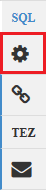

<properties
   pageTitle="使用登錄區 HDInsight (Hadoop) 上使用 Ambari 檢視 |Microsoft Azure"
   description="瞭解如何使用登錄區檢視從網頁瀏覽器來送出登錄區查詢。 登錄區檢視是提供 Linux 型 HDInsight 叢集 Ambari Web UI 部分。"
   services="hdinsight"
   documentationCenter=""
   authors="Blackmist"
   manager="jhubbard"
   editor="cgronlun"
    tags="azure-portal"/>

<tags
   ms.service="hdinsight"
   ms.devlang="na"
   ms.topic="article"
   ms.tgt_pltfrm="na"
   ms.workload="big-data"
   ms.date="10/28/2016"
   ms.author="larryfr"/>

#使用 Hadoop HDInsight 中的 [群組] 檢視

[AZURE.INCLUDE [hive-selector](../../includes/hdinsight-selector-use-hive.md)]

Ambari 就是管理提供 Linux 型 HDInsight 叢集監控公用程式。 透過 Ambari 所提供的功能是 Web UI，可以用來執行登錄區查詢。 這是__登錄區檢視__，提供 HDInsight 叢集 Ambari 檢視的組件。

> [AZURE.NOTE] Ambari 有很多不討論此文件中的功能。 如需詳細資訊，請參閱[管理 HDInsight 叢集使用 Ambari 網路使用者介面](hdinsight-hadoop-manage-ambari.md)。

##必要條件

- Linux 型 HDInsight 叢集。 建立新的叢集資訊，請參閱[開始使用 Linux 型 HDInsight](hdinsight-hadoop-linux-tutorial-get-started.md)。

##開啟登錄區檢視

您可以從 Azure] 入口網站; Ambari 檢視選取 HDInsight 叢集，然後從 [__快速連結__] 區段中選取 [ __Ambari 檢視__。

![快速連結] 區段](./media/hdinsight-hadoop-use-hive-ambari-view/quicklinks.png)

您可以也瀏覽至 Ambari 直接移至網頁瀏覽器中 https://CLUSTERNAME.azurehdinsight.net （ __CLUSTERNAME__是 HDInsight 叢集的名稱），然後在清單可用的檢視以的 （旁的__管理員__連結和左側的頁面] 按鈕） 的 [頁面] 功能表中選取的平方和的設定。 選取的__登錄區檢視__。

.

> [AZURE.NOTE] 存取 Ambari，系統會提示您驗證網站。 輸入管理員 (預設`admin`，) 帳戶名稱和密碼時建立叢集使用。

您應該會看到類似以下的頁面︰

![包含 [查詢編輯器] 區段的登錄區檢視頁面的圖像](./media/hdinsight-hadoop-use-hive-ambari-view/hiveview.png)

##檢視資料表

在 [頁面的 [__資料庫檔案總管__] 區段中，選取 [在 [__資料庫__] 索引標籤上的__預設__項目]。 這會顯示一份資料表中的預設資料庫。 為新的 HDInsight 叢集，應該存在只有一個資料表。__hivesampletable__。

為新的表格新增至這份文件中的步驟進行，您可以使用 [在右上角的 [資料庫檔案總管] 中 [重新整理] 圖示以重新整理可用表格的清單。

##查詢編輯器

使用下列步驟，從登錄區檢視登錄區查詢執行叢集隨附的資料。

1. 在 [頁面的 [__查詢編輯器__] 區段中，貼上到工作表的下列 HiveQL 陳述式︰

        DROP TABLE log4jLogs;
        CREATE EXTERNAL TABLE log4jLogs(t1 string, t2 string, t3 string, t4 string, t5 string, t6 string, t7 string)
        ROW FORMAT DELIMITED FIELDS TERMINATED BY ' '
        STORED AS TEXTFILE LOCATION 'wasbs:///example/data/';
        SELECT t4 AS sev, COUNT(*) AS cnt FROM log4jLogs WHERE t4 = '[ERROR]' GROUP BY t4;

    這些陳述式執行下列動作︰

    - **卸除表格**-會刪除表格和資料檔案，以防資料表已經存在。
    - **建立外部表格**-登錄區中建立新的 「 外部 」 資料表。 外部資料表儲存在登錄區; 中的 [表格定義資料會保留在原始位置。
    - **列格式**的資料設定格式的方式就是告訴登錄區。 在此案例中，以空格分隔每個記錄檔中的欄位。
    - **儲存另存新檔 TEXTFILE 位置**-會告訴登錄區資料的位置儲存 （範例/資料目錄），並確定它儲存為文字。
    - **選取**-選取資料行 t4 其中包含 [錯誤] 的值的所有資料列的計數。

    >[AZURE.NOTE] 應該使用外部表格，當您更新外部來源，例如自動化的資料上傳程序，或另一個 MapReduce 作業的基礎資料，但您會想要使用的最新資料的登錄區查詢。 卸除外部表格會*無法*刪除資料，只有表格定義。

2. 使用底部的 [查詢編輯器] 中的 [__執行__] 按鈕，可開始的查詢。 它應該開啟橘色而文字會停止__執行__。 __查詢的程序結果__區段應該出現在 [查詢編輯器] 下方，並顯示工作的相關資訊。

    > [AZURE.IMPORTANT] 某些瀏覽器中可能無法正確重新整理記錄或結果的資訊。 如果您執行的工作，並顯示為執行永遠沒有更新記錄檔] 或 [傳回結果，請嘗試改用 Mozilla FireFox 或 Google Chrome。

3. 查詢完成之後，[__查詢程序結果__] 區段會顯示作業的結果。 [__停止執行__] 按鈕，也會變更回綠色的 [__執行__] 按鈕。 [__結果__] 索引標籤應該包含下列資訊︰

        sev       cnt
        [ERROR]   3

    [__記錄__] 索引標籤可用來檢視工作所建立的記錄資訊。 您可以使用此查詢問題的疑難排解。

    > [AZURE.TIP] 請注意，在左上方的 [__查詢程序結果__] 區段中，__將結果__下拉式清單] 對話方塊您可以使用此下載結果]，或將它們儲存在 HDInsight 儲存為 CSV 檔案。

3. 選取此查詢的前四個線條，然後選取 [__執行__]。 請注意，沒有結果完成作業。 這是因為使用 [__執行__] 按鈕，選取查詢的組件時，才會執行選取的陳述式。 在此情況下，選取項目未包含擷取資料表中的資料列的最後一個陳述式。 如果您選取 [只那一行，並使用__執行__，您應該會看到預期的結果。

3. 若要建立新的工作表中使用底部的__查詢編輯器] 中__的 [__新工作表__] 按鈕。 在新工作表中，輸入下列 HiveQL 陳述式︰

        CREATE TABLE IF NOT EXISTS errorLogs (t1 string, t2 string, t3 string, t4 string, t5 string, t6 string, t7 string) STORED AS ORC;
        INSERT OVERWRITE TABLE errorLogs SELECT t1, t2, t3, t4, t5, t6, t7 FROM log4jLogs WHERE t4 = '[ERROR]';

    這些陳述式執行下列動作︰

    - **建立資料表 IF 不存在**-會建立一個表格，如果不存在。 不使用**外部**關鍵字，因為這是內部的資料表，就會儲存在登錄區資料倉庫，並登錄區會完全管理。 與外部表格不同卸除內部的資料表將會刪除基礎資料。
    - **儲存另存新檔 ORC** -最佳化列欄 (ORC) 格式儲存的資料。 這是高度最佳化，且有效率格式來儲存登錄區資料。
    - **插入覆寫...選取 [** -從**log4jLogs**資料表包含 [錯誤]，選取列，然後**種**表格中插入資料。

    若要執行這個查詢中使用 [__執行__] 按鈕。 沒有資料列會傳回此查詢，但是狀態應該會顯示為__成功__[__結果__] 索引標籤不能包含任何資訊。

###登錄區設定

選取右邊的編輯器] 中的 [__設定__] 圖示。

設定可以用於變更各種登錄區設定，例如變更登錄區 Tez （預設），從執行引擎 MapReduce。

###Visual 說明

選取右邊的編輯器] 中的 [__視覺說明__] 圖示。

這是查詢，有助於了解複雜的查詢的流量的__視覺說明__檢視。 使用 [__說明__] 按鈕在 [查詢編輯器] 中，您可以檢視此檢視的文字對等。

###Tez

選取右邊的編輯器] 中的 [ __Tez__ ] 圖示。

如果有的話，這會顯示導向非循環圖 (DAG) Tez 用於這個查詢。 如果您想要檢視查詢 DAG 您所要執行過去的經驗或偵錯 Tez 程序，使用[Tez 檢視](hdinsight-debug-ambari-tez-view.md)改為。

###通知

選取右邊的編輯器] 中的 [__通知__] 圖示。

通知是執行查詢時，會產生的訊息。 例如，您會收到通知，或當提交查詢時，發生錯誤時。

##已儲存的查詢

1. 從 [查詢編輯器] 中，建立新的工作表，並輸入下列查詢︰

        SELECT * from errorLogs;

    執行查詢來驗證其運作方式。 結果會如下所示︰

        errorlogs.t1    errorlogs.t2    errorlogs.t3    errorlogs.t4    errorlogs.t5    errorlogs.t6    errorlogs.t7
        2012-02-03  18:35:34    SampleClass0    [ERROR]     incorrect   id  
        2012-02-03  18:55:54    SampleClass1    [ERROR]     incorrect   id  
        2012-02-03  19:25:27    SampleClass4    [ERROR]     incorrect   id

2. 使用 [__另存新檔__] 按鈕，底部的編輯器]。 這__種__項查詢，然後選取__[確定__]。 請注意，工作表的名稱變更為 [__種__。

3. 選取登錄區檢視頁面頂端的 [__儲存的查詢__] 索引標籤。 請注意__種__現在已列為已儲存的查詢。 它會保留此清單中，直到您將其移除。 選取名稱會開啟查詢在 [查詢編輯器] 中。

##查詢歷程記錄

登錄區檢視頂端的 [__歷程記錄__] 按鈕可讓您檢視查詢，您必須在先前執行。 現在，然後選取您的查詢的一些先前執行，請使用它。 當您選取查詢時，它會開啟，在 [查詢編輯器] 中。

##使用者定義函數 (UDF)

登錄區也可以延伸透過**使用者定義函數 (UDF)**。 UDF 可讓您在 HiveQL 實作功能或不輕鬆地建立模型的邏輯。

雖然您可以新增 UDF HiveQL 陳述式的一部分，您在查詢中，按一下頂端的登錄區檢視 UDF] 索引標籤可讓您宣告及儲存 Udf，可以使用__查詢編輯器] 中__的一組。

一旦您已新增 UDF 登錄區檢視，__插入 udf__ ] 按鈕會出現底部的__查詢編輯器]__。 選取這會顯示在登錄區檢視定義 Udf 的下拉式清單。 選取 UDF，會新增至查詢，以啟用 UDF HiveQL 陳述式。

例如，如果您已經定義 UDF 的下列屬性︰

* 資源名稱︰ myudfs
* 資源路徑︰ wasbs:///myudfs.jar
* UDF 名稱︰ myawesomeudf
* UDF 的課程名稱︰ com.myudfs.Awesome

使用 [__插入 udf__ ] 按鈕，就會顯示項目名稱__myudfs__，與其他定義該資源的每個 UDF 下拉式清單。 在此例中__myawesomeudf__。 選取此項目會將下列文字新增至查詢的開頭︰

    add jar wasbs:///myudfs.jar;

    create temporary function myawesomeudf as 'com.myudfs.Awesome';

然後，您可以查詢中使用 UDF。 例如， `SELECT myawesomeudf(name) FROM people;`。

如需有關如何使用登錄區上 HDInsight Udf 的詳細資訊，請參閱下列各項︰

* [使用 Python 登錄區與 HDInsight 的豬](hdinsight-python.md)

* [如何將自訂的登錄區 UDF 新增至 HDInsight](http://blogs.msdn.com/b/bigdatasupport/archive/2014/01/14/how-to-add-custom-hive-udfs-to-hdinsight.aspx)

##後續步驟

如需登錄區 HDInsight 中的一般資訊︰

* [使用上 HDInsight Hadoop 登錄區](hdinsight-use-hive.md)

如需的資訊的其他方法您可以使用 Hadoop HDInsight 上︰

* [Hadoop HDInsight 上搭配使用的豬](hdinsight-use-pig.md)

* [使用上 HDInsight Hadoop MapReduce](hdinsight-use-mapreduce.md)
