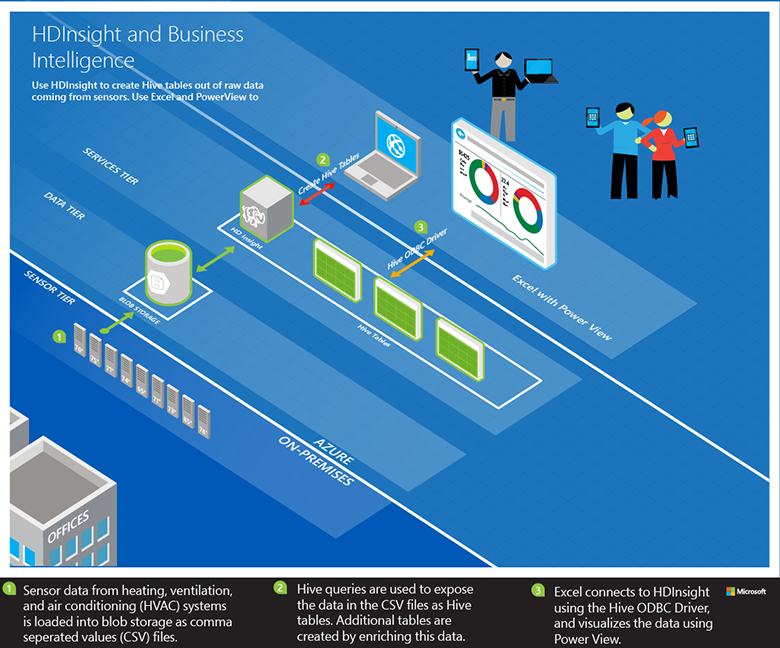

<properties
    pageTitle="分析感應器資料使用登錄區和 Hadoop |Microsoft Azure"
    description="瞭解如何使用登錄區查詢主控台 HDInsight (Hadoop)，以分析感應器的資料，然後以視覺化方式呈現的 PowerView 與 Microsoft Excel 中的資料。"
    services="hdinsight"
    documentationCenter=""
    authors="Blackmist"
    manager="jhubbard"
    editor="cgronlun"
    tags="azure-portal"/>

<tags
    ms.service="hdinsight"
    ms.workload="big-data"
    ms.tgt_pltfrm="na"
    ms.devlang="na"
    ms.topic="article"
    ms.date="09/20/2016" 
    ms.author="larryfr"/>

#分析感應器資料中 HDInsight Hadoop 上使用登錄區查詢主控台

瞭解如何使用登錄區查詢主控台 HDInsight (Hadoop)，以分析感應器的資料，然後使用 Power View 視覺化 Microsoft Excel 中的資料。

> [AZURE.NOTE] 使用 Windows 型 HDInsight 叢集僅適用於此文件中的步驟進行。

在此範例中，您會使用登錄區程序歷史資料所產生的加熱、 通風和空調 (HVAC) 系統，找出無法確實維護設定溫度的系統。 您將學習如何︰

- 建立查詢資料儲存在逗點分隔值 (CSV) 檔案的登錄區資料表。
- 建立區來分析資料的查詢。
- 使用 Microsoft Excel 連線至 HDInsight （來擷取資料分析中使用 [開放式資料庫連接 (ODBC)。
- 使用 Power View 以視覺化方式呈現資料。

##必要條件

* HDInsight (Hadoop) 叢集︰ 建立叢集的相關資訊，請參閱[在 HDInsight 佈建 Hadoop 叢集](hdinsight-provision-clusters.md)。

* Microsoft Excel 2013

    > [AZURE.NOTE] Microsoft Excel 用於與[Power View](https://support.office.com/Article/Power-View-Explore-visualize-and-present-your-data-98268d31-97e2-42aa-a52b-a68cf460472e?ui=en-US&rs=en-US&ad=US)的資料視覺效果。

* [Microsoft 登錄區 ODBC 驅動程式](http://www.microsoft.com/download/details.aspx?id=40886)

##若要執行的範例

1. 從網頁瀏覽器，瀏覽至下列 URL。 取代`<clustername>`HDInsight 叢集的名稱。

        https://<clustername>.azurehdinsight.net

    出現提示時，使用的系統管理員使用者名稱和密碼時佈建這個叢集使用驗證。

2. 從開啟的網頁上，按一下 [**快速入門庫**] 索引標籤，然後**解決方案範例資料**類別] 下方，按一下**感應器的資料分析**範例。

    ![快速入門] 庫](./media/hdinsight-hive-analyze-sensor-data/getting-started-gallery.png)

3. 請遵循在網頁上提供的指示，完成的範例。
